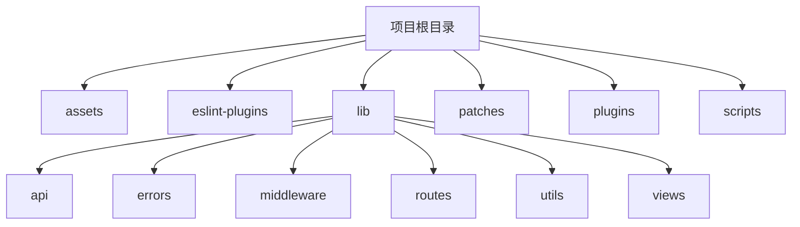
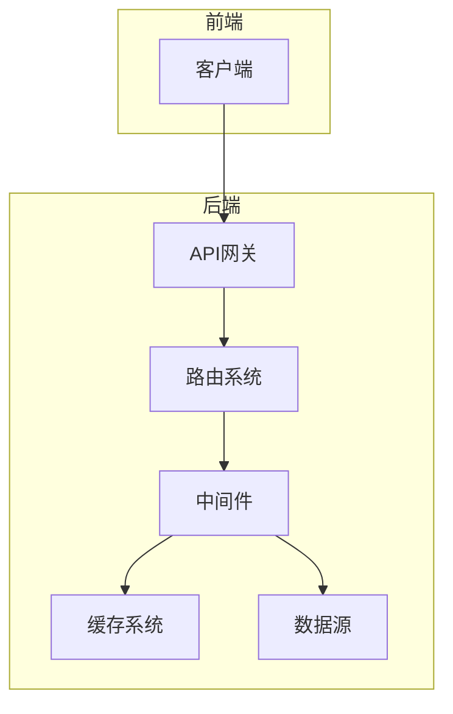
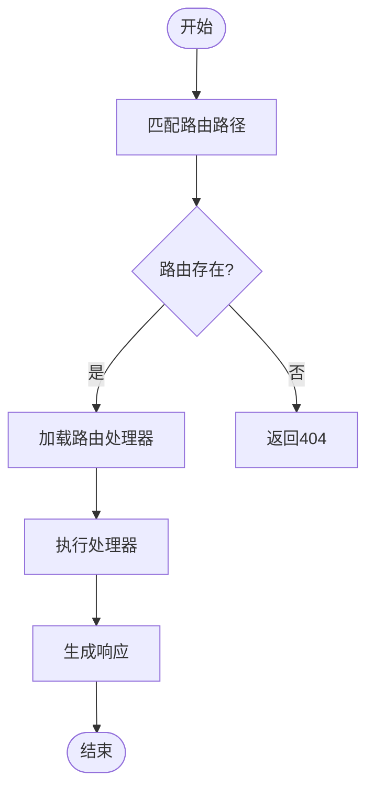
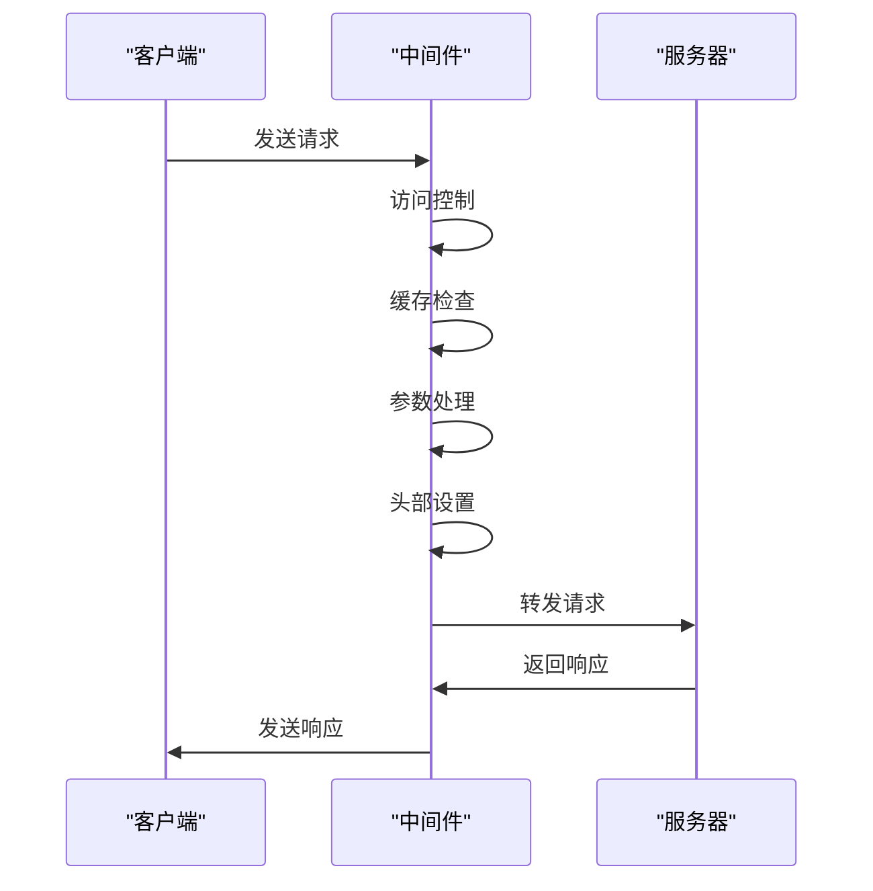
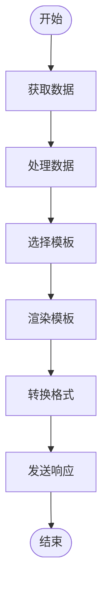
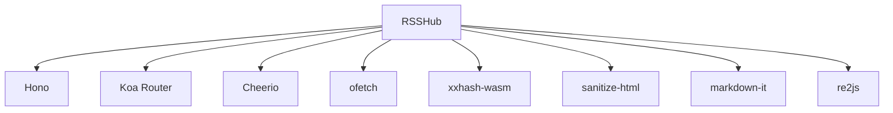
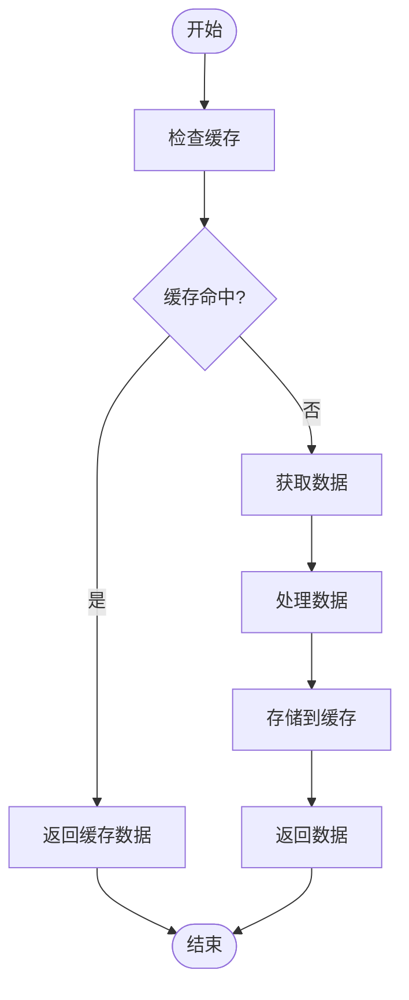

# 内容聚合API

<cite>
**本文档中引用的文件**   
- [README.md](file://README.md)
- [lib/app.ts](file://lib/app.ts)
- [lib/app-bootstrap.tsx](file://lib/app-bootstrap.tsx)
- [lib/router.js](file://lib/router.js)
- [lib/config.ts](file://lib/config.ts)
- [lib/registry.ts](file://lib/registry.ts)
- [lib/middleware/cache.ts](file://lib/middleware/cache.ts)
- [lib/middleware/access-control.ts](file://lib/middleware/access-control.ts)
- [lib/middleware/header.ts](file://lib/middleware/header.ts)
- [lib/middleware/parameter.ts](file://lib/middleware/parameter.ts)
- [lib/middleware/template.tsx](file://lib/middleware/template.tsx)
- [lib/utils/cache/index.ts](file://lib/utils/cache/index.ts)
- [lib/api/index.ts](file://lib/api/index.ts)
- [lib/views/rss.tsx](file://lib/views/rss.tsx)
- [lib/routes/test/index.ts](file://lib/routes/test/index.ts)
</cite>

## 目录
1. [简介](#简介)
2. [项目结构](#项目结构)
3. [核心组件](#核心组件)
4. [架构概述](#架构概述)
5. [详细组件分析](#详细组件分析)
6. [依赖分析](#依赖分析)
7. [性能考虑](#性能考虑)
8. [故障排除指南](#故障排除指南)
9. [结论](#结论)

## 简介

RSSHub是一个内容聚合API，能够将各种网络内容源转换为标准的RSS格式。它支持超过5000个全球实例，提供从新闻、社交媒体到论坛等多种来源的内容聚合服务。通过RSSHub，用户可以轻松获取和订阅各种网络内容，实现信息的集中管理和高效利用。

**Section sources**
- [README.md](file://README.md)

## 项目结构

RSSHub的项目结构清晰，主要分为以下几个部分：
- `assets/`：静态资源文件
- `eslint-plugins/`：ESLint插件
- `lib/`：核心库文件
- `patches/`：补丁文件
- `plugins/`：插件文件
- `scripts/`：脚本文件

核心功能主要集中在`lib/`目录下，包括API、错误处理、中间件、路由、工具和视图等模块。

**Diagram sources **
- [lib/app.ts](file://lib/app.ts)
- [lib/app-bootstrap.tsx](file://lib/app-bootstrap.tsx)

**Section sources**
- [lib/app.ts](file://lib/app.ts)
- [lib/app-bootstrap.tsx](file://lib/app-bootstrap.tsx)

## 核心组件

RSSHub的核心组件包括路由系统、中间件、缓存机制和API接口。这些组件共同协作，实现了高效的内容聚合和分发。

**Section sources**
- [lib/router.js](file://lib/router.js)
- [lib/registry.ts](file://lib/registry.ts)
- [lib/middleware/cache.ts](file://lib/middleware/cache.ts)
- [lib/api/index.ts](file://lib/api/index.ts)

## 架构概述

RSSHub采用模块化设计，通过Hono框架构建了一个高效的Web服务器。整个系统由多个中间件组成，每个中间件负责处理特定的任务，如请求验证、缓存管理、头部设置等。路由系统负责匹配和处理不同的API请求，而API接口则提供了丰富的功能，支持多种输出格式。

**Diagram sources **
- [lib/app-bootstrap.tsx](file://lib/app-bootstrap.tsx)
- [lib/router.js](file://lib/router.js)

## 详细组件分析

### 路由系统分析

RSSHub的路由系统基于Koa Router实现，通过懒加载机制按需加载路由处理器。每个路由定义了特定的路径和对应的处理函数，支持动态参数和正则表达式匹配。

#### 路由匹配流程

**Diagram sources **
- [lib/router.js](file://lib/router.js)
- [lib/registry.ts](file://lib/registry.ts)

### 中间件处理分析

RSSHub使用了一系列中间件来处理请求和响应，确保系统的安全性和性能。

#### 中间件处理流程

**Diagram sources **
- [lib/middleware/access-control.ts](file://lib/middleware/access-control.ts)
- [lib/middleware/cache.ts](file://lib/middleware/cache.ts)
- [lib/middleware/parameter.ts](file://lib/middleware/parameter.ts)
- [lib/middleware/header.ts](file://lib/middleware/header.ts)

### 响应生成流程

RSSHub支持多种输出格式，包括RSS、Atom、JSON Feed等。响应生成流程包括数据处理、模板渲染和格式转换。

#### 响应生成流程

**Diagram sources **
- [lib/middleware/template.tsx](file://lib/middleware/template.tsx)
- [lib/views/rss.tsx](file://lib/views/rss.tsx)

**Section sources**
- [lib/middleware/template.tsx](file://lib/middleware/template.tsx)
- [lib/views/rss.tsx](file://lib/views/rss.tsx)

## 依赖分析

RSSHub依赖于多个第三方库和工具，包括Hono、Koa Router、Cheerio、ofetch等。这些依赖项提供了Web服务器、路由管理、HTML解析和HTTP请求等功能。

**Diagram sources **
- [package.json](file://package.json)

**Section sources**
- [package.json](file://package.json)

## 性能考虑

RSSHub通过多种机制优化性能，包括缓存、并发请求处理和资源压缩。

### 缓存机制

RSSHub使用内存缓存和Redis缓存两种方式，有效减少了重复请求的处理时间。缓存键通过XXH64哈希算法生成，确保了键的唯一性和紧凑性。

**Diagram sources **
- [lib/middleware/cache.ts](file://lib/middleware/cache.ts)
- [lib/utils/cache/index.ts](file://lib/utils/cache/index.ts)

### 并发请求处理

RSSHub通过Hono框架的并发处理能力，能够同时处理多个请求，提高了系统的吞吐量。

### 资源压缩

RSSHub使用Hono的压缩中间件，对响应数据进行GZIP压缩，减少了网络传输的数据量。

**Section sources**
- [lib/middleware/cache.ts](file://lib/middleware/cache.ts)
- [lib/utils/cache/index.ts](file://lib/utils/cache/index.ts)
- [lib/app-bootstrap.tsx](file://lib/app-bootstrap.tsx)

## 故障排除指南

### 常见问题

1. **缓存问题**：如果遇到缓存相关的问题，可以尝试清除缓存或重启服务。
2. **路由匹配失败**：检查路由路径是否正确，确保路径中的参数符合预期。
3. **中间件错误**：查看日志文件，定位具体的中间件错误信息。

### 调试技巧

1. **启用调试模式**：通过设置`DEBUG_INFO`环境变量为`true`，可以开启调试模式，查看详细的请求和响应信息。
2. **使用API参考**：访问`/api/reference`路径，查看API文档和示例。

**Section sources**
- [lib/middleware/cache.ts](file://lib/middleware/cache.ts)
- [lib/middleware/parameter.ts](file://lib/middleware/parameter.ts)
- [lib/api/index.ts](file://lib/api/index.ts)

## 结论

RSSHub作为一个强大的内容聚合API，通过模块化设计和高效的中间件机制，实现了对多种网络内容源的标准化转换。其灵活的路由系统、强大的缓存机制和丰富的API接口，使得开发者能够轻松集成和使用。通过本文档的介绍，希望读者能够更好地理解和使用RSSHub，充分发挥其在内容聚合方面的优势。