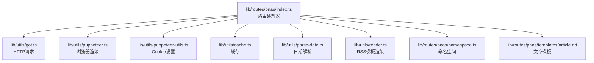
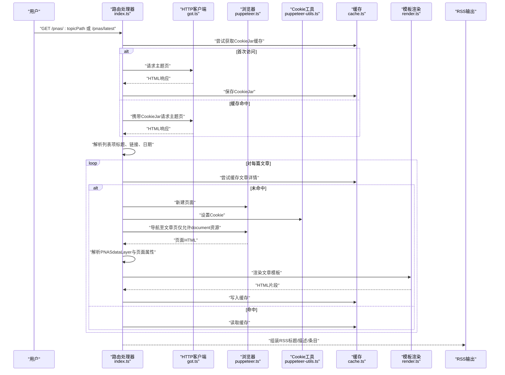
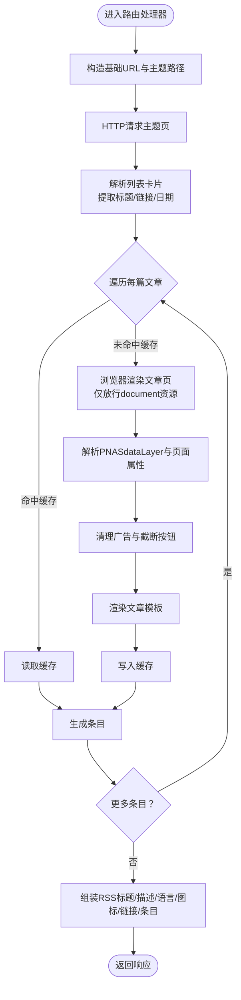
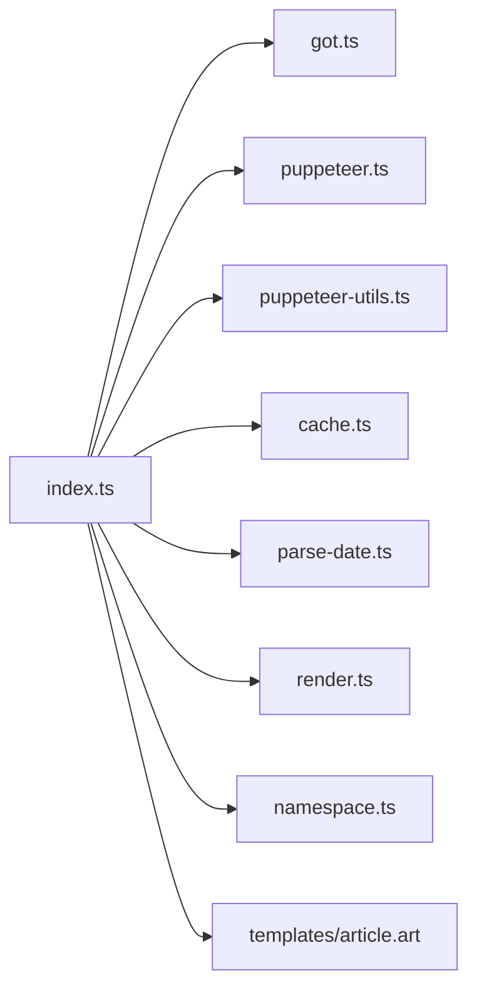

# PNAS学术聚合

<cite>
**本文引用的文件**
- [lib/routes/pnas/index.ts](file://lib/routes/pnas/index.ts)
- [lib/routes/pnas/namespace.ts](file://lib/routes/pnas/namespace.ts)
- [lib/routes/pnas/templates/article.art](file://lib/routes/pnas/templates/article.art)
- [lib/utils/puppeteer.ts](file://lib/utils/puppeteer.ts)
- [lib/utils/puppeteer-utils.ts](file://lib/utils/puppeteer-utils.ts)
- [lib/utils/cache.ts](file://lib/utils/cache.ts)
- [lib/utils/got.ts](file://lib/utils/got.ts)
- [lib/utils/parse-date.ts](file://lib/utils/parse-date.ts)
- [lib/utils/render.ts](file://lib/utils/render.ts)
- [lib/types.ts](file://lib/types.ts)
- [lib/routes/CLAUDE.md](file://lib/routes/CLAUDE.md)
- [lib/pkg.ts](file://lib/pkg.ts)
</cite>

## 目录
1. [简介](#简介)
2. [项目结构](#项目结构)
3. [核心组件](#核心组件)
4. [架构总览](#架构总览)
5. [详细组件分析](#详细组件分析)
6. [依赖关系分析](#依赖关系分析)
7. [性能考量](#性能考量)
8. [故障排查指南](#故障排查指南)
9. [结论](#结论)
10. [附录](#附录)

## 简介
本文件面向科研工作者与RSSHub使用者，系统化阐述“PNAS学术聚合”能力：基于美国国家科学院院刊（PNAS）平台，聚合高质量科研论文，覆盖生物、医学、社会科学等领域。该能力通过RSSHub路由实现，能够抓取并解析论文标题、作者、摘要、卷期信息、学科标签、DOI、开放获取状态等关键字段，并在必要时以浏览器渲染方式获取HTML全文与PDF链接信息。同时，提供按学科领域与最新发表日期筛选的API调用路径，帮助用户高效发现与评估高质量研究成果。

## 项目结构
- 路由入口位于 lib/routes/pnas/index.ts，定义了PNAS主题页到RSS的映射规则。
- 命名空间定义位于 lib/routes/pnas/namespace.ts，声明站点元信息。
- 模板渲染位于 lib/routes/pnas/templates/article.art，用于拼装文章详情内容。
- 工具与依赖包括 Puppeteer 浏览器自动化、Cookie 管理、缓存、HTTP 请求、日期解析、RSS 渲染等。

图表来源
- [lib/routes/pnas/index.ts](file://lib/routes/pnas/index.ts#L1-L120)
- [lib/routes/pnas/namespace.ts](file://lib/routes/pnas/namespace.ts#L1-L8)
- [lib/routes/pnas/templates/article.art](file://lib/routes/pnas/templates/article.art#L1-L9)
- [lib/utils/puppeteer.ts](file://lib/utils/puppeteer.ts#L1-L192)
- [lib/utils/puppeteer-utils.ts](file://lib/utils/puppeteer-utils.ts#L1-L58)
- [lib/utils/cache.ts](file://lib/utils/cache.ts#L1-L200)
- [lib/utils/got.ts](file://lib/utils/got.ts#L1-L200)
- [lib/utils/parse-date.ts](file://lib/utils/parse-date.ts#L1-L200)
- [lib/utils/render.ts](file://lib/utils/render.ts#L1-L200)

章节来源
- [lib/routes/CLAUDE.md](file://lib/routes/CLAUDE.md#L1-L51)
- [lib/routes/pnas/index.ts](file://lib/routes/pnas/index.ts#L1-L120)
- [lib/routes/pnas/namespace.ts](file://lib/routes/pnas/namespace.ts#L1-L8)

## 核心组件
- 路由处理器（index.ts）：负责根据主题路径构造目标URL，抓取列表页，解析基础元信息，再对每篇文章进行深度抓取与渲染。
- 命名空间（namespace.ts）：声明站点名称、域名与语言，便于API系统识别与归类。
- 模板（article.art）：将抽象的数据层（如摘要、正文、补充材料、参考文献等）渲染为RSS内容。
- 工具链：got（HTTP）、puppeteer（浏览器渲染）、puppeteer-utils（Cookie设置）、cache（缓存）、parse-date（日期解析）、render（RSS模板渲染）。

章节来源
- [lib/routes/pnas/index.ts](file://lib/routes/pnas/index.ts#L1-L120)
- [lib/routes/pnas/namespace.ts](file://lib/routes/pnas/namespace.ts#L1-L8)
- [lib/routes/pnas/templates/article.art](file://lib/routes/pnas/templates/article.art#L1-L9)
- [lib/utils/got.ts](file://lib/utils/got.ts#L1-L200)
- [lib/utils/puppeteer.ts](file://lib/utils/puppeteer.ts#L1-L192)
- [lib/utils/puppeteer-utils.ts](file://lib/utils/puppeteer-utils.ts#L1-L58)
- [lib/utils/cache.ts](file://lib/utils/cache.ts#L1-L200)
- [lib/utils/parse-date.ts](file://lib/utils/parse-date.ts#L1-L200)
- [lib/utils/render.ts](file://lib/utils/render.ts#L1-L200)

## 架构总览
下图展示了从请求到RSS输出的完整流程，包括列表抓取、单页渲染、数据提取与RSS组装。

图表来源
- [lib/routes/pnas/index.ts](file://lib/routes/pnas/index.ts#L1-L120)
- [lib/utils/got.ts](file://lib/utils/got.ts#L1-L200)
- [lib/utils/puppeteer.ts](file://lib/utils/puppeteer.ts#L1-L192)
- [lib/utils/puppeteer-utils.ts](file://lib/utils/puppeteer-utils.ts#L1-L58)
- [lib/utils/cache.ts](file://lib/utils/cache.ts#L1-L200)
- [lib/utils/render.ts](file://lib/utils/render.ts#L1-L200)

## 详细组件分析

### 组件A：PNAS路由处理器（index.ts）
- 路由路径：支持可选的主题路径参数，若未提供则默认抓取最新（latest）。
- 列表抓取：通过HTTP请求获取主题页，使用选择器解析卡片列表，提取标题、链接与发布日期。
- 单页渲染：使用浏览器渲染文章详情页，仅放行document资源，避免加载图片、脚本等非必要资源，提升稳定性与速度。
- 数据提取：从页面内嵌的PNASdataLayer中抽取关键词、主题、作者、DOI等；同时清理广告与截断按钮，保留摘要、正文、数据可用性、致谢、补充材料与参考文献等区域。
- 输出：组装RSS标题、描述、语言、图标、链接与条目集合。

图表来源
- [lib/routes/pnas/index.ts](file://lib/routes/pnas/index.ts#L1-L120)

章节来源
- [lib/routes/pnas/index.ts](file://lib/routes/pnas/index.ts#L1-L120)

### 组件B：命名空间与模板
- 命名空间（namespace.ts）：声明站点名称、域名与语言，便于API系统识别与归类。
- 文章模板（article.art）：根据是否开放获取，决定是否渲染正文；同时条件渲染摘要、数据可用性、致谢、补充材料与参考文献等区块。

章节来源
- [lib/routes/pnas/namespace.ts](file://lib/routes/pnas/namespace.ts#L1-L8)
- [lib/routes/pnas/templates/article.art](file://lib/routes/pnas/templates/article.art#L1-L9)

### 组件C：工具与依赖
- HTTP客户端（got.ts）：封装请求与响应处理，支持Cookie传递。
- 浏览器（puppeteer.ts）：提供无头浏览器实例，支持代理与超时控制。
- Cookie工具（puppeteer-utils.ts）：将CookieJar转换为浏览器可识别的Cookie数组并注入页面。
- 缓存（cache.ts）：提供键值缓存，用于存储CookieJar与文章详情，降低重复抓取成本。
- 日期解析（parse-date.ts）：将文本日期标准化为时间戳或日期对象。
- RSS渲染（render.ts）：将模板与数据组合为最终RSS内容。

章节来源
- [lib/utils/got.ts](file://lib/utils/got.ts#L1-L200)
- [lib/utils/puppeteer.ts](file://lib/utils/puppeteer.ts#L1-L192)
- [lib/utils/puppeteer-utils.ts](file://lib/utils/puppeteer-utils.ts#L1-L58)
- [lib/utils/cache.ts](file://lib/utils/cache.ts#L1-L200)
- [lib/utils/parse-date.ts](file://lib/utils/parse-date.ts#L1-L200)
- [lib/utils/render.ts](file://lib/utils/render.ts#L1-L200)

## 依赖关系分析
- 路由处理器依赖HTTP客户端、浏览器、Cookie工具、缓存、日期解析与RSS渲染。
- 浏览器渲染依赖代理与超时配置，确保在受限网络环境下稳定运行。
- Cookie管理贯穿列表页与详情页，保证登录态与访问权限一致性。

图表来源
- [lib/routes/pnas/index.ts](file://lib/routes/pnas/index.ts#L1-L120)
- [lib/utils/got.ts](file://lib/utils/got.ts#L1-L200)
- [lib/utils/puppeteer.ts](file://lib/utils/puppeteer.ts#L1-L192)
- [lib/utils/puppeteer-utils.ts](file://lib/utils/puppeteer-utils.ts#L1-L58)
- [lib/utils/cache.ts](file://lib/utils/cache.ts#L1-L200)
- [lib/utils/parse-date.ts](file://lib/utils/parse-date.ts#L1-L200)
- [lib/utils/render.ts](file://lib/utils/render.ts#L1-L200)
- [lib/routes/pnas/namespace.ts](file://lib/routes/pnas/namespace.ts#L1-L8)
- [lib/routes/pnas/templates/article.art](file://lib/routes/pnas/templates/article.art#L1-L9)

章节来源
- [lib/routes/pnas/index.ts](file://lib/routes/pnas/index.ts#L1-L120)

## 性能考量
- 资源拦截：在浏览器渲染阶段仅放行document资源，减少无关资源下载，提高稳定性与速度。
- 缓存策略：CookieJar与文章详情均采用缓存，显著降低重复抓取成本。
- 并发控制：对列表项采用并发抓取，但受浏览器实例数量与代理配置限制，建议合理设置并发度。
- 代理与超时：浏览器启动参数与代理配置影响网络稳定性，需结合实际环境调整。

章节来源
- [lib/utils/puppeteer.ts](file://lib/utils/puppeteer.ts#L1-L192)
- [lib/utils/cache.ts](file://lib/utils/cache.ts#L1-L200)

## 故障排查指南
- 无法获取CookieJar或登录态异常
  - 检查缓存是否成功写入与读取。
  - 确认Cookie域匹配（.pnas.org）。
  - 参考路径：[lib/routes/pnas/index.ts](file://lib/routes/pnas/index.ts#L34-L42)、[lib/utils/puppeteer-utils.ts](file://lib/utils/puppeteer-utils.ts#L41-L44)
- 页面渲染失败或空白
  - 确认仅放行document资源，避免加载图片/脚本导致阻塞。
  - 检查等待条件（domcontentloaded）与超时设置。
  - 参考路径：[lib/routes/pnas/index.ts](file://lib/routes/pnas/index.ts#L64-L73)、[lib/utils/puppeteer.ts](file://lib/utils/puppeteer.ts#L171-L174)
- 日期解析异常
  - 确认页面日期文本格式与解析器兼容。
  - 参考路径：[lib/utils/parse-date.ts](file://lib/utils/parse-date.ts#L1-L200)、[lib/routes/pnas/index.ts](file://lib/routes/pnas/index.ts#L53-L54)
- RSS输出为空或字段缺失
  - 检查模板渲染逻辑与选择器是否匹配页面结构。
  - 参考路径：[lib/routes/pnas/templates/article.art](file://lib/routes/pnas/templates/article.art#L1-L9)、[lib/utils/render.ts](file://lib/utils/render.ts#L1-L200)

章节来源
- [lib/routes/pnas/index.ts](file://lib/routes/pnas/index.ts#L34-L42)
- [lib/utils/puppeteer-utils.ts](file://lib/utils/puppeteer-utils.ts#L41-L44)
- [lib/utils/puppeteer.ts](file://lib/utils/puppeteer.ts#L171-L174)
- [lib/utils/parse-date.ts](file://lib/utils/parse-date.ts#L1-L200)
- [lib/routes/pnas/templates/article.art](file://lib/routes/pnas/templates/article.art#L1-L9)
- [lib/utils/render.ts](file://lib/utils/render.ts#L1-L200)

## 结论
PNAS学术聚合通过“列表抓取 + 浏览器渲染”的混合模式，实现了对PNAS平台高质量论文的稳定抓取与结构化输出。其核心优势在于：
- 支持按学科主题与最新发布筛选；
- 提取作者、摘要、关键词、主题、DOI等关键元信息；
- 条件渲染开放获取正文与补充材料，满足科研评估需求；
- 通过缓存与资源拦截优化性能与稳定性。

## 附录

### API调用示例与参数说明
- 基础路径：/pnas
- 参数：
  - topicPath：可选的主题路径（例如 latest、biology、medicine 等），不提供时默认 latest。
- 返回：
  - RSS标题、描述、语言、图标、链接与条目集合。每个条目包含标题、链接、发布日期、作者、学科标签、DOI、摘要与正文等字段（依据页面实际可得性）。

调用路径参考
- [lib/routes/pnas/index.ts](file://lib/routes/pnas/index.ts#L16-L27)

### 字段说明
- 标题：来自页面卡片标题。
- 链接：绝对URL。
- 发布日期：从页面卡片解析。
- 作者：来自页面数据层 pageInfo.author。
- DOI：来自页面数据层 pageInfo.DOI。
- 学科标签：来自页面数据层 page.attributes.keywords 与 topic。
- 摘要与正文：根据开放获取状态决定是否渲染正文内容。
- 补充材料、致谢、参考文献：按页面存在性条件渲染。

字段来源
- [lib/routes/pnas/index.ts](file://lib/routes/pnas/index.ts#L87-L103)
- [lib/routes/pnas/templates/article.art](file://lib/routes/pnas/templates/article.art#L1-L9)

### 影响因子、同行评审状态与开放获取标识
- 影响因子与同行评审状态：当前实现未直接抓取影响因子与评审状态字段。
- 开放获取标识：通过页面数据层 user.access 判断，模板据此决定是否渲染正文。

字段来源
- [lib/routes/pnas/index.ts](file://lib/routes/pnas/index.ts#L92-L94)
- [lib/routes/pnas/templates/article.art](file://lib/routes/pnas/templates/article.art#L1-L9)

### 类型定义参考
- DataItem、Data 等类型定义，用于约束RSS输出结构与字段。

类型来源
- [lib/types.ts](file://lib/types.ts#L32-L99)

### 路由注册与运行机制
- 路由系统通过动态扫描与注册实现，PNAS路由遵循统一的命名空间与处理器规范。

机制来源
- [lib/routes/CLAUDE.md](file://lib/routes/CLAUDE.md#L1-L51)
- [lib/pkg.ts](file://lib/pkg.ts#L1-L52)