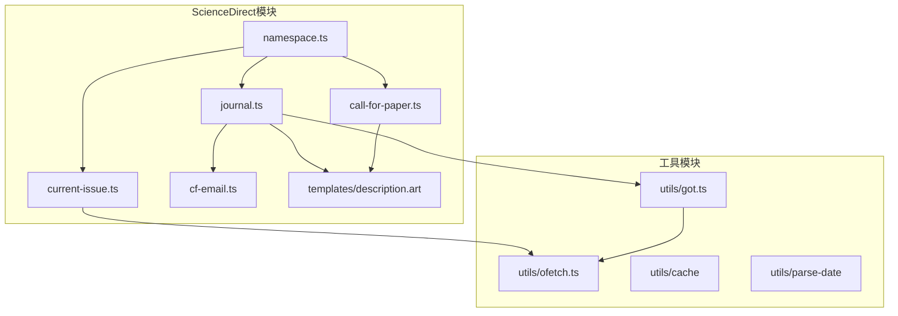
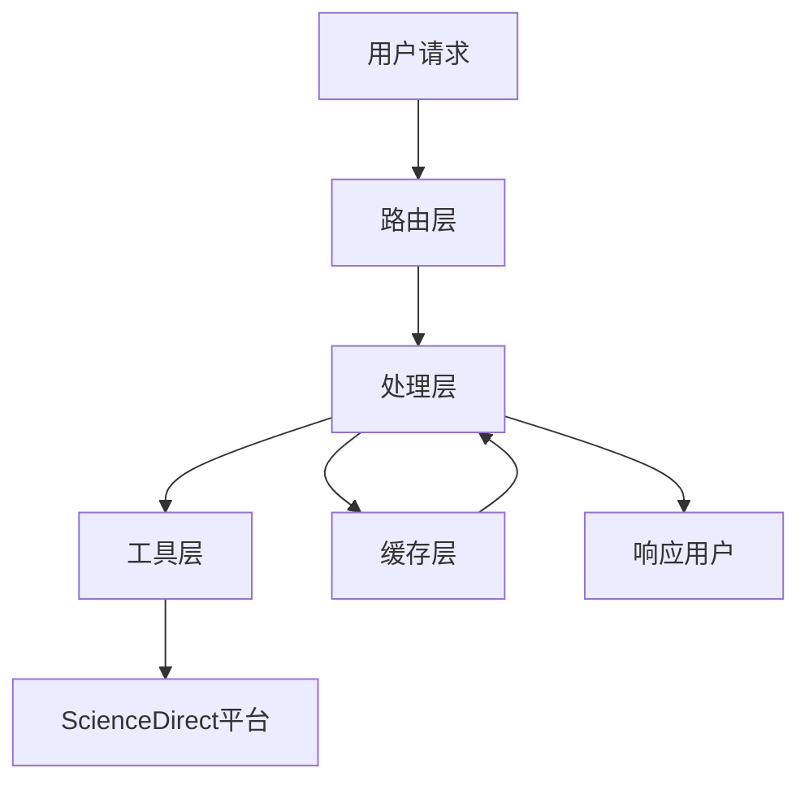
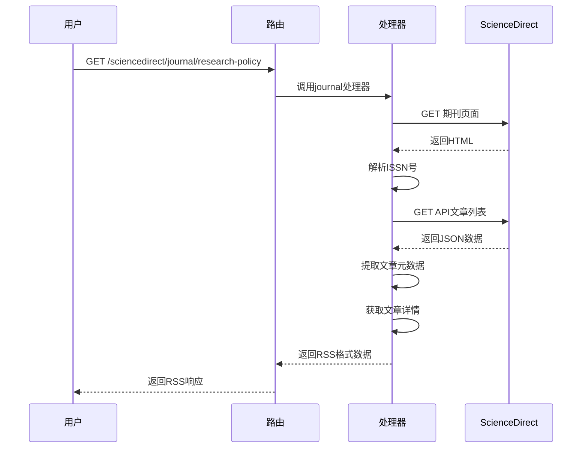
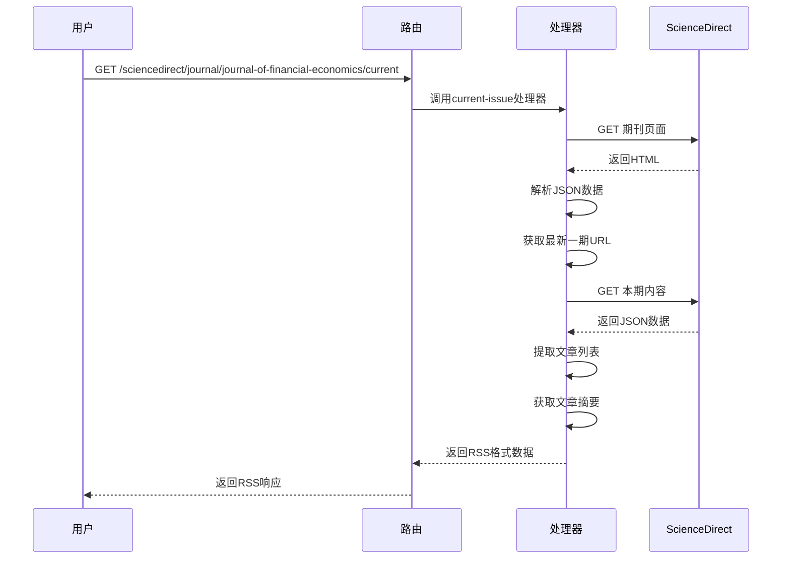
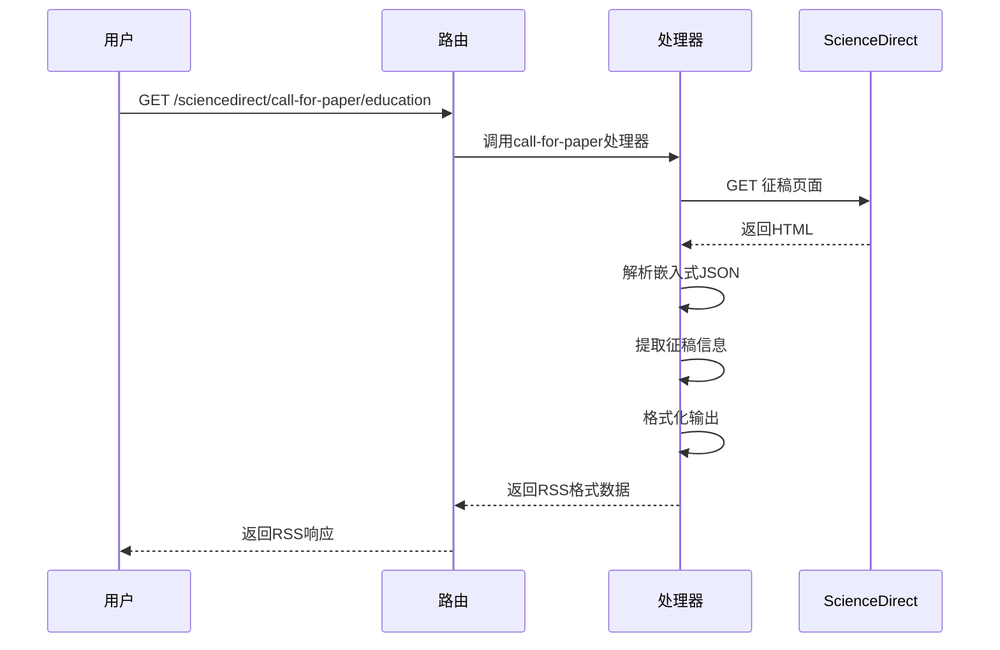
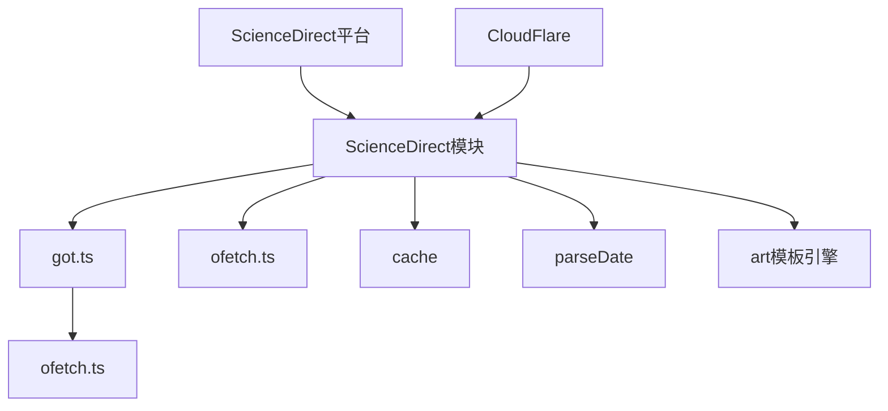

# ScienceDirect学术聚合

<cite>
**本文档中引用的文件**   
- [namespace.ts](file://lib/routes/sciencedirect/namespace.ts)
- [call-for-paper.ts](file://lib/routes/sciencedirect/call-for-paper.ts)
- [journal.ts](file://lib/routes/sciencedirect/journal.ts)
- [current-issue.ts](file://lib/routes/sciencedirect/current-issue.ts)
- [cf-email.ts](file://lib/routes/sciencedirect/cf-email.ts)
- [description.art](file://lib/routes/sciencedirect/templates/description.art)
- [got.ts](file://lib/utils/got.ts)
- [ofetch.ts](file://lib/utils/ofetch.ts)
</cite>

## 目录
1. [简介](#简介)
2. [项目结构](#项目结构)
3. [核心组件](#核心组件)
4. [架构概述](#架构概述)
5. [详细组件分析](#详细组件分析)
6. [依赖分析](#依赖分析)
7. [性能考虑](#性能考虑)
8. [故障排除指南](#故障排除指南)
9. [结论](#结论)

## 简介
本文档详细介绍了RSSHub项目中ScienceDirect学术聚合功能的实现机制。ScienceDirect是Elsevier旗下的学术资源平台，提供科学、技术、医学等领域的期刊文章和书籍章节。本系统通过API聚合ScienceDirect平台上的学术资源，为研究人员提供便捷的文献获取方式。

## 项目结构
RSSHub项目采用模块化设计，ScienceDirect相关的功能实现在`lib/routes/sciencedirect`目录下。系统通过路由机制将用户请求映射到相应的处理器函数，实现对ScienceDirect平台内容的抓取和聚合。

**图示来源**
- [namespace.ts](file://lib/routes/sciencedirect/namespace.ts)
- [call-for-paper.ts](file://lib/routes/sciencedirect/call-for-paper.ts)
- [journal.ts](file://lib/routes/sciencedirect/journal.ts)
- [current-issue.ts](file://lib/routes/sciencedirect/current-issue.ts)
- [cf-email.ts](file://lib/routes/sciencedirect/cf-email.ts)
- [description.art](file://lib/routes/sciencedirect/templates/description.art)
- [got.ts](file://lib/utils/got.ts)
- [ofetch.ts](file://lib/utils/ofetch.ts)

**章节来源**
- [namespace.ts](file://lib/routes/sciencedirect/namespace.ts)
- [call-for-paper.ts](file://lib/routes/sciencedirect/call-for-paper.ts)
- [journal.ts](file://lib/routes/sciencedirect/journal.ts)

## 核心组件
ScienceDirect学术聚合功能的核心组件包括期刊聚合、最新一期内容聚合和征稿信息聚合。系统通过HTTP请求获取ScienceDirect平台的网页内容，解析HTML中的JSON数据，提取文献元数据并进行格式化处理。

**章节来源**
- [journal.ts](file://lib/routes/sciencedirect/journal.ts#L1-L97)
- [current-issue.ts](file://lib/routes/sciencedirect/current-issue.ts#L1-L100)
- [call-for-paper.ts](file://lib/routes/sciencedirect/call-for-paper.ts#L1-L81)

## 架构概述
ScienceDirect学术聚合系统采用分层架构设计，包括路由层、处理层、工具层和缓存层。路由层负责接收用户请求并将其分发到相应的处理器；处理层负责与ScienceDirect平台交互，获取和解析数据；工具层提供HTTP请求、HTML解析和数据处理等基础功能；缓存层用于提高系统性能，减少重复请求。

**图示来源**
- [journal.ts](file://lib/routes/sciencedirect/journal.ts#L33-L96)
- [current-issue.ts](file://lib/routes/sciencedirect/current-issue.ts#L33-L99)
- [call-for-paper.ts](file://lib/routes/sciencedirect/call-for-paper.ts#L28-L80)

## 详细组件分析
### 期刊聚合分析
期刊聚合功能通过期刊ID获取特定期刊的最新文章列表。系统首先获取期刊页面的HTML内容，从中提取ISSN号，然后使用ISSN号构造API请求URL获取文章列表。

**图示来源**
- [journal.ts](file://lib/routes/sciencedirect/journal.ts#L33-L96)

**章节来源**
- [journal.ts](file://lib/routes/sciencedirect/journal.ts#L1-L97)

### 最新一期内容分析
最新一期内容聚合功能获取期刊最新一期的所有文章。系统通过解析期刊页面的JSON数据获取最新一期的URL，然后获取该期内容并提取文章信息。

**图示来源**
- [current-issue.ts](file://lib/routes/sciencedirect/current-issue.ts#L33-L99)

**章节来源**
- [current-issue.ts](file://lib/routes/sciencedirect/current-issue.ts#L1-L100)

### 征稿信息分析
征稿信息聚合功能获取特定学科领域的征稿信息。系统通过学科参数构造请求URL，获取征稿信息列表并提取相关信息。

**图示来源**
- [call-for-paper.ts](file://lib/routes/sciencedirect/call-for-paper.ts#L28-L80)

**章节来源**
- [call-for-paper.ts](file://lib/routes/sciencedirect/call-for-paper.ts#L1-L81)

## 依赖分析
ScienceDirect学术聚合功能依赖于多个内部和外部组件。内部依赖包括RSSHub的核心工具函数和缓存机制，外部依赖包括ScienceDirect平台的API接口和CloudFlare的邮件保护机制。

**图示来源**
- [journal.ts](file://lib/routes/sciencedirect/journal.ts)
- [current-issue.ts](file://lib/routes/sciencedirect/current-issue.ts)
- [call-for-paper.ts](file://lib/routes/sciencedirect/call-for-paper.ts)
- [got.ts](file://lib/utils/got.ts)
- [ofetch.ts](file://lib/utils/ofetch.ts)

**章节来源**
- [got.ts](file://lib/utils/got.ts#L1-L90)
- [ofetch.ts](file://lib/utils/ofetch.ts#L1-L45)
- [cf-email.ts](file://lib/routes/sciencedirect/cf-email.ts#L1-L39)

## 性能考虑
系统通过多种机制优化性能，包括使用缓存减少重复请求、并行处理多个文章详情获取、合理设置HTTP请求头避免被反爬虫机制拦截。缓存机制是性能优化的关键，通过`cache.tryGet`方法确保相同链接的内容只抓取一次。

**章节来源**
- [journal.ts](file://lib/routes/sciencedirect/journal.ts#L65-L89)
- [current-issue.ts](file://lib/routes/sciencedirect/current-issue.ts#L70-L89)
- [got.ts](file://lib/utils/got.ts)

## 故障排除指南
常见问题包括无法获取嵌入式JSON数据、解析失败、403错误等。解决方案包括检查请求头是否完整、验证URL参数是否正确、确保网络连接正常。对于CloudFlare邮件保护的内容，系统提供了专门的解码函数`decodeCFEmail`处理。

**章节来源**
- [call-for-paper.ts](file://lib/routes/sciencedirect/call-for-paper.ts#L38-L48)
- [journal.ts](file://lib/routes/sciencedirect/journal.ts#L75-L78)
- [cf-email.ts](file://lib/routes/sciencedirect/cf-email.ts#L1-L39)

## 结论
ScienceDirect学术聚合功能通过精心设计的架构和高效的实现方式，为研究人员提供了便捷的学术资源获取途径。系统能够准确提取文献元数据，包括标题、作者、摘要、DOI链接等信息，并通过RSS格式输出，方便用户订阅和跟踪感兴趣的学术领域。