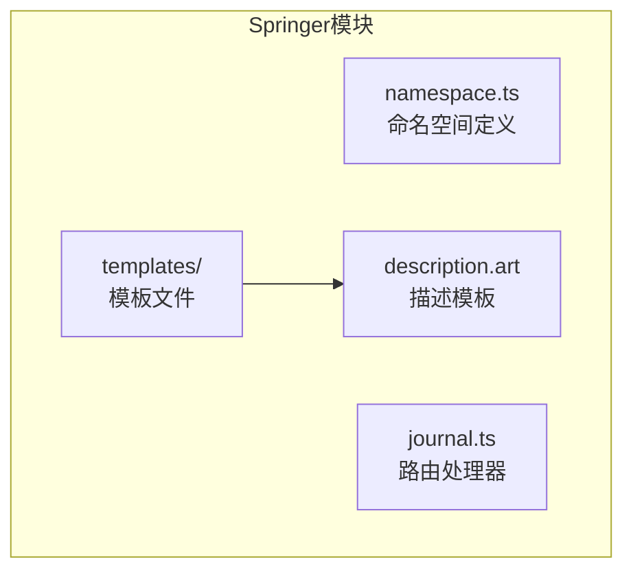
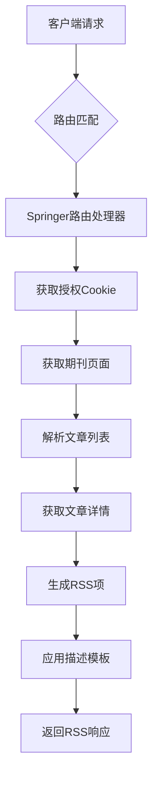
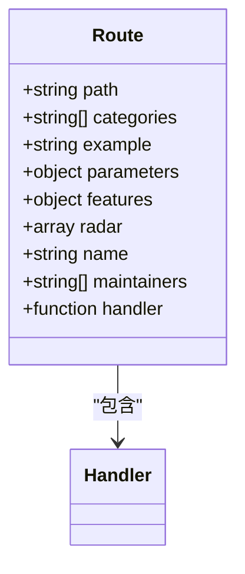
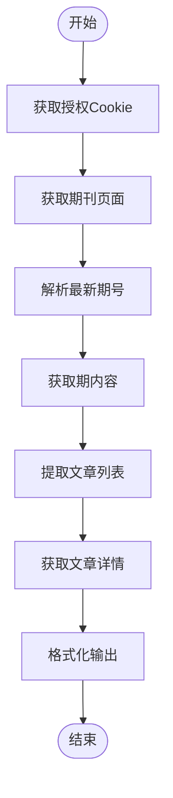
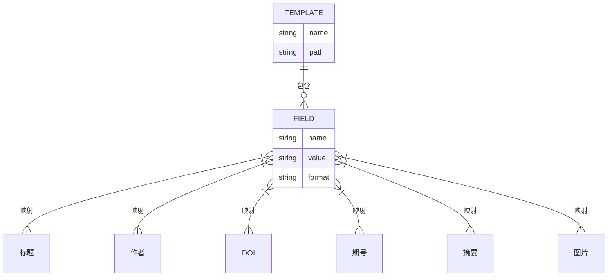
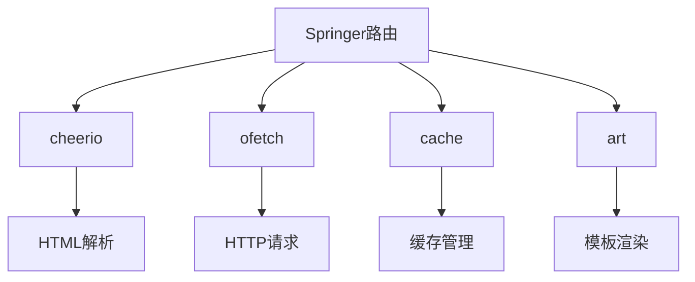

# Springer学术聚合

<cite>
**本文档引用的文件**  
- [journal.ts](file://lib/routes/springer/journal.ts)
- [namespace.ts](file://lib/routes/springer/namespace.ts)
- [description.art](file://lib/routes/springer/templates/description.art)
</cite>

## 目录
1. [简介](#简介)
2. [项目结构](#项目结构)
3. [核心组件](#核心组件)
4. [架构概述](#架构概述)
5. [详细组件分析](#详细组件分析)
6. [依赖分析](#依赖分析)
7. [性能考虑](#性能考虑)
8. [故障排除指南](#故障排除指南)
9. [结论](#结论)
10. [附录](#附录)（如有必要）

## 简介
本文档详细介绍了RSSHub项目中Springer学术聚合API的实现机制。该API专注于从SpringerLink平台聚合自然科学、工程技术和医学等领域的期刊文章、会议论文和书籍内容。文档深入解释了文献信息（标题、作者、摘要、出版商、ISBN/ISSN）的抓取与解析机制，以及章节链接和引用参考文献的处理方式。同时提供具体的API调用示例，展示如何按出版商系列、学科分类或发表年份获取相关研究成果。文档涵盖开放获取标识、许可协议类型和替代计量数据，帮助学术界有效利用Springer资源。

## 项目结构
Springer学术聚合功能位于`lib/routes/springer/`目录下，采用模块化设计，包含路由定义、命名空间配置和模板文件。该结构遵循RSSHub的标准路由组织模式，便于维护和扩展。

**图示来源**
- [namespace.ts](file://lib/routes/springer/namespace.ts)
- [journal.ts](file://lib/routes/springer/journal.ts)
- [description.art](file://lib/routes/springer/templates/description.art)

**节来源**
- [journal.ts](file://lib/routes/springer/journal.ts)
- [namespace.ts](file://lib/routes/springer/namespace.ts)

## 核心组件
Springer学术聚合的核心组件包括路由处理器、命名空间定义和内容模板。路由处理器负责与SpringerLink平台交互，获取最新的期刊文章信息；命名空间定义了该聚合源的基本元数据；内容模板则用于格式化输出的文献信息。

**节来源**
- [journal.ts](file://lib/routes/springer/journal.ts#L1-L31)
- [namespace.ts](file://lib/routes/springer/namespace.ts#L1-L7)
- [description.art](file://lib/routes/springer/templates/description.art#L1-L12)

## 架构概述
Springer学术聚合采用分层架构，包括路由层、处理层和展示层。路由层定义了API端点和参数；处理层负责与SpringerLink平台进行HTTP交互，获取和解析数据；展示层则通过模板引擎生成最终的RSS输出。

**图示来源**
- [journal.ts](file://lib/routes/springer/journal.ts#L33-L121)

## 详细组件分析

### 期刊路由分析
期刊路由组件是Springer学术聚合的核心，负责处理针对特定期刊的请求。它通过模拟浏览器行为，获取授权Cookie，然后访问期刊页面，提取最新的文章信息。

#### 路由配置

**图示来源**
- [journal.ts](file://lib/routes/springer/journal.ts#L10-L31)

#### 处理流程

**图示来源**
- [journal.ts](file://lib/routes/springer/journal.ts#L33-L121)

**节来源**
- [journal.ts](file://lib/routes/springer/journal.ts#L33-L121)

### 命名空间分析
命名空间组件定义了Springer聚合源的基本元数据，包括名称、URL和语言等信息，为整个聚合功能提供统一的标识。

**节来源**
- [namespace.ts](file://lib/routes/springer/namespace.ts#L3-L7)

### 模板分析
描述模板组件负责格式化文章的详细信息，包括标题、作者、DOI链接、期号和摘要等内容，确保输出的RSS项具有良好的可读性。

**图示来源**
- [description.art](file://lib/routes/springer/templates/description.art#L1-L12)

**节来源**
- [description.art](file://lib/routes/springer/templates/description.art#L1-L12)

## 依赖分析
Springer学术聚合功能依赖于多个核心工具和库，包括cheerio用于HTML解析，ofetch用于HTTP请求，cache用于缓存管理，以及art模板引擎用于内容渲染。这些依赖共同构成了稳定可靠的数据抓取和处理管道。

**图示来源**
- [journal.ts](file://lib/routes/springer/journal.ts#L3-L8)

## 性能考虑
Springer学术聚合在性能方面进行了多项优化。首先，通过缓存机制减少重复请求，提高响应速度；其次，采用异步并行处理，同时获取多个文章的详细信息；最后，通过精简的HTML解析和数据提取，降低处理开销。

## 故障排除指南
在使用Springer学术聚合API时，可能会遇到授权失败、页面结构变化或网络超时等问题。建议检查授权流程是否正常，验证期刊代码是否正确，并确保网络连接稳定。对于持续性问题，可查看维护者信息并联系相关开发人员。

**节来源**
- [journal.ts](file://lib/routes/springer/journal.ts#L38-L57)
- [journal.ts](file://lib/routes/springer/journal.ts#L58-L62)

## 结论
Springer学术聚合API为学术研究者提供了一个高效便捷的工具，能够自动化地获取和聚合SpringerLink平台上的最新研究成果。通过合理的架构设计和优化，该API能够稳定可靠地运行，为学术信息的传播和利用做出贡献。

## 附录

### API调用示例
- 获取特定期刊的最新文章：`/springer/journal/10450`
- 其中`10450`为期刊代码，可在期刊主页URL中找到

### 维护者信息
- Derekmini
- TonyRL
- xiahaoyun

### 功能特性
- 无需配置
- 无需Puppeteer
- 无反爬虫机制
- 不支持BT
- 不支持播客
- 不支持SciHub

**节来源**
- [journal.ts](file://lib/routes/springer/journal.ts#L15-L21)
- [journal.ts](file://lib/routes/springer/journal.ts#L29-L30)