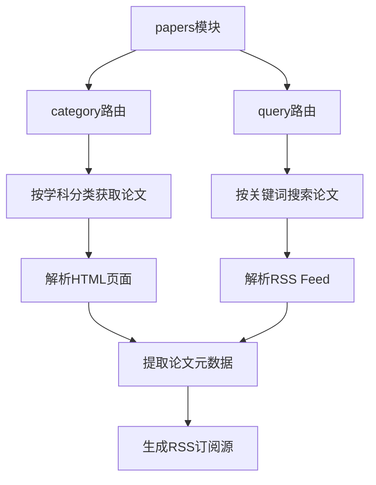
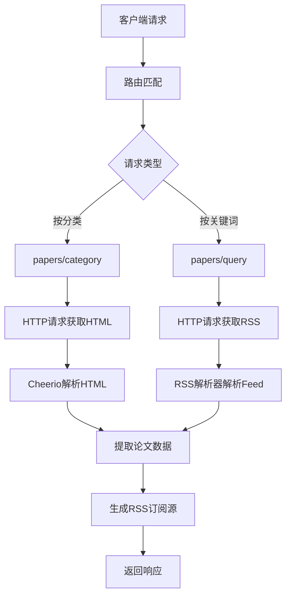
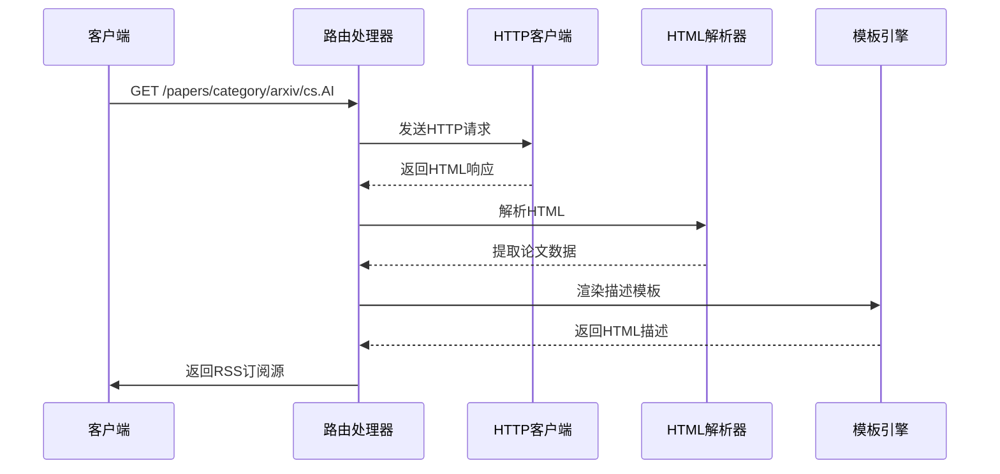
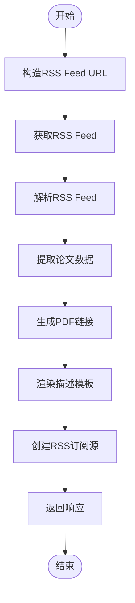
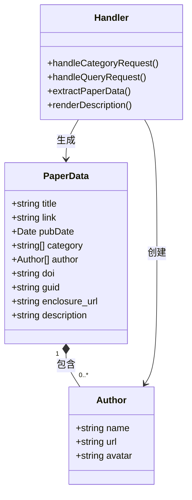
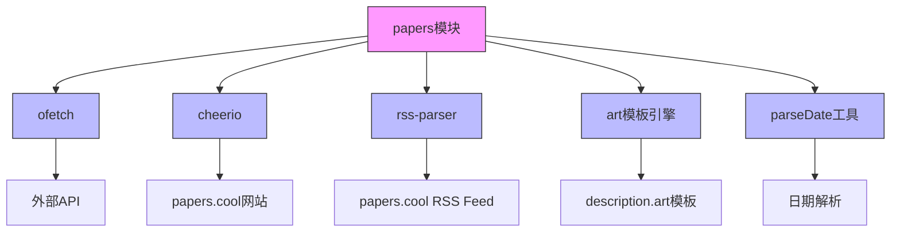

# arXiv学术聚合

<cite>
**本文档引用的文件**  
- [papers/category.ts](file://lib/routes/papers/category.ts)
- [papers/query.ts](file://lib/routes/papers/query.ts)
- [papers/templates/description.art](file://lib/routes/papers/templates/description.art)
- [arxiv/query.js](file://lib/routes-deprecated/arxiv/query.js)
</cite>

## 目录
1. [简介](#简介)
2. [项目结构](#项目结构)
3. [核心组件](#核心组件)
4. [架构概述](#架构概述)
5. [详细组件分析](#详细组件分析)
6. [依赖分析](#依赖分析)
7. [性能考虑](#性能考虑)
8. [故障排除指南](#故障排除指南)
9. [结论](#结论)

## 简介
本文档详细介绍了RSSHub项目中arXiv学术聚合功能的实现机制。该功能允许科研人员通过API订阅和获取arXiv平台上的最新预印本论文，涵盖计算机科学、物理学、数学等多个学科领域。文档将深入解析论文元数据提取、分类检索、PDF链接生成等核心功能的实现方式。

## 项目结构
arXiv学术聚合功能主要通过papers模块实现，该模块提供了按学科分类和关键词搜索两种主要的论文获取方式。系统通过抓取papers.cool网站的数据来聚合arXiv论文信息。

**Diagram sources**
- [papers/category.ts](file://lib/routes/papers/category.ts)
- [papers/query.ts](file://lib/routes/papers/query.ts)

**Section sources**
- [papers/category.ts](file://lib/routes/papers/category.ts)
- [papers/query.ts](file://lib/routes/papers/query.ts)

## 核心组件
arXiv学术聚合功能的核心组件包括按分类获取论文的路由处理器和按关键词查询论文的路由处理器。这些组件负责从papers.cool网站抓取数据，解析论文元数据，并生成标准化的RSS订阅源。

**Section sources**
- [papers/category.ts](file://lib/routes/papers/category.ts#L15-L114)
- [papers/query.ts](file://lib/routes/papers/query.ts#L12-L73)

## 架构概述
arXiv学术聚合功能采用模块化架构，通过独立的路由处理器处理不同类型的请求。系统利用HTTP客户端获取远程数据，使用HTML解析器提取所需信息，并通过模板引擎生成包含完整论文信息的RSS订阅源。

**Diagram sources**
- [papers/category.ts](file://lib/routes/papers/category.ts)
- [papers/query.ts](file://lib/routes/papers/query.ts)

## 详细组件分析

### 按分类获取论文分析
按分类获取论文的功能通过解析HTML页面来提取论文信息。系统发送HTTP请求到papers.cool的特定分类页面，然后使用Cheerio库解析返回的HTML内容，提取每篇论文的标题、作者、摘要、发布日期等元数据。

**Diagram sources**
- [papers/category.ts](file://lib/routes/papers/category.ts#L15-L114)
- [papers/templates/description.art](file://lib/routes/papers/templates/description.art)

**Section sources**
- [papers/category.ts](file://lib/routes/papers/category.ts#L15-L114)
- [papers/templates/description.art](file://lib/routes/papers/templates/description.art)

### 按关键词搜索论文分析
按关键词搜索论文的功能通过解析RSS Feed来获取论文信息。系统构造特定的RSS Feed URL，使用RSS解析器获取数据，然后提取和处理论文元数据。

**Diagram sources**
- [papers/query.ts](file://lib/routes/papers/query.ts#L12-L73)
- [papers/templates/description.art](file://lib/routes/papers/templates/description.art)

**Section sources**
- [papers/query.ts](file://lib/routes/papers/query.ts#L12-L73)
- [papers/templates/description.art](file://lib/routes/papers/templates/description.art)

### 论文元数据提取机制
论文元数据提取机制是arXiv学术聚合功能的核心。系统从不同的数据源提取标题、作者、摘要、分类等信息，并统一格式化为标准的RSS项。

**Diagram sources**
- [papers/category.ts](file://lib/routes/papers/category.ts#L15-L114)
- [papers/query.ts](file://lib/routes/papers/query.ts#L12-L73)

**Section sources**
- [papers/category.ts](file://lib/routes/papers/category.ts#L15-L114)
- [papers/query.ts](file://lib/routes/papers/query.ts#L12-L73)

## 依赖分析
arXiv学术聚合功能依赖于多个核心模块和外部服务。系统使用ofetch进行HTTP请求，cheerio进行HTML解析，rss-parser进行Feed解析，以及art模板引擎进行内容渲染。

**Diagram sources**
- [papers/category.ts](file://lib/routes/papers/category.ts)
- [papers/query.ts](file://lib/routes/papers/query.ts)
- [lib/utils/parse-date.ts](file://lib/utils/parse-date.ts)
- [lib/utils/ofetch.ts](file://lib/utils/ofetch.ts)

**Section sources**
- [papers/category.ts](file://lib/routes/papers/category.ts)
- [papers/query.ts](file://lib/routes/papers/query.ts)
- [lib/utils/parse-date.ts](file://lib/utils/parse-date.ts)
- [lib/utils/ofetch.ts](file://lib/utils/ofetch.ts)

## 性能考虑
arXiv学术聚合功能在设计时考虑了性能优化。系统实现了缓存机制，避免频繁请求外部服务。同时，通过限制返回的论文数量和优化数据解析过程，确保API响应的高效性。

- 分页机制：通过limit参数控制返回的论文数量，默认为50篇
- 数据缓存：利用RSSHub的全局缓存系统，减少对papers.cool的重复请求
- 异步处理：使用异步函数处理HTTP请求和数据解析，提高并发处理能力
- 更新频率：依赖于RSSHub的全局缓存过期策略，确保数据的及时更新

## 故障排除指南
当arXiv学术聚合API出现问题时，可以参考以下排查步骤：

1. 检查API端点是否正确，确保分类ID或关键词参数格式正确
2. 验证网络连接，确保能够访问papers.cool服务
3. 检查缓存状态，确认是否因缓存导致数据未更新
4. 查看错误日志，分析具体的错误信息
5. 验证返回的RSS Feed格式是否符合标准

**Section sources**
- [papers/category.ts](file://lib/routes/papers/category.ts)
- [papers/query.ts](file://lib/routes/papers/query.ts)

## 结论
arXiv学术聚合功能为科研人员提供了一个高效获取最新学术论文的途径。通过按学科分类和关键词搜索两种方式，用户可以灵活地追踪特定领域的研究进展。系统的模块化设计和高效的实现机制确保了API的稳定性和性能，为学术研究提供了有力支持。