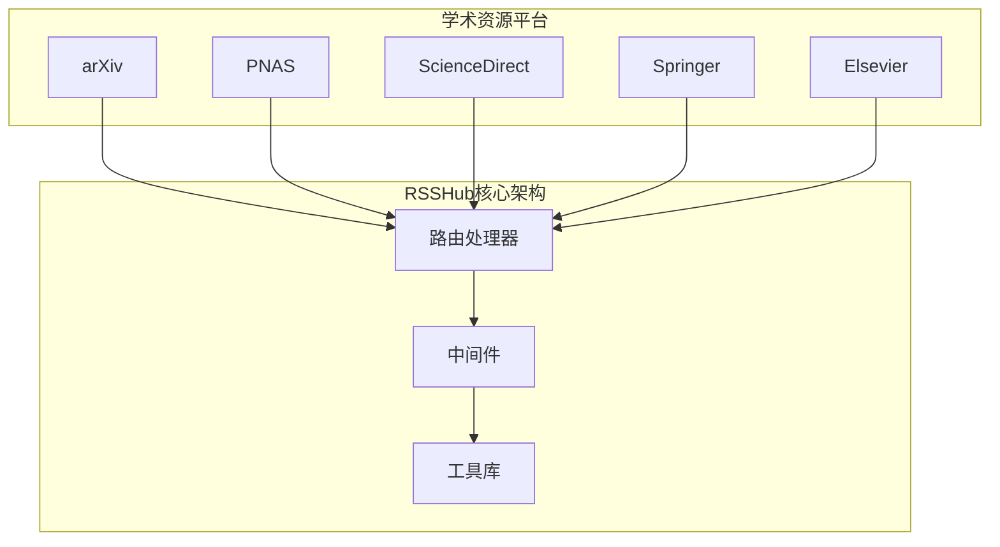
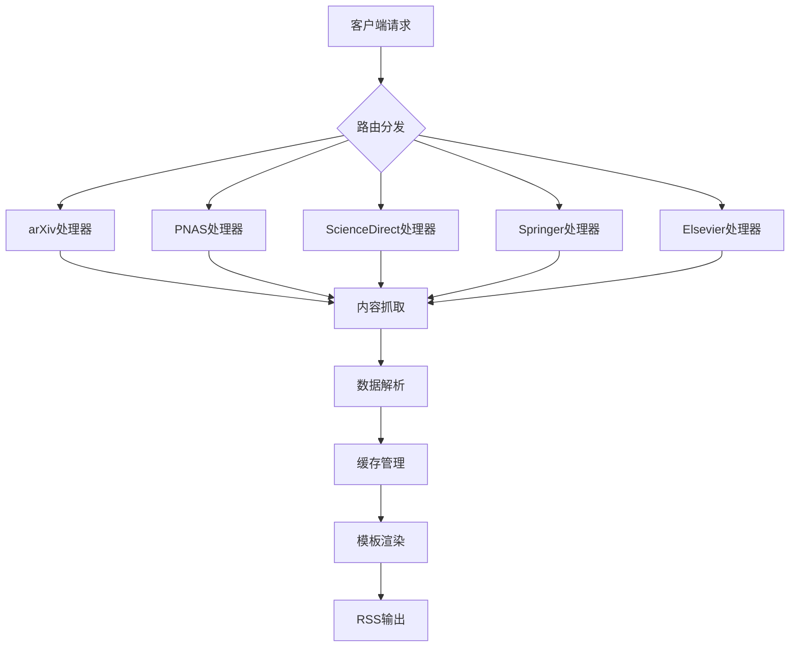
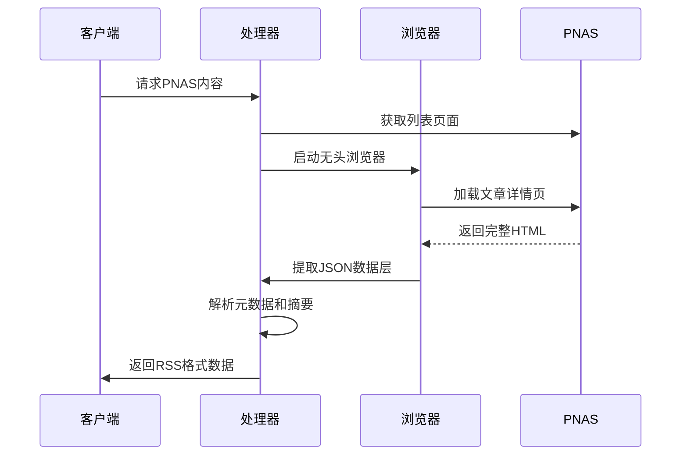
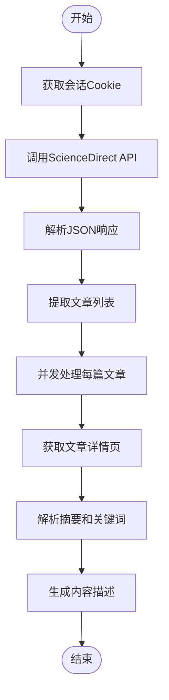
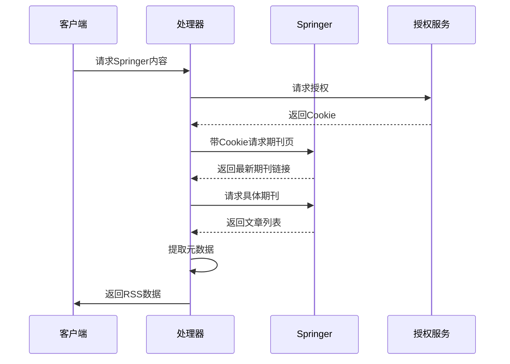
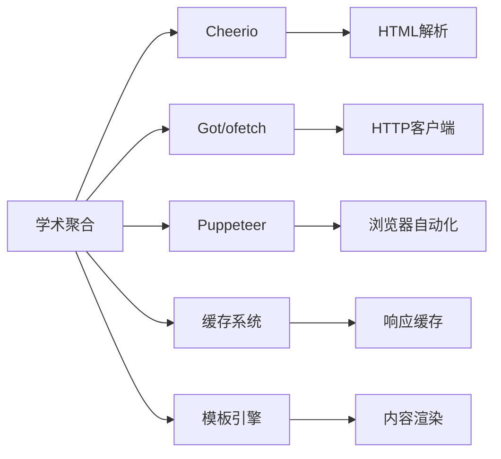

# 学术内容聚合

<cite>
**本文档引用的文件**  
- [pnas/index.ts](file://lib/routes/pnas/index.ts)
- [sciencedirect/journal.ts](file://lib/routes/sciencedirect/journal.ts)
- [springer/journal.ts](file://lib/routes/springer/journal.ts)
- [elsevier/journal.ts](file://lib/routes/elsevier/journal.ts)
- [sciencedirect/call-for-paper.ts](file://lib/routes/sciencedirect/call-for-paper.ts)
- [arxiv/query](file://lib/routes-deprecated/arxiv/query.js)
</cite>

## 目录
1. [简介](#简介)
2. [项目结构](#项目结构)
3. [核心组件](#核心组件)
4. [架构概述](#架构概述)
5. [详细组件分析](#详细组件分析)
6. [依赖分析](#依赖分析)
7. [性能考虑](#性能考虑)
8. [故障排除指南](#故障排除指南)
9. [结论](#结论)

## 简介
学术内容聚合API旨在为科研人员提供一个统一的接口，用于获取来自arXiv、PNAS、ScienceDirect、Springer等主流学术资源平台的最新研究成果。该系统通过自动化抓取和解析机制，将分散在不同平台的学术论文、研究报告和期刊文章整合为标准化的RSS格式，便于用户订阅和跟踪特定领域的研究动态。

## 项目结构
学术内容聚合功能主要分布在`lib/routes`目录下的多个子模块中，每个学术平台都有独立的路由处理文件。系统采用模块化设计，通过统一的中间件和工具库支持数据抓取、缓存管理和内容渲染。

**图源**  
- [lib/routes/pnas/index.ts](file://lib/routes/pnas/index.ts)
- [lib/routes/sciencedirect/journal.ts](file://lib/routes/sciencedirect/journal.ts)
- [lib/routes/springer/journal.ts](file://lib/routes/springer/journal.ts)

**节源**  
- [lib/routes/pnas/index.ts](file://lib/routes/pnas/index.ts#L1-L121)
- [lib/routes/sciencedirect/journal.ts](file://lib/routes/sciencedirect/journal.ts#L1-L97)

## 核心组件
系统的核心组件包括学术平台专用的路由处理器、内容解析引擎、缓存机制和模板渲染系统。这些组件协同工作，实现从原始网页到结构化学术数据的转换过程。

**节源**  
- [lib/routes/springer/journal.ts](file://lib/routes/springer/journal.ts#L1-L121)
- [lib/routes/elsevier/journal.ts](file://lib/routes/elsevier/journal.ts#L1-L90)

## 架构概述
学术内容聚合服务采用分层架构设计，包含数据采集层、处理层和输出层。数据采集层负责与各学术平台交互，处理层进行内容解析和结构化，输出层生成标准化的RSS响应。

**图源**  
- [lib/routes/pnas/index.ts](file://lib/routes/pnas/index.ts#L29-L120)
- [lib/routes/sciencedirect/journal.ts](file://lib/routes/sciencedirect/journal.ts#L33-L96)

## 详细组件分析

### PNAS平台分析
PNAS平台的处理器使用Puppeteer进行浏览器级渲染，以处理JavaScript动态加载的内容。系统通过解析页面中的JSON数据层获取完整的论文元数据。

**图源**  
- [lib/routes/pnas/index.ts](file://lib/routes/pnas/index.ts#L75-L120)

**节源**  
- [lib/routes/pnas/index.ts](file://lib/routes/pnas/index.ts#L1-L121)

### ScienceDirect平台分析
ScienceDirect平台提供两种访问方式：通过期刊ID直接获取最新文章，或获取特刊征稿信息。系统利用API接口获取结构化数据，并解析HTML内容提取摘要和关键词。

**图源**  
- [lib/routes/sciencedirect/journal.ts](file://lib/routes/sciencedirect/journal.ts#L46-L96)
- [lib/routes/sciencedirect/call-for-paper.ts](file://lib/routes/sciencedirect/call-for-paper.ts#L38-L80)

**节源**  
- [lib/routes/sciencedirect/journal.ts](file://lib/routes/sciencedirect/journal.ts#L1-L97)
- [lib/routes/sciencedirect/call-for-paper.ts](file://lib/routes/sciencedirect/call-for-paper.ts#L1-L80)

### Springer平台分析
Springer平台的处理器通过模拟用户授权流程获取访问权限，然后抓取最新期刊内容。系统能够提取作者信息、DOI编号和文章摘要。

**图源**  
- [lib/routes/springer/journal.ts](file://lib/routes/springer/journal.ts#L38-L120)

**节源**  
- [lib/routes/springer/journal.ts](file://lib/routes/springer/journal.ts#L1-L121)

### Elsevier平台分析
Elsevier平台的处理器与ScienceDirect共享部分基础设施，通过统一的Cookie管理机制维持会话状态，确保能够持续访问受保护的内容。

**节源**  
- [lib/routes/elsevier/journal.ts](file://lib/routes/elsevier/journal.ts#L1-L90)

## 依赖分析
学术内容聚合功能依赖于多个核心工具库，包括Cheerio用于HTML解析、Got用于HTTP请求、Puppeteer用于浏览器自动化，以及自定义的缓存和模板系统。

**图源**  
- [lib/routes/pnas/index.ts](file://lib/routes/pnas/index.ts#L3-L13)
- [lib/routes/sciencedirect/journal.ts](file://lib/routes/sciencedirect/journal.ts#L1-L9)
- [lib/routes/springer/journal.ts](file://lib/routes/springer/journal.ts#L1-L8)

**节源**  
- [lib/routes/pnas/index.ts](file://lib/routes/pnas/index.ts#L1-L121)
- [lib/routes/sciencedirect/journal.ts](file://lib/routes/sciencedirect/journal.ts#L1-L97)
- [lib/routes/springer/journal.ts](file://lib/routes/springer/journal.ts#L1-L121)

## 性能考虑
系统采用多级缓存策略，对API响应和页面内容进行缓存，显著减少重复请求。并发处理机制允许同时抓取多篇文章详情，提高整体处理效率。对于需要浏览器渲染的平台，系统复用浏览器实例以降低资源消耗。

## 故障排除指南
常见问题包括Cookie过期、API限流和内容结构变化。建议定期更新处理器逻辑以适应目标网站的变更。对于授权相关的错误，需要检查Cookie管理机制是否正常工作。当遇到解析失败时，应验证选择器是否仍然匹配最新的页面结构。

**节源**  
- [lib/routes/pnas/index.ts](file://lib/routes/pnas/index.ts#L34-L42)
- [lib/routes/springer/journal.ts](file://lib/routes/springer/journal.ts#L38-L56)

## 结论
学术内容聚合API通过统一的接口整合了多个重要学术资源平台的内容，为科研人员提供了便捷的信息获取途径。系统的模块化设计和可扩展架构使其能够轻松支持更多学术平台的集成，持续为学术社区提供价值。