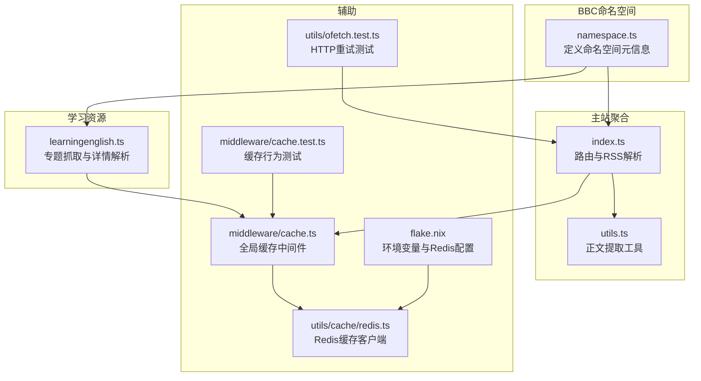
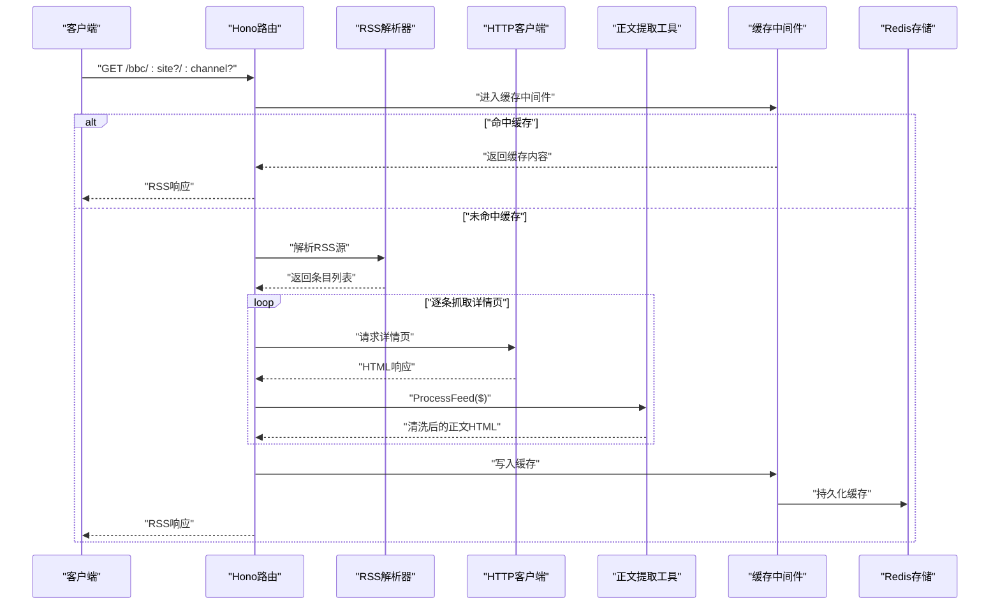
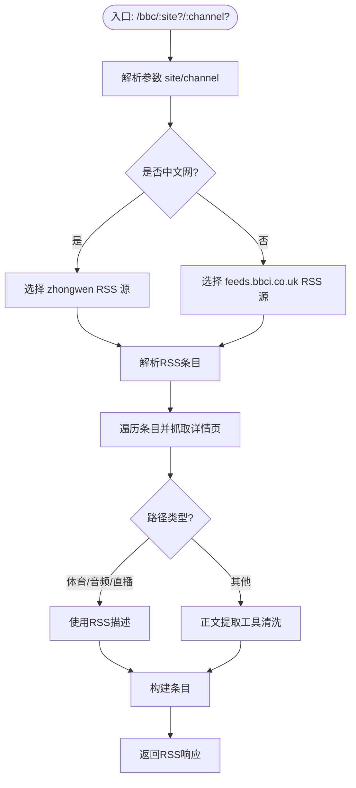
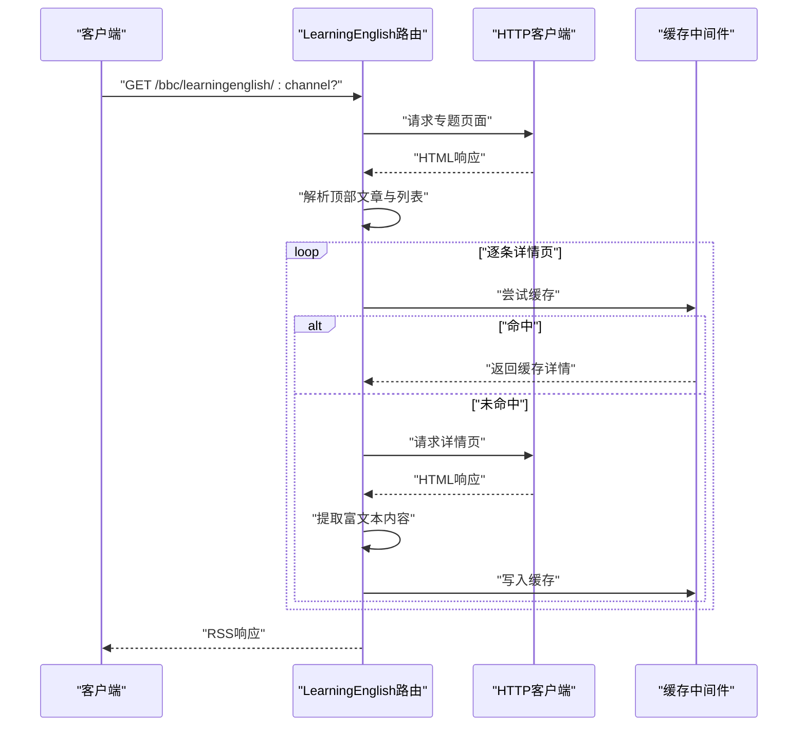
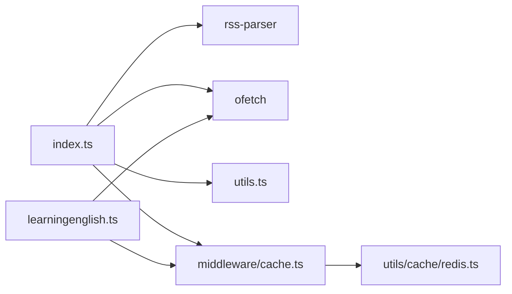

# BBC新闻聚合

<cite>
**本文引用的文件列表**
- [lib/routes/bbc/index.ts](file://lib/routes/bbc/index.ts)
- [lib/routes/bbc/utils.ts](file://lib/routes/bbc/utils.ts)
- [lib/routes/bbc/learningenglish.ts](file://lib/routes/bbc/learningenglish.ts)
- [lib/routes/bbc/namespace.ts](file://lib/routes/bbc/namespace.ts)
- [lib/routes/bbcnewslabs/news.ts](file://lib/routes/bbcnewslabs/news.ts)
- [lib/utils/cache/redis.ts](file://lib/utils/cache/redis.ts)
- [lib/middleware/cache.ts](file://lib/middleware/cache.ts)
- [lib/utils/ofetch.test.ts](file://lib/utils/ofetch.test.ts)
- [lib/middleware/cache.test.ts](file://lib/middleware/cache.test.ts)
- [flake.nix](file://flake.nix)
</cite>

## 目录
1. [简介](#简介)
2. [项目结构](#项目结构)
3. [核心组件](#核心组件)
4. [架构总览](#架构总览)
5. [详细组件分析](#详细组件分析)
6. [依赖关系分析](#依赖关系分析)
7. [性能与缓存特性](#性能与缓存特性)
8. [故障排查指南](#故障排查指南)
9. [结论](#结论)
10. [附录：API参数与响应规范](#附录api参数与响应规范)

## 简介
本文件面向RSSHub使用者与开发者，系统化说明RSSHub如何从BBC网站聚合新闻内容，覆盖：
- BBC News主站（含中文网）的RSS订阅与正文抽取
- BBC Learning English学习资源的抓取与详情页解析
- 不同栏目（如世界、亚洲、科技、财经等）的抓取策略
- 视频与音频内容的处理方式
- 请求参数配置、响应数据结构、内容更新机制、语言版本支持与特殊内容类型的处理方法

## 项目结构
RSSHub对BBC的聚合由以下模块组成：
- 命名空间定义：为RSSHub路由注册提供元信息
- 主站聚合路由：根据站点与频道参数选择RSS源，并抓取正文
- 学习资源路由：针对Learning English站点的专题页面抓取与详情解析
- 工具函数：统一的正文提取与清理逻辑
- 缓存中间件与存储：全局缓存控制与Redis支持
- 配置与测试：环境变量、缓存行为验证与HTTP重试机制

图表来源
- [lib/routes/bbc/namespace.ts](file://lib/routes/bbc/namespace.ts#L1-L8)
- [lib/routes/bbc/index.ts](file://lib/routes/bbc/index.ts#L1-L119)
- [lib/routes/bbc/utils.ts](file://lib/routes/bbc/utils.ts#L1-L36)
- [lib/routes/bbc/learningenglish.ts](file://lib/routes/bbc/learningenglish.ts#L1-L93)
- [lib/middleware/cache.ts](file://lib/middleware/cache.ts#L1-L68)
- [lib/utils/cache/redis.ts](file://lib/utils/cache/redis.ts#L1-L22)
- [lib/middleware/cache.test.ts](file://lib/middleware/cache.test.ts#L1-L190)
- [lib/utils/ofetch.test.ts](file://lib/utils/ofetch.test.ts#L1-L52)
- [flake.nix](file://flake.nix#L152-L188)

章节来源
- [lib/routes/bbc/namespace.ts](file://lib/routes/bbc/namespace.ts#L1-L8)
- [lib/routes/bbc/index.ts](file://lib/routes/bbc/index.ts#L1-L119)
- [lib/routes/bbc/utils.ts](file://lib/routes/bbc/utils.ts#L1-L36)
- [lib/routes/bbc/learningenglish.ts](file://lib/routes/bbc/learningenglish.ts#L1-L93)
- [lib/middleware/cache.ts](file://lib/middleware/cache.ts#L1-L68)
- [lib/utils/cache/redis.ts](file://lib/utils/cache/redis.ts#L1-L22)
- [lib/middleware/cache.test.ts](file://lib/middleware/cache.test.ts#L1-L190)
- [lib/utils/ofetch.test.ts](file://lib/utils/ofetch.test.ts#L1-L52)
- [flake.nix](file://flake.nix#L152-L188)

## 核心组件
- 命名空间：为RSSHub路由注册提供语言、域名等元信息，便于统一管理与识别。
- 主站聚合路由：根据站点与频道参数选择RSS源，解析条目并抓取详情页正文；对视频、音频、直播等特殊路径采用直接复用RSS描述的方式。
- 学习资源路由：针对Learning English站点的专题页面抓取列表与详情，解析富文本内容。
- 正文提取工具：统一处理不同页面结构，移除无用DOM、补全图片src、标注媒体播放提示等。
- 缓存中间件与存储：全局缓存键生成、并发请求去重、命中返回与过期控制；Redis作为可选后端。

章节来源
- [lib/routes/bbc/namespace.ts](file://lib/routes/bbc/namespace.ts#L1-L8)
- [lib/routes/bbc/index.ts](file://lib/routes/bbc/index.ts#L1-L119)
- [lib/routes/bbc/utils.ts](file://lib/routes/bbc/utils.ts#L1-L36)
- [lib/routes/bbc/learningenglish.ts](file://lib/routes/bbc/learningenglish.ts#L1-L93)
- [lib/middleware/cache.ts](file://lib/middleware/cache.ts#L1-L68)
- [lib/utils/cache/redis.ts](file://lib/utils/cache/redis.ts#L1-L22)

## 架构总览
RSSHub通过Hono路由框架对外提供接口，内部以RSS解析器获取条目，再按需抓取详情页并调用正文提取工具进行清洗与增强，最终输出标准RSS/Atom格式。

图表来源
- [lib/routes/bbc/index.ts](file://lib/routes/bbc/index.ts#L1-L119)
- [lib/routes/bbc/utils.ts](file://lib/routes/bbc/utils.ts#L1-L36)
- [lib/middleware/cache.ts](file://lib/middleware/cache.ts#L1-L68)
- [lib/utils/cache/redis.ts](file://lib/utils/cache/redis.ts#L1-L22)

## 详细组件分析

### 主站聚合路由（BBC News）
- 参数与示例
  - 路径：/bbc/:site?/:channel?
  - 示例：/bbc/world-asia、/bbc/chinese、/bbc/traditionalchinese
  - 说明：site对应中文网的语言参数（chinese、traditionalchinese），默认走英文网RSS；channel用于英文网RSS路径映射（如world/asia映射为world-asia）
- RSS源选择策略
  - 中文网：根据site与channel拼接zhongwen/simp或zhongwen/trad下的RSS
  - 英文网：默认feeds.bbci.co.uk/news/{site}/rss.xml，其中斜杠替换为连字符
- 详情页抓取与正文提取
  - 将www.bbc.com重定向至www.bbc.co.uk以避免跨域问题
  - 对特殊路径（体育、音频、直播）直接复用RSS描述字段
  - 其他路径使用正文提取工具进行结构化清洗与增强
- 输出字段
  - 标题、链接、图像、描述、条目数组（标题、发布时间、链接、正文）

图表来源
- [lib/routes/bbc/index.ts](file://lib/routes/bbc/index.ts#L1-L119)
- [lib/routes/bbc/utils.ts](file://lib/routes/bbc/utils.ts#L1-L36)

章节来源
- [lib/routes/bbc/index.ts](file://lib/routes/bbc/index.ts#L1-L119)
- [lib/routes/bbc/utils.ts](file://lib/routes/bbc/utils.ts#L1-L36)

### 学习资源路由（BBC Learning English）
- 参数与示例
  - 路径：/bbc/learningenglish/:channel?
  - 默认频道：take-away-english
  - 支持频道：随身英语、地道英语、媒体英语、英语大破解、一分钟英语、短语动词、今日短语、你问我答、白领英语、亲子英语故事
- 抓取流程
  - 访问专题页面，提取顶部文章与列表项
  - 对每个详情页发起请求，解析富文本内容并回填到条目
- 输出字段
  - 标题、链接、条目数组（标题、发布时间、链接、正文HTML）

图表来源
- [lib/routes/bbc/learningenglish.ts](file://lib/routes/bbc/learningenglish.ts#L1-L93)
- [lib/middleware/cache.ts](file://lib/middleware/cache.ts#L1-L68)

章节来源
- [lib/routes/bbc/learningenglish.ts](file://lib/routes/bbc/learningenglish.ts#L1-L93)

### 正文提取工具（ProcessFeed）
- 处理逻辑
  - 优先匹配混合新闻结构（含视频与正文）
  - 视频新闻结构降级适配
  - 中文网结构适配
  - 移除无用头部、区域与Logo容器
  - 替换noscript为实际HTML
  - 补全图片src（当仅有srcset时）
  - 对媒体块标注“在浏览器查看视频”的提示
- 性能与健壮性
  - 通过选择器与DOM遍历实现，避免复杂正则
  - 对缺失属性进行兜底处理

章节来源
- [lib/routes/bbc/utils.ts](file://lib/routes/bbc/utils.ts#L1-L36)

### 内容类型与特殊路径处理
- 视频与音频
  - 路径前缀为/sounds/play时，直接使用RSS描述字段，避免二次抓取
- 体育
  - 路径前缀为/sport时，直接使用RSS描述字段
- 新闻直播
  - 路径前缀为/news/live时，直接使用RSS描述字段
- 其他正文类页面
  - 使用正文提取工具进行结构化清洗与增强

章节来源
- [lib/routes/bbc/index.ts](file://lib/routes/bbc/index.ts#L63-L109)

### 内容更新机制与语言版本支持
- 更新机制
  - RSS源由feeds.bbci.co.uk提供，RSSHub按请求触发抓取与缓存
  - 缓存中间件支持内存与Redis两种模式，命中返回并设置缓存状态头
- 语言版本
  - 英文网：默认feeds.bbci.co.uk/news/{site}/rss.xml
  - 中文网：zhongwen/simp与zhongwen/trad两个版本，分别对应简体与繁体
  - 中文网RSS路径与英文网RSS路径存在差异，需正确映射

章节来源
- [lib/routes/bbc/index.ts](file://lib/routes/bbc/index.ts#L35-L61)
- [lib/middleware/cache.ts](file://lib/middleware/cache.ts#L1-L68)
- [lib/utils/cache/redis.ts](file://lib/utils/cache/redis.ts#L1-L22)

## 依赖关系分析
- 组件耦合
  - 主站聚合路由依赖RSS解析器、HTTP客户端、正文提取工具与缓存中间件
  - 学习资源路由依赖HTTP客户端与缓存中间件
  - 缓存中间件依赖Redis客户端（可选）
- 外部依赖
  - RSS解析器：解析BBC官方RSS
  - HTTP客户端：抓取详情页与专题页面
  - Redis：可选的分布式缓存后端

图表来源
- [lib/routes/bbc/index.ts](file://lib/routes/bbc/index.ts#L1-L119)
- [lib/routes/bbc/learningenglish.ts](file://lib/routes/bbc/learningenglish.ts#L1-L93)
- [lib/middleware/cache.ts](file://lib/middleware/cache.ts#L1-L68)
- [lib/utils/cache/redis.ts](file://lib/utils/cache/redis.ts#L1-L22)

章节来源
- [lib/routes/bbc/index.ts](file://lib/routes/bbc/index.ts#L1-L119)
- [lib/routes/bbc/learningenglish.ts](file://lib/routes/bbc/learningenglish.ts#L1-L93)
- [lib/middleware/cache.ts](file://lib/middleware/cache.ts#L1-L68)
- [lib/utils/cache/redis.ts](file://lib/utils/cache/redis.ts#L1-L22)

## 性能与缓存特性
- 缓存中间件
  - 全局缓存键由路径、format与limit组合生成，XXH64哈希缩短键长度
  - 并发请求去重：同一路径在请求期间会阻塞后续请求，避免雪崩
  - 命中返回：设置RSSHub-Cache-Status头，便于调试
- Redis支持
  - 可通过环境变量启用Redis缓存，提升高并发场景下的吞吐
- HTTP重试
  - 对403等状态码进行重试，提高稳定性
- 测试验证
  - 缓存命中、过期与刷新行为均有单元测试覆盖
  - HTTP重试次数与行为在测试中得到验证

章节来源
- [lib/middleware/cache.ts](file://lib/middleware/cache.ts#L1-L68)
- [lib/utils/cache/redis.ts](file://lib/utils/cache/redis.ts#L1-L22)
- [lib/utils/ofetch.test.ts](file://lib/utils/ofetch.test.ts#L1-L52)
- [lib/middleware/cache.test.ts](file://lib/middleware/cache.test.ts#L1-L190)
- [flake.nix](file://flake.nix#L152-L188)

## 故障排查指南
- 403错误
  - 主站详情页抓取时可能遇到403，HTTP客户端已配置重试策略
  - 若持续失败，请检查目标站点的反爬策略与UA设置
- 缓存命中异常
  - 查看响应头RSSHub-Cache-Status确认是否命中
  - 检查缓存类型（内存/Redis）与过期时间配置
- 并发请求冲突
  - 同一路径在请求期间会被阻塞，等待请求完成后再返回缓存
  - 如出现长时间阻塞，检查缓存控制键状态
- Redis连接问题
  - 确认REDIS_URL环境变量与Redis服务可用
- 学习资源详情为空
  - 检查专题页面结构是否发生变化，必要时更新选择器

章节来源
- [lib/utils/ofetch.test.ts](file://lib/utils/ofetch.test.ts#L1-L52)
- [lib/middleware/cache.ts](file://lib/middleware/cache.ts#L1-L68)
- [lib/middleware/cache.test.ts](file://lib/middleware/cache.test.ts#L1-L190)
- [lib/utils/cache/redis.ts](file://lib/utils/cache/redis.ts#L1-L22)
- [flake.nix](file://flake.nix#L152-L188)

## 结论
RSSHub对BBC新闻的聚合实现了从RSS源到正文的全链路自动化处理，具备良好的扩展性与稳定性。通过统一的正文提取工具与缓存中间件，能够高效地覆盖主流新闻、视频、音频与学习资源等多类型内容。建议在生产环境中启用Redis缓存，并结合合理的limit与format参数优化性能与用户体验。

## 附录：API参数与响应规范

### 主站聚合路由（/bbc/:site?/:channel?）
- 路径参数
  - site：语言或频道标识
    - 中文网：chinese、traditionalchinese
    - 英文网：如world、business、science、technology、asia、world-asia等（斜杠替换为连字符）
  - channel：频道（仅英文网有效），默认为顶级新闻
- 查询参数
  - format：输出格式（rss/atom/json等，默认rss）
  - limit：限制条目数量
- 响应字段
  - title：聚合标题
  - link：聚合链接
  - image：图标
  - description：描述
  - item：条目数组
    - title：标题
    - description：正文HTML
    - pubDate：发布时间
    - link：原文链接

章节来源
- [lib/routes/bbc/index.ts](file://lib/routes/bbc/index.ts#L10-L26)
- [lib/routes/bbc/index.ts](file://lib/routes/bbc/index.ts#L35-L61)
- [lib/routes/bbc/index.ts](file://lib/routes/bbc/index.ts#L63-L118)

### 学习资源路由（/bbc/learningenglish/:channel?）
- 路径参数
  - channel：专题频道（默认take-away-english）
    - 支持：take-away-english、authentic-real-english、media-english、lingohack、english-in-a-minute、phrasal-verbs、todays-phrase、q-and-a、english-at-work、storytellers
- 查询参数
  - format：输出格式（rss/atom/json等，默认rss）
  - limit：限制条目数量
- 响应字段
  - title：聚合标题
  - link：专题页面链接
  - item：条目数组
    - title：标题
    - description：正文HTML
    - pubDate：发布时间
    - link：原文链接

章节来源
- [lib/routes/bbc/learningenglish.ts](file://lib/routes/bbc/learningenglish.ts#L22-L36)
- [lib/routes/bbc/learningenglish.ts](file://lib/routes/bbc/learningenglish.ts#L38-L92)

### 缓存与环境配置
- 缓存类型
  - memory：内存缓存
  - redis：Redis缓存（需配置REDIS_URL）
- 关键环境变量
  - CACHE_TYPE：缓存类型（memory/redis）
  - REDIS_URL：Redis连接地址
  - CACHE_EXPIRE：路由缓存过期时间（秒）
  - CACHE_CONTENT_EXPIRE：内容缓存过期时间（秒）
- 响应头
  - RSSHub-Cache-Status：HIT表示命中缓存

章节来源
- [lib/middleware/cache.ts](file://lib/middleware/cache.ts#L1-L68)
- [lib/utils/cache/redis.ts](file://lib/utils/cache/redis.ts#L1-L22)
- [flake.nix](file://flake.nix#L152-L188)