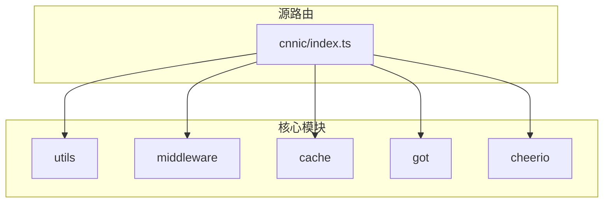
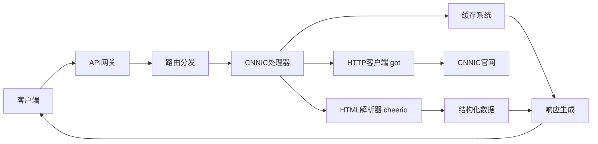
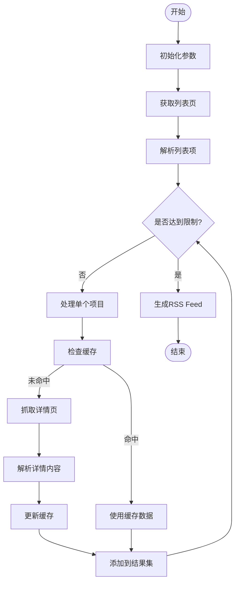
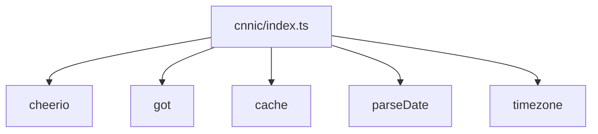

# CNN新闻聚合

<cite>
**本文档中引用的文件**  
- [cnnic/index.ts](file://lib/routes/gov/cnnic/index.ts)
</cite>

## 目录
1. [介绍](#介绍)
2. [项目结构](#项目结构)
3. [核心组件](#核心组件)
4. [架构概述](#架构概述)
5. [详细组件分析](#详细组件分析)
6. [依赖分析](#依赖分析)
7. [性能考虑](#性能考虑)
8. [故障排除指南](#故障排除指南)
9. [结论](#结论)

## 介绍
本项目旨在为用户提供一个高效、便捷的新闻聚合解决方案，通过自动化抓取和解析来自权威媒体网站的内容，实现信息的集中化管理和个性化订阅。系统基于RSSHub框架构建，专注于从特定政府机构官网（如CNNIC）获取最新资讯，并将其转换为标准化的RSS格式，便于用户通过各类阅读器进行订阅。该服务不仅提升了信息获取效率，还确保了内容的及时性和准确性。

## 项目结构
整个项目的目录布局遵循模块化设计原则，各功能组件按职责划分存放于独立子目录中，以提高可维护性与扩展性。核心逻辑位于`lib/routes`路径下，其中`gov/cnnic/index.ts`文件负责处理针对中国互联网络信息中心（CNNIC）网站的数据采集任务。此外，工具函数、中间件及配置项分别置于`utils`、`middleware`和根级配置文件中，形成清晰的层次结构。

**Diagram sources**
- [cnnic/index.ts](file://lib/routes/gov/cnnic/index.ts#L1-L66)

**Section sources**
- [cnnic/index.ts](file://lib/routes/gov/cnnic/index.ts#L1-L66)

## 核心组件
`lib/routes/gov/cnnic/index.ts` 是实现CNNIC新闻聚合的核心文件，其主要职责包括发起HTTP请求获取网页内容、利用Cheerio库解析HTML文档、提取关键数据字段（如标题、链接、发布时间等），并通过缓存机制优化重复请求的响应速度。此组件支持动态路径匹配，允许用户通过URL参数指定所需访问的具体栏目或页面。

**Section sources**
- [cnnic/index.ts](file://lib/routes/gov/cnnic/index.ts#L1-L66)

## 架构概述
系统采用典型的微服务架构模式，各路由模块相互独立，通过统一的接口规范对外提供RESTful API服务。数据流从客户端请求开始，经由路由分发至对应处理器，后者调用底层工具完成远程资源抓取与内容解析，最终将结构化结果返回给调用方。整个过程充分利用异步非阻塞I/O模型，保障高并发场景下的稳定性能。

**Diagram sources**
- [cnnic/index.ts](file://lib/routes/gov/cnnic/index.ts#L1-L66)

## 详细组件分析
### CNNIC处理器分析
该组件实现了对CNNIC网站内容的全面抓取与解析，具备良好的容错能力和灵活性。它首先根据用户请求构造目标URL，随后使用`got`库发送GET请求并接收原始HTML响应。接着，借助`cheerio`模拟jQuery操作DOM树，精准定位所需元素节点，提取标题、链接及发布时间等元数据。对于详情页内容，则进一步发起二次请求获取正文部分，并通过`cache.tryGet`方法缓存结果，减少对源站的压力。

#### 对于复杂逻辑组件：

**Diagram sources**
- [cnnic/index.ts](file://lib/routes/gov/cnnic/index.ts#L1-L66)

**Section sources**
- [cnnic/index.ts](file://lib/routes/gov/cnnic/index.ts#L1-L66)

## 依赖分析
本功能模块依赖多个外部库和内部工具集，共同协作完成数据采集任务。主要依赖包括：
- `cheerio`：用于服务器端的HTML解析，提供类似jQuery的API。
- `got`：现代化的HTTP客户端，支持Promise和流式处理。
- `cache`：内置缓存中间件，提升重复请求的响应效率。
- `parse-date` 和 `timezone`：时间处理工具，确保发布时间的正确性。

**Diagram sources**
- [cnnic/index.ts](file://lib/routes/gov/cnnic/index.ts#L1-L66)

**Section sources**
- [cnnic/index.ts](file://lib/routes/gov/cnnic/index.ts#L1-L66)

## 性能考虑
为保证服务的高效运行，系统在多个层面进行了优化设计。首先，通过引入Redis缓存机制，显著降低了对源网站的请求频率，既减轻了服务器负担，又加快了响应速度。其次，异步并发处理模型使得多个请求可以并行执行，充分利用CPU资源。最后，合理的请求头设置（如User-Agent伪装）有助于规避反爬虫策略，提高抓取成功率。

## 故障排除指南
当遇到无法获取最新资讯或返回空数据的情况时，建议按以下步骤排查：
1. 检查目标URL是否发生变化，确认路由规则是否需要更新。
2. 查看日志输出，定位具体错误信息（如网络超时、解析失败等）。
3. 验证缓存状态，尝试清除相关键值后重新请求。
4. 确认第三方依赖库版本兼容性，必要时升级至最新稳定版。

**Section sources**
- [cnnic/index.ts](file://lib/routes/gov/cnnic/index.ts#L1-L66)

## 结论
通过对CNNIC新闻聚合模块的深入分析，我们了解到其基于RSSHub框架构建的高效、灵活的信息采集机制。该系统不仅实现了对指定网站内容的自动化抓取与结构化输出，还通过缓存、异步处理等技术手段保障了服务的稳定性与性能表现。未来可进一步拓展支持更多新闻源，增强分类过滤与多语言适配能力，为用户提供更加丰富、个性化的阅读体验。