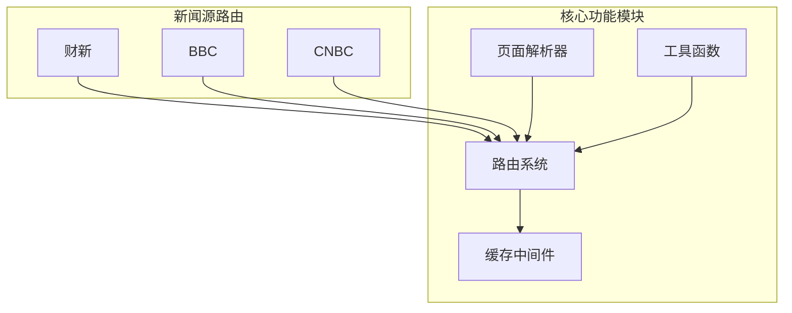
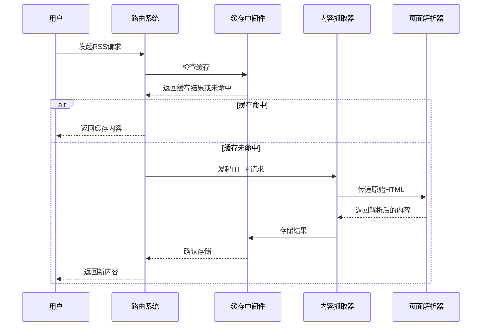
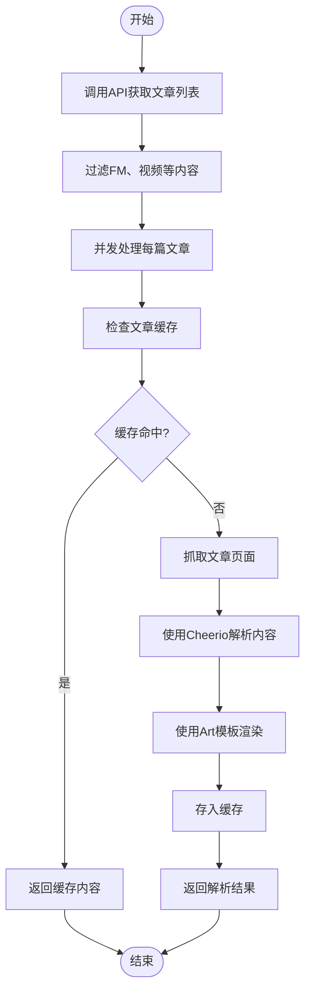
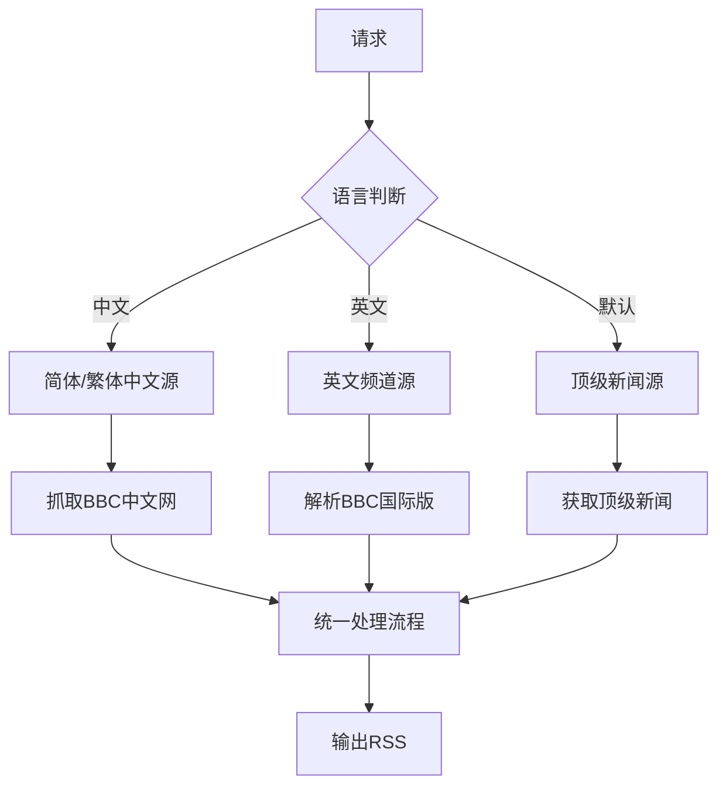
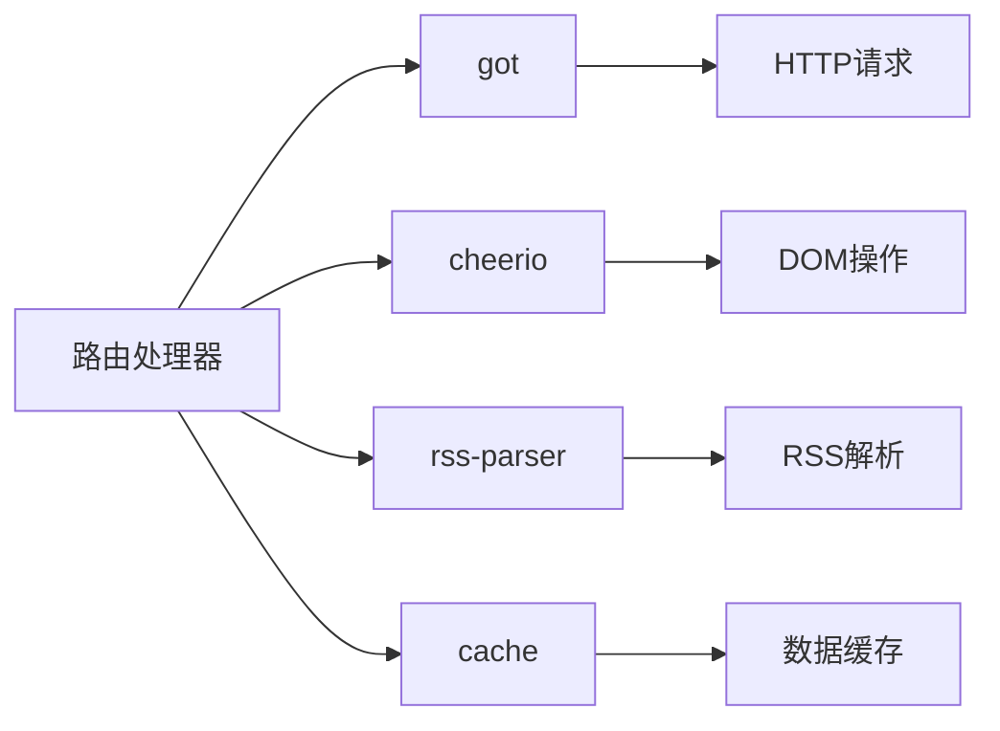

# 新闻网站聚合

<cite>
**本文档中引用的文件**  
- [latest.ts](file://lib/routes/caixin/latest.ts)
- [utils.ts](file://lib/routes/caixin/utils.ts)
- [article.ts](file://lib/routes/caixin/article.ts)
- [category.ts](file://lib/routes/caixin/category.ts)
- [index.ts](file://lib/routes/bbc/index.ts)
- [utils.ts](file://lib/routes/bbc/utils.ts)
- [rss.ts](file://lib/routes/cnbc/rss.ts)
- [namespace.ts](file://lib/routes/caixin/namespace.ts)
- [namespace.ts](file://lib/routes/bbc/namespace.ts)
- [namespace.ts](file://lib/routes/cnbc/namespace.ts)
- [cache.ts](file://lib/middleware/cache.ts)
- [cache.test.ts](file://lib/middleware/cache.test.ts)
</cite>

## 目录
1. [简介](#简介)
2. [项目结构](#项目结构)
3. [核心组件](#核心组件)
4. [架构概述](#架构概述)
5. [详细组件分析](#详细组件分析)
6. [依赖分析](#依赖分析)
7. [性能考虑](#性能考虑)
8. [故障排除指南](#故障排除指南)
9. [结论](#结论)

## 简介
RSSHub 是一个开源的新闻聚合API服务，能够从CNN、BBC、纽约时报、财新等主流新闻网站抓取内容并提供结构化的RSS订阅。本文档详细说明了RSSHub如何实现新闻内容的聚合，包括页面解析、文章提取和元数据处理的技术细节。通过具体的请求示例和响应格式说明，展示如何获取最新的新闻报道。文档还涵盖了内容更新策略、分类过滤功能和地域新闻支持，帮助开发者有效利用新闻聚合API。

## 项目结构
RSSHub的项目结构清晰地组织了不同新闻源的路由和处理逻辑。核心的新闻聚合功能主要位于`lib/routes`目录下，每个新闻网站都有独立的子目录，如`caixin`、`bbc`、`cnbc`等。这些目录包含了特定于该新闻源的路由定义、页面解析逻辑和工具函数。

**图示来源**  
- [latest.ts](file://lib/routes/caixin/latest.ts#L1-L74)
- [index.ts](file://lib/routes/bbc/index.ts#L1-L119)
- [rss.ts](file://lib/routes/cnbc/rss.ts#L1-L37)

**本节来源**  
- [lib/routes/caixin](file://lib/routes/caixin)
- [lib/routes/bbc](file://lib/routes/bbc)
- [lib/routes/cnbc](file://lib/routes/cnbc)

## 核心组件
RSSHub的核心组件包括路由系统、缓存机制、页面解析器和工具函数库。路由系统负责定义不同新闻源的访问路径和参数；缓存机制通过内存或Redis存储已抓取的内容，提高响应速度并减少对源网站的压力；页面解析器使用Cheerio等工具从HTML中提取文章内容；工具函数库提供了通用的数据处理和格式化功能。

**本节来源**  
- [latest.ts](file://lib/routes/caixin/latest.ts#L1-L74)
- [index.ts](file://lib/routes/bbc/index.ts#L1-L119)
- [cache.ts](file://lib/middleware/cache.ts#L1-L200)

## 架构概述
RSSHub的架构采用模块化设计，各新闻源的处理逻辑相互独立，便于维护和扩展。当用户发起请求时，路由系统根据URL路径调用相应的处理器。处理器首先检查缓存中是否存在有效数据，如果存在则直接返回；否则，向目标新闻网站发送HTTP请求获取原始内容，经过解析和处理后生成标准化的RSS格式，并存入缓存供后续请求使用。

**图示来源**  
- [cache.ts](file://lib/middleware/cache.ts#L26-L68)
- [latest.ts](file://lib/routes/caixin/latest.ts#L35-L73)
- [index.ts](file://lib/routes/bbc/index.ts#L63-L118)

## 详细组件分析

### 财新网聚合分析
财新网的聚合功能通过多个路由实现，包括最新文章、分类文章和特定栏目。系统通过API接口获取文章列表，然后逐个抓取和解析每篇文章的详细内容。

#### 文章解析流程

**图示来源**  
- [latest.ts](file://lib/routes/caixin/latest.ts#L35-L73)
- [utils.ts](file://lib/routes/caixin/utils.ts#L8-L48)

**本节来源**  
- [latest.ts](file://lib/routes/caixin/latest.ts#L1-L74)
- [utils.ts](file://lib/routes/caixin/utils.ts#L1-L49)
- [article.ts](file://lib/routes/caixin/article.ts#L1-L55)

### BBC新闻聚合分析
BBC的聚合功能支持多种语言和频道，通过统一的路由处理不同地区的新闻内容。系统能够智能识别请求参数，自动选择对应的RSS源或直接抓取网页内容。

#### 多语言支持逻辑

**图示来源**  
- [index.ts](file://lib/routes/bbc/index.ts#L35-L61)
- [utils.ts](file://lib/routes/bbc/utils.ts#L1-L36)

**本节来源**  
- [index.ts](file://lib/routes/bbc/index.ts#L1-L119)
- [utils.ts](file://lib/routes/bbc/utils.ts#L1-L36)

### CNBC新闻聚合分析
CNBC的聚合功能通过官方RSS源获取内容，提供比原始RSS更完整的阅读体验。系统支持所有频道，用户可以通过Channel ID指定感兴趣的新闻类别。

**本节来源**  
- [rss.ts](file://lib/routes/cnbc/rss.ts#L1-L37)

## 依赖分析
RSSHub的依赖关系清晰，各组件耦合度低，便于独立开发和测试。核心依赖包括HTTP客户端(got)、HTML解析器(cheerio)、RSS解析器(rss-parser)和缓存系统。

**图示来源**  
- [package.json](file://package.json#L1-L50)
- [cache.ts](file://lib/middleware/cache.ts#L1-L200)

**本节来源**  
- [package.json](file://package.json#L1-L100)
- [tsconfig.json](file://tsconfig.json#L1-L50)

## 性能考虑
RSSHub通过多层缓存机制显著提升了性能表现。全局缓存减少了重复的外部请求，内容缓存避免了频繁的页面解析。系统还实现了请求节流，防止同一路径的并发请求造成源网站压力。

**本节来源**  
- [cache.ts](file://lib/middleware/cache.ts#L26-L68)
- [cache.test.ts](file://lib/middleware/cache.test.ts#L1-L190)

## 故障排除指南
常见问题包括缓存未命中、页面结构变化导致解析失败、API限流等。建议检查网络连接、验证目标网站是否可访问、确认页面结构是否发生变化，并适当调整缓存策略。

**本节来源**  
- [cache.ts](file://lib/middleware/cache.ts#L46-L53)
- [utils.ts](file://lib/routes/bbc/utils.ts#L1-L36)

## 结论
RSSHub提供了一套完整的新闻网站聚合解决方案，通过模块化设计和高效的缓存机制，实现了对CNN、BBC、纽约时报、财新等主流新闻源的稳定抓取和聚合。开发者可以根据具体需求选择合适的路由和参数，快速集成高质量的新闻内容到自己的应用中。