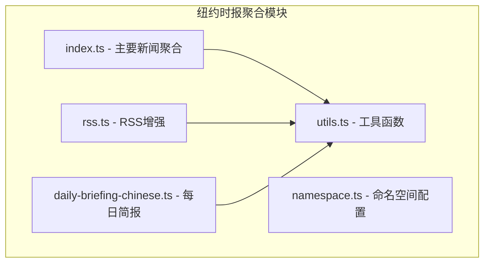
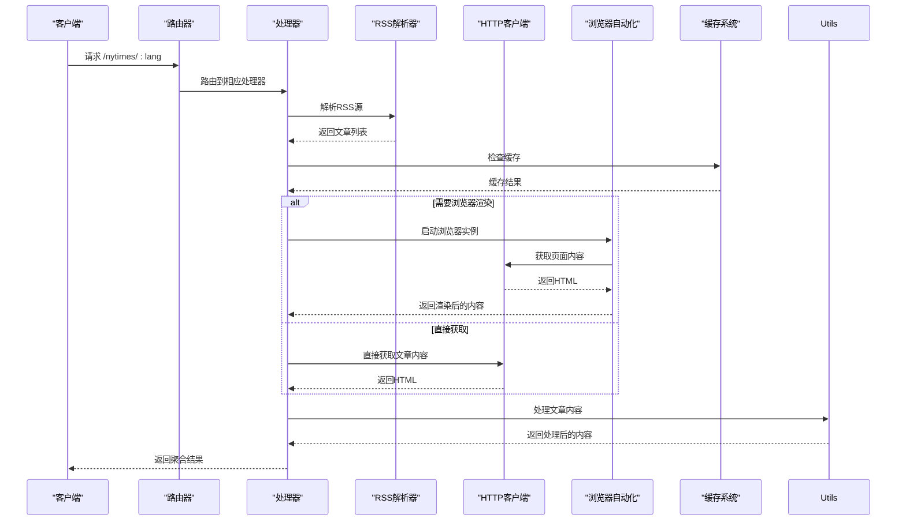
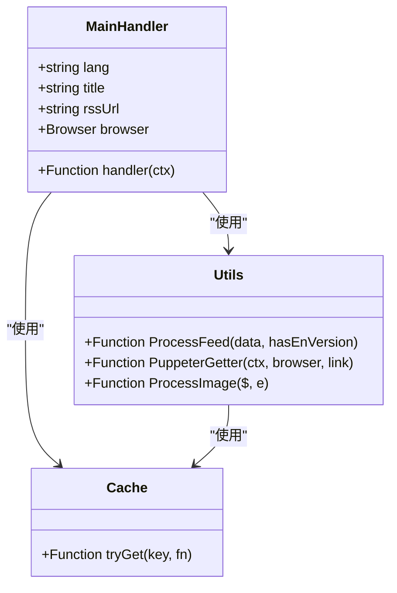
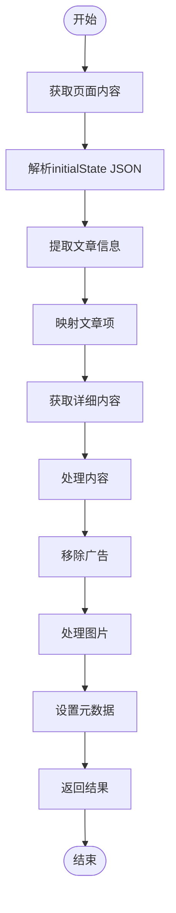
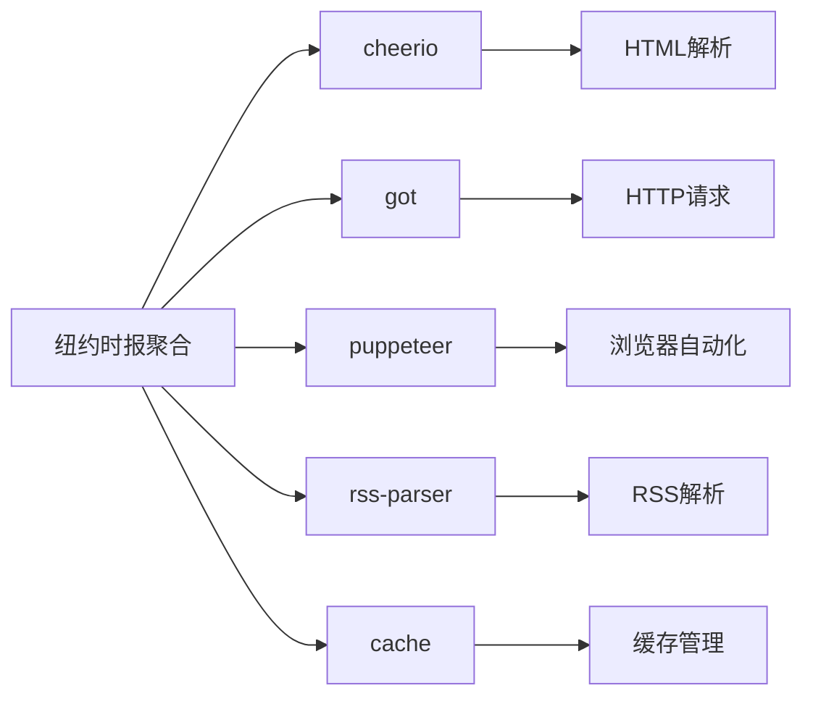

# 纽约时报聚合

<cite>
**本文档中引用的文件**  
- [index.ts](file://lib/routes/nytimes/index.ts)
- [utils.ts](file://lib/routes/nytimes/utils.ts)
- [rss.ts](file://lib/routes/nytimes/rss.ts)
- [daily-briefing-chinese.ts](file://lib/routes/nytimes/daily-briefing-chinese.ts)
- [namespace.ts](file://lib/routes/nytimes/namespace.ts)
</cite>

## 目录
1. [简介](#简介)
2. [项目结构](#项目结构)
3. [核心组件](#核心组件)
4. [架构概述](#架构概述)
5. [详细组件分析](#详细组件分析)
6. [依赖分析](#依赖分析)
7. [性能考虑](#性能考虑)
8. [故障排除指南](#故障排除指南)
9. [结论](#结论)

## 简介
本文档详细说明了RSSHub如何从纽约时报网站聚合高质量新闻内容。该系统能够抓取主页精选、专栏文章和专题报道，提供增强的阅读体验。文档涵盖了付费墙内容处理策略、文章正文提取技术以及元数据（作者、发表时间、分类）解析方法。此外，还提供了API调用示例和响应格式说明，展示如何获取不同版块（如国际、商业、科技）的新闻内容，并包含内容更新策略、文章摘要生成和高质量图片处理等特性。

## 项目结构
纽约时报聚合功能位于`lib/routes/nytimes/`目录下，包含多个专门处理不同类型内容的模块。该结构支持多种语言版本和内容格式，确保用户可以获得最佳的阅读体验。

**图源**  
- [index.ts](file://lib/routes/nytimes/index.ts)
- [utils.ts](file://lib/routes/nytimes/utils.ts)
- [rss.ts](file://lib/routes/nytimes/rss.ts)
- [daily-briefing-chinese.ts](file://lib/routes/nytimes/daily-briefing-chinese.ts)
- [namespace.ts](file://lib/routes/nytimes/namespace.ts)

**节源**  
- [index.ts](file://lib/routes/nytimes/index.ts)
- [namespace.ts](file://lib/routes/nytimes/namespace.ts)

## 核心组件
纽约时报聚合系统由多个核心组件构成，包括主新闻聚合器、每日简报处理器和RSS增强器。这些组件共同工作，从纽约时报网站抓取内容，提取完整文章正文，并提供优于官方RSS的阅读体验。系统支持多种语言版本，包括简体中文、繁体中文和英文原版，以及中英对照版本。

**节源**  
- [index.ts](file://lib/routes/nytimes/index.ts)
- [daily-briefing-chinese.ts](file://lib/routes/nytimes/daily-briefing-chinese.ts)
- [rss.ts](file://lib/routes/nytimes/rss.ts)

## 架构概述
纽约时报聚合系统的架构设计旨在高效地抓取、处理和呈现新闻内容。系统通过RSS源获取文章列表，然后使用HTTP请求获取每篇文章的完整内容。对于需要特殊处理的内容，系统会使用Puppeteer进行浏览器级渲染，以绕过可能的反爬虫机制。

**图源**  
- [index.ts](file://lib/routes/nytimes/index.ts)
- [utils.ts](file://lib/routes/nytimes/utils.ts)
- [rss.ts](file://lib/routes/nytimes/rss.ts)

## 详细组件分析

### 主新闻聚合器分析
主新闻聚合器负责处理纽约时报的主要新闻内容，支持多种语言和格式选项。它能够根据用户请求的语言参数提供相应版本的内容。

#### 组件功能

**图源**  
- [index.ts](file://lib/routes/nytimes/index.ts#L12-L165)
- [utils.ts](file://lib/routes/nytimes/utils.ts#L1-L113)

**节源**  
- [index.ts](file://lib/routes/nytimes/index.ts#L1-L165)
- [utils.ts](file://lib/routes/nytimes/utils.ts#L1-L113)

### 每日简报组件分析
每日简报组件专门处理纽约时报的每日简报内容，从特定URL获取数据并解析JSON格式的初始状态信息。

#### 数据处理流程

**图源**  
- [daily-briefing-chinese.ts](file://lib/routes/nytimes/daily-briefing-chinese.ts#L1-L98)

**节源**  
- [daily-briefing-chinese.ts](file://lib/routes/nytimes/daily-briefing-chinese.ts#L1-L98)

### RSS增强器分析
RSS增强器组件旨在增强官方的英文RSS feed，通过提取完整的文章正文内容来提供更好的阅读体验。

#### 内容增强流程

**图源**  
- [rss.ts](file://lib/routes/nytimes/rss.ts#L1-L64)

**节源**  
- [rss.ts](file://lib/routes/nytimes/rss.ts#L1-L64)

## 依赖分析
纽约时报聚合系统依赖于多个核心工具和库来实现其功能。这些依赖关系确保了系统的稳定性和可维护性。

**图源**  
- [index.ts](file://lib/routes/nytimes/index.ts)
- [utils.ts](file://lib/routes/nytimes/utils.ts)
- [rss.ts](file://lib/routes/nytimes/rss.ts)
- [daily-briefing-chinese.ts](file://lib/routes/nytimes/daily-briefing-chinese.ts)

**节源**  
- [index.ts](file://lib/routes/nytimes/index.ts)
- [utils.ts](file://lib/routes/nytimes/utils.ts)

## 性能考虑
系统通过多种机制优化性能，包括缓存策略、并发处理和资源优化。主要性能特性包括：
- 使用`cache.tryGet`对已获取的内容进行缓存，减少重复请求
- 使用`Promise.all`并发处理多篇文章，提高整体处理速度
- 在Puppeteer中仅加载文档资源，避免加载图片、样式表等非必要资源
- 限制每次返回的文章数量（通常为10篇），避免响应过大

## 故障排除指南
当遇到问题时，可以参考以下常见问题的解决方案：

**节源**  
- [index.ts](file://lib/routes/nytimes/index.ts)
- [utils.ts](file://lib/routes/nytimes/utils.ts)
- [daily-briefing-chinese.ts](file://lib/routes/nytimes/daily-briefing-chinese.ts)

## 结论
纽约时报聚合系统通过精心设计的架构和高效的实现，为用户提供了一个强大的新闻聚合解决方案。系统能够有效地从纽约时报网站抓取高质量内容，处理各种格式和语言版本，并提供优于官方RSS的阅读体验。通过合理的缓存策略和并发处理，系统在性能和可靠性方面表现出色，是RSSHub项目中一个重要的功能模块。