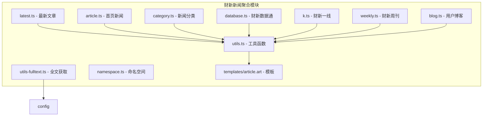
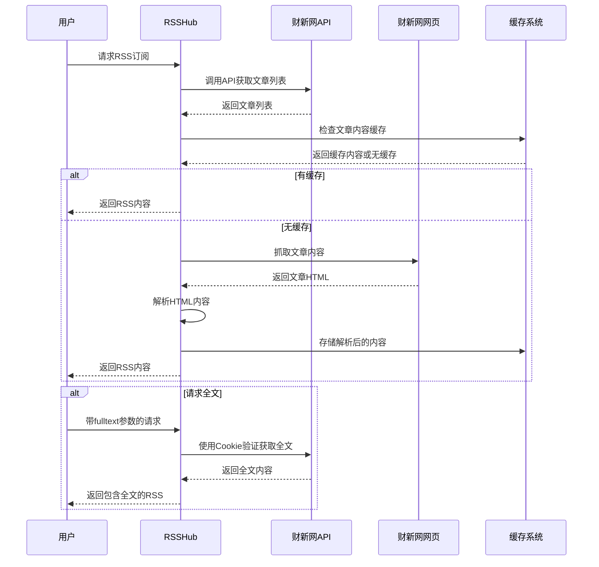
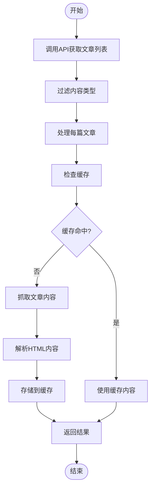
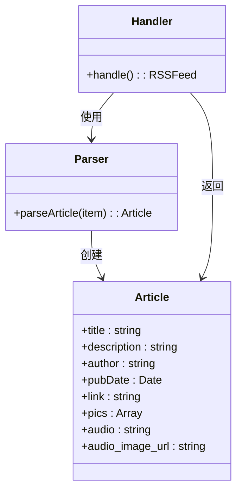
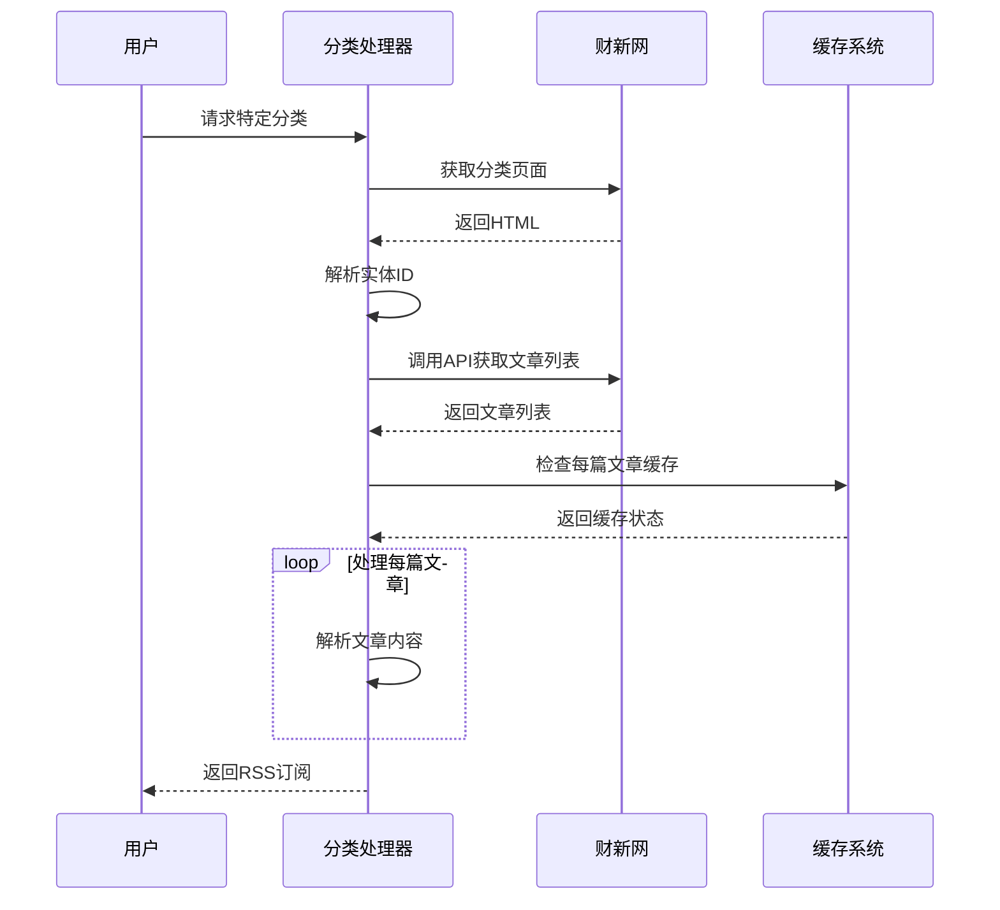
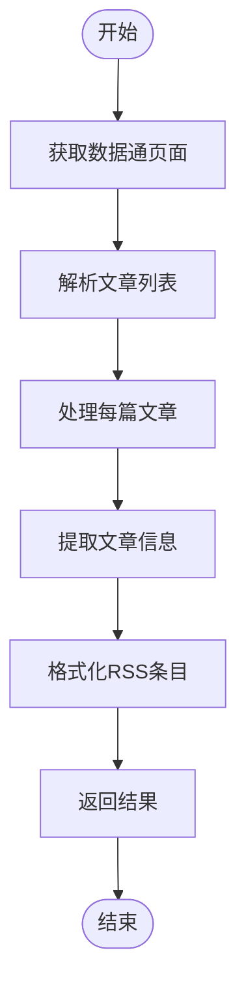
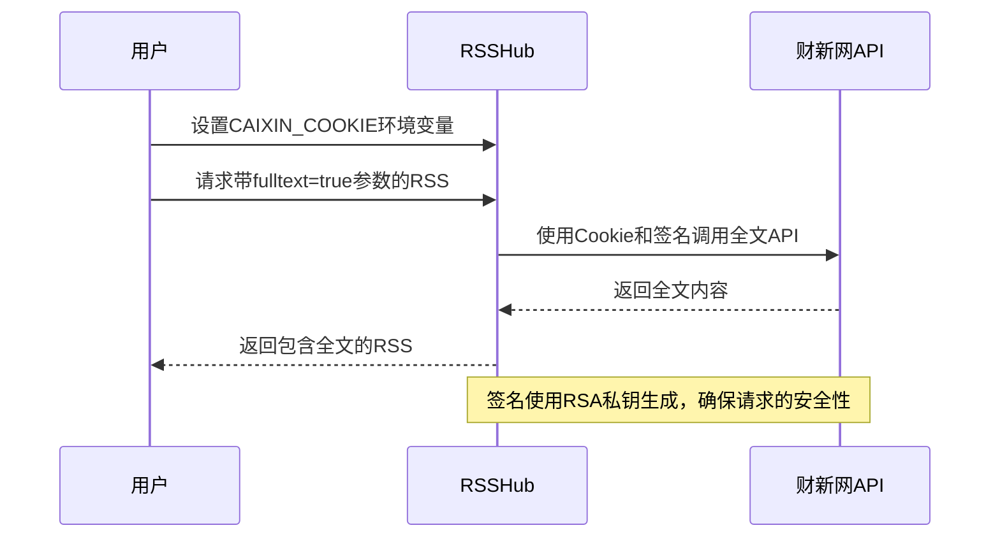
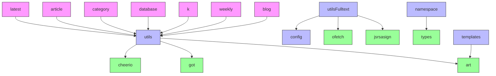

# 财新新闻聚合

<cite>
**本文档引用的文件**
- [latest.ts](file://lib/routes/caixin/latest.ts)
- [article.ts](file://lib/routes/caixin/article.ts)
- [category.ts](file://lib/routes/caixin/category.ts)
- [database.ts](file://lib/routes/caixin/database.ts)
- [k.ts](file://lib/routes/caixin/k.ts)
- [weekly.ts](file://lib/routes/caixin/weekly.ts)
- [blog.ts](file://lib/routes/caixin/blog.ts)
- [utils.ts](file://lib/routes/caixin/utils.ts)
- [utils-fulltext.ts](file://lib/routes/caixin/utils-fulltext.ts)
- [namespace.ts](file://lib/routes/caixin/namespace.ts)
- [config.ts](file://lib/config.ts)
- [article.art](file://lib/routes/caixin/templates/article.art)
</cite>

## 目录
1. [简介](#简介)
2. [项目结构](#项目结构)
3. [核心组件](#核心组件)
4. [架构概述](#架构概述)
5. [详细组件分析](#详细组件分析)
6. [依赖分析](#依赖分析)
7. [性能考虑](#性能考虑)
8. [故障排除指南](#故障排除指南)
9. [结论](#结论)

## 简介
本文档详细说明了RSSHub如何从财新网抓取财经新闻内容，包括普通文章和数据库内容。文档解释了付费内容的获取机制、财经数据的结构化处理和专业术语的解析方法。提供了具体的请求参数配置和响应数据结构说明，展示如何获取宏观经济、金融市场和公司报道等不同类型的财经资讯。文档还包含内容更新频率、数据可视化支持和专业财经指标的处理方式。

## 项目结构
财新新闻聚合模块位于`lib/routes/caixin/`目录下，包含多个路由文件，分别处理不同类型的财新内容抓取。该模块通过API调用和网页解析相结合的方式，从财新网获取财经新闻内容，并提供RSS格式的输出。

**图示来源**
- [latest.ts](file://lib/routes/caixin/latest.ts)
- [article.ts](file://lib/routes/caixin/article.ts)
- [category.ts](file://lib/routes/caixin/category.ts)
- [database.ts](file://lib/routes/caixin/database.ts)
- [k.ts](file://lib/routes/caixin/k.ts)
- [weekly.ts](file://lib/routes/caixin/weekly.ts)
- [blog.ts](file://lib/routes/caixin/blog.ts)
- [utils.ts](file://lib/routes/caixin/utils.ts)
- [utils-fulltext.ts](file://lib/routes/caixin/utils-fulltext.ts)
- [namespace.ts](file://lib/routes/caixin/namespace.ts)
- [article.art](file://lib/routes/caixin/templates/article.art)

**本节来源**
- [latest.ts](file://lib/routes/caixin/latest.ts)
- [article.ts](file://lib/routes/caixin/article.ts)
- [category.ts](file://lib/routes/caixin/category.ts)
- [database.ts](file://lib/routes/caixin/database.ts)
- [k.ts](file://lib/routes/caixin/k.ts)
- [weekly.ts](file://lib/routes/caixin/weekly.ts)
- [blog.ts](file://lib/routes/caixin/blog.ts)

## 核心组件
财新新闻聚合模块的核心组件包括多个路由处理器，分别负责抓取不同类型的内容。这些组件通过统一的工具函数进行文章解析和全文获取，确保了代码的可维护性和一致性。

**本节来源**
- [latest.ts](file://lib/routes/caixin/latest.ts)
- [article.ts](file://lib/routes/caixin/article.ts)
- [category.ts](file://lib/routes/caixin/category.ts)
- [database.ts](file://lib/routes/caixin/database.ts)
- [k.ts](file://lib/routes/caixin/k.ts)
- [weekly.ts](file://lib/routes/caixin/weekly.ts)
- [blog.ts](file://lib/routes/caixin/blog.ts)

## 架构概述
财新新闻聚合模块采用模块化设计，每个路由文件负责处理特定类型的内容抓取。模块通过API调用和网页解析两种方式获取数据，其中API调用用于获取结构化数据，网页解析用于提取文章内容。对于付费内容，模块提供了通过Cookie验证获取全文的机制。

**图示来源**
- [latest.ts](file://lib/routes/caixin/latest.ts)
- [article.ts](file://lib/routes/caixin/article.ts)
- [utils.ts](file://lib/routes/caixin/utils.ts)
- [utils-fulltext.ts](file://lib/routes/caixin/utils-fulltext.ts)
- [config.ts](file://lib/config.ts)

## 详细组件分析

### 最新文章组件分析
最新文章组件通过调用财新网的API获取最新文章列表，然后对每篇文章进行内容解析。该组件会过滤掉FM、视频和数据新闻内容，只保留普通文章。

**图示来源**
- [latest.ts](file://lib/routes/caixin/latest.ts)
- [utils.ts](file://lib/routes/caixin/utils.ts)

**本节来源**
- [latest.ts](file://lib/routes/caixin/latest.ts)
- [utils.ts](file://lib/routes/caixin/utils.ts)

### 首页新闻组件分析
首页新闻组件从财新网的移动端API获取首页文章列表，然后对每篇文章进行内容解析。该组件支持音频内容的提取和RSS播客功能。

**图示来源**
- [article.ts](file://lib/routes/caixin/article.ts)
- [utils.ts](file://lib/routes/caixin/utils.ts)

**本节来源**
- [article.ts](file://lib/routes/caixin/article.ts)
- [utils.ts](file://lib/routes/caixin/utils.ts)

### 分类新闻组件分析
分类新闻组件允许用户按栏目和子分类获取特定类型的财经新闻。该组件首先获取分类的实体信息，然后根据实体ID调用API获取文章列表。

**图示来源**
- [category.ts](file://lib/routes/caixin/category.ts)
- [utils.ts](file://lib/routes/caixin/utils.ts)

**本节来源**
- [category.ts](file://lib/routes/caixin/category.ts)
- [utils.ts](file://lib/routes/caixin/utils.ts)

### 财新数据通组件分析
财新数据通组件专门用于抓取财新网的数据库内容，这些内容通常包含专业的财经数据和分析。该组件通过解析网页内容获取文章列表和详细信息。

**图示来源**
- [database.ts](file://lib/routes/caixin/database.ts)
- [utils.ts](file://lib/routes/caixin/utils.ts)

**本节来源**
- [database.ts](file://lib/routes/caixin/database.ts)
- [utils.ts](file://lib/routes/caixin/utils.ts)

### 付费内容获取机制
财新网的部分内容需要付费订阅才能查看全文。RSSHub通过Cookie验证机制，允许已订阅用户获取付费内容的全文。

**图示来源**
- [utils-fulltext.ts](file://lib/routes/caixin/utils-fulltext.ts)
- [config.ts](file://lib/config.ts)

**本节来源**
- [utils-fulltext.ts](file://lib/routes/caixin/utils-fulltext.ts)
- [config.ts](file://lib/config.ts)

## 依赖分析
财新新闻聚合模块依赖于多个核心组件和工具函数，这些依赖关系确保了模块的功能完整性和代码复用性。

**图示来源**
- [latest.ts](file://lib/routes/caixin/latest.ts)
- [article.ts](file://lib/routes/caixin/article.ts)
- [category.ts](file://lib/routes/caixin/category.ts)
- [database.ts](file://lib/routes/caixin/database.ts)
- [k.ts](file://lib/routes/caixin/k.ts)
- [weekly.ts](file://lib/routes/caixin/weekly.ts)
- [blog.ts](file://lib/routes/caixin/blog.ts)
- [utils.ts](file://lib/routes/caixin/utils.ts)
- [utils-fulltext.ts](file://lib/routes/caixin/utils-fulltext.ts)
- [namespace.ts](file://lib/routes/caixin/namespace.ts)
- [config.ts](file://lib/config.ts)

**本节来源**
- [latest.ts](file://lib/routes/caixin/latest.ts)
- [article.ts](file://lib/routes/caixin/article.ts)
- [category.ts](file://lib/routes/caixin/category.ts)
- [database.ts](file://lib/routes/caixin/database.ts)
- [k.ts](file://lib/routes/caixin/k.ts)
- [weekly.ts](file://lib/routes/caixin/weekly.ts)
- [blog.ts](file://lib/routes/caixin/blog.ts)
- [utils.ts](file://lib/routes/caixin/utils.ts)
- [utils-fulltext.ts](file://lib/routes/caixin/utils-fulltext.ts)
- [namespace.ts](file://lib/routes/caixin/namespace.ts)
- [config.ts](file://lib/config.ts)

## 性能考虑
财新新闻聚合模块在设计时考虑了性能优化，主要通过缓存机制和异步处理来提高响应速度和减少服务器负载。

**本节来源**
- [latest.ts](file://lib/routes/caixin/latest.ts)
- [article.ts](file://lib/routes/caixin/article.ts)
- [category.ts](file://lib/routes/caixin/category.ts)
- [utils.ts](file://lib/routes/caixin/utils.ts)

## 故障排除指南
当财新新闻聚合功能出现问题时，可以按照以下步骤进行排查：

1. 检查环境变量CAIXIN_COOKIE是否正确设置
2. 验证财新网API是否正常工作
3. 检查网络连接是否正常
4. 查看缓存系统是否正常运行
5. 检查文章解析模板是否正确

**本节来源**
- [utils-fulltext.ts](file://lib/routes/caixin/utils-fulltext.ts)
- [config.ts](file://lib/config.ts)
- [utils.ts](file://lib/routes/caixin/utils.ts)

## 结论
财新新闻聚合模块通过多种方式从财新网获取财经新闻内容，包括API调用和网页解析。模块支持普通文章、分类新闻、数据通内容等多种类型的内容抓取，并提供了付费内容的全文获取机制。通过缓存和异步处理，模块在保证内容更新及时性的同时，也考虑了性能优化。