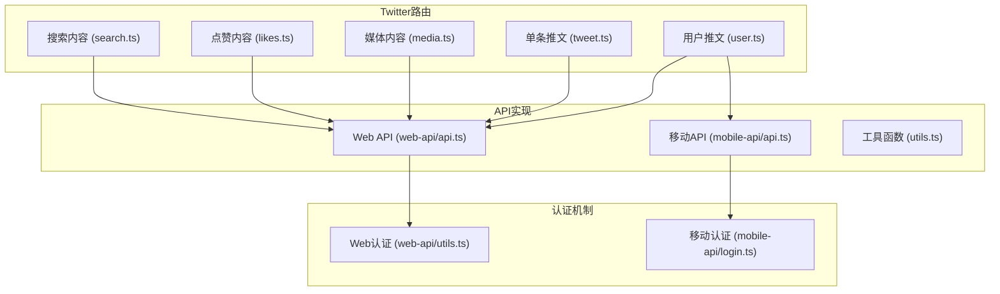
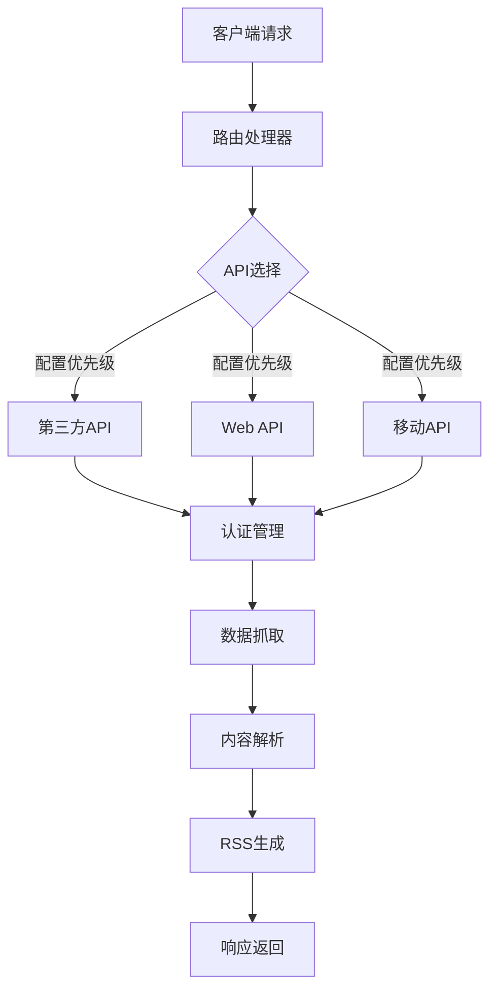
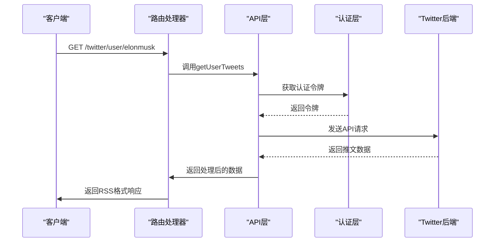
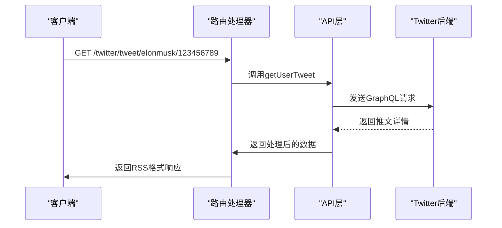
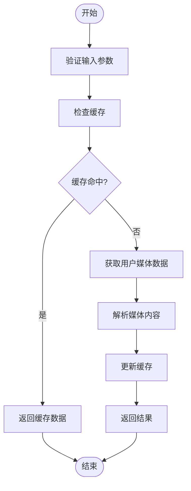
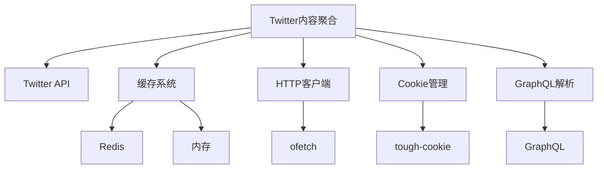

# Twitter内容聚合

<cite>
**本文档引用的文件**
- [twitter/api/index.ts](file://lib/routes/twitter/api/index.ts)
- [twitter/api/web-api/api.ts](file://lib/routes/twitter/api/web-api/api.ts)
- [twitter/api/web-api/utils.ts](file://lib/routes/twitter/api/web-api/utils.ts)
- [twitter/api/web-api/constants.ts](file://lib/routes/twitter/api/web-api/constants.ts)
- [twitter/api/mobile-api/api.ts](file://lib/routes/twitter/api/mobile-api/api.ts)
- [twitter/api/mobile-api/login.ts](file://lib/routes/twitter/api/mobile-api/login.ts)
- [twitter/api/mobile-api/token.ts](file://lib/routes/twitter/api/mobile-api/token.ts)
- [twitter/utils.ts](file://lib/routes/twitter/utils.ts)
- [twitter/user.ts](file://lib/routes/twitter/user.ts)
- [twitter/tweet.ts](file://lib/routes/twitter/tweet.ts)
- [twitter/media.ts](file://lib/routes/twitter/media.ts)
- [twitter/likes.ts](file://lib/routes/twitter/likes.ts)
- [twitter/search.ts](file://lib/routes/twitter/search.ts)
- [config.ts](file://lib/config.ts)
- [rattibha/user.ts](file://lib/routes/rattibha/user.ts)
</cite>

## 目录
1. [简介](#简介)
2. [项目结构](#项目结构)
3. [核心组件](#核心组件)
4. [架构概述](#架构概述)
5. [详细组件分析](#详细组件分析)
6. [依赖分析](#依赖分析)
7. [性能考虑](#性能考虑)
8. [故障排除指南](#故障排除指南)
9. [结论](#结论)

## 简介
RSSHub 是一个开源的 RSS 生成器，能够为任何内容创建 RSS 订阅源。本项目中的 Twitter 内容聚合功能允许用户通过 RSS 订阅 Twitter 用户的推文、话题标签和时间线内容。该功能通过多种 API 接口实现，包括 Web API、移动 API 和第三方 API，以应对 Twitter 的反爬虫机制和 API 限制。

## 项目结构
RSSHub 项目采用模块化设计，Twitter 相关的功能主要集中在 `lib/routes/twitter` 目录下。该目录包含了处理不同 Twitter 内容类型的路由文件，如用户推文、媒体内容、点赞等。此外，API 的实现分为 Web API 和移动 API 两个部分，分别位于 `web-api` 和 `mobile-api` 子目录中。

**Diagram sources**
- [twitter/user.ts](file://lib/routes/twitter/user.ts)
- [twitter/tweet.ts](file://lib/routes/twitter/tweet.ts)
- [twitter/media.ts](file://lib/routes/twitter/media.ts)
- [twitter/likes.ts](file://lib/routes/twitter/likes.ts)
- [twitter/search.ts](file://lib/routes/twitter/search.ts)
- [twitter/api/web-api/api.ts](file://lib/routes/twitter/api/web-api/api.ts)
- [twitter/api/mobile-api/api.ts](file://lib/routes/twitter/api/mobile-api/api.ts)
- [twitter/api/web-api/utils.ts](file://lib/routes/twitter/api/web-api/utils.ts)
- [twitter/api/mobile-api/login.ts](file://lib/routes/twitter/api/mobile-api/login.ts)

**Section sources**
- [twitter/user.ts](file://lib/routes/twitter/user.ts)
- [twitter/tweet.ts](file://lib/routes/twitter/tweet.ts)
- [twitter/media.ts](file://lib/routes/twitter/media.ts)
- [twitter/likes.ts](file://lib/routes/twitter/likes.ts)
- [twitter/search.ts](file://lib/routes/twitter/search.ts)

## 核心组件
Twitter 内容聚合的核心组件包括 API 路由处理、数据抓取、内容解析和缓存管理。这些组件协同工作，确保用户能够高效地获取 Twitter 内容。

**Section sources**
- [twitter/api/index.ts](file://lib/routes/twitter/api/index.ts)
- [twitter/utils.ts](file://lib/routes/twitter/utils.ts)
- [config.ts](file://lib/config.ts)

## 架构概述
RSSHub 的 Twitter 内容聚合功能采用分层架构，主要包括路由层、API 层、认证层和数据处理层。路由层负责接收用户请求并分发到相应的处理函数；API 层负责与 Twitter 的后端服务通信；认证层处理用户身份验证；数据处理层负责解析和格式化返回的数据。

**Diagram sources**
- [twitter/api/index.ts](file://lib/routes/twitter/api/index.ts)
- [twitter/api/web-api/api.ts](file://lib/routes/twitter/api/web-api/api.ts)
- [twitter/api/mobile-api/api.ts](file://lib/routes/twitter/api/mobile-api/api.ts)
- [twitter/api/web-api/utils.ts](file://lib/routes/twitter/api/web-api/utils.ts)

## 详细组件分析

### 用户推文分析
用户推文功能通过 `/twitter/user/:id` 路由实现，支持多种参数配置，如是否包含回复、是否包含转发等。该功能首先通过 API 获取用户信息，然后获取用户的推文数据，并进行处理和格式化。

**Diagram sources**
- [twitter/user.ts](file://lib/routes/twitter/user.ts)
- [twitter/api/web-api/api.ts](file://lib/routes/twitter/api/web-api/api.ts)
- [twitter/api/web-api/utils.ts](file://lib/routes/twitter/api/web-api/utils.ts)

### 单条推文分析
单条推文功能通过 `/twitter/tweet/:id/:status` 路由实现，能够获取指定推文的详细信息，包括转发、回复等内容。该功能使用 GraphQL API 获取推文数据，并进行深度解析。

**Diagram sources**
- [twitter/tweet.ts](file://lib/routes/twitter/tweet.ts)
- [twitter/api/web-api/api.ts](file://lib/routes/twitter/api/web-api/api.ts)

### 媒体内容分析
媒体内容功能通过 `/twitter/media/:id` 路由实现，专门用于获取用户发布的包含图片或视频的推文。该功能能够过滤出仅包含媒体内容的推文，并提供高质量的媒体链接。

**Diagram sources**
- [twitter/media.ts](file://lib/routes/twitter/media.ts)
- [twitter/api/web-api/api.ts](file://lib/routes/twitter/api/web-api/api.ts)
- [twitter/utils.ts](file://lib/routes/twitter/utils.ts)

## 依赖分析
Twitter 内容聚合功能依赖于多个外部服务和内部组件。主要依赖包括 Twitter 的 API 服务、缓存系统（Redis 或内存）、HTTP 客户端（ofetch）以及 Cookie 管理库。

**Diagram sources**
- [twitter/api/web-api/utils.ts](file://lib/routes/twitter/api/web-api/utils.ts)
- [config.ts](file://lib/config.ts)
- [twitter/api/index.ts](file://lib/routes/twitter/api/index.ts)

**Section sources**
- [twitter/api/web-api/utils.ts](file://lib/routes/twitter/api/web-api/utils.ts)
- [config.ts](file://lib/config.ts)
- [twitter/api/index.ts](file://lib/routes/twitter/api/index.ts)

## 性能考虑
为了提高性能和可靠性，RSSHub 实现了多层缓存机制。路由级别的缓存可以减少对 Twitter API 的请求频率，而内容级别的缓存可以避免重复的数据处理。此外，系统还实现了请求重试和错误处理机制，以应对网络波动和 API 限制。

## 故障排除指南
常见的问题包括认证失败、API 限制和数据解析错误。对于认证失败，应检查配置文件中的用户名、密码和令牌是否正确。对于 API 限制，系统会自动处理速率限制，并在必要时切换到备用令牌。对于数据解析错误，应检查返回的数据格式是否符合预期。

**Section sources**
- [twitter/api/web-api/utils.ts](file://lib/routes/twitter/api/web-api/utils.ts)
- [twitter/api/mobile-api/login.ts](file://lib/routes/twitter/api/mobile-api/login.ts)
- [twitter/utils.ts](file://lib/routes/twitter/utils.ts)

## 结论
RSSHub 的 Twitter 内容聚合功能通过灵活的架构设计和多种 API 接口，成功实现了对 Twitter 内容的高效抓取和聚合。该功能不仅支持基本的用户推文订阅，还提供了媒体内容、点赞内容和搜索功能，满足了用户多样化的需求。通过合理的缓存策略和错误处理机制，系统能够在保证性能的同时，提供稳定可靠的服务。