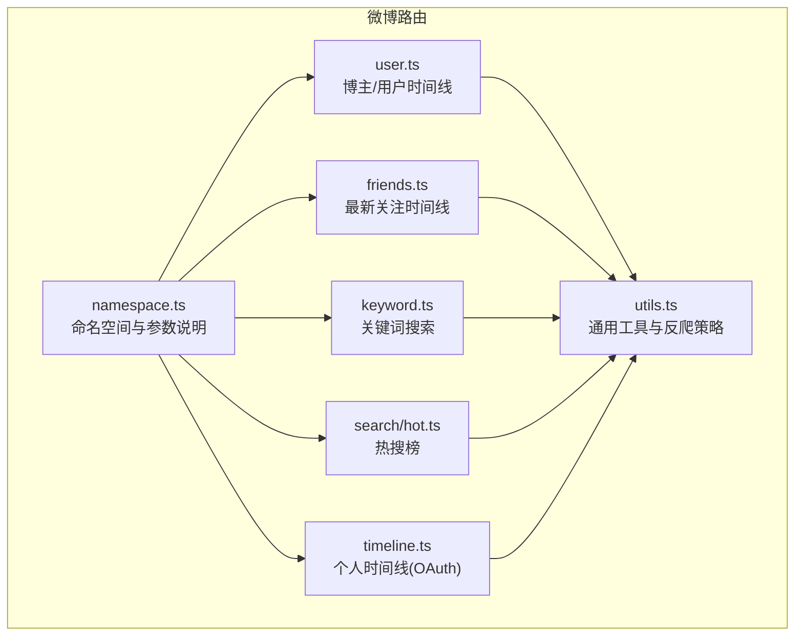
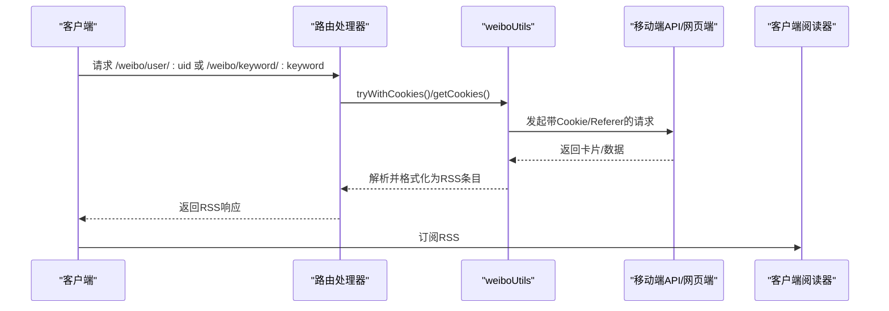
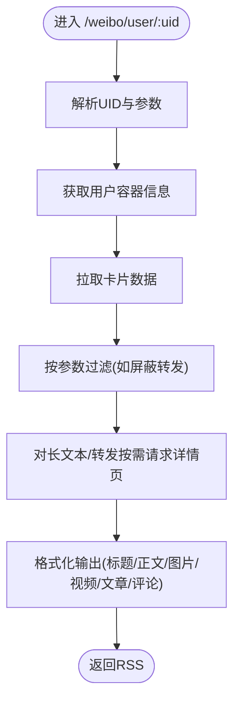
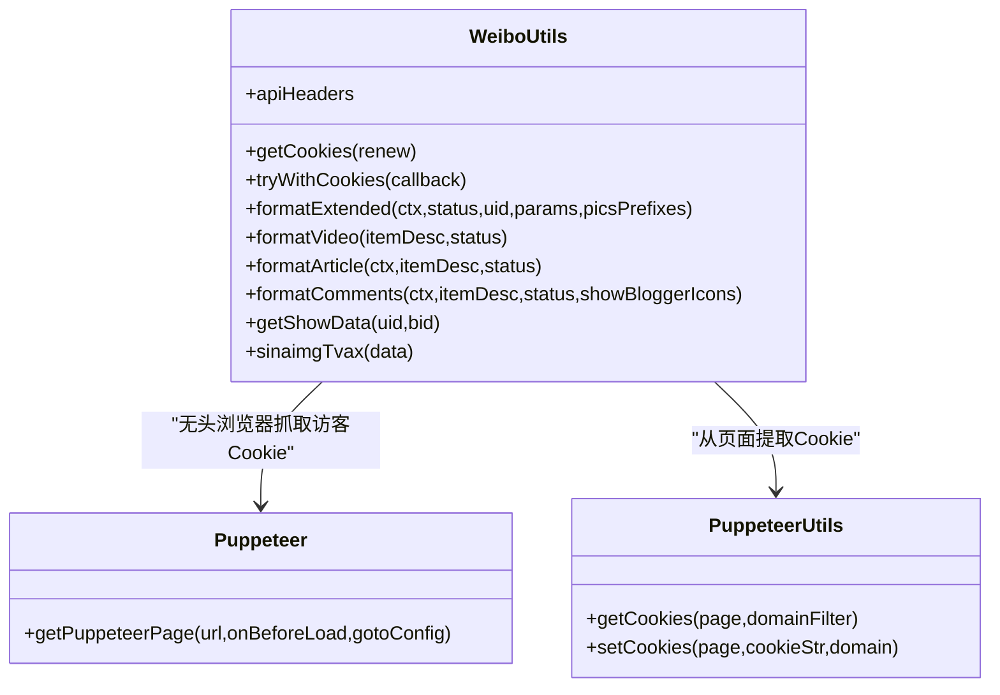
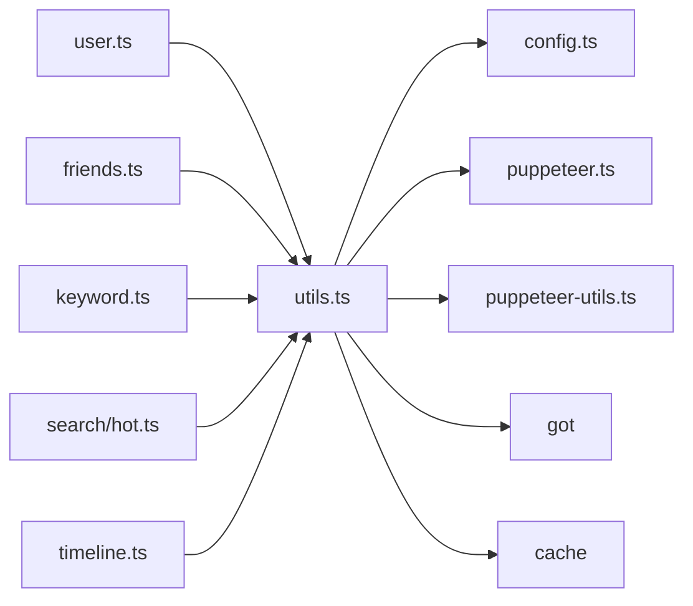

# 微博内容聚合

<cite>
**本文引用的文件**
- [lib/routes/weibo/namespace.ts](file://lib/routes/weibo/namespace.ts)
- [lib/routes/weibo/utils.ts](file://lib/routes/weibo/utils.ts)
- [lib/routes/weibo/user.ts](file://lib/routes/weibo/user.ts)
- [lib/routes/weibo/friends.ts](file://lib/routes/weibo/friends.ts)
- [lib/routes/weibo/keyword.ts](file://lib/routes/weibo/keyword.ts)
- [lib/routes/weibo/search/hot.ts](file://lib/routes/weibo/search/hot.ts)
- [lib/routes/weibo/timeline.ts](file://lib/routes/weibo/timeline.ts)
- [lib/utils/puppeteer.ts](file://lib/utils/puppeteer.ts)
- [lib/utils/puppeteer-utils.ts](file://lib/utils/puppeteer-utils.ts)
- [lib/config.ts](file://lib/config.ts)
</cite>

## 目录
1. [简介](#简介)
2. [项目结构](#项目结构)
3. [核心组件](#核心组件)
4. [架构总览](#架构总览)
5. [详细组件分析](#详细组件分析)
6. [依赖关系分析](#依赖关系分析)
7. [性能与更新频率](#性能与更新频率)
8. [配置与认证](#配置与认证)
9. [错误处理与反爬虫](#错误处理与反爬虫)
10. [故障排查指南](#故障排查指南)
11. [结论](#结论)

## 简介
本文件面向开发者，系统化梳理 RSSHub 中“微博内容聚合”的实现与使用方式，覆盖以下主题：
- 如何通过 RSSHub 聚合微博用户动态、热搜话题与关键词相关内容
- 数据抓取策略、内容解析方法与反爬虫应对机制
- 配置与调用端点、参数与过滤选项、错误处理策略
- 数据更新频率、性能与缓存策略

## 项目结构
微博相关路由集中在 lib/routes/weibo 下，核心能力包括：
- 用户时间线与个人主页聚合
- 关注时间线
- 热搜榜
- 关键词搜索
- 时间线（OAuth 方案）

图表来源
- [lib/routes/weibo/namespace.ts](file://lib/routes/weibo/namespace.ts#L1-L49)
- [lib/routes/weibo/user.ts](file://lib/routes/weibo/user.ts#L1-L221)
- [lib/routes/weibo/friends.ts](file://lib/routes/weibo/friends.ts#L1-L163)
- [lib/routes/weibo/keyword.ts](file://lib/routes/weibo/keyword.ts#L1-L82)
- [lib/routes/weibo/search/hot.ts](file://lib/routes/weibo/search/hot.ts#L1-L189)
- [lib/routes/weibo/timeline.ts](file://lib/routes/weibo/timeline.ts#L1-L194)
- [lib/routes/weibo/utils.ts](file://lib/routes/weibo/utils.ts#L1-L620)

章节来源
- [lib/routes/weibo/namespace.ts](file://lib/routes/weibo/namespace.ts#L1-L49)

## 核心组件
- 命名空间与参数规范：统一描述微博路由的参数与可读性选项，便于调用者按需定制输出样式。
- 通用工具库：封装 Cookie 获取与轮换、请求头伪装、内容格式化、视频/文章/评论扩展渲染、图片链接替换等。
- 路由实现：围绕不同场景（用户、热搜、关键词、关注流、OAuth 时间线）构建抓取与解析流程。

章节来源
- [lib/routes/weibo/namespace.ts](file://lib/routes/weibo/namespace.ts#L1-L49)
- [lib/routes/weibo/utils.ts](file://lib/routes/weibo/utils.ts#L1-L620)

## 架构总览
整体架构采用“路由层 + 工具层 + 外部 API/站点”的模式：
- 路由层负责参数解析、调用工具层、组织 RSS 输出
- 工具层负责反爬虫与内容解析（Cookie、User-Agent、内容清洗、富媒体渲染）
- 外部接口包括移动端 API、网页端容器、微博开放平台 OAuth

图表来源
- [lib/routes/weibo/user.ts](file://lib/routes/weibo/user.ts#L56-L221)
- [lib/routes/weibo/keyword.ts](file://lib/routes/weibo/keyword.ts#L38-L82)
- [lib/routes/weibo/utils.ts](file://lib/routes/weibo/utils.ts#L93-L122)

## 详细组件分析

### 命名空间与参数规范
- 定义微博路由的参数与可读性选项，如是否显示作者、头像、表情、图片尺寸、是否显示视频/文章/评论等。
- 提供示例链接展示参数效果，便于调试与定制。

章节来源
- [lib/routes/weibo/namespace.ts](file://lib/routes/weibo/namespace.ts#L1-L49)

### 用户时间线（博主/用户）
- 功能：聚合指定 UID 的微博内容，支持过滤转发、视频、文章、评论等扩展内容。
- 抓取策略：
  - 先获取用户信息与容器 ID，再拉取卡片数据
  - 对长文本与转发内容按需二次请求详情页以补齐正文
- 内容解析：
  - 统一标题/正文/图片/视频/文章/评论渲染
  - 支持可读性参数（作者名加粗、头像、表情、链接图标、宽高、移动端链接偏好等）
- 性能：使用缓存键避免重复请求，减少对外部接口压力

图表来源
- [lib/routes/weibo/user.ts](file://lib/routes/weibo/user.ts#L56-L221)

章节来源
- [lib/routes/weibo/user.ts](file://lib/routes/weibo/user.ts#L1-L221)

### 关注时间线（Friends）
- 功能：聚合当前登录用户关注的人的最新动态
- 抓取策略：
  - 通过配置的 Cookie 获取登录用户 UID
  - 拉取用户首页容器与关注流数据
  - 对长文本转发按需请求详情页补齐正文
- 内容解析：与用户时间线一致，支持视频/文章/评论开关

章节来源
- [lib/routes/weibo/friends.ts](file://lib/routes/weibo/friends.ts#L1-L163)

### 关键词搜索（Keyword）
- 功能：聚合包含指定关键词的微博内容
- 抓取策略：
  - 使用移动端容器 API 拉取关键词搜索结果卡片
  - 通过工具层 tryWithCookies 自动处理 Cookie 过期与轮换
- 内容解析：统一格式化标题/正文/图片/作者信息

章节来源
- [lib/routes/weibo/keyword.ts](file://lib/routes/weibo/keyword.ts#L1-L82)
- [lib/routes/weibo/utils.ts](file://lib/routes/weibo/utils.ts#L93-L122)

### 热搜榜（Search Hot）
- 功能：聚合微博热搜榜条目，支持可选获取每个条目的摘要（不含视频/图片）或带图片缩略/原图
- 抓取策略：
  - 拉取热搜容器数据，若请求 fulltext，则逐条请求子页摘要
  - 通过模板渲染摘要、作者、发布时间、图片等
- 注意事项：图片显示需特定 Referer 以规避外链限制

章节来源
- [lib/routes/weibo/search/hot.ts](file://lib/routes/weibo/search/hot.ts#L1-L189)

### 个人时间线（Timeline，OAuth）
- 功能：基于微博开放平台 OAuth 的个人时间线聚合
- 抓取策略：
  - 首次访问引导用户授权，换取 access_token 并缓存
  - 使用 home_timeline 接口拉取数据，必要时回补详情页正文
- 认证流程：302 跳转至授权页，回调后换取 token 并重定向

章节来源
- [lib/routes/weibo/timeline.ts](file://lib/routes/weibo/timeline.ts#L1-L194)

### 通用工具库（weiboUtils）
- Cookie 获取与轮换：
  - 优先使用配置的 WEIBO_COOKIES
  - 若未配置，使用 Puppeteer 无头浏览器模拟访问，拦截关键请求，提取 Cookie
  - 冷却期防止频繁抓取访客 Cookie
- 请求头伪装：User-Agent、Referer、XHR 头等
- 内容格式化：
  - 标题清洗、正文表情/链接/图片处理
  - 视频/文章/评论扩展渲染
  - 图片链接替换（tvax 强制，规避某些 WAF）
- 错误处理：对 -100 类错误抛出 RenewWeiboCookiesError，触发 Cookie 重新获取

图表来源
- [lib/routes/weibo/utils.ts](file://lib/routes/weibo/utils.ts#L1-L620)
- [lib/utils/puppeteer.ts](file://lib/utils/puppeteer.ts#L1-L192)
- [lib/utils/puppeteer-utils.ts](file://lib/utils/puppeteer-utils.ts#L1-L59)

章节来源
- [lib/routes/weibo/utils.ts](file://lib/routes/weibo/utils.ts#L1-L620)
- [lib/utils/puppeteer.ts](file://lib/utils/puppeteer.ts#L1-L192)
- [lib/utils/puppeteer-utils.ts](file://lib/utils/puppeteer-utils.ts#L1-L59)

## 依赖关系分析
- 路由依赖工具库：各路由均依赖 weiboUtils 进行 Cookie 管理、内容格式化与富媒体渲染
- 工具库依赖：
  - 配置：读取 WEIBO_COOKIES、缓存过期等
  - Puppeteer：无头浏览器抓取访客 Cookie
  - Puppeteer-utils：从页面提取 Cookie 字符串
  - got：HTTP 请求
  - cache：缓存键管理
  - cheerio：HTML 解析与模板渲染

图表来源
- [lib/routes/weibo/user.ts](file://lib/routes/weibo/user.ts#L1-L221)
- [lib/routes/weibo/friends.ts](file://lib/routes/weibo/friends.ts#L1-L163)
- [lib/routes/weibo/keyword.ts](file://lib/routes/weibo/keyword.ts#L1-L82)
- [lib/routes/weibo/search/hot.ts](file://lib/routes/weibo/search/hot.ts#L1-L189)
- [lib/routes/weibo/timeline.ts](file://lib/routes/weibo/timeline.ts#L1-L194)
- [lib/routes/weibo/utils.ts](file://lib/routes/weibo/utils.ts#L1-L620)
- [lib/config.ts](file://lib/config.ts#L620-L819)
- [lib/utils/puppeteer.ts](file://lib/utils/puppeteer.ts#L1-L192)
- [lib/utils/puppeteer-utils.ts](file://lib/utils/puppeteer-utils.ts#L1-L59)

## 性能与更新频率
- 缓存策略：
  - 路由级缓存：config.cache.routeExpire 控制，用于降低对外部接口的请求频率
  - 内容级缓存：对长文本/转发详情页、热搜子页等使用 cache.tryGet
- 更新频率：
  - 热搜榜：描述为“每分钟更新一次”
  - 其他路由：受缓存与实际抓取频率影响，通常为几分钟到数小时
- 性能优化：
  - 使用 tryWithCookies 自动处理 Cookie 过期，减少失败重试
  - 对图片链接强制 tvax，减少跨域与 WAF 影响
  - 可读性参数按需启用，避免不必要的 HTML 渲染

章节来源
- [lib/config.ts](file://lib/config.ts#L735-L740)
- [lib/routes/weibo/search/hot.ts](file://lib/routes/weibo/search/hot.ts#L112-L119)
- [lib/routes/weibo/utils.ts](file://lib/routes/weibo/utils.ts#L93-L122)

## 配置与认证
- 环境变量与配置项：
  - WEIBO_COOKIES：微博 Cookie 字符串，优先使用
  - WEIBO_APP_KEY / WEIBO_APP_SECRET / WEIBO_REDIRECT_URL：用于 timeline OAuth
- 路由特性：
  - user/friends/keyword/hot/timeline 等路由均声明是否需要 Cookie、Puppeteer、反爬等特性
- 认证流程（timeline）：
  - 首次访问：302 跳转至微博授权页
  - 回调：使用 code 换取 access_token 并缓存，随后重定向到目标路由

章节来源
- [lib/config.ts](file://lib/config.ts#L620-L627)
- [lib/routes/weibo/user.ts](file://lib/routes/weibo/user.ts#L14-L33)
- [lib/routes/weibo/friends.ts](file://lib/routes/weibo/friends.ts#L12-L30)
- [lib/routes/weibo/keyword.ts](file://lib/routes/weibo/keyword.ts#L13-L32)
- [lib/routes/weibo/search/hot.ts](file://lib/routes/weibo/search/hot.ts#L18-L45)
- [lib/routes/weibo/timeline.ts](file://lib/routes/weibo/timeline.ts#L12-L33)

## 错误处理与反爬虫
- 反爬虫应对：
  - 使用伪装 User-Agent、Referer、XHR 头
  - 无头浏览器抓取访客 Cookie，冷却期避免频繁请求
  - 对 -100 类错误自动触发 Cookie 重新获取
- 错误处理：
  - tryWithCookies 包裹请求，捕获 Cookie 过期与网络异常，自动重试与降级
  - Puppeteer 导航失败时记录日志并标记代理失败（若使用代理）
- 内容安全：
  - 对图片链接强制 tvax，规避特定 WAF
  - 标题/正文清洗，去除多余 HTML 标签与图标

章节来源
- [lib/routes/weibo/utils.ts](file://lib/routes/weibo/utils.ts#L21-L122)
- [lib/utils/puppeteer.ts](file://lib/utils/puppeteer.ts#L160-L191)

## 故障排查指南
- 无内容或空 RSS：
  - 确认是否配置 WEIBO_COOKIES；若未配置，部分路由需 Puppeteer 获取访客 Cookie
  - 检查 Cookie 是否过期，工具层会自动尝试刷新
- 热搜图片不显示：
  - 按路由说明，需特定 Referer 才能显示图片
- timeline 无法获取内容：
  - 首次访问需完成授权流程，确保回调正确换取 token 并缓存
- 性能问题：
  - 检查缓存过期与代理配置，适当提高 routeExpire 以减少请求
  - 仅在必要时启用可读性参数与视频/文章/评论扩展渲染

章节来源
- [lib/routes/weibo/search/hot.ts](file://lib/routes/weibo/search/hot.ts#L23-L31)
- [lib/routes/weibo/timeline.ts](file://lib/routes/weibo/timeline.ts#L94-L104)
- [lib/routes/weibo/utils.ts](file://lib/routes/weibo/utils.ts#L93-L122)

## 结论
RSSHub 的微博聚合通过“路由 + 工具 + 外部接口”的清晰分层，实现了对用户动态、热搜、关键词与 OAuth 时间线的稳定抓取与高质量输出。其反爬虫策略（Cookie 管理、User-Agent 伪装、Puppeteer 抓取、冷却期）与缓存机制有效平衡了可用性与性能。开发者可通过配置 Cookie 与可读性参数，灵活定制 RSS 输出，满足不同场景需求。