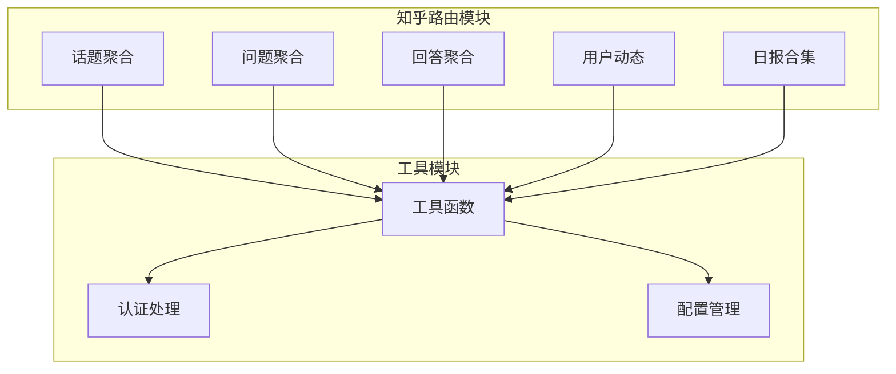
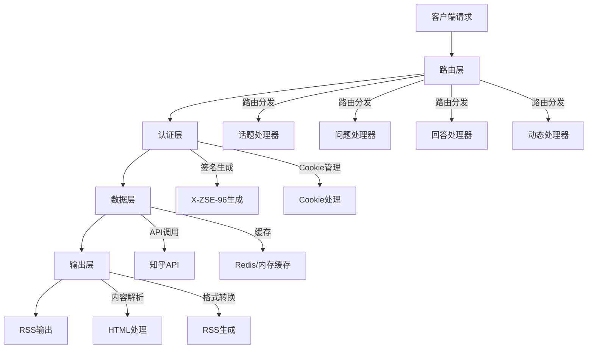
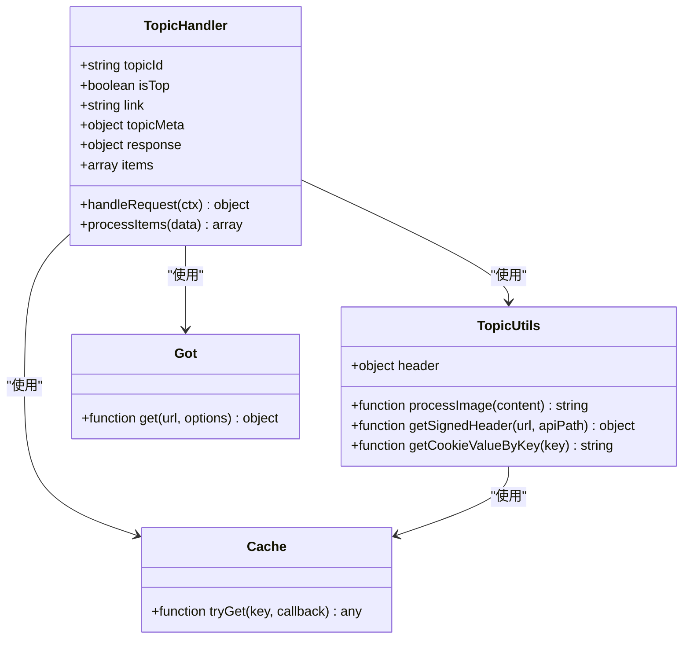
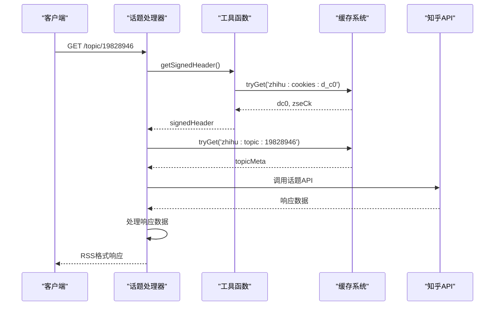
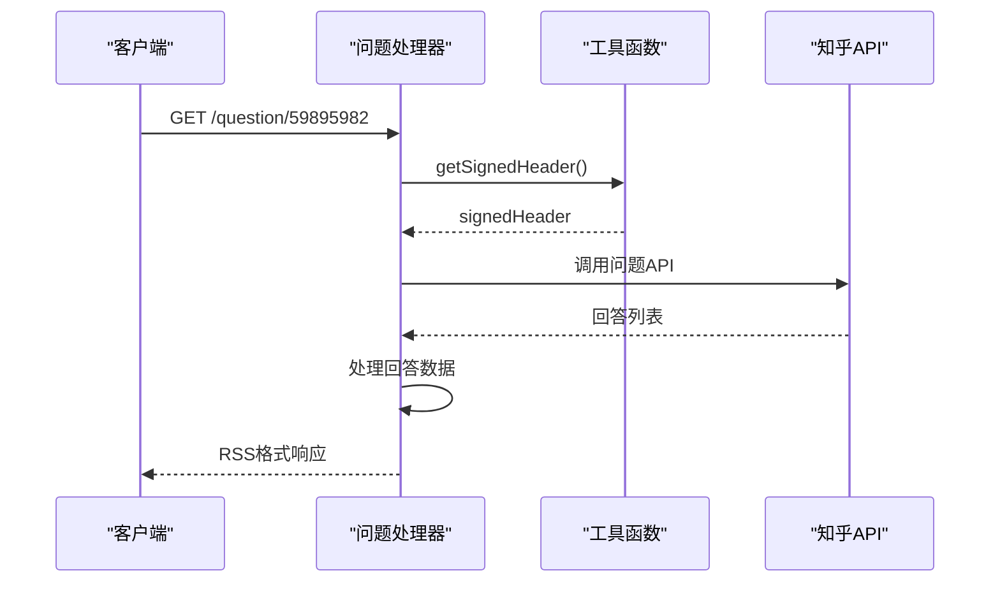
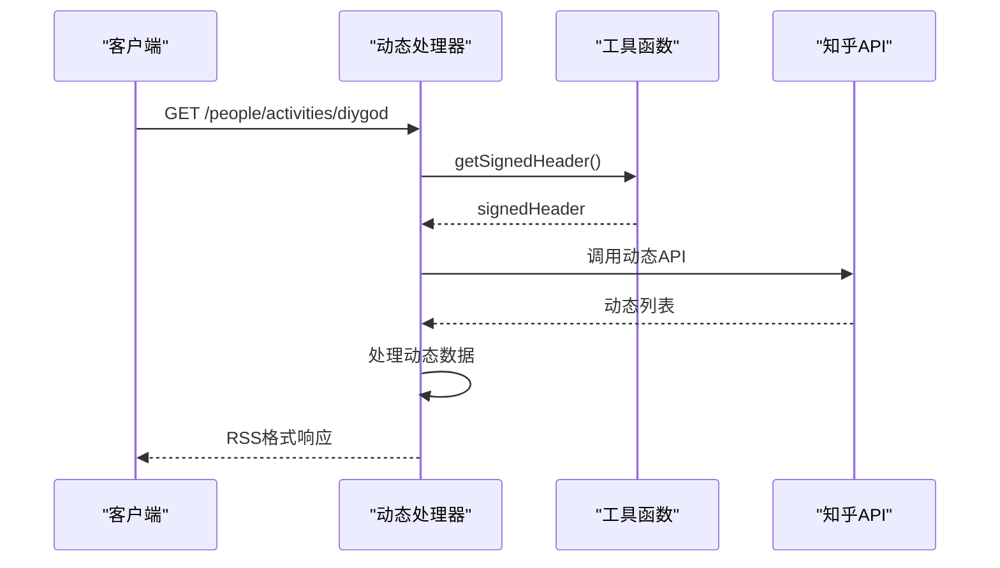
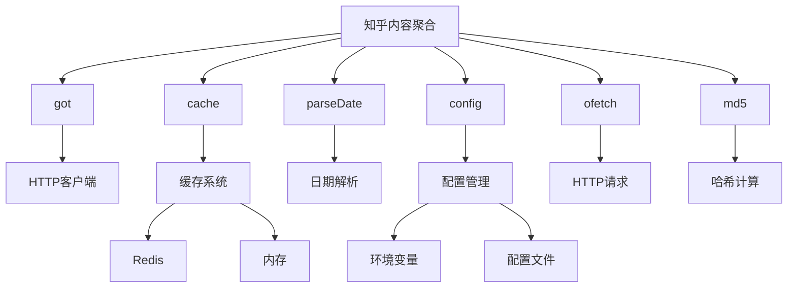

# 知乎内容聚合

<cite>
**本文档引用的文件**
- [namespace.ts](file://lib/routes/zhihu/namespace.ts)
- [topic.ts](file://lib/routes/zhihu/topic.ts)
- [daily-section.ts](file://lib/routes/zhihu/daily-section.ts)
- [answers.ts](file://lib/routes/zhihu/answers.ts)
- [question.ts](file://lib/routes/zhihu/question.ts)
- [activities.ts](file://lib/routes/zhihu/activities.ts)
- [utils.ts](file://lib/routes/zhihu/utils.ts)
- [config.ts](file://lib/config.ts)
- [check-cookie.ts](file://lib/routes/zhihu/check-cookie.ts)
- [xhu/auth.ts](file://lib/routes/zhihu/xhu/auth.ts)
- [execlib/x-zse-96-v3.ts](file://lib/routes/zhihu/execlib/x-zse-96-v3.ts)
</cite>

## 目录
1. [简介](#简介)
2. [项目结构](#项目结构)
3. [核心组件](#核心组件)
4. [架构概述](#架构概述)
5. [详细组件分析](#详细组件分析)
6. [依赖分析](#依赖分析)
7. [性能考虑](#性能考虑)
8. [故障排除指南](#故障排除指南)
9. [结论](#结论)

## 简介
本文档详细介绍了如何通过RSSHub聚合知乎平台上的内容，包括问题回答、话题讨论和用户动态。文档深入解析了知乎API的实现细节，涵盖数据抓取策略、内容解析方法和反爬虫应对机制。同时提供了具体的配置和调用方法，帮助开发者理解知乎内容聚合的技术挑战和解决方案。

## 项目结构
RSSHub项目采用模块化设计，知乎相关的功能实现在`lib/routes/zhihu`目录下。该目录包含了处理不同知乎内容类型的路由文件，如话题、问题、用户回答和动态等。项目通过统一的中间件和工具函数来处理认证、缓存和反爬虫机制。

**图示来源**
- [namespace.ts](file://lib/routes/zhihu/namespace.ts)
- [topic.ts](file://lib/routes/zhihu/topic.ts)
- [utils.ts](file://lib/routes/zhihu/utils.ts)

**本节来源**
- [namespace.ts](file://lib/routes/zhihu/namespace.ts#L1-L11)
- [topic.ts](file://lib/routes/zhihu/topic.ts#L1-L125)

## 核心组件
知乎内容聚合的核心组件包括路由定义、数据抓取、内容解析和反爬虫处理。每个组件都通过模块化设计实现，确保代码的可维护性和扩展性。

**本节来源**
- [topic.ts](file://lib/routes/zhihu/topic.ts#L8-L34)
- [utils.ts](file://lib/routes/zhihu/utils.ts#L10-L132)

## 架构概述
知乎内容聚合的架构分为四个主要层次：路由层、认证层、数据层和输出层。路由层负责接收请求并分发到相应的处理器；认证层处理知乎的反爬虫机制；数据层负责从知乎API获取数据；输出层将数据转换为RSS格式。

**图示来源**
- [topic.ts](file://lib/routes/zhihu/topic.ts#L37-L125)
- [utils.ts](file://lib/routes/zhihu/utils.ts#L68-L132)
- [config.ts](file://lib/config.ts#L661-L663)

## 详细组件分析

### 话题聚合分析
话题聚合功能通过`/topic/:topicId`路由实现，能够获取指定话题下的最新讨论和精华内容。该功能支持分页和内容过滤，确保用户能够获取到最新的高质量内容。

#### 话题聚合类图

**图示来源**
- [topic.ts](file://lib/routes/zhihu/topic.ts#L37-L125)
- [utils.ts](file://lib/routes/zhihu/utils.ts#L10-L132)

#### 话题聚合序列图

**图示来源**
- [topic.ts](file://lib/routes/zhihu/topic.ts#L37-L125)
- [utils.ts](file://lib/routes/zhihu/utils.ts#L68-L132)

**本节来源**
- [topic.ts](file://lib/routes/zhihu/topic.ts#L37-L125)
- [utils.ts](file://lib/routes/zhihu/utils.ts#L68-L132)

### 问题聚合分析
问题聚合功能通过`/question/:questionId`路由实现，能够获取指定问题下的所有回答。该功能支持按创建时间、更新时间或默认排序方式对回答进行排序。

#### 问题聚合序列图

**图示来源**
- [question.ts](file://lib/routes/zhihu/question.ts#L37-L86)
- [utils.ts](file://lib/routes/zhihu/utils.ts#L68-L132)

**本节来源**
- [question.ts](file://lib/routes/zhihu/question.ts#L8-L86)
- [utils.ts](file://lib/routes/zhihu/utils.ts#L68-L132)

### 用户动态分析
用户动态功能通过`/people/activities/:id`路由实现，能够获取指定用户的最新动态。该功能支持多种动态类型，包括回答、文章、想法等。

#### 用户动态序列图

**图示来源**
- [activities.ts](file://lib/routes/zhihu/activities.ts#L40-L170)
- [utils.ts](file://lib/routes/zhihu/utils.ts#L68-L132)

**本节来源**
- [activities.ts](file://lib/routes/zhihu/activities.ts#L11-L170)
- [utils.ts](file://lib/routes/zhihu/utils.ts#L68-L132)

## 依赖分析
知乎内容聚合功能依赖于多个核心模块和外部服务。这些依赖关系确保了系统的稳定性和可扩展性。

**图示来源**
- [topic.ts](file://lib/routes/zhihu/topic.ts#L2-L6)
- [utils.ts](file://lib/routes/zhihu/utils.ts#L3-L7)
- [config.ts](file://lib/config.ts#L661-L663)

**本节来源**
- [topic.ts](file://lib/routes/zhihu/topic.ts#L1-L125)
- [utils.ts](file://lib/routes/zhihu/utils.ts#L1-L132)
- [config.ts](file://lib/config.ts#L1-L1188)

## 性能考虑
知乎内容聚合在性能方面进行了多项优化，包括缓存策略、并发处理和错误处理。这些优化确保了系统在高负载下的稳定性和响应速度。

**本节来源**
- [config.ts](file://lib/config.ts#L735-L740)
- [topic.ts](file://lib/routes/zhihu/topic.ts#L41-L49)
- [daily-section.ts](file://lib/routes/zhihu/daily-section.ts#L50-L53)

## 故障排除指南
在使用知乎内容聚合功能时，可能会遇到一些常见问题。以下是一些常见问题及其解决方案。

**本节来源**
- [check-cookie.ts](file://lib/routes/zhihu/check-cookie.ts#L12-L31)
- [topic.ts](file://lib/routes/zhihu/topic.ts#L7-L8)
- [config.ts](file://lib/config.ts#L661-L663)

### Cookie配置问题
当未配置有效的知乎Cookie时，系统将无法获取完整内容。需要在环境变量中设置`ZHIHU_COOKIES`，包含`z_c0`值。

**本节来源**
- [namespace.ts](file://lib/routes/zhihu/namespace.ts#L7-L8)
- [config.ts](file://lib/config.ts#L232)
- [check-cookie.ts](file://lib/routes/zhihu/check-cookie.ts#L13-L31)

### 反爬虫机制问题
知乎采用了复杂的反爬虫机制，包括X-ZSE-96签名和Cookie验证。系统通过动态生成签名和管理Cookie来应对这些机制。

**本节来源**
- [utils.ts](file://lib/routes/zhihu/utils.ts#L68-L132)
- [execlib/x-zse-96-v3.ts](file://lib/routes/zhihu/execlib/x-zse-96-v3.ts#L1-L128)

## 结论
RSSHub的知乎内容聚合功能通过模块化设计和先进的反爬虫应对机制，为开发者提供了一个稳定可靠的内容聚合解决方案。通过合理的配置和使用，用户可以轻松获取知乎平台上的高质量内容。