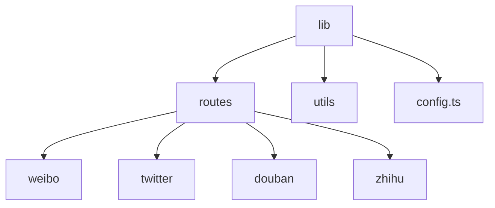
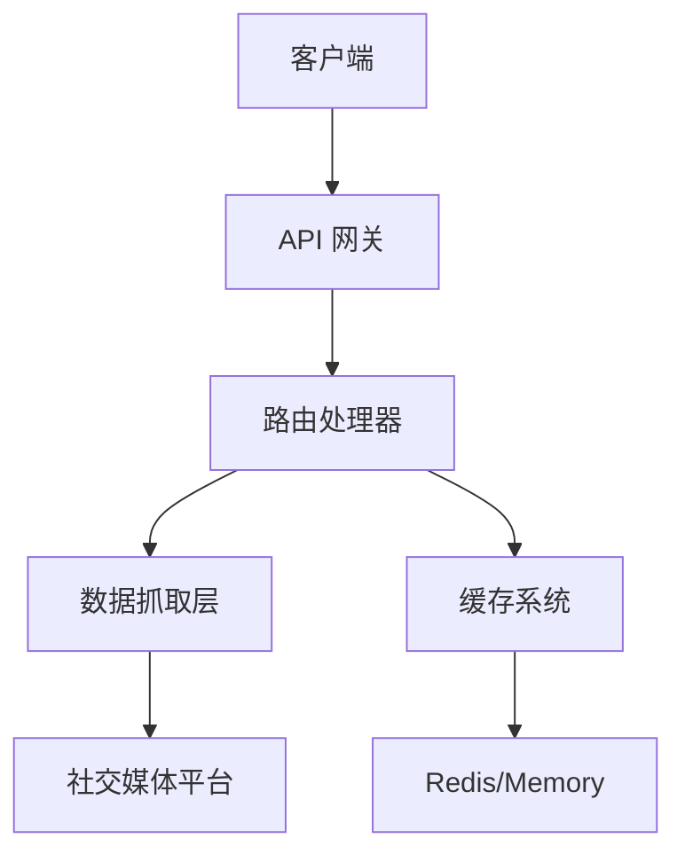
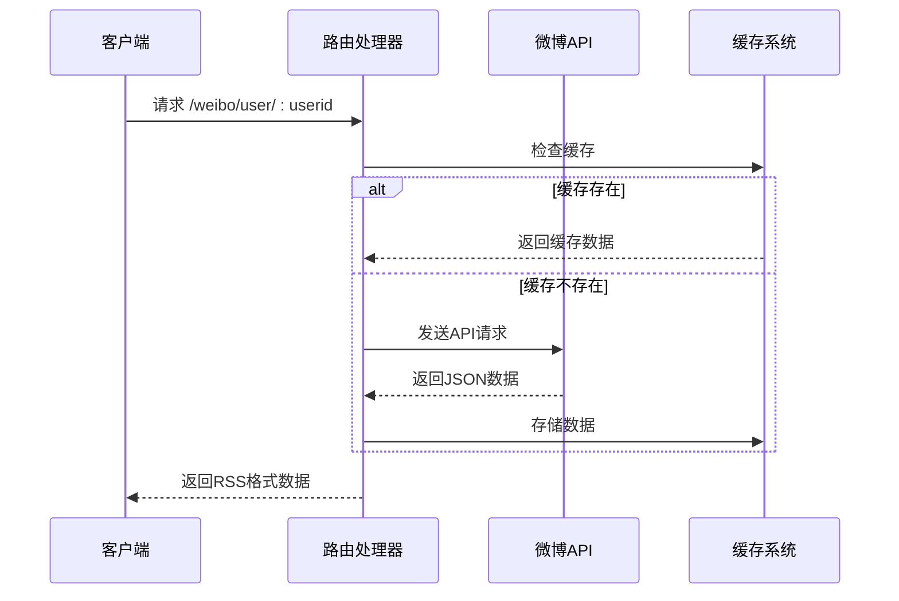
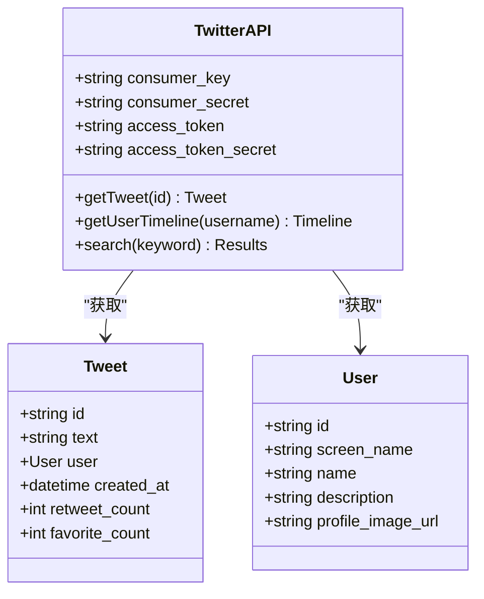
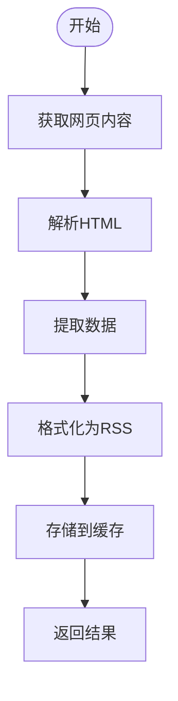
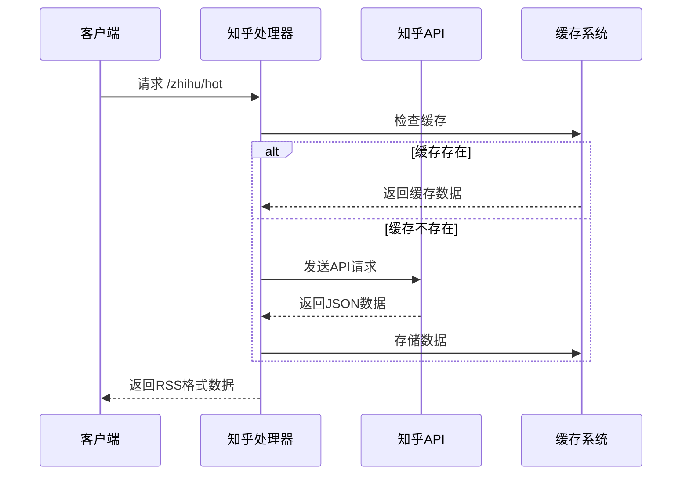
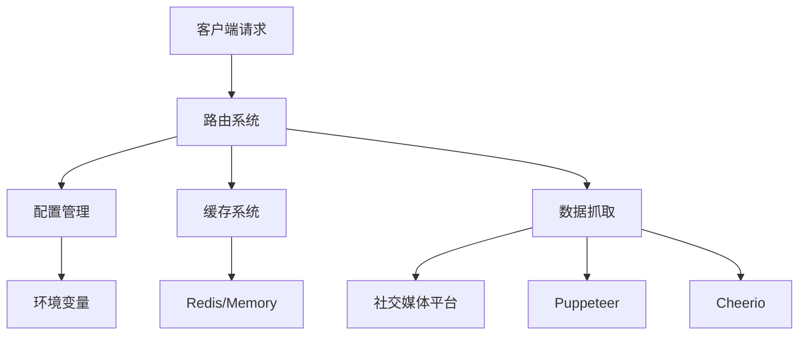

# 社交媒体聚合

<cite>
**本文档中引用的文件**  
- [config.ts](file://lib/config.ts)
- [weibo/utils.ts](file://lib/routes/weibo/utils.ts)
- [weibo/user.ts](file://lib/routes/weibo/user.ts)
- [weibo/keyword.ts](file://lib/routes/weibo/keyword.ts)
- [twitter/utils.ts](file://lib/routes/twitter/utils.ts)
- [twitter/tweet.ts](file://lib/routes/twitter/tweet.ts)
- [douban/other/group.ts](file://lib/routes/douban/other/group.ts)
- [zhihu/hot.ts](file://lib/routes/zhihu/hot.ts)
- [common-config.ts](file://lib/utils/common-config.ts)
</cite>

## 目录
1. [简介](#简介)
2. [项目结构](#项目结构)
3. [核心组件](#核心组件)
4. [架构概述](#架构概述)
5. [详细组件分析](#详细组件分析)
6. [依赖分析](#依赖分析)
7. [性能考虑](#性能考虑)
8. [故障排除指南](#故障排除指南)
9. [结论](#结论)

## 简介

RSSHub 是一个开源的 RSS 聚合网络，能够从各种社交媒体平台（如微博、Twitter、豆瓣、知乎等）聚合内容。本项目通过提供统一的 API 接口，将这些平台的内容转换为标准的 RSS 格式，方便用户订阅和获取信息。RSSHub 支持超过 5,000 个全球实例，每天为数百万用户提供内容聚合服务。

**Section sources**
- [README.md](file://README.md#L1-L62)

## 项目结构

RSSHub 项目采用模块化设计，主要目录结构如下：

```
lib/
├── routes/           # 各个社交媒体平台的路由实现
│   ├── weibo/        # 微博相关路由
│   ├── twitter/      # Twitter 相关路由
│   ├── douban/       # 豆瓣相关路由
│   ├── zhihu/        # 知乎相关路由
├── utils/            # 工具函数
├── config.ts         # 配置管理
```

**Diagram sources**
- [project_structure](file://#L1-L10)



## 核心组件

RSSHub 的核心组件包括配置管理、路由处理、缓存机制和数据抓取工具。这些组件协同工作，实现社交媒体内容的聚合和转换。

**Section sources**
- [config.ts](file://lib/config.ts#L1-L800)
- [common-config.ts](file://lib/utils/common-config.ts#L1-L81)

## 架构概述

RSSHub 采用分层架构设计，主要包括以下几个层次：



**Diagram sources**
- [config.ts](file://lib/config.ts#L243-L800)
- [common-config.ts](file://lib/utils/common-config.ts#L46-L79)

## 详细组件分析

### 微博聚合实现

微博内容聚合通过 API 调用和网页抓取相结合的方式实现。系统首先获取用户 Cookie，然后通过微博移动版 API 获取数据。



**Diagram sources**
- [weibo/utils.ts](file://lib/routes/weibo/utils.ts#L20-L620)
- [weibo/user.ts](file://lib/routes/weibo/user.ts#L1-L50)

### Twitter 聚合实现

Twitter 内容聚合使用 Twitter API 和网页抓取技术。系统支持多种认证方式，包括 OAuth 和 Cookie 认证。



**Diagram sources**
- [twitter/utils.ts](file://lib/routes/twitter/utils.ts#L445-L492)
- [twitter/tweet.ts](file://lib/routes/twitter/tweet.ts#L1-L100)

### 豆瓣聚合实现

豆瓣内容聚合主要通过网页抓取实现，系统解析豆瓣小组、话题等页面的 HTML 结构，提取所需信息。



**Diagram sources**
- [douban/other/group.ts](file://lib/routes/douban/other/group.ts#L1-L100)
- [common-config.ts](file://lib/utils/common-config.ts#L46-L79)

### 知乎聚合实现

知乎内容聚合结合了 API 调用和网页抓取技术，能够获取热门话题、问题回答等内容。



**Diagram sources**
- [zhihu/hot.ts](file://lib/routes/zhihu/hot.ts#L1-L100)
- [config.ts](file://lib/config.ts#L233-L236)

## 依赖分析

RSSHub 项目的依赖关系如下：



**Diagram sources**
- [config.ts](file://lib/config.ts#L239-L800)
- [pkg.ts](file://lib/pkg.ts#L1-L52)

## 性能考虑

RSSHub 在性能方面做了多项优化：

1. **缓存机制**：使用内存或 Redis 缓存，减少重复请求
2. **请求重试**：配置请求重试次数，提高稳定性
3. **并发控制**：限制并发请求数量，避免被目标网站封禁
4. **数据压缩**：对返回的 RSS 数据进行压缩

**Section sources**
- [config.ts](file://lib/config.ts#L257-L258)
- [config.ts](file://lib/config.ts#L729-L730)

## 故障排除指南

常见问题及解决方案：

1. **Cookie 过期**：更新相应的 Cookie 配置
2. **API 限制**：检查是否达到 API 调用频率限制
3. **网络问题**：检查代理设置和网络连接
4. **解析失败**：检查目标网站 HTML 结构是否发生变化

**Section sources**
- [weibo/utils.ts](file://lib/routes/weibo/utils.ts#L13-L18)
- [twitter/utils.ts](file://lib/routes/twitter/utils.ts#L447-L469)

## 结论

RSSHub 通过统一的 API 接口，成功实现了对多个社交媒体平台的内容聚合。项目采用模块化设计，具有良好的扩展性和维护性。通过缓存机制和错误处理，确保了系统的稳定性和性能。未来可以进一步优化数据抓取策略，支持更多社交媒体平台。