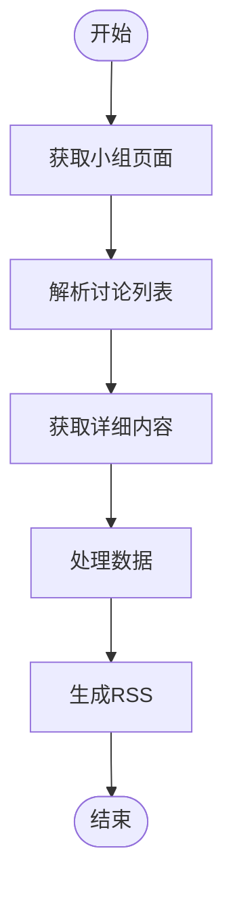

# 豆瓣内容聚合

<cite>
**本文档引用的文件**
- [topic.ts](file://lib/routes/douban/channel/topic.ts)
- [group.ts](file://lib/routes/douban/other/group.ts)
- [later.ts](file://lib/routes/douban/other/later.ts)
- [latest-music.ts](file://lib/routes/douban/other/latest-music.ts)
- [status.ts](file://lib/routes/douban/people/status.ts)
- [list.ts](file://lib/routes/douban/other/list.ts)
- [latest.ts](file://lib/routes/douban/book/latest.ts)
- [rank.ts](file://lib/routes/douban/book/rank.ts)
- [subject.ts](file://lib/routes/douban/channel/subject.ts)
- [coming.ts](file://lib/routes/douban/movie/coming.ts)
- [hot.ts](file://lib/routes/douban/event/hot.ts)
- [namespace.ts](file://lib/routes/douban/namespace.ts)
- [movie_coming.art](file://lib/routes/douban/templates/movie_coming.art)
</cite>

## 目录
1. [简介](#简介)
2. [项目结构](#项目结构)
3. [核心组件](#核心组件)
4. [架构概述](#架构概述)
5. [详细组件分析](#详细组件分析)
6. [依赖分析](#依赖分析)
7. [性能考虑](#性能考虑)
8. [故障排除指南](#故障排除指南)
9. [结论](#结论)

## 简介
本文档详细介绍了如何通过RSSHub聚合豆瓣小组讨论、电影信息和音乐内容。文档深入解释了豆瓣API的实现细节，包括数据抓取策略、内容解析方法和反爬虫应对机制。通过具体的代码示例，展示了如何配置和调用豆瓣API端点。文档涵盖了数据更新频率、内容过滤选项、分页处理和错误处理策略，帮助开发者理解豆瓣内容聚合的技术挑战和解决方案。

## 项目结构
RSSHub项目中的豆瓣内容聚合功能主要分布在`lib/routes/douban`目录下，包含多个子模块来处理不同类型的豆瓣内容。项目结构清晰，按功能划分，便于维护和扩展。

**图表来源**
- [topic.ts](file://lib/routes/douban/channel/topic.ts)
- [group.ts](file://lib/routes/douban/other/group.ts)
- [later.ts](file://lib/routes/douban/other/later.ts)
- [latest-music.ts](file://lib/routes/douban/other/latest-music.ts)
- [status.ts](file://lib/routes/douban/people/status.ts)
- [list.ts](file://lib/routes/douban/other/list.ts)
- [latest.ts](file://lib/routes/douban/book/latest.ts)
- [rank.ts](file://lib/routes/douban/book/rank.ts)
- [subject.ts](file://lib/routes/douban/channel/subject.ts)
- [coming.ts](file://lib/routes/douban/movie/coming.ts)
- [hot.ts](file://lib/routes/douban/event/hot.ts)
- [namespace.ts](file://lib/routes/douban/namespace.ts)
- [movie_coming.art](file://lib/routes/douban/templates/movie_coming.art)

**章节来源**
- [topic.ts](file://lib/routes/douban/channel/topic.ts)
- [group.ts](file://lib/routes/douban/other/group.ts)
- [later.ts](file://lib/routes/douban/other/later.ts)
- [latest-music.ts](file://lib/routes/douban/other/latest-music.ts)
- [status.ts](file://lib/routes/douban/people/status.ts)
- [list.ts](file://lib/routes/douban/other/list.ts)
- [latest.ts](file://lib/routes/douban/book/latest.ts)
- [rank.ts](file://lib/routes/douban/book/rank.ts)
- [subject.ts](file://lib/routes/douban/channel/subject.ts)
- [coming.ts](file://lib/routes/douban/movie/coming.ts)
- [hot.ts](file://lib/routes/douban/event/hot.ts)
- [namespace.ts](file://lib/routes/douban/namespace.ts)

## 核心组件
豆瓣内容聚合的核心组件包括频道专题、小组讨论、即将上映电影、最新增加音乐、用户广播、榜单与集合、新书速递、热门图书排行、频道书影音、电影即将上映和热门同城活动等。这些组件通过统一的API接口提供服务，支持灵活的参数配置和内容过滤。

**章节来源**
- [topic.ts](file://lib/routes/douban/channel/topic.ts)
- [group.ts](file://lib/routes/douban/other/group.ts)
- [later.ts](file://lib/routes/douban/other/later.ts)
- [latest-music.ts](file://lib/routes/douban/other/latest-music.ts)
- [status.ts](file://lib/routes/douban/people/status.ts)
- [list.ts](file://lib/routes/douban/other/list.ts)
- [latest.ts](file://lib/routes/douban/book/latest.ts)
- [rank.ts](file://lib/routes/douban/book/rank.ts)
- [subject.ts](file://lib/routes/douban/channel/subject.ts)
- [coming.ts](file://lib/routes/douban/movie/coming.ts)
- [hot.ts](file://lib/routes/douban/event/hot.ts)

## 架构概述
豆瓣内容聚合的架构基于RSSHub框架，通过定义路由和处理器函数来实现不同内容类型的聚合。每个组件都有明确的职责，通过HTTP请求获取数据，解析内容，并生成RSS格式的输出。

**图表来源**
- [topic.ts](file://lib/routes/douban/channel/topic.ts)
- [group.ts](file://lib/routes/douban/other/group.ts)
- [later.ts](file://lib/routes/douban/other/later.ts)
- [latest-music.ts](file://lib/routes/douban/other/latest-music.ts)
- [status.ts](file://lib/routes/douban/people/status.ts)
- [list.ts](file://lib/routes/douban/other/list.ts)
- [latest.ts](file://lib/routes/douban/book/latest.ts)
- [rank.ts](file://lib/routes/douban/book/rank.ts)
- [subject.ts](file://lib/routes/douban/channel/subject.ts)
- [coming.ts](file://lib/routes/douban/movie/coming.ts)
- [hot.ts](file://lib/routes/douban/event/hot.ts)

**章节来源**
- [topic.ts](file://lib/routes/douban/channel/topic.ts)
- [group.ts](file://lib/routes/douban/other/group.ts)
- [later.ts](file://lib/routes/douban/other/later.ts)
- [latest-music.ts](file://lib/routes/douban/other/latest-music.ts)
- [status.ts](file://lib/routes/douban/people/status.ts)
- [list.ts](file://lib/routes/douban/other/list.ts)
- [latest.ts](file://lib/routes/douban/book/latest.ts)
- [rank.ts](file://lib/routes/douban/book/rank.ts)
- [subject.ts](file://lib/routes/douban/channel/subject.ts)
- [coming.ts](file://lib/routes/douban/movie/coming.ts)
- [hot.ts](file://lib/routes/douban/event/hot.ts)

## 详细组件分析
### 频道专题分析
频道专题组件通过调用豆瓣的API获取特定频道的动态内容。支持按热门、最新等分类进行筛选。

#### 组件分析内容

**图表来源**
- [topic.ts](file://lib/routes/douban/channel/topic.ts)

**章节来源**
- [topic.ts](file://lib/routes/douban/channel/topic.ts)

### 小组讨论分析
小组讨论组件通过抓取豆瓣小组页面的内容，提取最新的讨论主题。支持按最新、最热、精华等类型进行筛选。

#### 组件分析内容

**图表来源**
- [group.ts](file://lib/routes/douban/other/group.ts)

**章节来源**
- [group.ts](file://lib/routes/douban/other/group.ts)

### 即将上映电影分析
即将上映电影组件通过抓取豆瓣电影页面的内容，获取即将上映的电影信息。

#### 组件分析内容

**图表来源**
- [later.ts](file://lib/routes/douban/other/later.ts)

**章节来源**
- [later.ts](file://lib/routes/douban/other/later.ts)

### 最新增加音乐分析
最新增加音乐组件通过调用豆瓣音乐API获取最新增加的音乐信息，支持按华语、欧美、日韩等区域进行筛选。

#### 组件分析内容

**图表来源**
- [latest-music.ts](file://lib/routes/douban/other/latest-music.ts)

**章节来源**
- [latest-music.ts](file://lib/routes/douban/other/latest-music.ts)

### 用户广播分析
用户广播组件通过调用豆瓣API获取用户的广播内容，支持丰富的参数配置来优化输出样式。

#### 组件分析内容

**图表来源**
- [status.ts](file://lib/routes/douban/people/status.ts)

**章节来源**
- [status.ts](file://lib/routes/douban/people/status.ts)

### 榜单与集合分析
榜单与集合组件通过调用豆瓣API获取各种榜单和集合的内容，支持按类型和评分进行筛选。

#### 组件分析内容

**图表来源**
- [list.ts](file://lib/routes/douban/other/list.ts)

**章节来源**
- [list.ts](file://lib/routes/douban/other/list.ts)

### 新书速递分析
新书速递组件通过调用豆瓣API获取最新书籍信息，支持按文学、小说、历史文化等分类进行筛选。

#### 组件分析内容

**图表来源**
- [latest.ts](file://lib/routes/douban/book/latest.ts)

**章节来源**
- [latest.ts](file://lib/routes/douban/book/latest.ts)

### 热门图书排行分析
热门图书排行组件通过调用豆瓣API获取热门图书的排行信息，支持按虚构类和非虚构类进行筛选。

#### 组件分析内容

**图表来源**
- [rank.ts](file://lib/routes/douban/book/rank.ts)

**章节来源**
- [rank.ts](file://lib/routes/douban/book/rank.ts)

### 频道书影音分析
频道书影音组件通过调用豆瓣API获取特定频道的书影音推荐内容，支持按电影、电视剧、图书、唱片等分类进行筛选。

#### 组件分析内容

**图表来源**
- [subject.ts](file://lib/routes/douban/channel/subject.ts)

**章节来源**
- [subject.ts](file://lib/routes/douban/channel/subject.ts)

### 电影即将上映分析
电影即将上映组件通过调用豆瓣API获取即将上映的电影信息，并使用模板渲染详细的描述内容。

#### 组件分析内容

**图表来源**
- [coming.ts](file://lib/routes/douban/movie/coming.ts)
- [movie_coming.art](file://lib/routes/douban/templates/movie_coming.art)

**章节来源**
- [coming.ts](file://lib/routes/douban/movie/coming.ts)

### 热门同城活动分析
热门同城活动组件通过调用豆瓣API获取指定位置的热门同城活动信息。

#### 组件分析内容

**图表来源**
- [hot.ts](file://lib/routes/douban/event/hot.ts)

**章节来源**
- [hot.ts](file://lib/routes/douban/event/hot.ts)

## 依赖分析
豆瓣内容聚合组件依赖于多个核心模块和工具函数，包括路由定义、HTTP请求处理、数据解析和缓存管理等。

**图表来源**
- [topic.ts](file://lib/routes/douban/channel/topic.ts)
- [group.ts](file://lib/routes/douban/other/group.ts)
- [later.ts](file://lib/routes/douban/other/later.ts)
- [latest-music.ts](file://lib/routes/douban/other/latest-music.ts)
- [status.ts](file://lib/routes/douban/people/status.ts)
- [list.ts](file://lib/routes/douban/other/list.ts)
- [latest.ts](file://lib/routes/douban/book/latest.ts)
- [rank.ts](file://lib/routes/douban/book/rank.ts)
- [subject.ts](file://lib/routes/douban/channel/subject.ts)
- [coming.ts](file://lib/routes/douban/movie/coming.ts)
- [hot.ts](file://lib/routes/douban/event/hot.ts)

**章节来源**
- [topic.ts](file://lib/routes/douban/channel/topic.ts)
- [group.ts](file://lib/routes/douban/other/group.ts)
- [later.ts](file://lib/routes/douban/other/later.ts)
- [latest-music.ts](file://lib/routes/douban/other/latest-music.ts)
- [status.ts](file://lib/routes/douban/people/status.ts)
- [list.ts](file://lib/routes/douban/other/list.ts)
- [latest.ts](file://lib/routes/douban/book/latest.ts)
- [rank.ts](file://lib/routes/douban/book/rank.ts)
- [subject.ts](file://lib/routes/douban/channel/subject.ts)
- [coming.ts](file://lib/routes/douban/movie/coming.ts)
- [hot.ts](file://lib/routes/douban/event/hot.ts)

## 性能考虑
豆瓣内容聚合在性能方面考虑了多个因素，包括数据更新频率、缓存策略和错误处理。通过合理的缓存设置，减少了对豆瓣API的频繁调用，提高了响应速度。同时，组件设计考虑了错误处理，确保在API调用失败时能够优雅地降级。

## 故障排除指南
在使用豆瓣内容聚合时，可能会遇到一些常见问题，如API调用失败、数据解析错误等。建议检查网络连接、API端点是否可用，以及参数配置是否正确。对于频繁的API调用，建议合理设置缓存策略，避免触发豆瓣的反爬虫机制。

**章节来源**
- [topic.ts](file://lib/routes/douban/channel/topic.ts)
- [group.ts](file://lib/routes/douban/other/group.ts)
- [later.ts](file://lib/routes/douban/other/later.ts)
- [latest-music.ts](file://lib/routes/douban/other/latest-music.ts)
- [status.ts](file://lib/routes/douban/people/status.ts)
- [list.ts](file://lib/routes/douban/other/list.ts)
- [latest.ts](file://lib/routes/douban/book/latest.ts)
- [rank.ts](file://lib/routes/douban/book/rank.ts)
- [subject.ts](file://lib/routes/douban/channel/subject.ts)
- [coming.ts](file://lib/routes/douban/movie/coming.ts)
- [hot.ts](file://lib/routes/douban/event/hot.ts)

## 结论
通过RSSHub聚合豆瓣内容是一种高效且灵活的方式，能够满足不同场景下的需求。本文档详细介绍了各个组件的实现细节和使用方法，帮助开发者更好地理解和应用豆瓣内容聚合技术。未来可以进一步优化性能，增加更多功能，提升用户体验。