# B站内容聚合

<cite>
**本文档引用的文件**  
- [video.ts](file://lib/routes/bilibili/video.ts)
- [dynamic.ts](file://lib/routes/bilibili/dynamic.ts)
- [bangumi.ts](file://lib/routes/bilibili/bangumi.ts)
- [popular.ts](file://lib/routes/bilibili/popular.ts)
- [partion.ts](file://lib/routes/bilibili/partion.ts)
- [utils.ts](file://lib/routes/bilibili/utils.ts)
- [types.ts](file://lib/routes/bilibili/types.ts)
- [api-interface.d.ts](file://lib/routes/bilibili/api-interface.d.ts)
</cite>

## 目录
1. [简介](#简介)
2. [项目结构](#项目结构)
3. [核心组件](#核心组件)
4. [架构概述](#架构概述)
5. [详细组件分析](#详细组件分析)
6. [依赖分析](#依赖分析)
7. [性能考虑](#性能考虑)
8. [故障排除指南](#故障排除指南)
9. [结论](#结论)

## 简介
RSSHub 是一个内容聚合网络，支持从 B站（bilibili）等平台聚合视频、动态、番剧等内容。本项目通过调用 B站 API 接口，实现对视频元数据、弹幕数据、用户动态和番剧更新信息的提取与聚合。开发者可以通过简单的 API 请求获取最新的视频更新、热门推荐和用户动态信息。系统支持视频分类、分区信息、播放统计和弹幕分析等功能，帮助开发者有效利用 B站内容聚合功能。

## 项目结构
B站内容聚合功能位于 `lib/routes/bilibili/` 目录下，包含多个模块化文件，分别处理不同类型的 B站内容。

**图表来源**  
- [video.ts](file://lib/routes/bilibili/video.ts)
- [dynamic.ts](file://lib/routes/bilibili/dynamic.ts)
- [bangumi.ts](file://lib/routes/bilibili/bangumi.ts)

**本节来源**  
- [lib/routes/bilibili/](file://lib/routes/bilibili/)

## 核心组件
B站内容聚合系统的核心组件包括视频聚合、动态聚合、番剧聚合、热门聚合和分区聚合。每个组件都实现了特定的路由处理函数，通过调用 B站 API 获取数据并进行格式化处理。系统使用缓存机制提高性能，通过 WBI 签名等反爬虫技术确保请求的合法性。组件之间通过共享的工具函数和类型定义保持一致性，实现了高效的内容聚合功能。

**本节来源**  
- [video.ts](file://lib/routes/bilibili/video.ts#L1-L106)
- [dynamic.ts](file://lib/routes/bilibili/dynamic.ts#L1-L462)
- [bangumi.ts](file://lib/routes/bilibili/bangumi.ts#L1-L71)

## 架构概述
B站内容聚合系统采用模块化架构，每个内容类型都有独立的处理模块。系统通过统一的 API 调用机制与 B站服务器通信，使用中间件处理请求验证和缓存。数据流从 API 请求开始，经过数据解析、格式化处理，最终生成标准化的 RSS 输出。

**图表来源**  
- [video.ts](file://lib/routes/bilibili/video.ts)
- [dynamic.ts](file://lib/routes/bilibili/dynamic.ts)
- [bangumi.ts](file://lib/routes/bilibili/bangumi.ts)

## 详细组件分析

### 视频聚合分析
视频聚合模块负责获取用户投稿的视频内容，包括视频标题、描述、发布时间、作者信息等元数据。

**图表来源**  
- [video.ts](file://lib/routes/bilibili/video.ts#L1-L106)
- [utils.ts](file://lib/routes/bilibili/utils.ts#L1-L325)

### 动态聚合分析
动态聚合模块处理用户动态内容，支持多种动态类型，包括纯文字、带图、视频、专栏等。

**图表来源**  
- [dynamic.ts](file://lib/routes/bilibili/dynamic.ts#L1-L462)
- [api-interface.d.ts](file://lib/routes/bilibili/api-interface.d.ts#L1-L494)

### 番剧聚合分析
番剧聚合模块专门处理 B站番剧内容，获取番剧信息和分集更新。

```mermaid
classDiagram
class BangumiHandler {
+string mediaId
+boolean embed
+handle() Data
}
class Utils {
+getBangumi(mediaId, cache) MediaResult
+getBangumiItems(seasonId, cache) SeasonResult
+renderOGVDescription(embed, img, desc, seasonId, episodeId) string
}
class Types {
+interface MediaResult
+interface SeasonResult
+interface EpisodeResult
}
BangumiHandler --> Utils : "使用"
BangumiHandler --> Types : "引用"
Utils --> Cache : "依赖"
```

**图表来源**  
- [bangumi.ts](file://lib/routes/bilibili/bangumi.ts#L1-L71)
- [utils.ts](file://lib/routes/bilibili/utils.ts#L208-L247)
- [types.ts](file://lib/routes/bilibili/types.ts#L1-L53)

**本节来源**  
- [bangumi.ts](file://lib/routes/bilibili/bangumi.ts#L1-L71)
- [utils.ts](file://lib/routes/bilibili/utils.ts#L208-L247)
- [types.ts](file://lib/routes/bilibili/types.ts#L1-L53)

## 依赖分析
B站内容聚合系统依赖多个内部和外部组件，形成了复杂的依赖网络。

**图表来源**  
- [video.ts](file://lib/routes/bilibili/video.ts)
- [dynamic.ts](file://lib/routes/bilibili/dynamic.ts)
- [bangumi.ts](file://lib/routes/bilibili/bangumi.ts)
- [popular.ts](file://lib/routes/bilibili/popular.ts)
- [partion.ts](file://lib/routes/bilibili/partion.ts)
- [utils.ts](file://lib/routes/bilibili/utils.ts)

**本节来源**  
- [lib/routes/bilibili/](file://lib/routes/bilibili/)

## 性能考虑
B站内容聚合系统通过多种机制优化性能。系统使用缓存机制存储频繁访问的数据，如用户信息、Cookie 和 WBI 验证字符串，减少重复的 API 调用。对于视频字幕等大文件，系统提供配置选项来排除字幕附件，降低响应大小。请求参数中支持 JSON 格式输出，便于客户端处理。系统还实现了错误处理和重试机制，当遇到风控校验时会尝试重新获取 Cookie，提高请求成功率。

## 故障排除指南
在使用 B站内容聚合功能时，可能会遇到以下常见问题：

**本节来源**  
- [dynamic.ts](file://lib/routes/bilibili/dynamic.ts#L293-L300)
- [video.ts](file://lib/routes/bilibili/video.ts#L61-L64)

## 结论
B站内容聚合系统提供了一套完整的解决方案，用于聚合 B站的视频、动态、番剧等内容。系统通过模块化设计实现了高可维护性，使用缓存和反爬虫技术确保了稳定性和可靠性。开发者可以轻松集成这些功能，获取最新的 B站内容更新。未来可以考虑增加更多内容类型的支持，优化性能，并提供更详细的文档和示例。