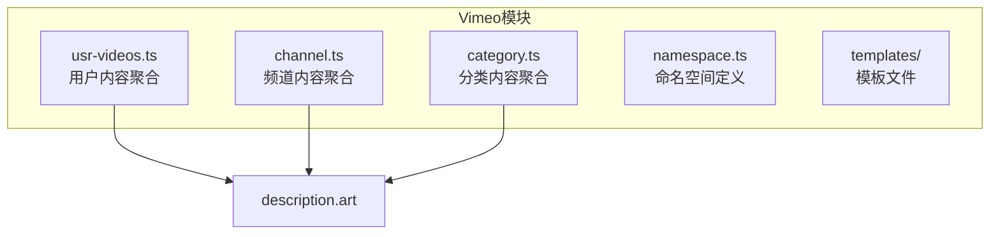
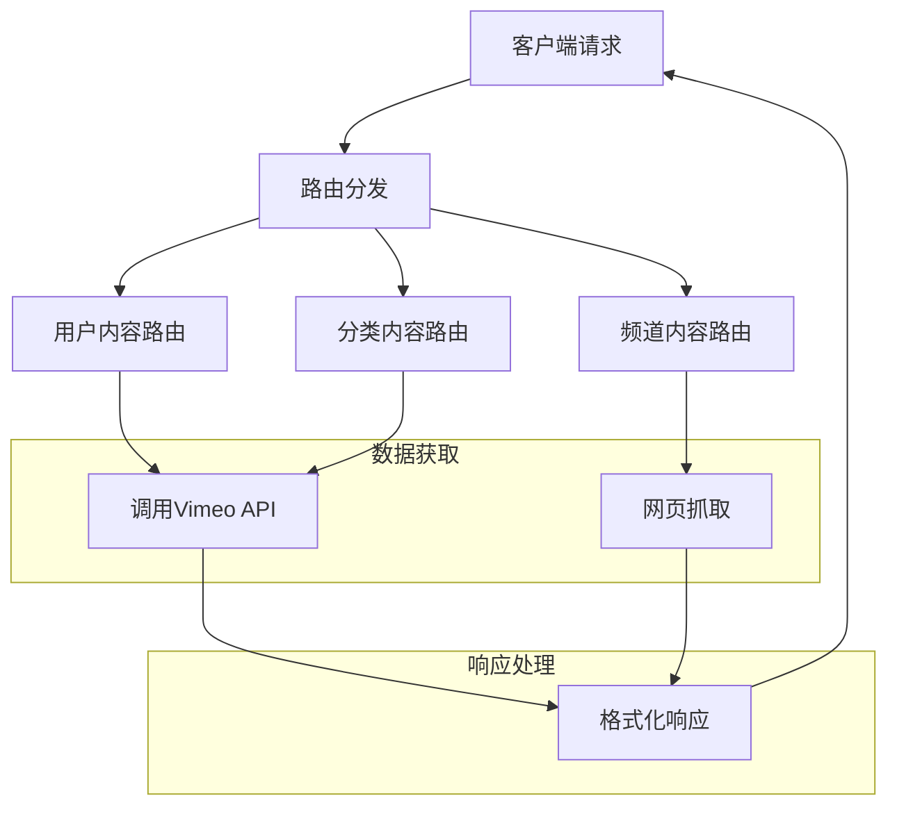
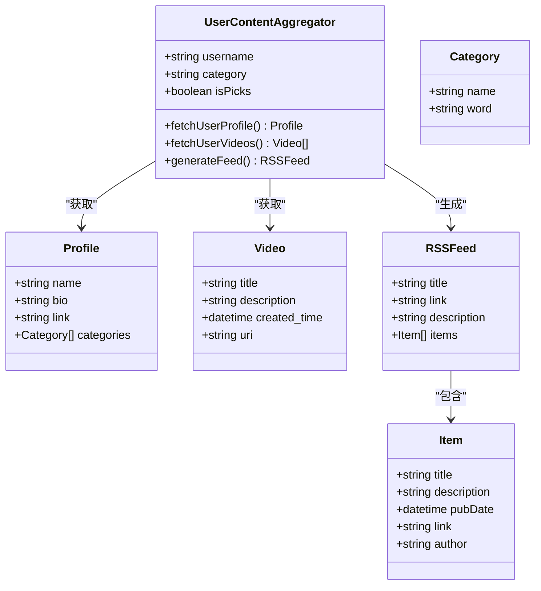
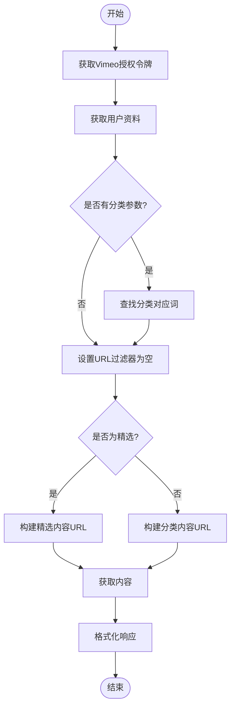
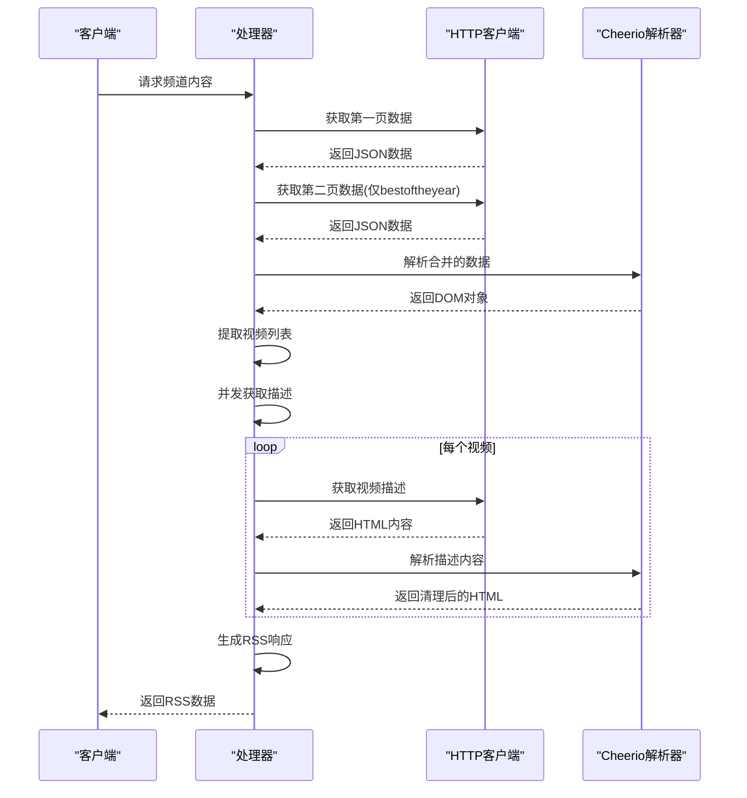
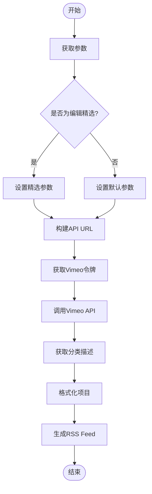
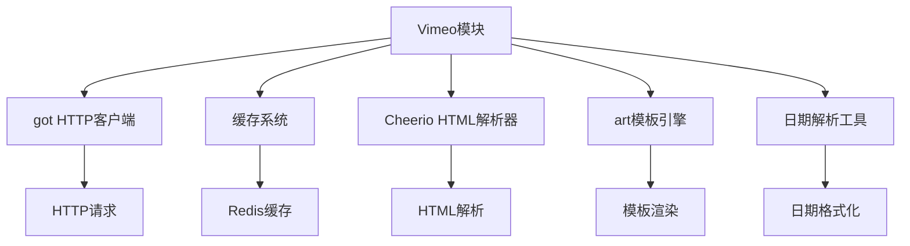

# Vimeo内容聚合

<cite>
**本文档引用文件**   
- [usr-videos.ts](file://lib/routes/vimeo/usr-videos.ts)
- [channel.ts](file://lib/routes/vimeo/channel.ts)
- [category.ts](file://lib/routes/vimeo/category.ts)
- [namespace.ts](file://lib/routes/vimeo/namespace.ts)
- [description.art](file://lib/routes/vimeo/templates/description.art)
</cite>

## 目录
1. [简介](#简介)
2. [项目结构](#项目结构)
3. [核心组件](#核心组件)
4. [架构概述](#架构概述)
5. [详细组件分析](#详细组件分析)
6. [依赖分析](#依赖分析)
7. [性能考虑](#性能考虑)
8. [故障排除指南](#故障排除指南)
9. [结论](#结论)

## 简介
Vimeo内容聚合API为开发者提供了从Vimeo平台获取用户、频道和分类内容的便捷方式。该API能够提取视频元数据、处理专辑、获取用户作品集和频道更新信息。通过本API，开发者可以轻松集成Vimeo内容到自己的应用中，实现视频分类、创意标签、观看统计和创作者信息的获取。

## 项目结构
Vimeo内容聚合功能位于`lib/routes/vimeo/`目录下，包含多个专门处理不同类型Vimeo内容的路由文件。该结构遵循模块化设计原则，将不同功能分离到独立的文件中，便于维护和扩展。

**图示来源**
- [usr-videos.ts](file://lib/routes/vimeo/usr-videos.ts)
- [channel.ts](file://lib/routes/vimeo/channel.ts)
- [category.ts](file://lib/routes/vimeo/category.ts)
- [description.art](file://lib/routes/vimeo/templates/description.art)

**本节来源**
- [namespace.ts](file://lib/routes/vimeo/namespace.ts)

## 核心组件
Vimeo内容聚合API的核心组件包括用户内容聚合、频道内容聚合和分类内容聚合三个主要功能模块。这些组件共同构成了完整的Vimeo内容获取系统，支持从不同维度提取和聚合Vimeo平台的内容。

**本节来源**
- [usr-videos.ts](file://lib/routes/vimeo/usr-videos.ts#L1-L104)
- [channel.ts](file://lib/routes/vimeo/channel.ts#L1-L97)
- [category.ts](file://lib/routes/vimeo/category.ts#L1-L91)

## 架构概述
Vimeo内容聚合API采用基于路由的架构设计，通过不同的路由处理Vimeo平台的各种内容类型。系统通过API调用和网页抓取相结合的方式获取数据，然后统一格式化为标准的RSS输出。

**图示来源**
- [usr-videos.ts](file://lib/routes/vimeo/usr-videos.ts#L34-L104)
- [channel.ts](file://lib/routes/vimeo/channel.ts#L34-L97)
- [category.ts](file://lib/routes/vimeo/category.ts#L34-L91)

## 详细组件分析

### 用户内容分析
用户内容聚合组件负责获取Vimeo用户的相关信息和视频内容。该组件支持获取用户的最新视频上传、分类内容和精选作品。

#### 用户内容聚合类图

**图示来源**
- [usr-videos.ts](file://lib/routes/vimeo/usr-videos.ts#L34-L104)

#### 用户内容获取流程

**图示来源**
- [usr-videos.ts](file://lib/routes/vimeo/usr-videos.ts#L34-L104)

**本节来源**
- [usr-videos.ts](file://lib/routes/vimeo/usr-videos.ts#L1-L104)

### 频道内容分析
频道内容聚合组件专门用于获取Vimeo频道的视频内容。该组件通过网页抓取技术从Vimeo频道页面提取视频信息。

#### 频道内容获取序列图

**图示来源**
- [channel.ts](file://lib/routes/vimeo/channel.ts#L34-L97)

**本节来源**
- [channel.ts](file://lib/routes/vimeo/channel.ts#L1-L97)

### 分类内容分析
分类内容聚合组件用于获取Vimeo特定分类下的视频内容，支持按编辑精选排序。

#### 分类内容处理流程

**图示来源**
- [category.ts](file://lib/routes/vimeo/category.ts#L34-L91)

**本节来源**
- [category.ts](file://lib/routes/vimeo/category.ts#L1-L91)

## 依赖分析
Vimeo内容聚合功能依赖于多个核心工具和库，这些依赖项共同支持数据获取、处理和格式化。

**图示来源**
- [usr-videos.ts](file://lib/routes/vimeo/usr-videos.ts#L5-L7)
- [channel.ts](file://lib/routes/vimeo/channel.ts#L6-L9)
- [category.ts](file://lib/routes/vimeo/category.ts#L8-L9)

**本节来源**
- [usr-videos.ts](file://lib/routes/vimeo/usr-videos.ts#L3-L7)
- [channel.ts](file://lib/routes/vimeo/channel.ts#L5-L9)
- [category.ts](file://lib/routes/vimeo/category.ts#L6-L9)

## 性能考虑
Vimeo内容聚合API在设计时考虑了性能优化，通过缓存机制减少重复请求，提高响应速度。对于频道内容的获取，系统采用并发请求的方式获取视频描述，显著提升了数据获取效率。同时，API调用和网页抓取的选择也基于性能考虑，对于支持API的资源优先使用API方式获取数据。

## 故障排除指南
当使用Vimeo内容聚合API时，可能会遇到一些常见问题。对于分类名称中包含斜杠的情况，需要将斜杠"/"替换为竖线"|"。如果请求返回空内容，可能是由于分类名称不正确或用户不存在。对于频道内容获取，某些特殊频道可能需要额外的处理逻辑。

**本节来源**
- [usr-videos.ts](file://lib/routes/vimeo/usr-videos.ts#L67-L69)
- [channel.ts](file://lib/routes/vimeo/channel.ts#L45-L52)

## 结论
Vimeo内容聚合API提供了一套完整的解决方案，用于从Vimeo平台获取用户、频道和分类内容。通过模块化的设计和高效的实现，该API能够稳定地提取视频元数据、处理专辑、获取用户作品集和频道更新信息。开发者可以利用这些功能构建丰富的多媒体应用，为用户提供最新的Vimeo内容。