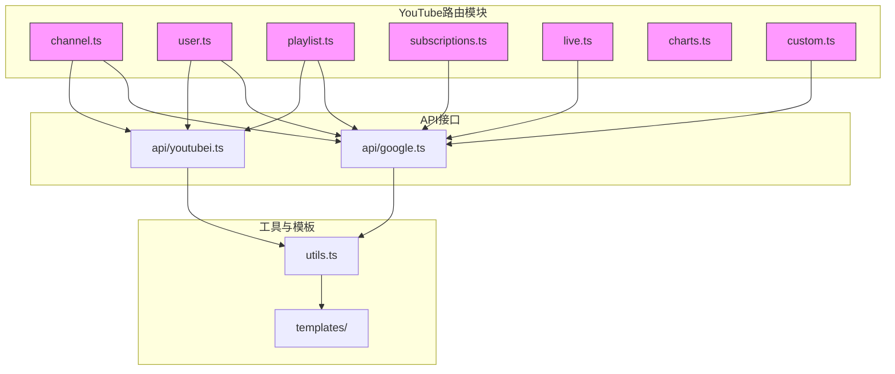
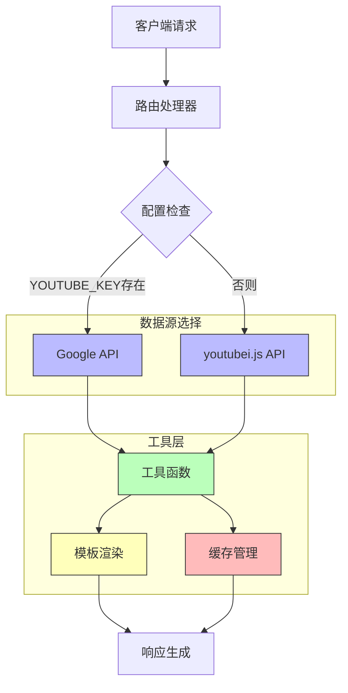
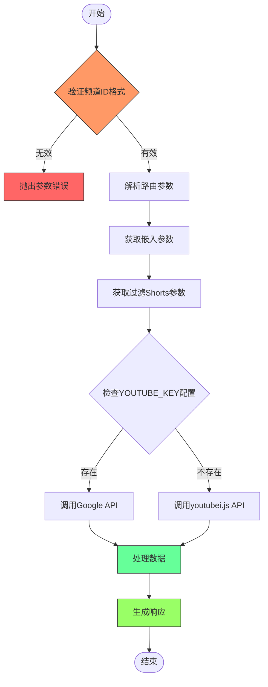
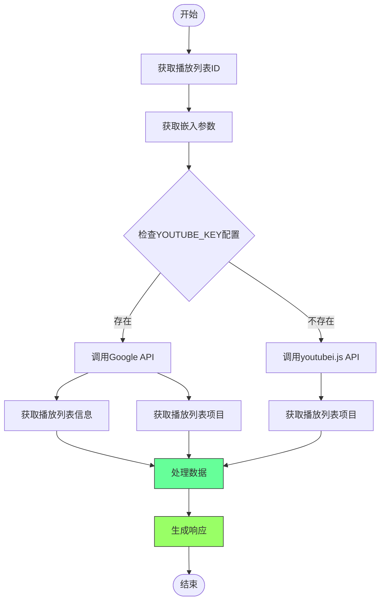
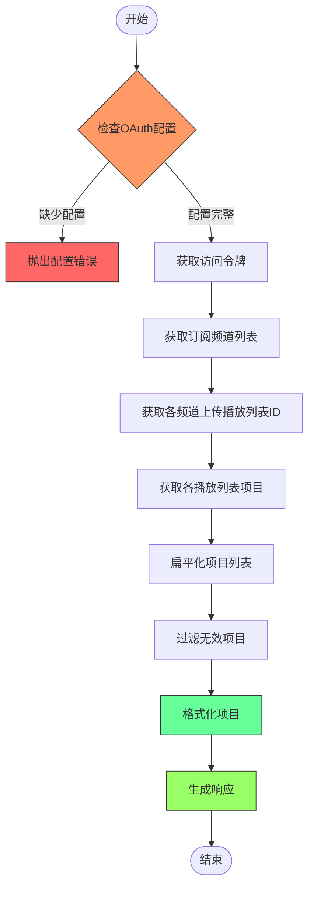
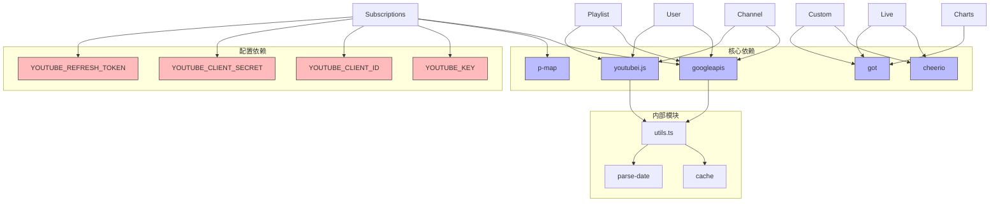

# YouTube内容聚合

<cite>
**本文档引用文件**  
- [channel.ts](file://lib/routes/youtube/channel.ts)
- [user.ts](file://lib/routes/youtube/user.ts)
- [playlist.ts](file://lib/routes/youtube/playlist.ts)
- [subscriptions.ts](file://lib/routes/youtube/subscriptions.ts)
- [live.ts](file://lib/routes/youtube/live.ts)
- [charts.ts](file://lib/routes/youtube/charts.ts)
- [custom.ts](file://lib/routes/youtube/custom.ts)
- [utils.ts](file://lib/routes/youtube/utils.ts)
- [google.ts](file://lib/routes/youtube/api/google.ts)
- [youtubei.ts](file://lib/routes/youtube/api/youtubei.ts)
- [description.art](file://lib/routes/youtube/templates/description.art)
- [config.ts](file://lib/config.ts)
</cite>

## 目录
1. [简介](#简介)
2. [项目结构](#项目结构)
3. [核心组件](#核心组件)
4. [架构概述](#架构概述)
5. [详细组件分析](#详细组件分析)
6. [依赖分析](#依赖分析)
7. [性能考虑](#性能考虑)
8. [故障排除指南](#故障排除指南)
9. [结论](#结论)

## 简介
YouTube内容聚合API提供了一种高效的方式来获取和聚合YouTube平台上的各种内容，包括频道、播放列表、订阅更新、直播状态和音乐排行榜。该系统通过多种数据源和API实现内容抓取，支持灵活的参数配置和数据过滤，为开发者提供了全面的YouTube内容访问能力。

## 项目结构
YouTube内容聚合功能位于`lib/routes/youtube`目录下，采用模块化设计，将不同类型的YouTube内容聚合功能分离到独立的文件中。系统通过API层与YouTube数据源交互，使用工具函数处理通用逻辑，并通过模板渲染内容描述。

**图源**  
- [channel.ts](file://lib/routes/youtube/channel.ts)
- [user.ts](file://lib/routes/youtube/user.ts)
- [playlist.ts](file://lib/routes/youtube/playlist.ts)
- [subscriptions.ts](file://lib/routes/youtube/subscriptions.ts)
- [live.ts](file://lib/routes/youtube/live.ts)
- [charts.ts](file://lib/routes/youtube/charts.ts)
- [custom.ts](file://lib/routes/youtube/custom.ts)
- [google.ts](file://lib/routes/youtube/api/google.ts)
- [youtubei.ts](file://lib/routes/youtube/api/youtubei.ts)
- [utils.ts](file://lib/routes/youtube/utils.ts)

**节源**
- [channel.ts](file://lib/routes/youtube/channel.ts)
- [user.ts](file://lib/routes/youtube/user.ts)
- [playlist.ts](file://lib/routes/youtube/playlist.ts)
- [subscriptions.ts](file://lib/routes/youtube/subscriptions.ts)
- [live.ts](file://lib/routes/youtube/live.ts)
- [charts.ts](file://lib/routes/youtube/charts.ts)
- [custom.ts](file://lib/routes/youtube/custom.ts)

## 核心组件
YouTube内容聚合系统的核心组件包括频道聚合、用户聚合、播放列表聚合、订阅聚合、直播状态聚合、音乐排行榜和自定义URL聚合。每个组件都实现了特定的内容聚合功能，支持参数化配置和灵活的数据获取。

**节源**
- [channel.ts](file://lib/routes/youtube/channel.ts#L8-L24)
- [user.ts](file://lib/routes/youtube/user.ts#L8-L44)
- [playlist.ts](file://lib/routes/youtube/playlist.ts#L8-L30)
- [subscriptions.ts](file://lib/routes/youtube/subscriptions.ts#L11-L45)
- [live.ts](file://lib/routes/youtube/live.ts#L12-L32)
- [charts.ts](file://lib/routes/youtube/charts.ts#L8-L15)
- [custom.ts](file://lib/routes/youtube/custom.ts#L12-L37)

## 架构概述
YouTube内容聚合系统采用双API源架构，优先使用Google官方API，当配置不可用时回退到youtubei.js实现。系统通过统一的工具函数层处理缓存、数据提取和格式化，确保不同数据源的一致性。

**图源**  
- [google.ts](file://lib/routes/youtube/api/google.ts)
- [youtubei.ts](file://lib/routes/youtube/api/youtubei.ts)
- [utils.ts](file://lib/routes/youtube/utils.ts)
- [description.art](file://lib/routes/youtube/templates/description.art)

**节源**
- [google.ts](file://lib/routes/youtube/api/google.ts#L20-L50)
- [youtubei.ts](file://lib/routes/youtube/api/youtubei.ts#L10-L27)
- [utils.ts](file://lib/routes/youtube/utils.ts#L137-L146)

## 详细组件分析

### 频道聚合分析
频道聚合功能通过频道ID获取YouTube频道的最新视频内容。系统支持过滤短视频（Shorts）和嵌入视频播放器的配置选项。

**图源**  
- [channel.ts](file://lib/routes/youtube/channel.ts#L51-L77)
- [utils.ts](file://lib/routes/youtube/utils.ts#L106)
- [google.ts](file://lib/routes/youtube/api/google.ts#L151-L194)
- [youtubei.ts](file://lib/routes/youtube/api/youtubei.ts#L41-L78)

**节源**
- [channel.ts](file://lib/routes/youtube/channel.ts#L8-L78)
- [utils.ts](file://lib/routes/youtube/utils.ts#L106)
- [google.ts](file://lib/routes/youtube/api/google.ts#L151-L194)
- [youtubei.ts](file://lib/routes/youtube/api/youtubei.ts#L41-L78)

### 播放列表聚合分析
播放列表聚合功能通过播放列表ID获取指定播放列表中的所有视频内容，支持视频嵌入配置。

**图源**  
- [playlist.ts](file://lib/routes/youtube/playlist.ts#L33-L45)
- [google.ts](file://lib/routes/youtube/api/google.ts#L196-L233)
- [youtubei.ts](file://lib/routes/youtube/api/youtubei.ts#L81-L123)

**节源**
- [playlist.ts](file://lib/routes/youtube/playlist.ts#L8-L46)
- [google.ts](file://lib/routes/youtube/api/google.ts#L196-L233)
- [youtubei.ts](file://lib/routes/youtube/api/youtubei.ts#L81-L123)

### 订阅聚合分析
订阅聚合功能获取用户订阅的所有频道的最新视频内容，需要OAuth2认证配置。

**图源**  
- [subscriptions.ts](file://lib/routes/youtube/subscriptions.ts#L48-L90)
- [utils.ts](file://lib/routes/youtube/utils.ts#L76-L104)

**节源**
- [subscriptions.ts](file://lib/routes/youtube/subscriptions.ts#L11-L91)
- [utils.ts](file://lib/routes/youtube/utils.ts#L76-L104)

## 依赖分析
YouTube内容聚合系统依赖多个外部库和配置项，通过清晰的依赖管理确保系统的稳定性和可维护性。

**图源**  
- [google.ts](file://lib/routes/youtube/api/google.ts#L3-L4)
- [youtubei.ts](file://lib/routes/youtube/api/youtubei.ts#L1)
- [live.ts](file://lib/routes/youtube/live.ts#L1-L2)
- [custom.ts](file://lib/routes/youtube/custom.ts#L1-L2)
- [charts.ts](file://lib/routes/youtube/charts.ts#L4)
- [subscriptions.ts](file://lib/routes/youtube/subscriptions.ts#L1-L2)
- [config.ts](file://lib/config.ts#L1133-L1136)

**节源**
- [google.ts](file://lib/routes/youtube/api/google.ts)
- [youtubei.ts](file://lib/routes/youtube/api/youtubei.ts)
- [live.ts](file://lib/routes/youtube/live.ts)
- [custom.ts](file://lib/routes/youtube/custom.ts)
- [charts.ts](file://lib/routes/youtube/charts.ts)
- [subscriptions.ts](file://lib/routes/youtube/subscriptions.ts)
- [config.ts](file://lib/config.ts)

## 性能考虑
YouTube内容聚合系统通过多种机制优化性能，包括缓存策略、并发处理和数据预取。系统使用`cache.tryGet`方法缓存API响应，减少对YouTube API的重复请求。对于订阅聚合等需要处理多个频道的场景，系统使用`p-map`库实现并发请求，提高数据获取效率。

**节源**
- [utils.ts](file://lib/routes/youtube/utils.ts#L10-L25)
- [subscriptions.ts](file://lib/routes/youtube/subscriptions.ts#L54-L58)

## 故障排除指南
当YouTube内容聚合功能无法正常工作时，可参考以下常见问题及解决方案：

1. **API密钥错误**：确保`YOUTUBE_KEY`环境变量已正确配置，对于需要OAuth的路由（如订阅），还需配置`YOUTUBE_CLIENT_ID`、`YOUTUBE_CLIENT_SECRET`和`YOUTUBE_REFRESH_TOKEN`。

2. **频道ID无效**：使用`/youtube/user/:username`路由替代`/youtube/channel/:id`路由，当处理用户名而非频道ID时。

3. **访问令牌过期**：系统会自动处理OAuth访问令牌的刷新，但如果持续出现认证错误，可能需要重新生成刷新令牌。

4. **内容为空**：某些频道可能没有公开内容，或播放列表为空，检查目标频道是否有公开视频。

**节源**
- [channel.ts](file://lib/routes/youtube/channel.ts#L65-L67)
- [subscriptions.ts](file://lib/routes/youtube/subscriptions.ts#L49-L51)
- [live.ts](file://lib/routes/youtube/live.ts#L36-L38)
- [custom.ts](file://lib/routes/youtube/custom.ts#L42-L44)

## 结论
YouTube内容聚合API提供了一套完整的解决方案，用于聚合YouTube平台上的各种内容。系统通过双API源架构确保了数据获取的可靠性，支持多种内容类型和灵活的参数配置。开发者可以根据具体需求选择合适的路由和参数，高效地集成YouTube内容到自己的应用中。