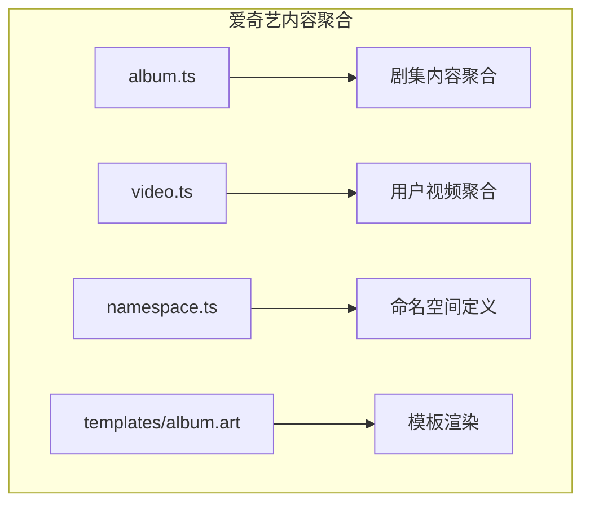
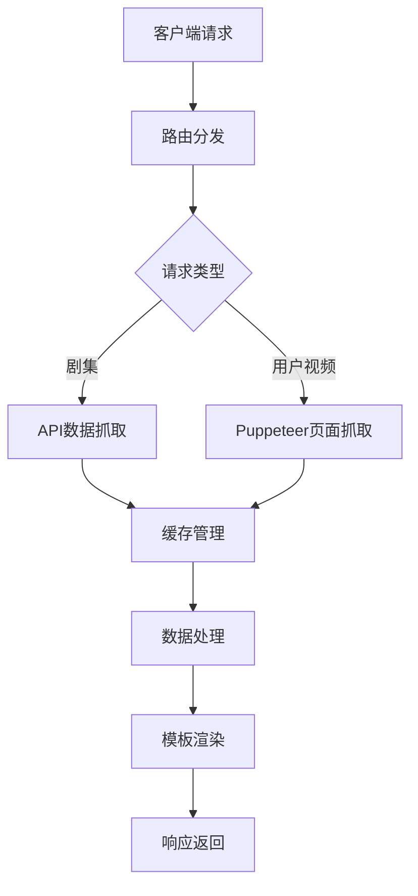
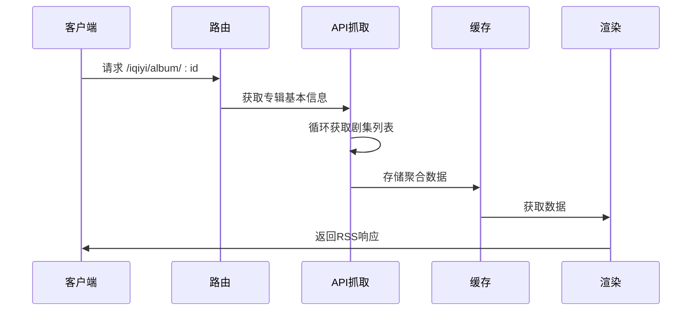
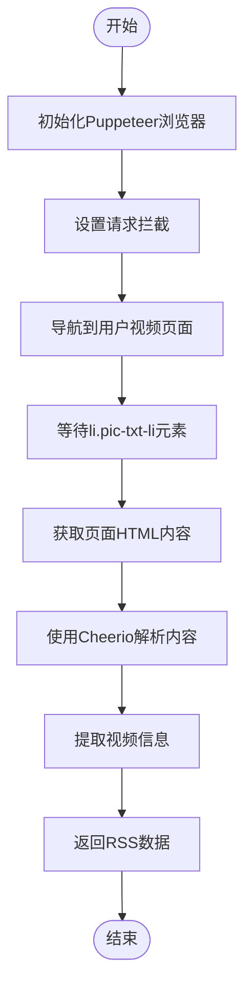
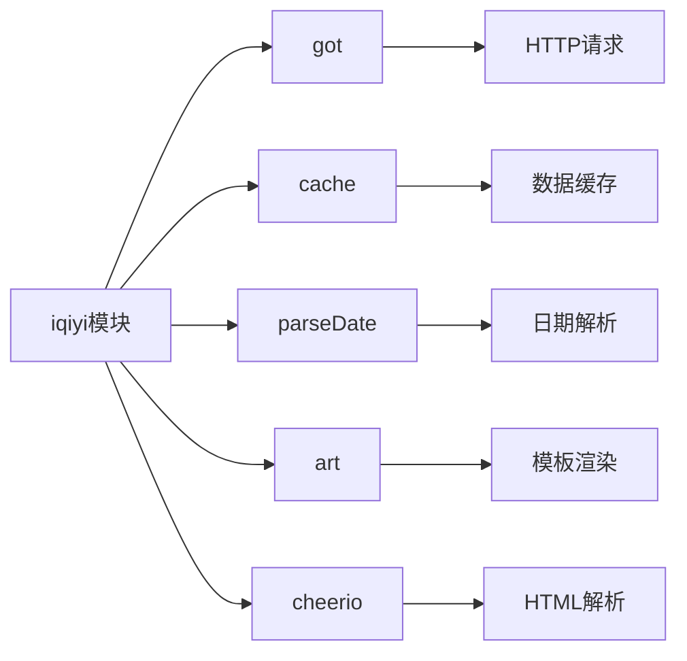

# 爱奇艺内容聚合

<cite>
**本文档引用文件**   
- [album.ts](file://lib/routes/iqiyi/album.ts)
- [video.ts](file://lib/routes/iqiyi/video.ts)
- [namespace.ts](file://lib/routes/iqiyi/namespace.ts)
- [album.art](file://lib/routes/iqiyi/templates/album.art)
- [parse-date.ts](file://lib/utils/parse-date.ts)
- [got.ts](file://lib/utils/got.ts)
- [cache.ts](file://lib/middleware/cache.ts)
</cite>

## 目录
1. [简介](#简介)
2. [项目结构](#项目结构)
3. [核心组件](#核心组件)
4. [架构概述](#架构概述)
5. [详细组件分析](#详细组件分析)
6. [依赖分析](#依赖分析)
7. [性能考虑](#性能考虑)
8. [故障排除指南](#故障排除指南)
9. [结论](#结论)

## 简介
本文档详细说明了爱奇艺内容聚合API的实现机制，涵盖电视剧、电影、综艺等内容的聚合技术。文档解释了视频元数据提取、播放列表处理、更新信息获取和推荐内容抓取的技术实现，为开发者提供全面的指导。

## 项目结构
爱奇艺内容聚合功能位于`lib/routes/iqiyi`目录下，包含剧集和用户视频的路由实现。项目采用模块化设计，分离了数据抓取、缓存管理和模板渲染等职责。

**图示来源**
- [album.ts](file://lib/routes/iqiyi/album.ts#L1-L88)
- [video.ts](file://lib/routes/iqiyi/video.ts#L1-L77)
- [namespace.ts](file://lib/routes/iqiyi/namespace.ts#L1-L8)
- [album.art](file://lib/routes/iqiyi/templates/album.art#L1-L2)

**本节来源**
- [album.ts](file://lib/routes/iqiyi/album.ts#L1-L88)
- [video.ts](file://lib/routes/iqiyi/video.ts#L1-L77)

## 核心组件
爱奇艺内容聚合的核心组件包括剧集聚合模块和用户视频聚合模块。剧集聚合模块通过API接口获取视频专辑信息和剧集列表，用户视频聚合模块使用Puppeteer抓取用户上传的视频内容。

**本节来源**
- [album.ts](file://lib/routes/iqiyi/album.ts#L1-L88)
- [video.ts](file://lib/routes/iqiyi/video.ts#L1-L77)

## 架构概述
爱奇艺内容聚合系统采用分层架构，包括路由层、数据抓取层、缓存层和渲染层。系统通过定义清晰的接口和职责分离，实现了高效的内容聚合。

**图示来源**
- [album.ts](file://lib/routes/iqiyi/album.ts#L1-L88)
- [video.ts](file://lib/routes/iqiyi/video.ts#L1-L77)
- [got.ts](file://lib/utils/got.ts#L1-L90)
- [cache.ts](file://lib/middleware/cache.ts#L1-L100)

## 详细组件分析

### 剧集聚合分析
剧集聚合功能通过调用爱奇艺的API接口获取专辑信息和剧集列表。系统首先获取专辑基本信息，然后分页获取所有剧集信息，最后整合数据生成RSS输出。

**图示来源**
- [album.ts](file://lib/routes/iqiyi/album.ts#L32-L87)
- [got.ts](file://lib/utils/got.ts#L1-L90)
- [cache.ts](file://lib/middleware/cache.ts#L1-L100)

**本节来源**
- [album.ts](file://lib/routes/iqiyi/album.ts#L1-L88)

### 用户视频聚合分析
用户视频聚合功能使用Puppeteer浏览器自动化工具抓取用户页面内容。由于爱奇艺用户页面存在加载延迟，系统需要等待特定元素出现后才能提取数据。

**图示来源**
- [video.ts](file://lib/routes/iqiyi/video.ts#L35-L76)
- [puppeteer](file://lib/utils/puppeteer.ts#L1-L50)
- [cheerio](file://lib/utils/cheerio.ts#L1-L30)

**本节来源**
- [video.ts](file://lib/routes/iqiyi/video.ts#L1-L77)

## 依赖分析
爱奇艺内容聚合功能依赖多个核心工具和库，包括HTTP客户端、缓存系统、日期解析和模板渲染等。

**图示来源**
- [album.ts](file://lib/routes/iqiyi/album.ts#L1-L88)
- [video.ts](file://lib/routes/iqiyi/video.ts#L1-L77)
- [got.ts](file://lib/utils/got.ts#L1-L90)
- [parse-date.ts](file://lib/utils/parse-date.ts#L1-L208)

**本节来源**
- [album.ts](file://lib/routes/iqiyi/album.ts#L1-L88)
- [video.ts](file://lib/routes/iqiyi/video.ts#L1-L77)
- [got.ts](file://lib/utils/got.ts#L1-L90)
- [parse-date.ts](file://lib/utils/parse-date.ts#L1-L208)

## 性能考虑
爱奇艺内容聚合系统通过缓存机制优化性能，减少对爱奇艺API的重复请求。剧集聚合使用分页加载避免一次性获取过多数据，用户视频聚合通过请求拦截减少不必要的资源加载。

**本节来源**
- [album.ts](file://lib/routes/iqiyi/album.ts#L49-L68)
- [video.ts](file://lib/routes/iqiyi/video.ts#L41-L72)
- [cache.ts](file://lib/middleware/cache.ts#L1-L100)

## 故障排除指南
常见问题包括地区限制导致的内容不可用、API接口变更导致的数据抓取失败和Puppeteer执行超时等。系统通过错误处理机制提供清晰的错误信息。

**本节来源**
- [album.ts](file://lib/routes/iqiyi/album.ts#L45-L47)
- [video.ts](file://lib/routes/iqiyi/video.ts#L49-L53)
- [errors.ts](file://lib/errors/types/invalid-parameter.ts#L1-L20)

## 结论
爱奇艺内容聚合API提供了高效的内容抓取和聚合功能，支持剧集和用户视频两种内容类型。系统通过合理的架构设计和性能优化，为开发者提供了稳定可靠的内容聚合服务。