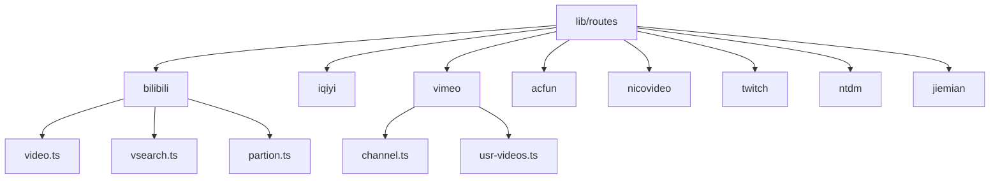
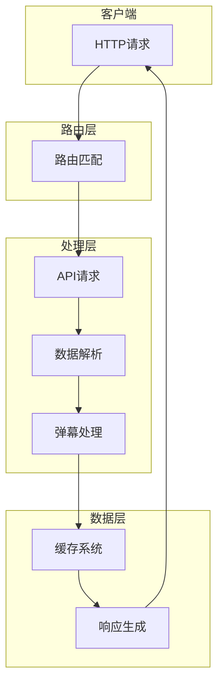
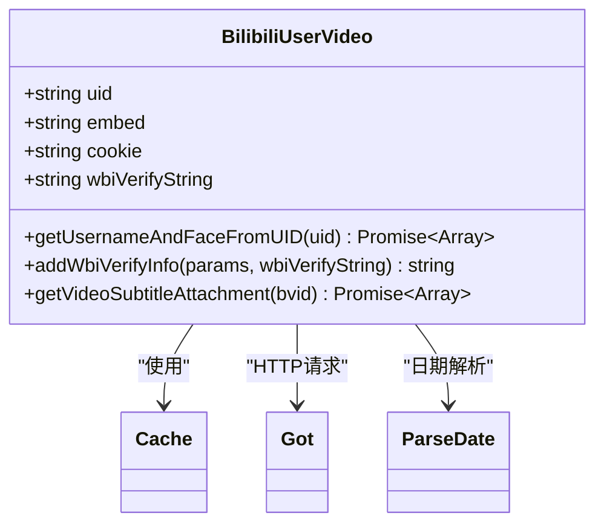
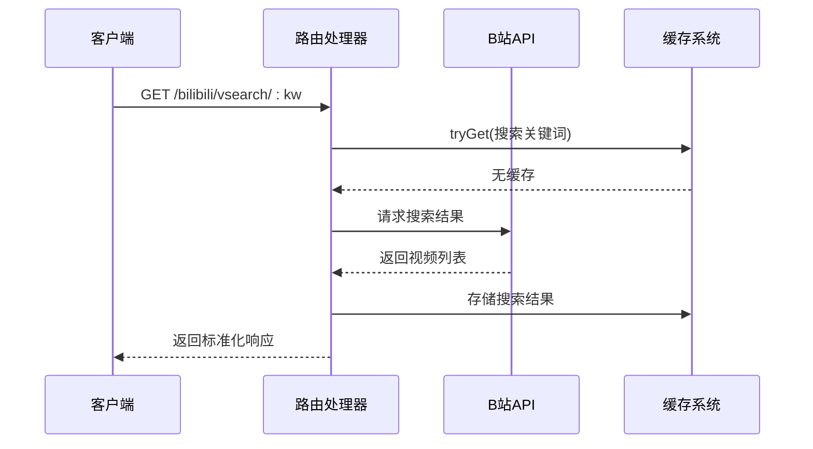
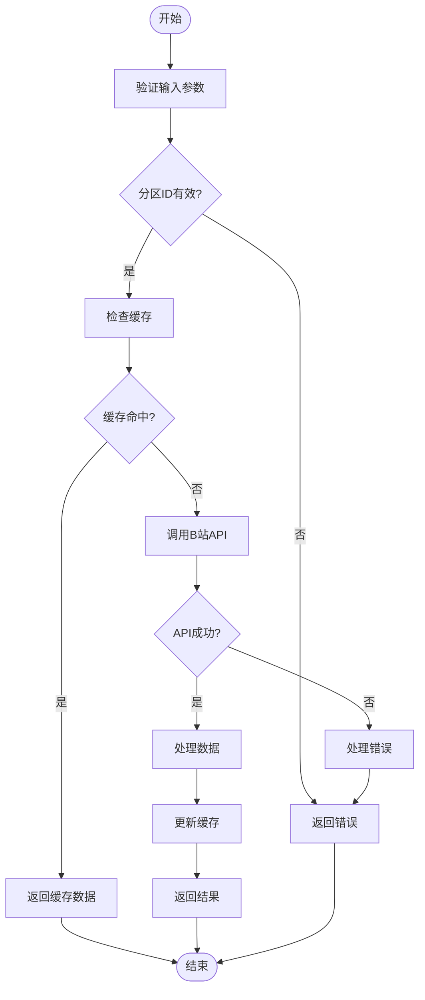
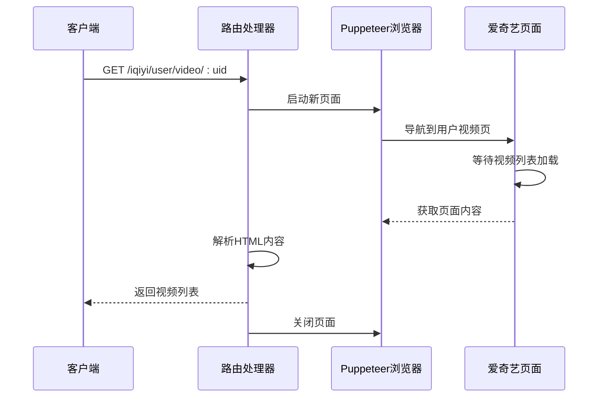
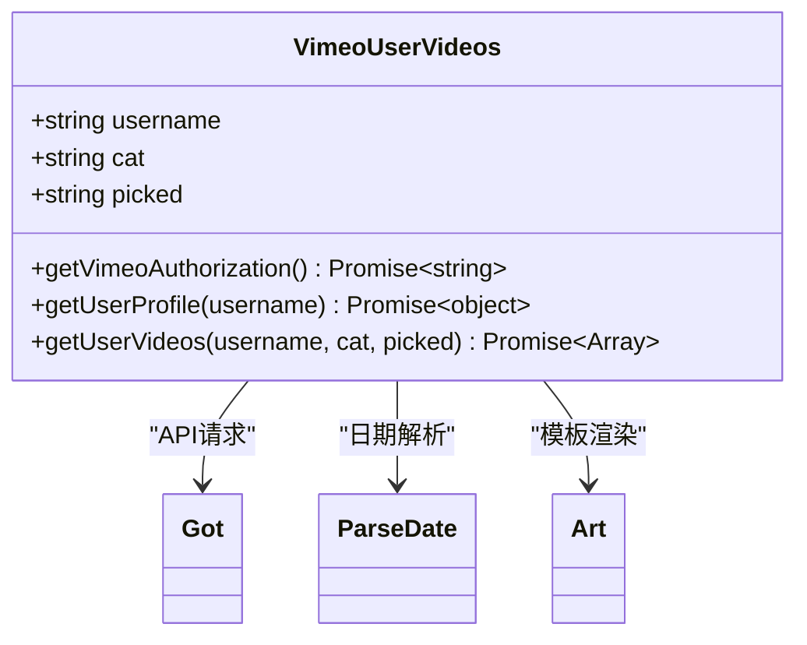
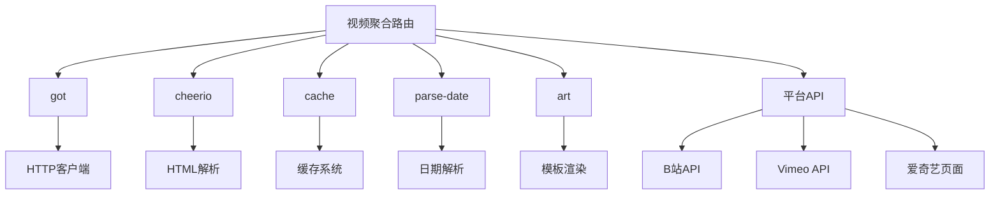

# 视频平台聚合

<cite>
**本文档引用文件**  
- [bilibili/video.ts](file://lib/routes/bilibili/video.ts)
- [bilibili/vsearch.ts](file://lib/routes/bilibili/vsearch.ts)
- [bilibili/partion.ts](file://lib/routes/bilibili/partion.ts)
- [bilibili/ranking.ts](file://lib/routes/bilibili/ranking.ts)
- [bilibili/bilibili-recommend.ts](file://lib/routes/bilibili/bilibili-recommend.ts)
- [iqiyi/video.ts](file://lib/routes/iqiyi/video.ts)
- [vimeo/channel.ts](file://lib/routes/vimeo/channel.ts)
- [vimeo/usr-videos.ts](file://lib/routes/vimeo/usr-videos.ts)
- [acfun/video.ts](file://lib/routes/acfun/video.ts)
- [nicovideo/video.ts](file://lib/routes/nicovideo/video.ts)
- [twitch/video.ts](file://lib/routes/twitch/video.ts)
- [ntdm/video.ts](file://lib/routes/ntdm/video.ts)
- [jiemian/video.ts](file://lib/routes/jiemian/video.ts)
</cite>

## 目录
1. [简介](#简介)
2. [项目结构](#项目结构)
3. [核心组件](#核心组件)
4. [架构概述](#架构概述)
5. [详细组件分析](#详细组件分析)
6. [依赖分析](#依赖分析)
7. [性能考虑](#性能考虑)
8. [故障排除指南](#故障排除指南)
9. [结论](#结论)

## 简介
本文档详细说明了如何通过RSSHub聚合多个视频平台（包括B站、YouTube、爱奇艺、Vimeo等）的内容。文档涵盖了视频信息抓取的技术实现，包括视频元数据提取、播放列表处理和弹幕数据获取。提供了具体的请求示例和响应格式，展示如何获取最新的视频更新和热门推荐。文档还包含视频分类、标签过滤和播放统计信息，帮助开发者有效利用视频内容聚合功能。

## 项目结构
RSSHub项目采用模块化设计，视频平台相关的路由文件位于`lib/routes`目录下。每个视频平台都有独立的子目录或文件，实现了特定平台的内容聚合功能。主要视频平台的路由文件包括B站、爱奇艺、Vimeo、AcFun、Niconico、Twitch等。

**图示来源**
- [bilibili/video.ts](file://lib/routes/bilibili/video.ts)
- [iqiyi/video.ts](file://lib/routes/iqiyi/video.ts)
- [vimeo/channel.ts](file://lib/routes/vimeo/channel.ts)
- [acfun/video.ts](file://lib/routes/acfun/video.ts)
- [nicovideo/video.ts](file://lib/routes/nicovideo/video.ts)
- [twitch/video.ts](file://lib/routes/twitch/video.ts)

**章节来源**
- [bilibili/video.ts](file://lib/routes/bilibili/video.ts)
- [iqiyi/video.ts](file://lib/routes/iqiyi/video.ts)
- [vimeo/channel.ts](file://lib/routes/vimeo/channel.ts)

## 核心组件
视频平台聚合的核心组件主要包括视频元数据提取、播放列表处理、弹幕数据获取和分类标签过滤等功能。这些功能通过各个平台特定的路由文件实现，使用统一的接口规范返回标准化的视频信息。

**章节来源**
- [bilibili/video.ts](file://lib/routes/bilibili/video.ts)
- [bilibili/vsearch.ts](file://lib/routes/bilibili/vsearch.ts)
- [bilibili/partion.ts](file://lib/routes/bilibili/partion.ts)

## 架构概述
视频平台聚合系统采用分层架构设计，包括路由层、处理层和数据层。路由层负责接收HTTP请求并匹配相应的处理函数；处理层负责与视频平台API交互，获取原始数据；数据层负责数据解析、转换和缓存。

**图示来源**
- [bilibili/video.ts](file://lib/routes/bilibili/video.ts)
- [iqiyi/video.ts](file://lib/routes/iqiyi/video.ts)
- [vimeo/usr-videos.ts](file://lib/routes/vimeo/usr-videos.ts)

## 详细组件分析

### B站视频聚合分析
B站视频聚合功能提供了多种访问方式，包括用户投稿、视频搜索、分区视频和热门推荐等。系统通过B站开放API获取视频数据，并进行标准化处理。

#### B站用户投稿

**图示来源**
- [bilibili/video.ts](file://lib/routes/bilibili/video.ts)
- [bilibili/utils.ts](file://lib/routes/bilibili/utils.ts)

#### B站视频搜索

**图示来源**
- [bilibili/vsearch.ts](file://lib/routes/bilibili/vsearch.ts)
- [bilibili/cache.ts](file://lib/routes/bilibili/cache.ts)

#### B站分区视频

**图示来源**
- [bilibili/partion.ts](file://lib/routes/bilibili/partion.ts)
- [bilibili/utils.ts](file://lib/routes/bilibili/utils.ts)

### 爱奇艺视频聚合分析
爱奇艺视频聚合通过Puppeteer技术实现，能够处理动态加载的内容。系统模拟浏览器行为，等待页面完全加载后提取视频信息。

**图示来源**
- [iqiyi/video.ts](file://lib/routes/iqiyi/video.ts)
- [puppeteer.ts](file://lib/utils/puppeteer.ts)

### Vimeo视频聚合分析
Vimeo视频聚合支持频道和用户视频的获取，通过Vimeo API获取结构化数据，并处理分类和推荐内容。

**图示来源**
- [vimeo/usr-videos.ts](file://lib/routes/vimeo/usr-videos.ts)
- [vimeo/utils.ts](file://lib/routes/vimeo/utils.ts)

**章节来源**
- [bilibili/video.ts](file://lib/routes/bilibili/video.ts)
- [iqiyi/video.ts](file://lib/routes/iqiyi/video.ts)
- [vimeo/usr-videos.ts](file://lib/routes/vimeo/usr-videos.ts)
- [acfun/video.ts](file://lib/routes/acfun/video.ts)
- [nicovideo/video.ts](file://lib/routes/nicovideo/video.ts)

## 依赖分析
视频平台聚合系统依赖多个核心模块和外部服务，确保功能的完整性和稳定性。

**图示来源**
- [bilibili/video.ts](file://lib/routes/bilibili/video.ts)
- [iqiyi/video.ts](file://lib/routes/iqiyi/video.ts)
- [vimeo/channel.ts](file://lib/routes/vimeo/channel.ts)

**章节来源**
- [bilibili/video.ts](file://lib/routes/bilibili/video.ts)
- [iqiyi/video.ts](file://lib/routes/iqiyi/video.ts)
- [vimeo/channel.ts](file://lib/routes/vimeo/channel.ts)
- [package.json](file://package.json)

## 性能考虑
视频平台聚合系统的性能主要受API请求频率、数据解析效率和缓存策略的影响。系统采用多种优化措施来提高性能：

1. **缓存机制**：所有视频数据都经过缓存处理，减少重复API调用
2. **并发请求**：支持并发处理多个视频项的详细信息获取
3. **数据精简**：只获取必要的视频元数据，减少传输量
4. **异步处理**：采用异步非阻塞模式，提高响应速度

系统还实现了智能缓存过期策略，平衡数据新鲜度和性能表现。

## 故障排除指南
在使用视频平台聚合功能时，可能会遇到以下常见问题及解决方案：

1. **API请求失败**：检查平台API是否正常，确认请求参数正确
2. **数据解析错误**：验证HTML结构是否发生变化，更新选择器
3. **缓存问题**：清除相关缓存，重新获取数据
4. **认证问题**：确保必要的Cookie或Token已正确配置
5. **性能瓶颈**：检查并发请求量，优化缓存策略

**章节来源**
- [bilibili/video.ts](file://lib/routes/bilibili/video.ts)
- [iqiyi/video.ts](file://lib/routes/iqiyi/video.ts)
- [vimeo/usr-videos.ts](file://lib/routes/vimeo/usr-videos.ts)

## 结论
RSSHub的视频平台聚合功能提供了强大而灵活的视频内容获取能力。通过标准化的接口设计和模块化的实现方式，系统能够高效地聚合多个视频平台的内容。开发者可以利用这些功能快速构建视频内容聚合应用，获取最新的视频更新和热门推荐。系统的可扩展性设计也使得添加新的视频平台支持变得简单高效。