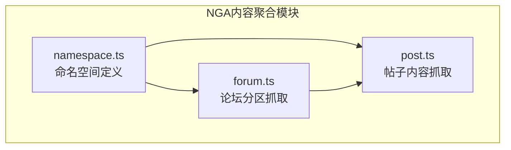
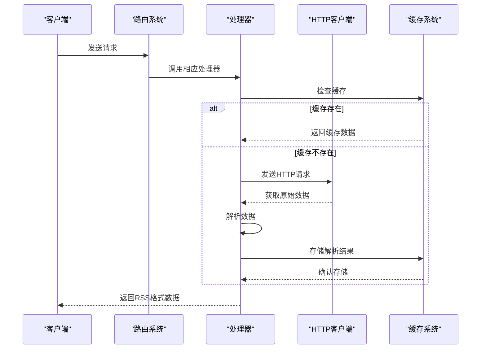
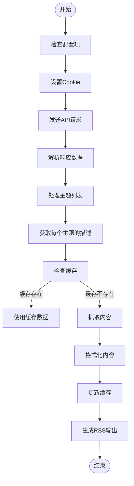
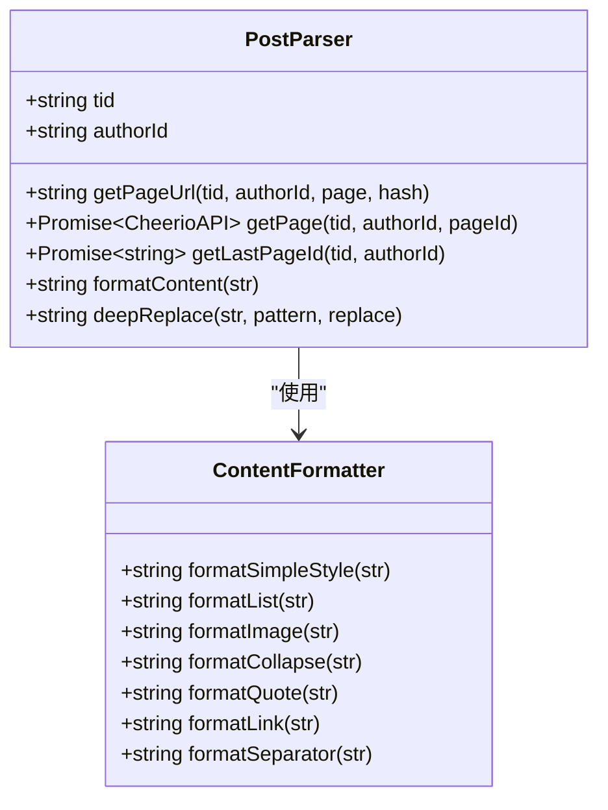
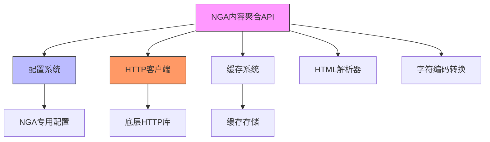

# NGA玩家社区内容聚合

<cite>
**本文档引用文件**  
- [post.ts](file://lib/routes/nga/post.ts)
- [forum.ts](file://lib/routes/nga/forum.ts)
- [namespace.ts](file://lib/routes/nga/namespace.ts)
- [config.ts](file://lib/config.ts)
</cite>

## 目录
1. [简介](#简介)
2. [项目结构](#项目结构)
3. [核心组件](#核心组件)
4. [架构概述](#架构概述)
5. [详细组件分析](#详细组件分析)
6. [依赖分析](#依赖分析)
7. [性能考虑](#性能考虑)
8. [故障排除指南](#故障排除指南)
9. [结论](#结论)

## 简介
NGA玩家社区内容聚合API是RSSHub项目的一部分，旨在为用户提供从NGA（bbs.nga.cn）这一国内专业游戏玩家社区抓取游戏讨论、攻略分享和玩家交流内容的能力。该API能够解析NGA的版块结构、主题帖子和用户回复，支持分页处理、用户等级和声望信息提取，以及游戏相关标签处理。通过本API，开发者可以轻松获取热门游戏话题和最新攻略信息，实现内容的自动化聚合与分发。

## 项目结构
NGA内容聚合功能位于`lib/routes/nga/`目录下，包含三个主要文件：`forum.ts`、`post.ts`和`namespace.ts`。这些文件共同实现了对NGA社区内容的抓取和聚合功能。`forum.ts`负责处理论坛分区内容的抓取，`post.ts`负责处理具体帖子及其回复的抓取，而`namespace.ts`则定义了NGA的命名空间信息。

**图源**  
- [namespace.ts](file://lib/routes/nga/namespace.ts)
- [forum.ts](file://lib/routes/nga/forum.ts)
- [post.ts](file://lib/routes/nga/post.ts)

## 核心组件
NGA内容聚合API的核心组件包括论坛分区抓取器、帖子内容抓取器和命名空间定义。这些组件协同工作，实现了对NGA社区内容的全面抓取和结构化输出。API通过模拟HTTP请求与NGA服务器交互，解析HTML和API响应，提取所需内容并以RSS格式输出。

**组件源**  
- [forum.ts](file://lib/routes/nga/forum.ts)
- [post.ts](file://lib/routes/nga/post.ts)
- [namespace.ts](file://lib/routes/nga/namespace.ts)

## 架构概述
NGA内容聚合API采用模块化架构，各组件职责分明。API通过路由系统接收请求，根据请求参数调用相应的处理器。处理器利用HTTP客户端发送请求，获取原始数据后通过解析器提取有效信息，最终生成标准化的RSS输出。整个过程充分利用了缓存机制以提高性能和降低服务器负载。

**图源**  
- [forum.ts](file://lib/routes/nga/forum.ts)
- [post.ts](file://lib/routes/nga/post.ts)
- [config.ts](file://lib/config.ts)

## 详细组件分析
### 论坛分区抓取分析
论坛分区抓取器负责获取NGA特定分区的主题列表，支持精华帖筛选功能。它通过POST请求访问NGA的API接口，获取分区内的主题数据，并为每个主题生成详细的RSS条目。

#### API调用流程

**图源**  
- [forum.ts](file://lib/routes/nga/forum.ts#L29-L93)

**组件源**  
- [forum.ts](file://lib/routes/nga/forum.ts)

### 帖子内容抓取分析
帖子内容抓取器负责获取NGA特定帖子的完整内容，包括所有回复。它需要处理分页逻辑，自动识别帖子的总页数，并抓取最后一页的内容以确保获取最新的回复。

#### 内容解析流程

**图源**  
- [post.ts](file://lib/routes/nga/post.ts#L28-L143)

**组件源**  
- [post.ts](file://lib/routes/nga/post.ts)

## 依赖分析
NGA内容聚合API依赖于多个核心模块和配置项。这些依赖关系确保了API的正常运行和功能完整性。

**图源**  
- [config.ts](file://lib/config.ts#L516-L520)
- [post.ts](file://lib/routes/nga/post.ts)
- [forum.ts](file://lib/routes/nga/forum.ts)

**依赖源**  
- [config.ts](file://lib/config.ts)
- [post.ts](file://lib/routes/nga/post.ts)
- [forum.ts](file://lib/routes/nga/forum.ts)

## 性能考虑
NGA内容聚合API在设计时充分考虑了性能优化。通过使用缓存机制，API能够显著减少对NGA服务器的请求频率，提高响应速度。同时，API采用了懒加载路由处理机制，只有在首次请求时才会加载相应的处理模块，减少了内存占用。对于大型帖子的抓取，API通过智能分页处理，只获取最后一页的内容，避免了不必要的数据传输。

## 故障排除指南
当NGA内容聚合API出现问题时，可以按照以下步骤进行排查：

1. **检查配置项**：确保`NGA_PASSPORT_UID`和`NGA_PASSPORT_CID`环境变量已正确设置，这些配置项用于生成有效的Cookie，提高抓取成功率。
2. **验证网络连接**：确认服务器能够正常访问NGA网站（https://nga.178.com）。
3. **检查API响应**：查看API返回的错误信息，根据错误类型进行相应处理。
4. **清除缓存**：如果出现内容更新不及时的问题，尝试清除相关缓存。
5. **查看日志**：检查系统日志，寻找可能的错误信息或警告。

**故障排除源**  
- [config.ts](file://lib/config.ts#L994-L998)
- [post.ts](file://lib/routes/nga/post.ts)
- [forum.ts](file://lib/routes/nga/forum.ts)

## 结论
NGA玩家社区内容聚合API为开发者提供了一种高效、可靠的方式，用于抓取和聚合NGA社区的游戏相关内容。通过深入分析API的实现机制，我们可以看到其在内容解析、分页处理、用户信息提取和反爬虫应对等方面的精心设计。该API不仅能够满足基本的内容抓取需求，还通过缓存机制和性能优化，确保了服务的稳定性和高效性。对于希望集成NGA社区内容的应用开发者来说，这是一个强大而灵活的工具。