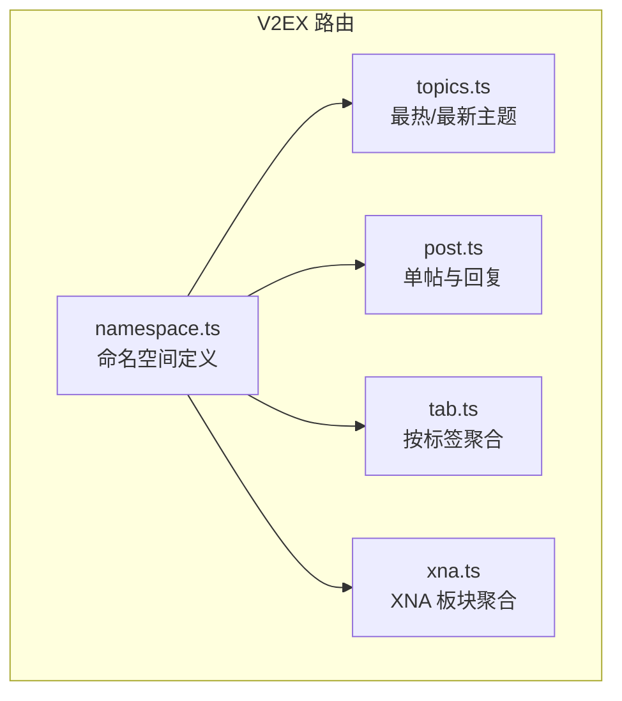
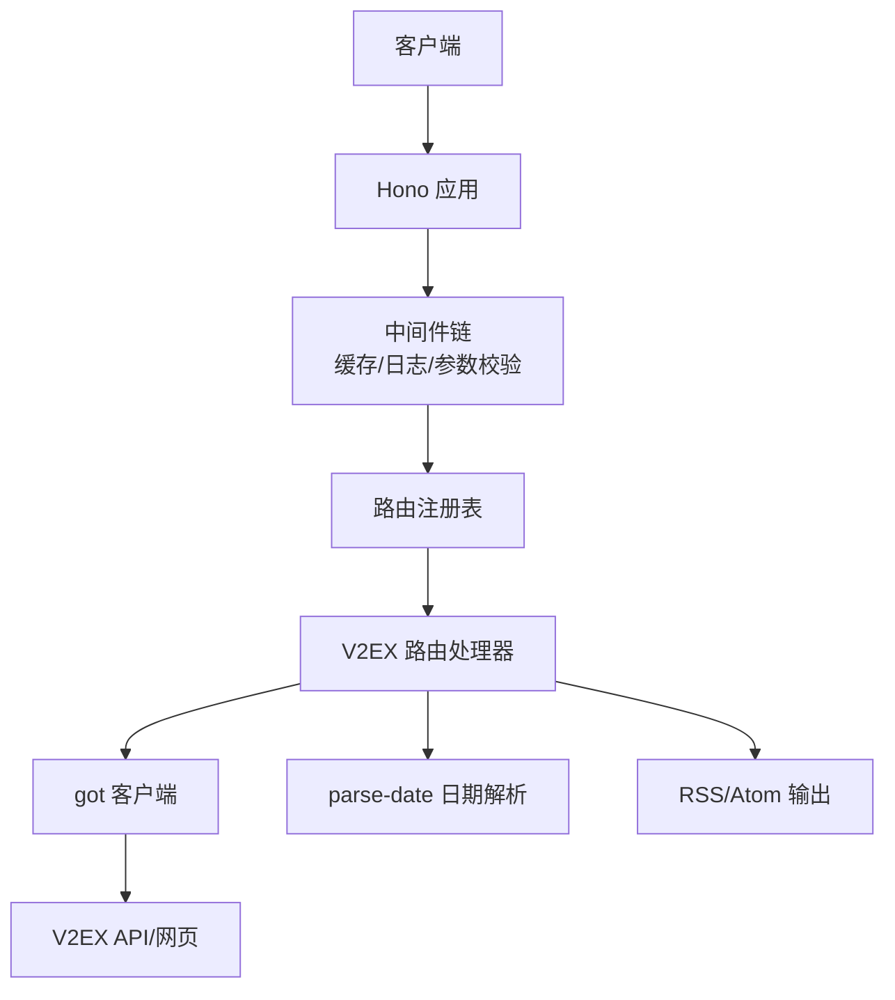
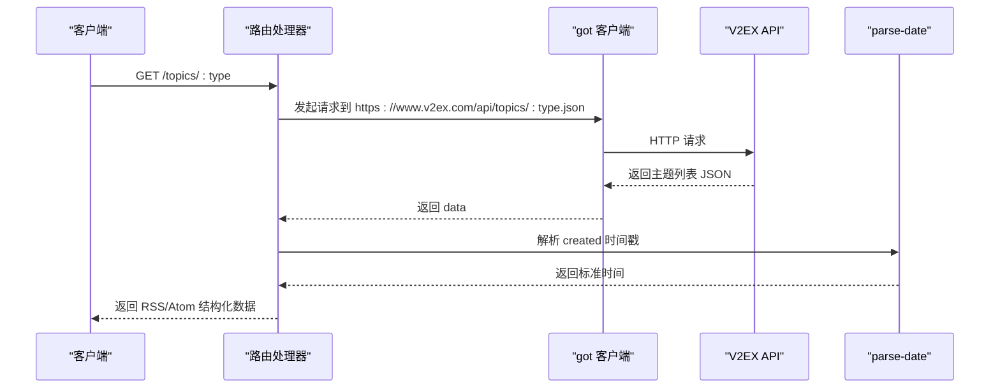
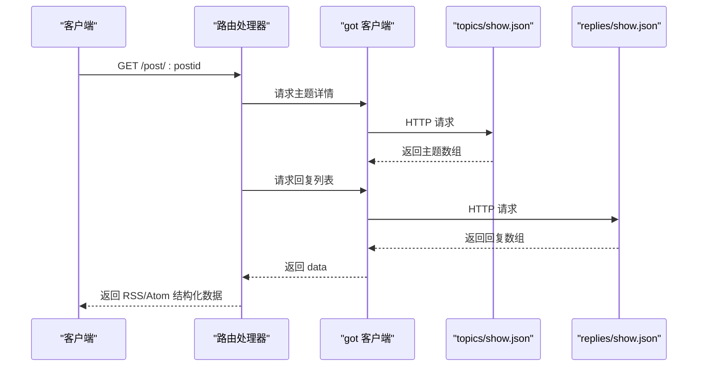
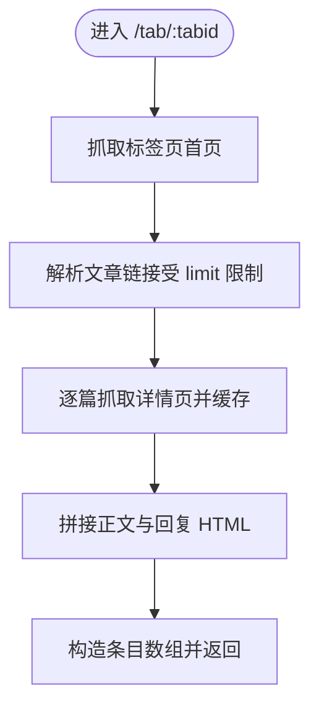
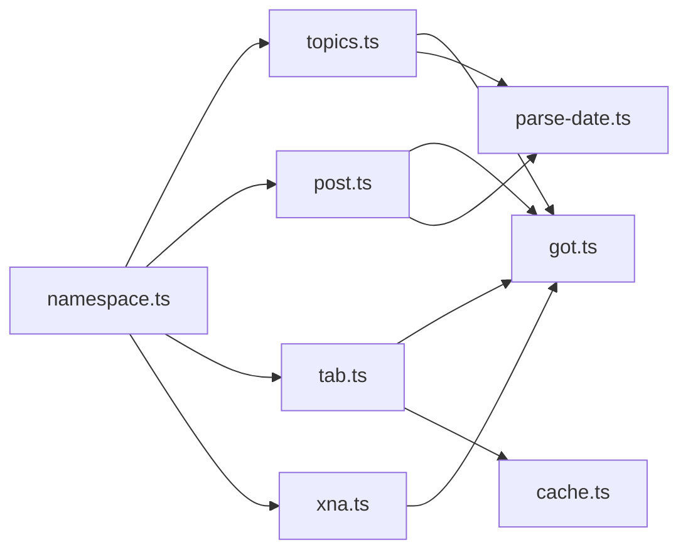

# V2EX内容聚合

<cite>
**本文引用的文件列表**
- [lib/routes/v2ex/namespace.ts](file://lib/routes/v2ex/namespace.ts)
- [lib/routes/v2ex/topics.ts](file://lib/routes/v2ex/topics.ts)
- [lib/routes/v2ex/post.ts](file://lib/routes/v2ex/post.ts)
- [lib/routes/v2ex/tab.ts](file://lib/routes/v2ex/tab.ts)
- [lib/routes/v2ex/xna.ts](file://lib/routes/v2ex/xna.ts)
- [lib/utils/got.ts](file://lib/utils/got.ts)
- [lib/utils/parse-date.ts](file://lib/utils/parse-date.ts)
- [lib/middleware/cache.ts](file://lib/middleware/cache.ts)
- [lib/pkg.ts](file://lib/pkg.ts)
- [lib/routes/CLAUDE.md](file://lib/routes/CLAUDE.md)
- [lib/CLAUDE.md](file://lib/CLAUDE.md)
</cite>

## 目录
1. [简介](#简介)
2. [项目结构](#项目结构)
3. [核心组件](#核心组件)
4. [架构总览](#架构总览)
5. [详细组件分析](#详细组件分析)
6. [依赖关系分析](#依赖关系分析)
7. [性能考量](#性能考量)
8. [故障排查指南](#故障排查指南)
9. [结论](#结论)
10. [附录](#附录)

## 简介
本文件面向开发者，系统性梳理 RSSHub 中 V2EX 内容聚合能力，覆盖以下要点：
- 从 V2EX 抓取技术讨论、热门话题与最新动态的 API 设计与实现
- 解析 V2EX 节点结构、主题帖子与用户回复的数据流与结构化输出
- 分页与限制策略、用户信息提取、内容渲染与排序
- 反爬虫应对与缓存优化策略
- 实际调用示例与最佳实践

## 项目结构
V2EX 聚合路由位于 lib/routes/v2ex 目录下，采用“命名空间 + 路由文件”的组织方式，每个路由文件导出路由定义与处理器，统一由 RSSHub 路由系统注册与调度。

图表来源
- [lib/routes/v2ex/namespace.ts](file://lib/routes/v2ex/namespace.ts#L1-L7)
- [lib/routes/v2ex/topics.ts](file://lib/routes/v2ex/topics.ts#L1-L67)
- [lib/routes/v2ex/post.ts](file://lib/routes/v2ex/post.ts#L1-L59)
- [lib/routes/v2ex/tab.ts](file://lib/routes/v2ex/tab.ts#L1-L79)
- [lib/routes/v2ex/xna.ts](file://lib/routes/v2ex/xna.ts#L1-L57)

章节来源
- [lib/routes/CLAUDE.md](file://lib/routes/CLAUDE.md#L1-L51)
- [lib/CLAUDE.md](file://lib/CLAUDE.md#L1-L90)

## 核心组件
- 命名空间：定义 V2EX 的站点名称、URL 与语言，作为路由元信息。
- 路由处理器：
  - topics：基于官方 API 获取最热/最新主题列表，结构化输出标题、作者、发布时间、链接、评论数与节点分类。
  - post：通过主题 API 获取主题正文，再通过回复 API 获取回复列表，拼装为条目数组。
  - tab：抓取标签页首页，解析标题、作者、正文与回复内容，支持 limit 控制数量。
  - xna：抓取 XNA 板块文章列表，支持 limit 控制数量。
- 工具与中间件：
  - got：统一 HTTP 客户端封装，兼容搜索参数、JSON 解析与响应类型。
  - parse-date：日期解析工具，支持相对时间与标准时间格式。
  - cache 中间件：请求级缓存与并发控制，避免重复抓取与雪崩。

章节来源
- [lib/routes/v2ex/namespace.ts](file://lib/routes/v2ex/namespace.ts#L1-L7)
- [lib/routes/v2ex/topics.ts](file://lib/routes/v2ex/topics.ts#L1-L67)
- [lib/routes/v2ex/post.ts](file://lib/routes/v2ex/post.ts#L1-L59)
- [lib/routes/v2ex/tab.ts](file://lib/routes/v2ex/tab.ts#L1-L79)
- [lib/routes/v2ex/xna.ts](file://lib/routes/v2ex/xna.ts#L1-L57)
- [lib/utils/got.ts](file://lib/utils/got.ts#L1-L90)
- [lib/utils/parse-date.ts](file://lib/utils/parse-date.ts#L1-L208)
- [lib/middleware/cache.ts](file://lib/middleware/cache.ts#L1-L84)

## 架构总览
RSSHub 采用 Hono 应用与中间件链路，路由处理器通过统一 HTTP 客户端访问 V2EX API 或网页，再将数据结构化为 RSS/Atom 输出。缓存中间件对请求进行去重与命中加速。

图表来源
- [lib/CLAUDE.md](file://lib/CLAUDE.md#L1-L90)
- [lib/middleware/cache.ts](file://lib/middleware/cache.ts#L1-L84)
- [lib/utils/got.ts](file://lib/utils/got.ts#L1-L90)
- [lib/utils/parse-date.ts](file://lib/utils/parse-date.ts#L1-L208)

## 详细组件分析

### 组件 A：最热/最新主题（topics）
- 路由路径与参数：/topics/:type，支持 hot 与 latest 两种类型。
- 数据来源：调用 V2EX 官方 API 获取主题列表。
- 结构化输出：
  - 标题、描述、链接、条目数组
  - 条目字段：标题、HTML 正文、纯文本正文、发布时间、链接、作者、评论数、节点分类
- 排序策略：由上游 API 返回顺序决定；前端可通过 RSS 客户端自行排序。
- 用户过滤：未内置用户过滤选项，可在上游 API 层面结合业务需求扩展。

图表来源
- [lib/routes/v2ex/topics.ts](file://lib/routes/v2ex/topics.ts#L1-L67)
- [lib/utils/got.ts](file://lib/utils/got.ts#L1-L90)
- [lib/utils/parse-date.ts](file://lib/utils/parse-date.ts#L1-L208)

章节来源
- [lib/routes/v2ex/topics.ts](file://lib/routes/v2ex/topics.ts#L1-L67)

### 组件 B：帖子与回复（post）
- 路由路径与参数：/post/:postid，传入帖子 ID。
- 数据来源：
  - 主题正文：topics/show.json?id=...
  - 回复列表：replies/show.json?topic_id=...
- 结构化输出：
  - 标题、链接、描述（主题正文）
  - 条目数组：每条回复作为一条条目，包含回复编号、HTML 正文、作者、发布时间、楼层锚点链接
- 分页与限制：未内置分页，但可通过 RSS 客户端订阅条目上限控制；也可在上游扩展分页参数。
- 用户过滤：未内置用户过滤选项，可在上游扩展。

图表来源
- [lib/routes/v2ex/post.ts](file://lib/routes/v2ex/post.ts#L1-L59)
- [lib/utils/got.ts](file://lib/utils/got.ts#L1-L90)

章节来源
- [lib/routes/v2ex/post.ts](file://lib/routes/v2ex/post.ts#L1-L59)

### 组件 C：标签页聚合（tab）
- 路由路径与参数：/tab/:tabid，传入标签 ID。
- 数据来源：抓取标签页首页，解析标题、作者、正文与回复内容。
- 结构化输出：
  - 标题、链接、描述
  - 条目数组：每篇文章作为一条条目，包含标题、链接、HTML 描述（含回复拼接）
- 分页与限制：通过 limit 查询参数限制抓取数量，默认 10。
- 并发与缓存：内部使用缓存工具对单篇文章详情页进行缓存，避免重复抓取。

图表来源
- [lib/routes/v2ex/tab.ts](file://lib/routes/v2ex/tab.ts#L1-L79)

章节来源
- [lib/routes/v2ex/tab.ts](file://lib/routes/v2ex/tab.ts#L1-L79)

### 组件 D：XNA 板块（xna）
- 路由路径与参数：/xna，无参数。
- 数据来源：抓取 XNA 板块首页，解析文章列表。
- 结构化输出：
  - 标题、链接、描述
  - 条目数组：标题、链接、作者
- 分页与限制：通过 limit 查询参数限制抓取数量，默认 50。

章节来源
- [lib/routes/v2ex/xna.ts](file://lib/routes/v2ex/xna.ts#L1-L57)

## 依赖关系分析
- 路由与命名空间：各路由文件通过 namespace.ts 导出命名空间元信息，统一挂载到 RSSHub 路由系统。
- 工具依赖：
  - got.ts 提供统一 HTTP 客户端，支持搜索参数拼接、JSON 自动解析与响应类型处理。
  - parse-date.ts 提供日期解析，支持相对时间与标准时间格式。
- 中间件依赖：
  - cache.ts 提供请求级缓存与并发控制，避免重复抓取与请求风暴。

图表来源
- [lib/routes/v2ex/topics.ts](file://lib/routes/v2ex/topics.ts#L1-L67)
- [lib/routes/v2ex/post.ts](file://lib/routes/v2ex/post.ts#L1-L59)
- [lib/routes/v2ex/tab.ts](file://lib/routes/v2ex/tab.ts#L1-L79)
- [lib/routes/v2ex/xna.ts](file://lib/routes/v2ex/xna.ts#L1-L57)
- [lib/utils/got.ts](file://lib/utils/got.ts#L1-L90)
- [lib/utils/parse-date.ts](file://lib/utils/parse-date.ts#L1-L208)
- [lib/middleware/cache.ts](file://lib/middleware/cache.ts#L1-L84)
- [lib/routes/v2ex/namespace.ts](file://lib/routes/v2ex/namespace.ts#L1-L7)

章节来源
- [lib/pkg.ts](file://lib/pkg.ts#L1-L52)
- [lib/routes/CLAUDE.md](file://lib/routes/CLAUDE.md#L1-L51)

## 性能考量
- 缓存策略
  - 请求级缓存：同一路径 + format + limit 的组合作为缓存键，命中后直接返回，降低上游压力。
  - 并发控制：通过“正在请求”控制键避免同一路径并发抓取，减少重复工作与抖动。
  - 过期与回写：成功响应后写入缓存，设置过期时间；请求过程中会阻塞或等待。
- 限流与节流
  - 通过 limit 参数限制抓取数量，避免一次性抓取过多导致超时或限流。
  - 对于标签页详情抓取，内部使用缓存工具进行单页缓存，减少重复请求。
- 反爬虫建议
  - 当前路由未启用 Puppeteer，也未内置 UA/代理等反爬机制；如需增强，可在 got 客户端中增加请求头与延迟策略，并结合缓存中间件使用。

章节来源
- [lib/middleware/cache.ts](file://lib/middleware/cache.ts#L1-L84)

## 故障排查指南
- 常见问题
  - 429/5xx：上游 API 限流或临时不可用，检查网络与上游状态；适当增大 limit 或延时。
  - 404：路由参数错误（如 postid、tabid），确认参数是否正确。
  - 缓存命中异常：确认缓存键组合（路径 + format + limit）是否一致；检查缓存过期与并发控制键。
- 调试建议
  - 使用 RSS 客户端观察条目数量与时间线，定位 limit 设置是否合理。
  - 在本地调试时，可临时关闭缓存中间件验证抓取逻辑。
- 错误处理
  - 路由处理器未显式抛错时，通常由中间件或应用层统一处理；如需自定义错误，可在路由内捕获并返回结构化错误。

章节来源
- [lib/middleware/cache.ts](file://lib/middleware/cache.ts#L1-L84)

## 结论
V2EX 内容聚合在 RSSHub 中以简洁清晰的方式实现了三大场景：主题列表、单帖回复聚合与标签页聚合。通过统一的 HTTP 客户端与日期解析工具，以及请求级缓存与并发控制中间件，整体具备良好的稳定性与可维护性。对于更复杂的用户过滤、分页与反爬需求，可在现有路由基础上扩展参数与策略。

## 附录

### API 调用示例（路径与参数）
- 获取最热主题
  - 路径：/v2ex/topics/hot
  - 示例：/v2ex/topics/hot
- 获取最新主题
  - 路径：/v2ex/topics/latest
  - 示例：/v2ex/topics/latest
- 获取指定帖子及其回复
  - 路径：/v2ex/post/:postid
  - 示例：/v2ex/post/584403
  - 参数：postid（帖子 ID）
- 按标签聚合
  - 路径：/v2ex/tab/:tabid
  - 示例：/v2ex/tab/hot
  - 参数：tabid（标签 ID）
  - 查询参数：limit（默认 10）
- XNA 板块
  - 路径：/v2ex/xna
  - 查询参数：limit（默认 50）

章节来源
- [lib/routes/v2ex/topics.ts](file://lib/routes/v2ex/topics.ts#L1-L67)
- [lib/routes/v2ex/post.ts](file://lib/routes/v2ex/post.ts#L1-L59)
- [lib/routes/v2ex/tab.ts](file://lib/routes/v2ex/tab.ts#L1-L79)
- [lib/routes/v2ex/xna.ts](file://lib/routes/v2ex/xna.ts#L1-L57)

### 数据结构与字段说明
- 主题列表（topics）
  - 字段：标题、HTML 正文、纯文本正文、发布时间、链接、作者、评论数、节点分类
- 帖子回复（post）
  - 字段：标题（带楼层）、HTML 正文、作者、发布时间、楼层锚点链接
- 标签页聚合（tab）
  - 字段：标题、链接、HTML 描述（含正文与回复拼接）、作者
- XNA 板块（xna）
  - 字段：标题、链接、作者

章节来源
- [lib/routes/v2ex/topics.ts](file://lib/routes/v2ex/topics.ts#L52-L66)
- [lib/routes/v2ex/post.ts](file://lib/routes/v2ex/post.ts#L46-L58)
- [lib/routes/v2ex/tab.ts](file://lib/routes/v2ex/tab.ts#L63-L68)
- [lib/routes/v2ex/xna.ts](file://lib/routes/v2ex/xna.ts#L36-L50)