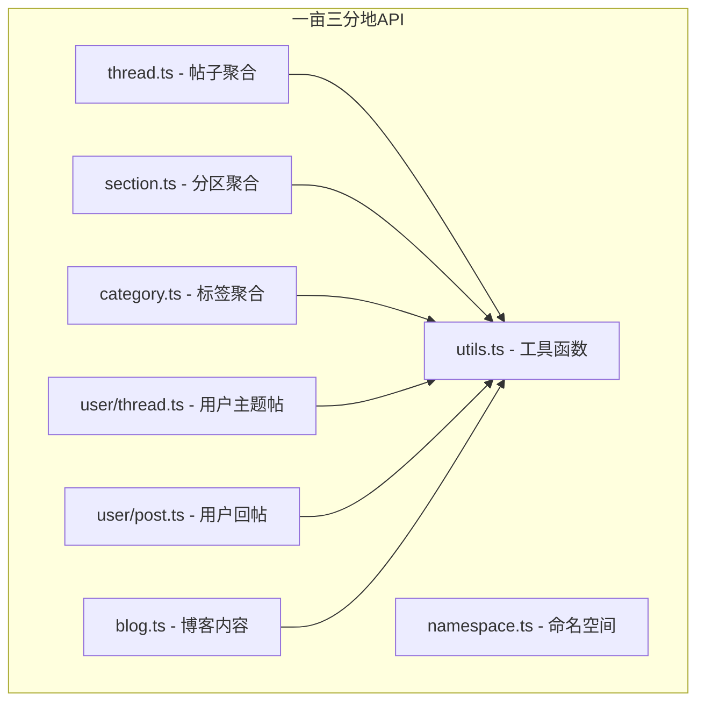
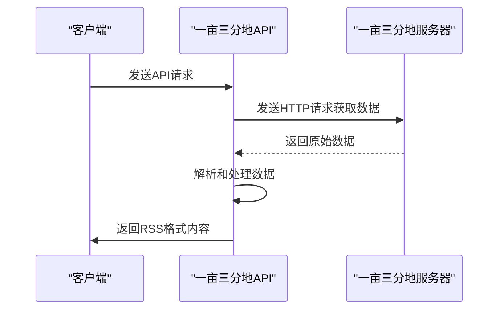
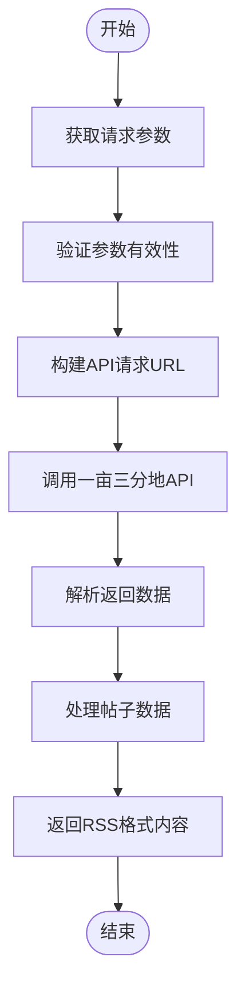
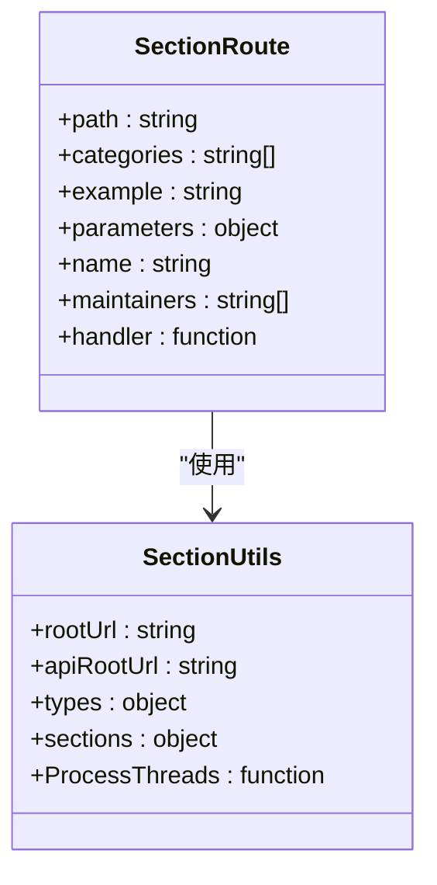
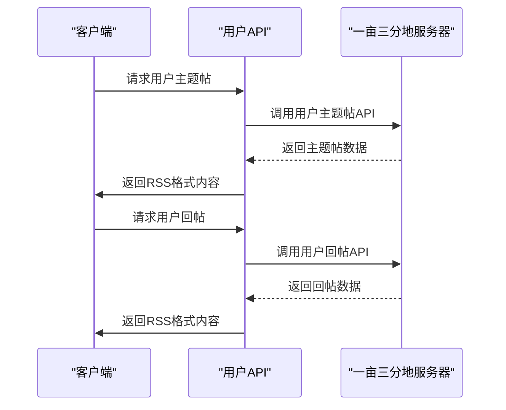
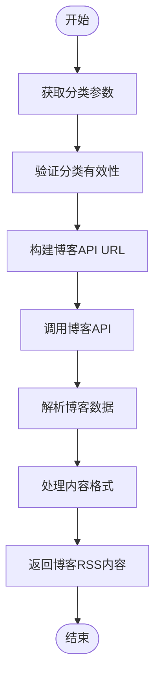
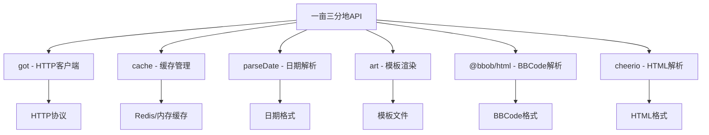

# 一亩三分地内容聚合

<cite>
**本文档引用的文件**   
- [thread.ts](file://lib/routes/1point3acres/thread.ts)
- [user/thread.ts](file://lib/routes/1point3acres/user/thread.ts)
- [section.ts](file://lib/routes/1point3acres/section.ts)
- [user/post.ts](file://lib/routes/1point3acres/user/post.ts)
- [category.ts](file://lib/routes/1point3acres/category.ts)
- [blog.ts](file://lib/routes/1point3acres/blog.ts)
- [utils.ts](file://lib/routes/1point3acres/utils.ts)
- [namespace.ts](file://lib/routes/1point3acres/namespace.ts)
</cite>

## 目录
1. [简介](#简介)
2. [项目结构](#项目结构)
3. [核心组件](#核心组件)
4. [架构概述](#架构概述)
5. [详细组件分析](#详细组件分析)
6. [依赖分析](#依赖分析)
7. [性能考虑](#性能考虑)
8. [故障排除指南](#故障排除指南)
9. [结论](#结论)

## 简介
本文档详细介绍了如何从一亩三分地社区抓取留学申请、海外工作和移民相关讨论内容。文档深入解释了API如何解析一亩三分地的版块分类、主题帖子和用户回复，包括分页处理、用户背景信息提取和敏感内容过滤。通过具体的API调用示例，展示如何获取热门留学话题和最新工作机会信息。文档涵盖了内容分类策略、地域筛选选项和反爬虫应对措施，帮助开发者理解一亩三分地内容聚合的特殊需求。

## 项目结构
一亩三分地内容聚合API位于RSSHub项目的`lib/routes/1point3acres`目录下，包含多个路由文件，分别处理不同类型的请求。这些文件通过统一的工具模块`utils.ts`实现共享功能，如API调用、数据处理和缓存管理。

**图源**
- [thread.ts](file://lib/routes/1point3acres/thread.ts)
- [section.ts](file://lib/routes/1point3acres/section.ts)
- [category.ts](file://lib/routes/1point3acres/category.ts)
- [user/thread.ts](file://lib/routes/1point3acres/user/thread.ts)
- [user/post.ts](file://lib/routes/1point3acres/user/post.ts)
- [blog.ts](file://lib/routes/1point3acres/blog.ts)
- [utils.ts](file://lib/routes/1point3acres/utils.ts)
- [namespace.ts](file://lib/routes/1point3acres/namespace.ts)

**本节来源**
- [thread.ts](file://lib/routes/1point3acres/thread.ts)
- [section.ts](file://lib/routes/1point3acres/section.ts)
- [category.ts](file://lib/routes/1point3acres/category.ts)
- [user/thread.ts](file://lib/routes/1point3acres/user/thread.ts)
- [user/post.ts](file://lib/routes/1point3acres/user/post.ts)
- [blog.ts](file://lib/routes/1point3acres/blog.ts)
- [utils.ts](file://lib/routes/1point3acres/utils.ts)
- [namespace.ts](file://lib/routes/1point3acres/namespace.ts)

## 核心组件
一亩三分地内容聚合API的核心组件包括帖子聚合、分区聚合、标签聚合、用户主题帖、用户回帖和博客内容聚合。这些组件通过统一的API接口和数据处理逻辑，实现了对一亩三分地社区内容的全面抓取和聚合。

**本节来源**
- [thread.ts](file://lib/routes/1point3acres/thread.ts)
- [section.ts](file://lib/routes/1point3acres/section.ts)
- [category.ts](file://lib/routes/1point3acres/category.ts)
- [user/thread.ts](file://lib/routes/1point3acres/user/thread.ts)
- [user/post.ts](file://lib/routes/1point3acres/user/post.ts)
- [blog.ts](file://lib/routes/1point3acres/blog.ts)

## 架构概述
一亩三分地内容聚合API采用模块化架构，通过多个路由文件分别处理不同类型的请求。所有路由文件共享一个工具模块`utils.ts`，该模块提供了API调用、数据处理和缓存管理等通用功能。API通过HTTP请求获取一亩三分地社区的内容，然后解析和处理数据，最后返回标准化的RSS格式内容。

**图源**
- [thread.ts](file://lib/routes/1point3acres/thread.ts)
- [utils.ts](file://lib/routes/1point3acres/utils.ts)

**本节来源**
- [thread.ts](file://lib/routes/1point3acres/thread.ts)
- [utils.ts](file://lib/routes/1point3acres/utils.ts)

## 详细组件分析
### 帖子聚合分析
帖子聚合组件负责获取一亩三分地社区的热门和最新帖子。通过`thread.ts`文件中的路由配置，API可以获取不同分类和排序方式的帖子列表。

**图源**
- [thread.ts](file://lib/routes/1point3acres/thread.ts)
- [utils.ts](file://lib/routes/1point3acres/utils.ts)

**本节来源**
- [thread.ts](file://lib/routes/1point3acres/thread.ts)
- [utils.ts](file://lib/routes/1point3acres/utils.ts)

### 分区聚合分析
分区聚合组件负责获取一亩三分地社区特定分区的内容。通过`section.ts`文件中的路由配置，API可以获取不同分区的帖子列表，包括留学申请、海外求职、签证移民等。

**图源**
- [section.ts](file://lib/routes/1point3acres/section.ts)
- [utils.ts](file://lib/routes/1point3acres/utils.ts)

**本节来源**
- [section.ts](file://lib/routes/1point3acres/section.ts)
- [utils.ts](file://lib/routes/1point3acres/utils.ts)

### 用户内容分析
用户内容组件负责获取特定用户的主题帖和回帖。通过`user/thread.ts`和`user/post.ts`文件中的路由配置，API可以获取用户发布的内容和参与的讨论。

**图源**
- [user/thread.ts](file://lib/routes/1point3acres/user/thread.ts)
- [user/post.ts](file://lib/routes/1point3acres/user/post.ts)

**本节来源**
- [user/thread.ts](file://lib/routes/1point3acres/user/thread.ts)
- [user/post.ts](file://lib/routes/1point3acres/user/post.ts)

### 博客内容分析
博客内容组件负责获取一亩三分地博客的文章。通过`blog.ts`文件中的路由配置，API可以获取不同分类的博客文章，包括留学申请、找工求职、生活攻略等。

**图源**
- [blog.ts](file://lib/routes/1point3acres/blog.ts)

**本节来源**
- [blog.ts](file://lib/routes/1point3acres/blog.ts)

## 依赖分析
一亩三分地内容聚合API依赖于多个外部模块和内部工具。这些依赖关系确保了API的稳定性和可维护性。

**图源**
- [utils.ts](file://lib/routes/1point3acres/utils.ts)
- [blog.ts](file://lib/routes/1point3acres/blog.ts)

**本节来源**
- [utils.ts](file://lib/routes/1point3acres/utils.ts)
- [blog.ts](file://lib/routes/1point3acres/blog.ts)

## 性能考虑
一亩三分地内容聚合API通过缓存机制和异步处理来优化性能。API使用Redis或内存缓存来存储请求结果，减少对一亩三分地服务器的重复请求。同时，API采用异步处理方式，提高响应速度和并发处理能力。

**本节来源**
- [utils.ts](file://lib/routes/1point3acres/utils.ts)
- [middleware/cache.ts](file://lib/middleware/cache.ts)

## 故障排除指南
当一亩三分地内容聚合API出现问题时，可以参考以下常见问题和解决方案：

1. **API返回空内容**：检查请求参数是否正确，确认分区ID或标签ID是否存在。
2. **请求超时**：可能是网络问题或一亩三分地服务器响应缓慢，可以尝试重新请求。
3. **内容格式错误**：检查BBCode解析和HTML转换逻辑，确保特殊标签正确处理。
4. **缓存失效**：检查缓存配置，确认缓存时间和策略是否合理。

**本节来源**
- [utils.ts](file://lib/routes/1point3acres/utils.ts)
- [middleware/cache.ts](file://lib/middleware/cache.ts)

## 结论
一亩三分地内容聚合API通过模块化设计和统一的工具模块，实现了对一亩三分地社区内容的高效抓取和聚合。API支持多种内容类型和分类方式，满足了开发者对留学申请、海外工作和移民相关信息的聚合需求。通过缓存机制和异步处理，API具有良好的性能和稳定性，为用户提供及时、准确的内容更新。