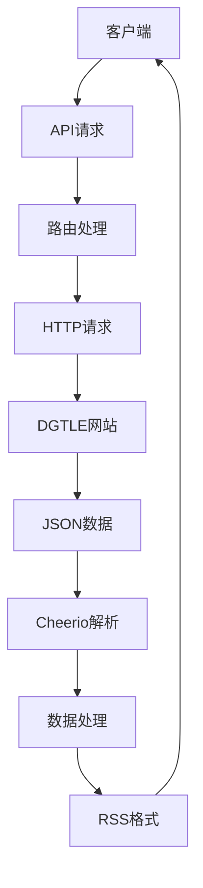
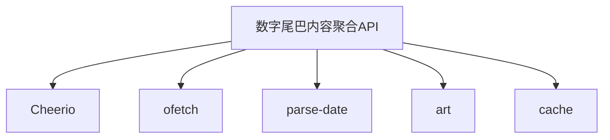

# 数字尾巴内容聚合

<cite>
**本文档引用的文件**
- [article.ts](file://lib/routes/dgtle/article.ts)
- [news.ts](file://lib/routes/dgtle/news.ts)
- [feed.ts](file://lib/routes/dgtle/feed.ts)
- [video.ts](file://lib/routes/dgtle/video.ts)
- [util.ts](file://lib/routes/dgtle/util.ts)
- [namespace.ts](file://lib/routes/dgtle/namespace.ts)
- [description.art](file://lib/routes/dgtle/templates/description.art)
- [index.js](file://lib/routes-deprecated/dgtle/index.js)
- [trade.js](file://lib/routes-deprecated/dgtle/trade.js)
</cite>

## 目录
1. [简介](#简介)
2. [项目结构](#项目结构)
3. [核心组件](#核心组件)
4. [架构概述](#架构概述)
5. [详细组件分析](#详细组件分析)
6. [依赖分析](#依赖分析)
7. [性能考虑](#性能考虑)
8. [故障排除指南](#故障排除指南)
9. [结论](#结论)

## 简介
数字尾巴(DGTLE)内容聚合API旨在为开发者提供一个便捷的接口，用于获取数字尾巴社区中的数码产品讨论、评测和用户分享内容。该API能够解析DGTLE的版块结构、主题帖子和用户评论，支持分页处理、用户等级信息提取和多媒体内容处理。通过本API，开发者可以轻松获取热门评测和最新数码资讯，实现内容的高效聚合与分发。

## 项目结构
数字尾巴内容聚合API的项目结构清晰，主要分为以下几个部分：
- `lib/routes/dgtle/`：包含主要的路由文件，如`article.ts`、`news.ts`、`feed.ts`和`video.ts`，分别对应文章、新闻、兴趣和视频内容的抓取。
- `lib/routes/dgtle/util.ts`：提供通用的工具函数，如`ProcessItems`，用于处理抓取到的数据。
- `lib/routes/dgtle/templates/description.art`：定义了内容描述的模板，用于生成HTML格式的描述。
- `lib/routes-deprecated/dgtle/`：包含已废弃的路由文件，如`index.js`和`trade.js`，用于历史参考。

**Section sources**
- [article.ts](file://lib/routes/dgtle/article.ts)
- [news.ts](file://lib/routes/dgtle/news.ts)
- [feed.ts](file://lib/routes/dgtle/feed.ts)
- [video.ts](file://lib/routes/dgtle/video.ts)

## 核心组件
数字尾巴内容聚合API的核心组件包括：
- **文章抓取模块**：通过`article.ts`文件实现，支持按分类ID和推送排序获取文章内容。
- **新闻抓取模块**：通过`news.ts`文件实现，支持获取最新、直播、资讯和每日一言等新闻内容。
- **兴趣抓取模块**：通过`feed.ts`文件实现，获取用户的兴趣动态，包括图文内容和标签信息。
- **视频抓取模块**：通过`video.ts`文件实现，获取视频内容，包括封面、描述和播放链接。

**Section sources**
- [article.ts](file://lib/routes/dgtle/article.ts)
- [news.ts](file://lib/routes/dgtle/news.ts)
- [feed.ts](file://lib/routes/dgtle/feed.ts)
- [video.ts](file://lib/routes/dgtle/video.ts)

## 架构概述
数字尾巴内容聚合API采用模块化设计，每个模块负责特定类型的内容抓取。API通过HTTP请求与DGTLE网站进行交互，获取JSON格式的数据，然后通过Cheerio库解析HTML内容，提取所需信息。抓取到的数据经过处理后，以RSS格式返回给客户端。

**Diagram sources**
- [article.ts](file://lib/routes/dgtle/article.ts)
- [news.ts](file://lib/routes/dgtle/news.ts)
- [feed.ts](file://lib/routes/dgtle/feed.ts)
- [video.ts](file://lib/routes/dgtle/video.ts)

## 详细组件分析
### 文章抓取模块分析
文章抓取模块通过`article.ts`文件实现，支持按分类ID和推送排序获取文章内容。模块首先通过API请求获取文章列表，然后解析HTML内容，提取标题、描述、发布时间、链接、分类、作者、GUID、内容、图片、横幅和更新时间等信息。

**Section sources**
- [article.ts](file://lib/routes/dgtle/article.ts)

### 新闻抓取模块分析
新闻抓取模块通过`news.ts`文件实现，支持获取最新、直播、资讯和每日一言等新闻内容。模块通过API请求获取新闻列表，解析HTML内容，提取标题、描述、发布时间、链接、分类、作者、GUID、内容、图片、横幅和更新时间等信息。

**Section sources**
- [news.ts](file://lib/routes/dgtle/news.ts)

### 兴趣抓取模块分析
兴趣抓取模块通过`feed.ts`文件实现，获取用户的兴趣动态，包括图文内容和标签信息。模块通过API请求获取兴趣动态列表，解析Markdown内容，提取标题、描述、发布时间、链接、分类、作者、GUID、内容、图片、横幅和更新时间等信息。

**Section sources**
- [feed.ts](file://lib/routes/dgtle/feed.ts)

### 视频抓取模块分析
视频抓取模块通过`video.ts`文件实现，获取视频内容，包括封面、描述和播放链接。模块通过API请求获取视频列表，解析HTML内容，提取标题、描述、链接、作者、GUID、内容、图片、横幅和视频时长等信息。

**Section sources**
- [video.ts](file://lib/routes/dgtle/video.ts)

## 依赖分析
数字尾巴内容聚合API依赖于以下几个关键组件：
- **Cheerio**：用于解析HTML内容，提取所需信息。
- **ofetch**：用于发送HTTP请求，获取JSON数据。
- **parse-date**：用于解析日期时间，确保时间格式的正确性。
- **art**：用于渲染模板，生成HTML格式的描述。
- **cache**：用于缓存数据，提高性能。

**Diagram sources**
- [util.ts](file://lib/routes/dgtle/util.ts)

## 性能考虑
为了提高性能，数字尾巴内容聚合API采用了以下优化措施：
- **缓存机制**：通过`cache.tryGet`方法缓存抓取到的数据，减少重复请求。
- **分页处理**：支持分页获取内容，避免一次性获取过多数据导致性能下降。
- **异步处理**：使用异步函数处理数据，提高响应速度。

## 故障排除指南
在使用数字尾巴内容聚合API时，可能会遇到以下问题：
- **请求超时**：检查网络连接，确保API服务器能够正常访问DGTLE网站。
- **数据解析失败**：检查HTML结构是否发生变化，更新解析逻辑。
- **缓存失效**：清除缓存，重新获取数据。

**Section sources**
- [util.ts](file://lib/routes/dgtle/util.ts)

## 结论
数字尾巴内容聚合API为开发者提供了一个高效、便捷的接口，用于获取数字尾巴社区中的数码产品讨论、评测和用户分享内容。通过模块化设计和优化措施，API能够稳定、高效地运行，满足开发者的需求。