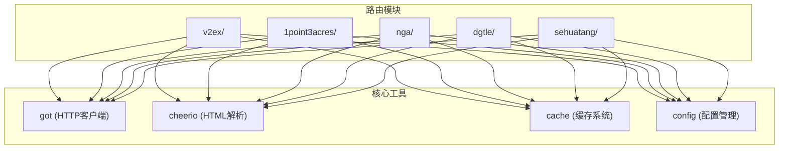
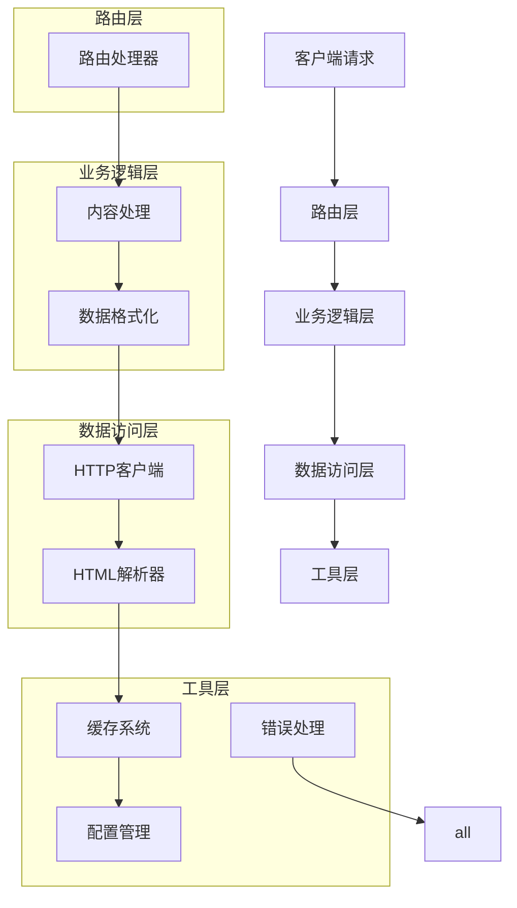
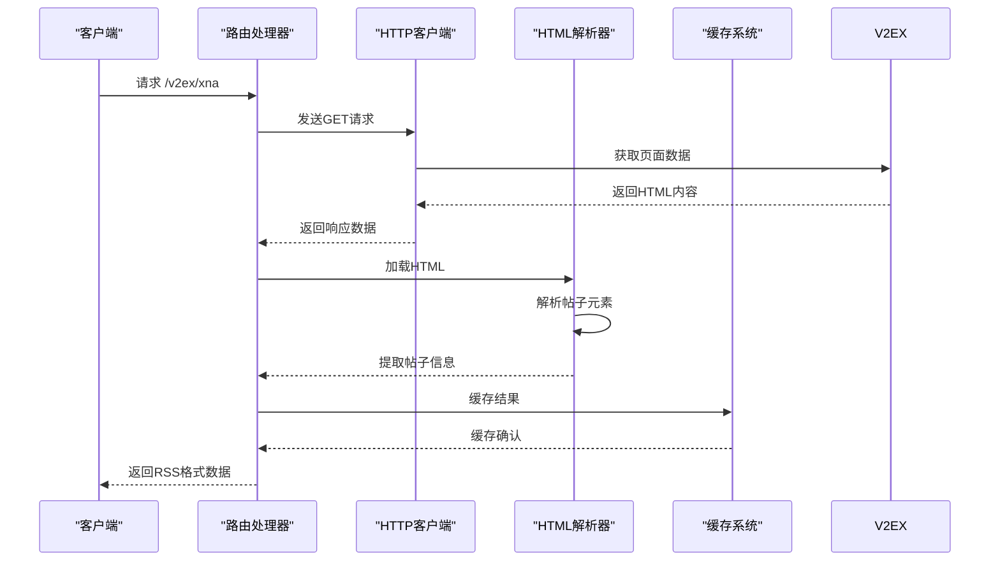
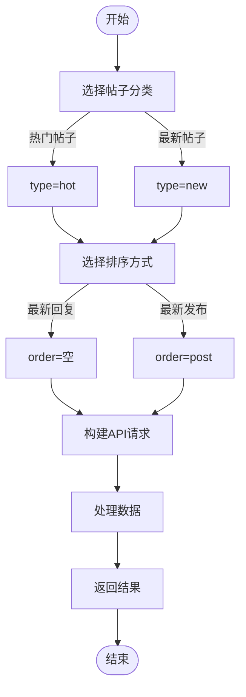
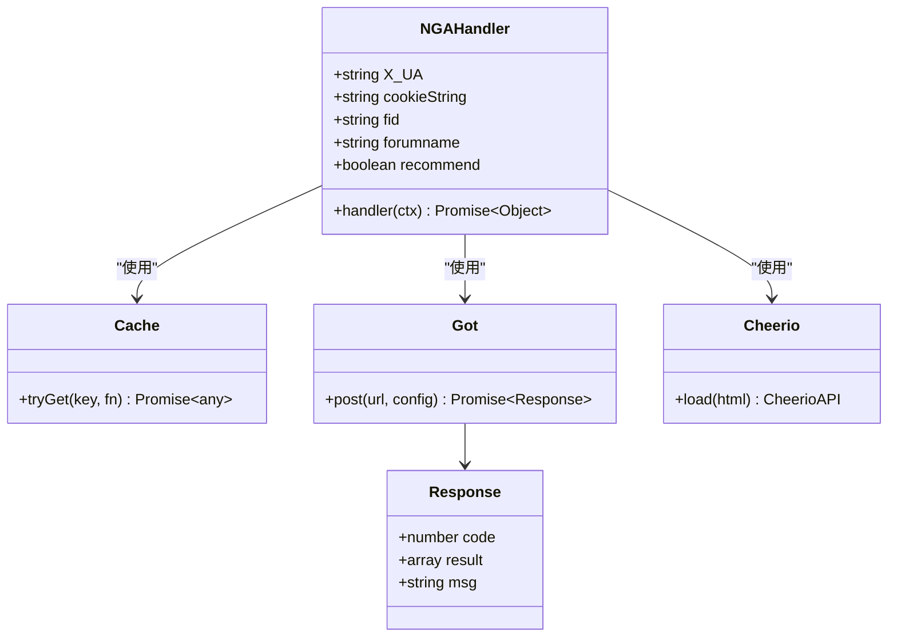
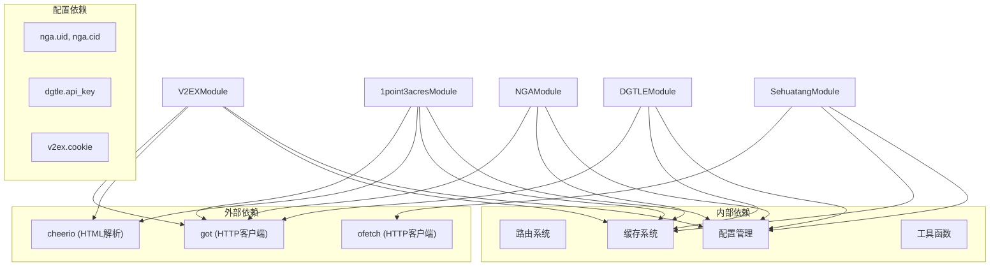

# 论坛内容聚合

<cite>
**本文档引用的文件**   
- [v2ex/xna.ts](file://lib/routes/v2ex/xna.ts)
- [1point3acres/thread.ts](file://lib/routes/1point3acres/thread.ts)
- [dgtle/article.ts](file://lib/routes/dgtle/article.ts)
- [nga/forum.ts](file://lib/routes/nga/forum.ts)
- [sehuatang/index.ts](file://lib/routes/sehuatang/index.ts)
- [config.ts](file://lib/config.ts)
- [utils/cache.ts](file://lib/utils/cache.ts)
</cite>

## 目录
1. [简介](#简介)
2. [项目结构](#项目结构)
3. [核心组件](#核心组件)
4. [架构概述](#架构概述)
5. [详细组件分析](#详细组件分析)
6. [依赖分析](#依赖分析)
7. [性能考虑](#性能考虑)
8. [故障排除指南](#故障排除指南)
9. [结论](#结论)

## 简介
本文档详细介绍了RSSHub中论坛内容聚合API的实现机制。该系统能够聚合V2EX、DGTLE、一亩三分地、NGA等多个技术论坛和社区的内容，为用户提供统一的信息获取接口。文档深入解析了内容抓取、解析、缓存和分发的完整流程，帮助开发者理解如何构建高效稳定的论坛内容聚合服务。

## 项目结构
论坛内容聚合功能主要分布在`lib/routes`目录下的各个子模块中，每个论坛都有独立的路由实现。系统采用模块化设计，通过统一的接口规范实现不同论坛的适配。

**Diagram sources**
- [v2ex/xna.ts](file://lib/routes/v2ex/xna.ts)
- [1point3acres/thread.ts](file://lib/routes/1point3acres/thread.ts)
- [dgtle/article.ts](file://lib/routes/dgtle/article.ts)
- [nga/forum.ts](file://lib/routes/nga/forum.ts)
- [sehuatang/index.ts](file://lib/routes/sehuatang/index.ts)

**Section sources**
- [lib/routes](file://lib/routes)

## 核心组件
论坛内容聚合系统的核心组件包括路由处理器、HTTP客户端、HTML解析器和缓存系统。这些组件协同工作，实现从目标论坛抓取内容、解析数据结构、缓存结果并提供标准化输出的完整流程。

**Section sources**
- [v2ex/xna.ts](file://lib/routes/v2ex/xna.ts#L7-L24)
- [1point3acres/thread.ts](file://lib/routes/1point3acres/thread.ts#L6-L14)
- [nga/forum.ts](file://lib/routes/nga/forum.ts#L1-L50)

## 架构概述
系统采用分层架构设计，各层职责分明，便于维护和扩展。整体架构分为路由层、业务逻辑层、数据访问层和工具层。

**Diagram sources**
- [v2ex/xna.ts](file://lib/routes/v2ex/xna.ts)
- [1point3acres/thread.ts](file://lib/routes/1point3acres/thread.ts)
- [nga/forum.ts](file://lib/routes/nga/forum.ts)

## 详细组件分析

### V2EX内容聚合分析
V2EX内容聚合实现了对特定板块（如XNA）的帖子抓取和解析。系统通过HTTP请求获取页面内容，使用cheerio解析HTML，提取标题、链接和作者等关键信息。

#### 内容抓取流程

**Diagram sources**
- [v2ex/xna.ts](file://lib/routes/v2ex/xna.ts#L26-L57)

**Section sources**
- [v2ex/xna.ts](file://lib/routes/v2ex/xna.ts#L1-L57)

### 一亩三分地内容聚合分析
一亩三分地的内容聚合支持多种分类和排序方式，包括热门帖子和最新帖子，并可根据最新回复或最新发布进行排序。

#### 分类与排序机制

**Diagram sources**
- [1point3acres/thread.ts](file://lib/routes/1point3acres/thread.ts#L28-L40)

**Section sources**
- [1point3acres/thread.ts](file://lib/routes/1point3acres/thread.ts#L1-L40)

### NGA内容聚合分析
NGA论坛的内容聚合通过POST请求获取帖子列表和内容，需要特定的用户代理和Cookie认证信息。

#### 认证与内容获取

**Diagram sources**
- [nga/forum.ts](file://lib/routes/nga/forum.ts#L68-L93)

**Section sources**
- [nga/forum.ts](file://lib/routes/nga/forum.ts#L1-L100)

## 依赖分析
论坛内容聚合系统依赖多个核心模块和外部服务，这些依赖关系确保了系统的稳定运行和功能完整性。

**Diagram sources**
- [config.ts](file://lib/config.ts#L517-L520)
- [utils/cache.ts](file://lib/utils/cache.ts)

**Section sources**
- [config.ts](file://lib/config.ts#L510-L530)

## 性能考虑
论坛内容聚合系统在设计时充分考虑了性能优化，通过多种机制确保服务的高效和稳定。

1. **缓存机制**：所有内容聚合都使用缓存系统，避免重复请求和解析，显著提高响应速度。
2. **分页处理**：支持通过limit参数控制返回结果数量，防止一次性获取过多数据导致性能问题。
3. **并发处理**：使用Promise.all()并行处理多个内容项的获取，提高整体效率。
4. **连接复用**：HTTP客户端支持连接复用，减少网络开销。
5. **资源限制**：通过配置限制最大返回数量，防止资源耗尽。

这些性能优化措施确保了系统在高并发场景下的稳定运行，同时降低了对目标论坛的访问压力。

## 故障排除指南
在使用论坛内容聚合API时，可能会遇到各种问题。以下是常见问题及其解决方案：

**Section sources**
- [v2ex/xna.ts](file://lib/routes/v2ex/xna.ts#L14-L20)
- [1point3acres/thread.ts](file://lib/routes/1point3acres/thread.ts#L13-L19)
- [nga/forum.ts](file://lib/routes/nga/forum.ts#L1-L10)

### 常见问题及解决方案

| 问题现象 | 可能原因 | 解决方案 |
|--------|--------|--------|
| 返回空内容 | 目标页面结构变化 | 检查HTML选择器是否需要更新 |
| 认证失败 | Cookie或认证信息过期 | 更新配置中的认证信息 |
| 请求频率受限 | 触发反爬虫机制 | 检查antiCrawler配置，调整请求频率 |
| 内容解析错误 | HTML结构变化 | 更新cheerio选择器表达式 |
| 接口返回错误 | API端点变化 | 检查目标论坛API文档，更新请求URL |

### 监控与调试
系统提供了完善的监控和调试机制：
- 通过配置文件中的设置控制各论坛的访问参数
- 使用缓存系统记录请求状态，便于问题排查
- 在路由配置中明确标注是否需要配置、是否需要Puppeteer等依赖
- 提供详细的错误处理机制，确保系统稳定性

## 结论
RSSHub的论坛内容聚合系统通过模块化设计和统一的接口规范，成功实现了对多个技术论坛和社区的内容聚合。系统采用分层架构，各组件职责分明，便于维护和扩展。通过缓存、分页、并发处理等性能优化措施，确保了服务的高效稳定。同时，系统提供了灵活的配置选项和完善的错误处理机制，能够适应不同论坛的技术特点和访问要求。这一架构为开发者提供了强大的工具，可以轻松集成和聚合各种论坛内容，为用户提供统一的信息获取体验。