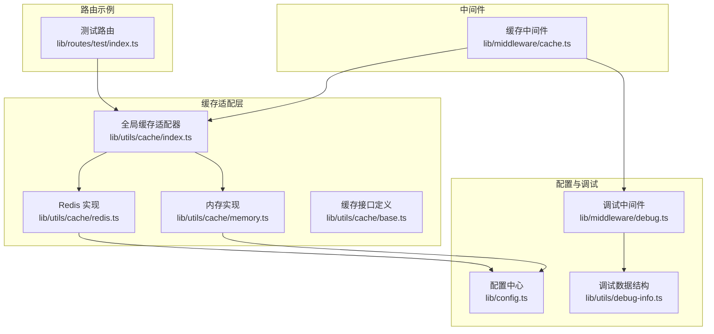
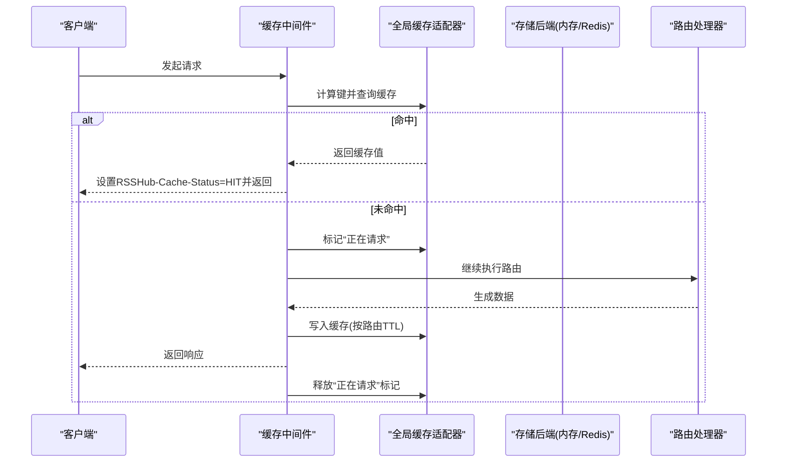
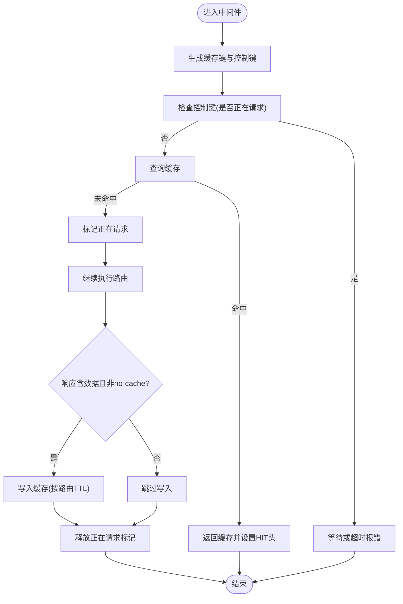
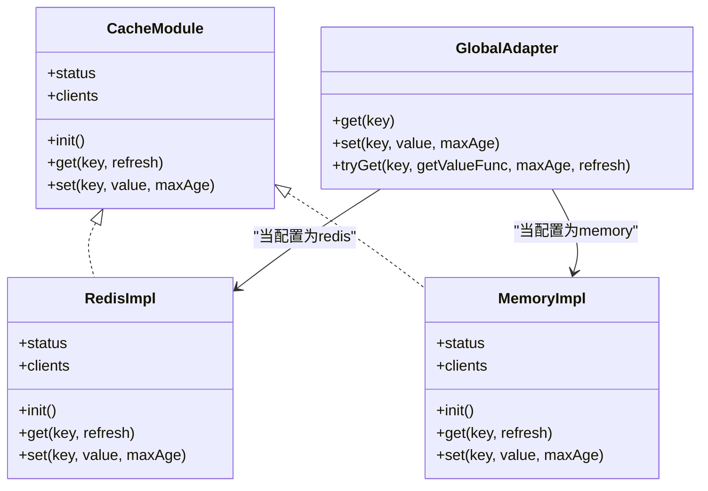
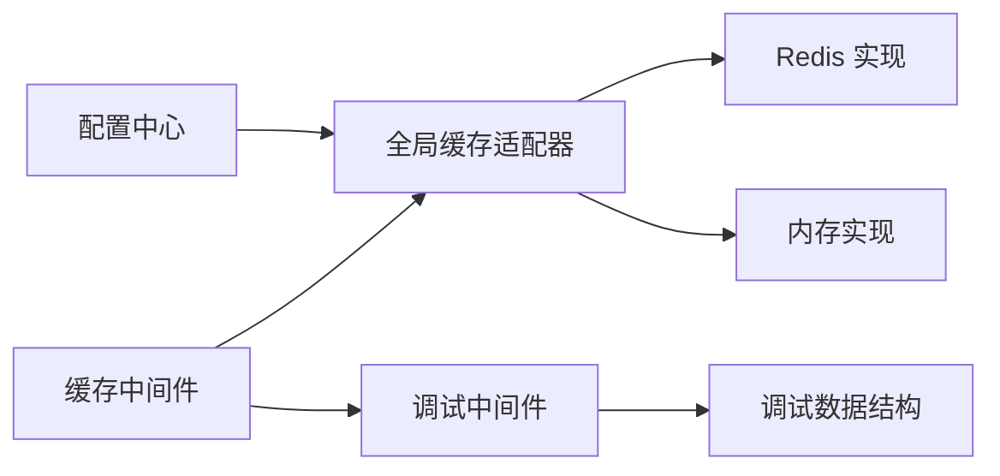
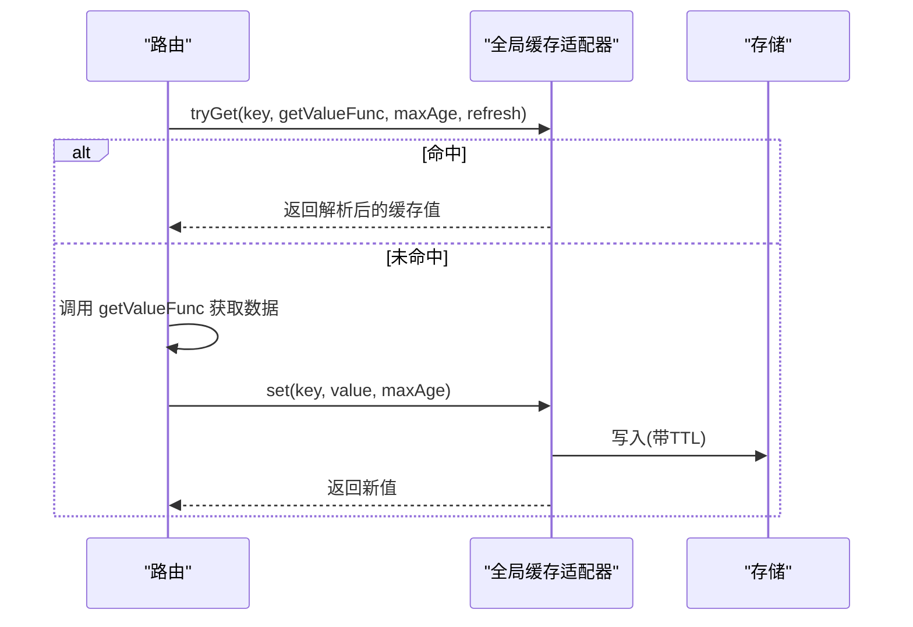

# 缓存API

<cite>
**本文引用的文件**
- [lib/middleware/cache.ts](file://lib/middleware/cache.ts)
- [lib/utils/cache/index.ts](file://lib/utils/cache/index.ts)
- [lib/utils/cache/redis.ts](file://lib/utils/cache/redis.ts)
- [lib/utils/cache/memory.ts](file://lib/utils/cache/memory.ts)
- [lib/utils/cache/base.ts](file://lib/utils/cache/base.ts)
- [lib/config.ts](file://lib/config.ts)
- [lib/middleware/debug.ts](file://lib/middleware/debug.ts)
- [lib/middleware/cache.test.ts](file://lib/middleware/cache.test.ts)
- [lib/utils/cache.test.ts](file://lib/utils/cache.test.ts)
- [lib/routes/test/index.ts](file://lib/routes/test/index.ts)
- [lib/utils/debug-info.ts](file://lib/utils/debug-info.ts)
</cite>

## 目录
1. [简介](#简介)
2. [项目结构](#项目结构)
3. [核心组件](#核心组件)
4. [架构总览](#架构总览)
5. [详细组件分析](#详细组件分析)
6. [依赖关系分析](#依赖关系分析)
7. [性能考量](#性能考量)
8. [故障排查指南](#故障排查指南)
9. [结论](#结论)
10. [附录](#附录)

## 简介
本文件系统性阐述 RSSHub 的缓存API与缓存机制，重点覆盖以下方面：
- 缓存策略设计：TTL（生存时间）管理、缓存失效与并发控制、缓存穿透防护思路
- 如何通过API控制缓存行为：手动刷新缓存、设置自定义缓存时间
- Redis 缓存配置：连接参数、集群配置与性能调优建议
- 缓存命中率监控与缓存清理最佳实践

该文档面向不同技术背景的读者，既提供高层概览，也包含代码级图示与定位路径，便于快速定位实现细节。

## 项目结构
缓存相关代码主要分布在以下模块：
- 中间件层：统一入口的缓存中间件，负责键生成、并发控制、命中/未命中分支处理
- 缓存适配层：抽象接口与内存/Redis 两种实现，对外暴露统一的 get/set/tryGet 接口
- 配置层：集中管理缓存类型、TTL、内存容量、Redis 连接地址等
- 调试与测试：通过调试中间件统计命中率，配合测试用例验证 TTL、并发与刷新行为

图表来源
- [lib/middleware/cache.ts](file://lib/middleware/cache.ts#L1-L84)
- [lib/utils/cache/index.ts](file://lib/utils/cache/index.ts#L1-L101)
- [lib/utils/cache/redis.ts](file://lib/utils/cache/redis.ts#L1-L78)
- [lib/utils/cache/memory.ts](file://lib/utils/cache/memory.ts#L1-L45)
- [lib/utils/cache/base.ts](file://lib/utils/cache/base.ts#L1-L17)
- [lib/config.ts](file://lib/config.ts#L735-L748)
- [lib/middleware/debug.ts](file://lib/middleware/debug.ts#L1-L40)
- [lib/utils/debug-info.ts](file://lib/utils/debug-info.ts#L1-L25)
- [lib/routes/test/index.ts](file://lib/routes/test/index.ts#L1-L150)

章节来源
- [lib/middleware/cache.ts](file://lib/middleware/cache.ts#L1-L84)
- [lib/utils/cache/index.ts](file://lib/utils/cache/index.ts#L1-L101)
- [lib/utils/cache/redis.ts](file://lib/utils/cache/redis.ts#L1-L78)
- [lib/utils/cache/memory.ts](file://lib/utils/cache/memory.ts#L1-L45)
- [lib/utils/cache/base.ts](file://lib/utils/cache/base.ts#L1-L17)
- [lib/config.ts](file://lib/config.ts#L735-L748)
- [lib/middleware/debug.ts](file://lib/middleware/debug.ts#L1-L40)
- [lib/utils/debug-info.ts](file://lib/utils/debug-info.ts#L1-L25)
- [lib/routes/test/index.ts](file://lib/routes/test/index.ts#L1-L150)

## 核心组件
- 缓存中间件：在请求进入路由前尝试命中缓存；若未命中，则标记“正在请求”，并允许后续请求等待或报错；成功后写入缓存并释放锁
- 全局缓存适配器：根据配置选择 Redis 或内存实现，并提供 get/set/tryGet
- Redis 实现：支持按 key 存储独立 TTL，自动续期；错误/断连时置不可用状态
- 内存实现：基于 LRU，支持 TTL 与最大项数
- 配置中心：集中管理缓存类型、TTL、内存容量、Redis 地址
- 调试中间件：统计命中次数、请求总数、ETag 命中等指标

章节来源
- [lib/middleware/cache.ts](file://lib/middleware/cache.ts#L1-L84)
- [lib/utils/cache/index.ts](file://lib/utils/cache/index.ts#L1-L101)
- [lib/utils/cache/redis.ts](file://lib/utils/cache/redis.ts#L1-L78)
- [lib/utils/cache/memory.ts](file://lib/utils/cache/memory.ts#L1-L45)
- [lib/config.ts](file://lib/config.ts#L735-L748)
- [lib/middleware/debug.ts](file://lib/middleware/debug.ts#L1-L40)

## 架构总览
缓存工作流从中间件开始，贯穿到适配器与具体存储后端，最终回到中间件完成响应。

图表来源
- [lib/middleware/cache.ts](file://lib/middleware/cache.ts#L1-L84)
- [lib/utils/cache/index.ts](file://lib/utils/cache/index.ts#L1-L101)
- [lib/utils/cache/redis.ts](file://lib/utils/cache/redis.ts#L1-L78)
- [lib/utils/cache/memory.ts](file://lib/utils/cache/memory.ts#L1-L45)

## 详细组件分析

### 缓存中间件（并发与命中）
- 键生成：基于路径、format、limit 参数计算唯一键，避免重复请求风暴
- 并发控制：使用“控制键”标记当前路径是否正在请求，其他并发请求轮询等待或超时报错
- 命中处理：命中则直接返回缓存，设置 RSSHub-Cache-Status 头
- 写入缓存：仅当响应头不含 no-cache 且存在数据时，才写入缓存并更新 lastBuildDate

图表来源
- [lib/middleware/cache.ts](file://lib/middleware/cache.ts#L1-L84)

章节来源
- [lib/middleware/cache.ts](file://lib/middleware/cache.ts#L1-L84)

### 全局缓存适配器与存储实现
- 接口抽象：统一 init/get/set/status/clients
- Redis 实现：连接、错误/断开事件监听、按 key 存储 TTL 并自动续期
- 内存实现：LRU，支持 TTL 与最大项数
- 适配器选择：依据配置决定使用 Redis 或内存，否则记录日志并禁用缓存

图表来源
- [lib/utils/cache/base.ts](file://lib/utils/cache/base.ts#L1-L17)
- [lib/utils/cache/redis.ts](file://lib/utils/cache/redis.ts#L1-L78)
- [lib/utils/cache/memory.ts](file://lib/utils/cache/memory.ts#L1-L45)
- [lib/utils/cache/index.ts](file://lib/utils/cache/index.ts#L1-L101)

章节来源
- [lib/utils/cache/base.ts](file://lib/utils/cache/base.ts#L1-L17)
- [lib/utils/cache/redis.ts](file://lib/utils/cache/redis.ts#L1-L78)
- [lib/utils/cache/memory.ts](file://lib/utils/cache/memory.ts#L1-L45)
- [lib/utils/cache/index.ts](file://lib/utils/cache/index.ts#L1-L101)

### 配置与环境变量
- 缓存类型：支持 memory、redis；留空可完全禁用缓存
- TTL 参数：
  - 路由缓存时间 routeExpire（默认单位秒）
  - 内容缓存时间 contentExpire（默认单位秒）
  - 请求并发控制超时 requestTimeout（用于“正在请求”标记）
- 内存缓存容量：MEMORY_MAX
- Redis 连接：REDIS_URL

章节来源
- [lib/config.ts](file://lib/config.ts#L735-L748)

### API 控制缓存行为
- 手动刷新缓存
  - 使用全局缓存接口的 get/set/tryGet 可以在路由内主动刷新或设置缓存
  - 示例：测试路由中演示了通过 cache.get/cache.set 控制刷新逻辑
- 设置自定义缓存时间
  - 通过 tryGet 的 maxAge 参数或 set 的 maxAge 参数，可为特定键设置不同的 TTL
  - 测试路由中演示了将 TTL 设为 routeExpire 的倍数

章节来源
- [lib/routes/test/index.ts](file://lib/routes/test/index.ts#L99-L148)
- [lib/utils/cache/index.ts](file://lib/utils/cache/index.ts#L66-L101)

### Redis 缓存配置与集群
- 连接参数
  - REDIS_URL：Redis 连接字符串
  - 客户端初始化：在 Redis 实现中创建连接并监听错误/断开事件
- 集群配置
  - 仓库未提供内置集群客户端；如需集群/哨兵/密码认证，请在 REDIS_URL 中配置相应连接串
- 性能调优建议
  - 合理设置 routeExpire/contentExpire，避免过短导致频繁回源
  - 对热点路由使用更长 TTL；对动态内容使用较短 TTL
  - 在高并发场景下，适当增大 requestTimeout，减少“正在请求”冲突
  - 使用 tryGet 为关键键设置独立 TTL，避免全局 TTL 影响所有键

章节来源
- [lib/utils/cache/redis.ts](file://lib/utils/cache/redis.ts#L1-L78)
- [lib/config.ts](file://lib/config.ts#L735-L748)

### 缓存命中率监控与清理
- 命中率监控
  - 调试中间件会统计 RSSHub-Cache-Status=HIT 的次数
  - 结合请求总数与 ETAG 命中，评估缓存效果
- 清理最佳实践
  - 使用 set(key, null 或空值) 可实现删除键
  - 对于 Redis，可利用 EX 参数设置 TTL；对于内存，LRU 自动淘汰
  - 对于需要强制刷新的路由，可在路由内调用 set(key, value, customTTL) 覆盖默认 TTL

章节来源
- [lib/middleware/debug.ts](file://lib/middleware/debug.ts#L1-L40)
- [lib/utils/debug-info.ts](file://lib/utils/debug-info.ts#L1-L25)
- [lib/utils/cache/index.ts](file://lib/utils/cache/index.ts#L66-L101)

## 依赖关系分析
- 中间件依赖全局缓存适配器；适配器再依赖具体存储实现
- 配置中心为适配器与中间件提供 TTL、类型、连接参数
- 调试中间件依赖调试数据结构，统计命中与错误

图表来源
- [lib/config.ts](file://lib/config.ts#L735-L748)
- [lib/utils/cache/index.ts](file://lib/utils/cache/index.ts#L1-L101)
- [lib/utils/cache/redis.ts](file://lib/utils/cache/redis.ts#L1-L78)
- [lib/utils/cache/memory.ts](file://lib/utils/cache/memory.ts#L1-L45)
- [lib/middleware/cache.ts](file://lib/middleware/cache.ts#L1-L84)
- [lib/middleware/debug.ts](file://lib/middleware/debug.ts#L1-L40)
- [lib/utils/debug-info.ts](file://lib/utils/debug-info.ts#L1-L25)

章节来源
- [lib/config.ts](file://lib/config.ts#L735-L748)
- [lib/utils/cache/index.ts](file://lib/utils/cache/index.ts#L1-L101)
- [lib/utils/cache/redis.ts](file://lib/utils/cache/redis.ts#L1-L78)
- [lib/utils/cache/memory.ts](file://lib/utils/cache/memory.ts#L1-L45)
- [lib/middleware/cache.ts](file://lib/middleware/cache.ts#L1-L84)
- [lib/middleware/debug.ts](file://lib/middleware/debug.ts#L1-L40)
- [lib/utils/debug-info.ts](file://lib/utils/debug-info.ts#L1-L25)

## 性能考量
- TTL 设计
  - routeExpire：路由级缓存，适合 RSS 输出整体缓存
  - contentExpire：内容级缓存，默认较长，适合不变数据
- 并发控制
  - 控制键用于避免同一路径的并发回源，降低源服务器压力
- 存储选择
  - Redis：跨进程共享、持久化能力更强，适合多实例部署
  - 内存：单进程内低延迟，适合开发/小规模部署
- 监控与调优
  - 通过调试中间件观察命中率与错误率，结合业务特性调整 TTL

[本节为通用指导，不直接分析具体文件]

## 故障排查指南
- 缓存未生效
  - 检查 CACHE_TYPE 是否正确设置；留空将禁用缓存
  - 查看日志中关于缓存不可用的提示
- Redis 连接异常
  - REDIS_URL 是否正确；客户端 on('error')/on('end') 会置不可用
  - 测试用例展示了错误连接与断开后的行为
- 并发冲突
  - 若出现“正在请求”的等待或超时，检查 requestTimeout 与路由耗时
- 刷新与 TTL 异常
  - 使用 tryGet/set 的 maxAge 参数确认是否覆盖默认 TTL
  - 测试用例验证了 TTL 与刷新行为

章节来源
- [lib/config.ts](file://lib/config.ts#L735-L748)
- [lib/utils/cache/index.ts](file://lib/utils/cache/index.ts#L1-L101)
- [lib/utils/cache/redis.ts](file://lib/utils/cache/redis.ts#L1-L78)
- [lib/middleware/cache.test.ts](file://lib/middleware/cache.test.ts#L1-L190)
- [lib/utils/cache.test.ts](file://lib/utils/cache.test.ts#L1-L92)

## 结论
RSSHub 的缓存API通过中间件+适配器的分层设计，实现了灵活的 TTL 管理、并发控制与存储后端切换。借助调试中间件与测试用例，用户可以有效监控命中率并优化缓存策略。通过合理设置 TTL、请求并发控制与存储类型，可在显著降低源服务器负载的同时提升响应性能。

[本节为总结，不直接分析具体文件]

## 附录

### 关键流程与数据流
- 中间件到适配器再到存储的数据流
- tryGet/refresh 行为与 TTL 续期

图表来源
- [lib/utils/cache/index.ts](file://lib/utils/cache/index.ts#L66-L101)
- [lib/utils/cache/redis.ts](file://lib/utils/cache/redis.ts#L36-L74)
- [lib/utils/cache/memory.ts](file://lib/utils/cache/memory.ts#L20-L41)

### 配置清单（关键项）
- CACHE_TYPE：缓存类型（memory/redis/留空）
- CACHE_EXPIRE：路由缓存时间（秒）
- CACHE_CONTENT_EXPIRE：内容缓存时间（秒）
- CACHE_REQUEST_TIMEOUT：并发请求控制超时（秒）
- MEMORY_MAX：内存缓存最大项数
- REDIS_URL：Redis 连接字符串

章节来源
- [lib/config.ts](file://lib/config.ts#L735-L748)