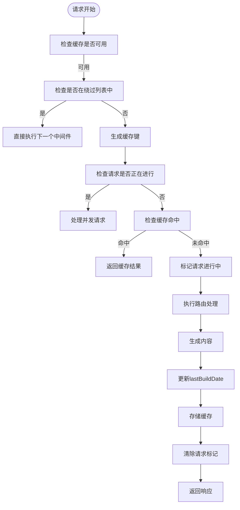
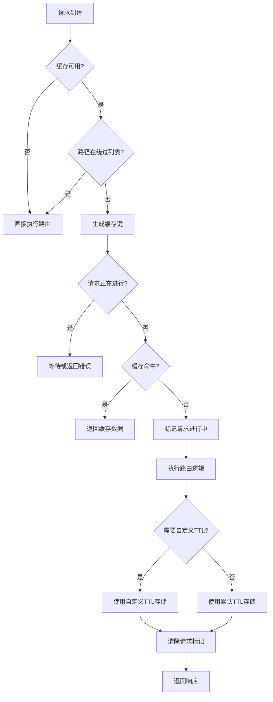
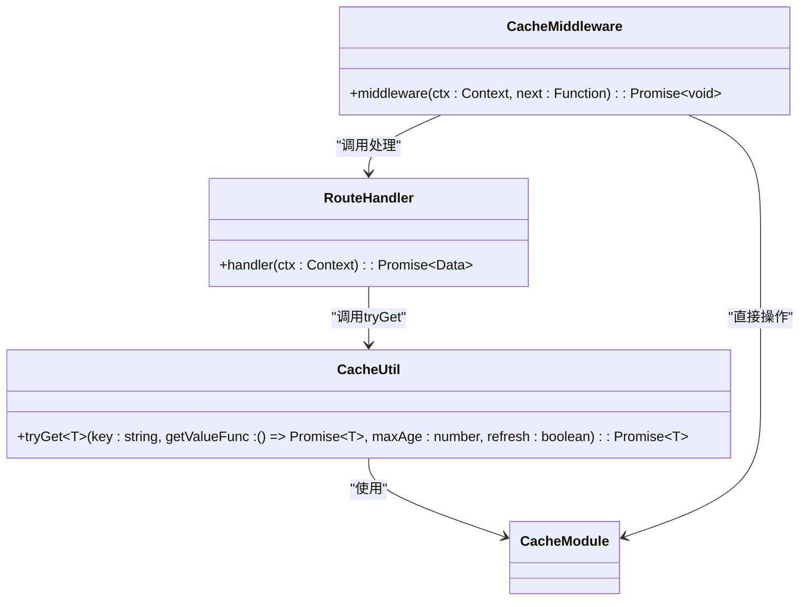
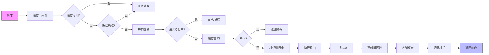

# 缓存策略

<cite>
**本文档引用的文件**
- [cache.ts](file://lib/middleware/cache.ts)
- [cache.test.ts](file://lib/middleware/cache.test.ts)
- [config.ts](file://lib/config.ts)
- [index.ts](file://lib/utils/cache/index.ts)
- [memory.ts](file://lib/utils/cache/memory.ts)
- [redis.ts](file://lib/utils/cache/redis.ts)
- [base.ts](file://lib/utils/cache/base.ts)
- [test/index.ts](file://lib/routes/test/index.ts)
- [header.ts](file://lib/middleware/header.ts)
- [rss.tsx](file://lib/views/rss.tsx)
</cite>

## 目录
1. [引言](#引言)
2. [TTL管理机制](#ttl管理机制)
3. [缓存失效策略](#缓存失效策略)
4. [缓存穿透防护](#缓存穿透防护)
5. [内容源缓存时间配置](#内容源缓存时间配置)
6. [缓存预热与更新策略](#缓存预热与更新策略)
7. [缓存策略协同工作](#缓存策略协同工作)
8. [结论](#结论)

## 引言

RSSHub采用了一套完整的缓存策略来优化系统性能，通过合理的TTL（生存时间）管理、缓存失效机制和缓存穿透防护方案，有效减少了重复请求和服务器负载。本文档深入分析RSSHub的缓存设计，详细解释其核心机制和实现细节。

**Section sources**
- [cache.ts](file://lib/middleware/cache.ts#L1-L84)
- [config.ts](file://lib/config.ts#L730-L768)

## TTL管理机制

RSSHub的TTL管理机制基于配置文件中的缓存设置，通过`config.cache.routeExpire`和`config.cache.contentExpire`两个关键参数来控制缓存的生存时间。路由缓存时间（routeExpire）默认为5分钟（300秒），而不变内容缓存时间（contentExpire）默认为1小时（3600秒）。

在RSS输出中，TTL值会根据缓存配置动态生成。当启用缓存时，RSS的TTL值为路由缓存时间除以60的整数部分；当禁用缓存时，TTL值固定为1。这种设计确保了RSS订阅器能够根据缓存状态合理地安排刷新频率。



**Diagram sources**
- [cache.ts](file://lib/middleware/cache.ts#L1-L84)
- [config.ts](file://lib/config.ts#L737-L739)

**Section sources**
- [cache.ts](file://lib/middleware/cache.ts#L72-L75)
- [config.ts](file://lib/config.ts#L738-L739)

## 缓存失效策略

RSSHub实现了基于时间的缓存失效策略，通过Redis或内存缓存的过期机制自动清除过期的缓存数据。缓存键的过期时间由`config.cache.routeExpire`参数决定，默认为5分钟。

对于非默认的缓存时间，系统会额外存储一个带有`rsshub:cacheTtl:`前缀的键来记录具体的TTL值。这种设计允许系统在刷新缓存时保持正确的过期时间，确保缓存策略的一致性。

```mermaid
classDiagram
class CacheModule {
+init() : void
+get(key : string, refresh? : boolean) : Promise~string | null~
+set(key : string, value? : string | Record~string, any~, maxAge? : number) : any
+status : { available : boolean }
+clients : { redisClient? : Redis, memoryCache? : LRUCache~any, any~ }
}
class RedisCache {
+init() : void
+get(key : string, refresh? : boolean) : Promise~string | null~
+set(key : string, value? : string | Record~string, any~, maxAge? : number) : any
+status : { available : boolean }
+clients : { redisClient? : Redis }
}
class MemoryCache {
+init() : void
+get(key : string, refresh? : boolean) : string | undefined
+set(key : string, value? : string | Record~string, any~, maxAge? : number) : any
+status : { available : boolean }
+clients : { memoryCache? : LRUCache~any, any~ }
}
CacheModule <|-- RedisCache : "实现"
CacheModule <|-- MemoryCache : "实现"
RedisCache --> Redis : "使用"
MemoryCache --> LRUCache : "使用"
```

**Diagram sources**
- [index.ts](file://lib/utils/cache/index.ts#L1-L100)
- [redis.ts](file://lib/utils/cache/redis.ts#L1-L78)
- [memory.ts](file://lib/utils/cache/memory.ts#L1-L45)

**Section sources**
- [redis.ts](file://lib/utils/cache/redis.ts#L57-L72)
- [memory.ts](file://lib/utils/cache/memory.ts#L31-L40)

## 缓存穿透防护

RSSHub通过并发请求控制机制有效防止缓存穿透问题。系统使用一个特殊的控制键（controlKey）来标记某个路径的请求是否正在进行中。当多个请求同时访问同一个未缓存的路径时，后续请求会等待而不是重复执行耗时的数据获取操作。

具体实现中，系统首先检查控制键的状态，如果发现已有请求正在进行，则进入等待循环。在测试环境中最多等待1次（3秒），在生产环境中最多等待10次（每次6秒），总共最多等待60秒。如果等待超时，系统会抛出RequestInProgressError异常，提示用户稍后重试。

```mermaid
sequenceDiagram
participant Client1 as "客户端1"
participant Client2 as "客户端2"
participant Middleware as "缓存中间件"
participant Cache as "缓存系统"
participant Route as "路由处理器"
Client1->>Middleware : 请求路径A
Middleware->>Cache : 检查controlKey
Cache-->>Middleware : 无记录
Middleware->>Cache : 设置controlKey=1
Middleware->>Route : 执行路由处理
Route->>Middleware : 返回数据
Middleware->>Cache : 存储缓存数据
Middleware->>Cache : 设置controlKey=0
Middleware-->>Client1 : 返回响应
Client2->>Middleware : 请求路径A
Middleware->>Cache : 检查controlKey
Cache-->>Middleware : controlKey=1
Middleware->>Middleware : 启动等待循环
loop 每6秒检查一次
Middleware->>Cache : 检查controlKey
alt controlKey已释放
Cache-->>Middleware : controlKey=0
Middleware->>Cache : 获取缓存数据
Middleware-->>Client2 : 返回缓存响应
break
else 仍在进行中
Cache-->>Middleware : controlKey=1
end
end
```

**Diagram sources**
- [cache.ts](file://lib/middleware/cache.ts#L26-L44)
- [errors/types/request-in-progress.ts](file://lib/errors/types/request-in-progress.ts)

**Section sources**
- [cache.ts](file://lib/middleware/cache.ts#L26-L44)
- [cache.test.ts](file://lib/middleware/cache.test.ts#L30-L43)

## 内容源缓存时间配置

RSSHub支持灵活的缓存时间配置，允许根据不同内容源的特点设置合适的缓存时间。系统提供了默认缓存时间和自定义缓存时间两种配置方式。

默认情况下，所有路由使用`config.cache.routeExpire`配置的默认缓存时间（5分钟）。对于需要特殊缓存策略的内容源，可以通过`tryGet`方法的第三个参数指定自定义的缓存时间。例如，在测试路由中，可以将缓存时间设置为默认值的两倍：



**Diagram sources**
- [cache.ts](file://lib/middleware/cache.ts#L1-L84)
- [test/index.ts](file://lib/routes/test/index.ts#L135-L141)

**Section sources**
- [index.ts](file://lib/utils/cache/index.ts#L75-L97)
- [test/index.ts](file://lib/routes/test/index.ts#L135-L141)

## 缓存预热与更新策略

RSSHub的缓存预热机制主要通过`tryGet`方法实现。该方法尝试从缓存中获取数据，如果缓存未命中，则执行提供的函数获取数据并自动存储到缓存中。这种"懒加载"式的预热策略确保了缓存只在真正需要时才被填充。

缓存更新策略采用写后更新（Write-Through）模式，在路由处理完成后立即更新缓存。系统会检查响应头中的`Cache-Control`是否为`no-cache`，如果不是，则更新缓存数据并设置`lastBuildDate`字段。这种策略确保了缓存数据的及时性和一致性。



**Diagram sources**
- [index.ts](file://lib/utils/cache/index.ts#L75-L97)
- [cache.ts](file://lib/middleware/cache.ts#L70-L76)

**Section sources**
- [index.ts](file://lib/utils/cache/index.ts#L75-L97)
- [cache.ts](file://lib/middleware/cache.ts#L70-L76)

## 缓存策略协同工作

RSSHub的各个缓存策略协同工作，形成了一个完整的缓存管理体系。当请求到达时，系统首先检查缓存可用性和路径是否在绕过列表中，然后生成唯一的缓存键。通过控制键机制防止并发请求导致的缓存击穿，利用TTL机制确保缓存数据的时效性。

在响应头中，系统会添加`RSSHub-Cache-Status`字段指示缓存命中情况（HIT或MISS），并设置标准的`Cache-Control`头告知客户端缓存策略。对于RSS输出，还会在XML中包含`ttl`元素，指导RSS订阅器的刷新行为。



**Diagram sources**
- [cache.ts](file://lib/middleware/cache.ts#L1-L84)
- [header.ts](file://lib/middleware/header.ts#L8-L13)
- [rss.tsx](file://lib/views/rss.tsx#L37)

**Section sources**
- [cache.ts](file://lib/middleware/cache.ts#L1-L84)
- [header.ts](file://lib/middleware/header.ts#L8-L13)

## 结论

RSSHub的缓存策略设计充分考虑了性能优化、系统稳定性和用户体验。通过合理的TTL管理、有效的缓存失效机制和完善的缓存穿透防护，系统能够在保证数据时效性的同时，显著降低服务器负载。灵活的缓存时间配置和智能的预热更新策略，使得不同内容源都能获得最优的缓存体验。这些策略的协同工作，共同构建了一个高效、可靠的缓存管理体系。