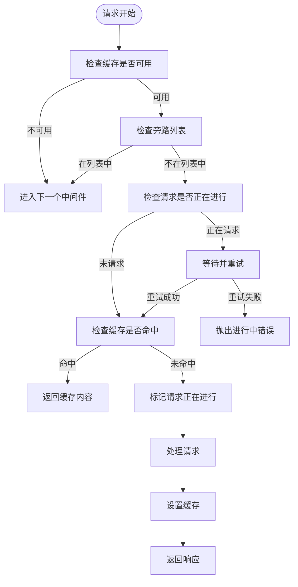
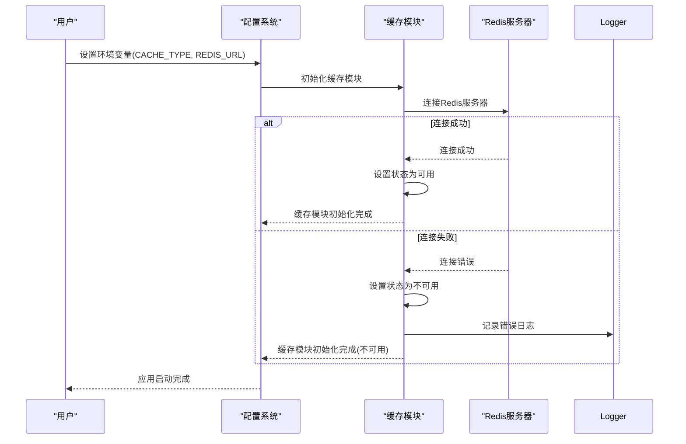
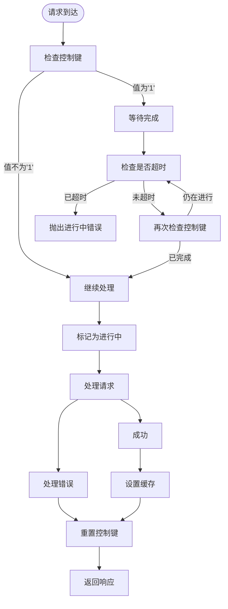

# 缓存管理接口

<cite>
**本文档引用的文件**
- [base.ts](file://lib/utils/cache/base.ts)
- [memory.ts](file://lib/utils/cache/memory.ts)
- [redis.ts](file://lib/utils/cache/redis.ts)
- [index.ts](file://lib/utils/cache/index.ts)
- [cache.ts](file://lib/middleware/cache.ts)
- [cache.test.ts](file://lib/middleware/cache.test.ts)
- [index.ts](file://lib/routes/test/index.ts)
</cite>

## 目录
1. [简介](#简介)
2. [缓存管理API概述](#缓存管理api概述)
3. [核心缓存操作](#核心缓存操作)
4. [API认证与权限控制](#api认证与权限控制)
5. [错误处理策略](#错误处理策略)
6. [常见问题解决方案](#常见问题解决方案)
7. [使用示例](#使用示例)

## 简介
RSSHub提供了一套完整的缓存管理机制，用于优化内容抓取和响应性能。本文档详细说明了RSSHub的缓存管理API接口，包括手动刷新缓存、批量清除缓存和设置临时缓存等操作。系统支持多种缓存后端，包括Redis和内存缓存，通过统一的接口进行管理。

**Section sources**
- [index.ts](file://lib/utils/cache/index.ts#L1-L100)
- [base.ts](file://lib/utils/cache/base.ts#L1-L17)

## 缓存管理API概述
RSSHub的缓存管理系统基于中间件架构实现，通过Hono框架的中间件机制对请求进行拦截和处理。缓存系统支持Redis和内存两种存储方式，通过配置文件中的`cache.type`参数进行选择。系统使用XXH64哈希算法对请求路径进行哈希处理，以生成唯一的缓存键。

缓存中间件在请求处理流程中扮演关键角色：首先检查请求路径是否在旁路列表中，如果在则跳过缓存处理；然后检查缓存是否可用，如果不可用则直接进入下一个中间件；最后根据缓存键查询缓存，如果命中则直接返回缓存内容，否则继续请求处理流程并在响应时设置缓存。



**Diagram sources**
- [cache.ts](file://lib/middleware/cache.ts#L13-L83)

**Section sources**
- [cache.ts](file://lib/middleware/cache.ts#L1-L83)
- [index.ts](file://lib/utils/cache/index.ts#L16-L60)

## 核心缓存操作
RSSHub的缓存系统提供了丰富的操作接口，包括基本的get/set操作以及高级的tryGet操作。这些操作通过统一的缓存模块暴露给应用程序的各个部分。

### 缓存获取操作
缓存获取操作通过`get`方法实现，该方法接受缓存键和刷新标志作为参数。当缓存命中时，根据刷新标志决定是否更新缓存的过期时间。系统对Redis和内存缓存分别实现了不同的获取逻辑，但对外提供统一的接口。

对于Redis缓存，系统会同时获取缓存值和缓存TTL键，如果设置了刷新标志，则会更新这两个键的过期时间。对于内存缓存，系统使用LRU缓存的`updateAgeOnGet`选项来控制是否更新缓存项的访问时间。

### 缓存设置操作
缓存设置操作通过`set`方法实现，该方法接受缓存键、值和最大生存时间作为参数。系统会对值进行预处理：如果值为空或未定义，则设置为空字符串；如果值是对象，则将其序列化为JSON字符串。然后根据配置的缓存类型，将数据存储到相应的后端。

对于Redis缓存，如果最大生存时间不是默认值，系统会额外存储一个TTL键来记录自定义的过期时间。对于内存缓存，系统会将生存时间转换为毫秒后设置。

### 高级缓存操作
系统提供了`tryGet`高级操作，该操作实现了"获取-若不存在则生成"的模式。当缓存未命中时，`tryGet`会调用提供的生成函数获取数据，并将结果缓存起来。这个操作特别适用于需要复杂计算或网络请求才能获取的数据。

```mermaid
classDiagram
class CacheModule {
+init() : void
+get(key : string, refresh? : boolean) : Promise~string | null~ | string | null
+set(key : string, value? : string | Record~string, any~, maxAge? : number) : any
+status : { available : boolean }
+clients : { redisClient? : Redis, memoryCache? : LRUCache~any, any~ }
}
class GlobalCache {
+get(key : string) : Promise~string | null | undefined~ | string | null | undefined
+set(key : string, value? : string | Record~string, any~, maxAge? : number) : any
}
class RedisCache {
+init() : void
+get(key : string, refresh? : boolean) : Promise~string | null~
+set(key : string, value? : string | Record~string, any~, maxAge? : number) : any
+status : { available : boolean }
+clients : { redisClient? : Redis }
}
class MemoryCache {
+init() : void
+get(key : string, refresh? : boolean) : string | null
+set(key : string, value? : string | Record~string, any~, maxAge? : number) : any
+status : { available : boolean }
+clients : { memoryCache? : LRUCache~any, any~ }
}
CacheModule <|-- RedisCache
CacheModule <|-- MemoryCache
GlobalCache --> CacheModule : "使用"
```

**Diagram sources**
- [base.ts](file://lib/utils/cache/base.ts#L4-L15)
- [redis.ts](file://lib/utils/cache/redis.ts#L20-L77)
- [memory.ts](file://lib/utils/cache/memory.ts#L12-L44)
- [index.ts](file://lib/utils/cache/index.ts#L8-L14)

**Section sources**
- [base.ts](file://lib/utils/cache/base.ts#L1-L17)
- [redis.ts](file://lib/utils/cache/redis.ts#L1-L77)
- [memory.ts](file://lib/utils/cache/memory.ts#L1-L44)
- [index.ts](file://lib/utils/cache/index.ts#L65-L98)

## API认证与权限控制
RSSHub的缓存管理API通过环境变量和配置文件进行认证和权限控制。系统使用`config`模块管理所有配置，包括缓存类型、Redis连接URL、缓存过期时间等。这些配置在应用启动时加载，并在整个生命周期中保持不变。

为了确保缓存操作的安全性，系统对特定的缓存键前缀进行了保护。例如，以`rsshub:cacheTtl:`开头的键被保留用于内部使用，任何尝试获取或设置这些键的操作都会抛出错误。这种设计防止了用户意外修改系统的内部状态。

权限控制主要通过配置文件的访问控制实现。只有具有相应权限的用户才能修改缓存相关的配置，如`CACHE_TYPE`、`REDIS_URL`等环境变量。此外，系统在初始化缓存客户端时会进行连接验证，如果连接失败则会记录错误并禁用缓存功能。



**Diagram sources**
- [index.ts](file://lib/utils/cache/index.ts#L18-L60)
- [redis.ts](file://lib/utils/cache/redis.ts#L21-L35)
- [config.ts](file://lib/config.ts)

**Section sources**
- [index.ts](file://lib/utils/cache/index.ts#L1-L60)
- [redis.ts](file://lib/utils/cache/redis.ts#L1-L35)

## 错误处理策略
RSSHub的缓存系统实现了完善的错误处理机制，确保在各种异常情况下系统仍能正常运行。错误处理策略主要包括连接错误处理、缓存操作错误处理和请求并发控制。

### 连接错误处理
当使用Redis作为缓存后端时，系统会监听Redis客户端的各种事件，包括错误、结束和连接事件。当发生连接错误时，系统会将缓存状态设置为不可用，并记录错误日志。当连接断开时，同样会更新状态。只有当成功连接到Redis服务器时，才会将状态设置为可用。

### 缓存操作错误处理
在缓存操作过程中，系统会对各种可能的错误情况进行处理。例如，在获取缓存时，如果缓存键不是字符串类型，会抛出类型错误。在设置缓存时，如果值是对象类型，会先将其序列化为JSON字符串。这些处理确保了缓存操作的健壮性。

### 请求并发控制
为了防止同一路径的并发请求导致服务器过载，系统实现了请求并发控制机制。当一个请求正在处理某个路径时，后续请求会被阻塞一段时间，等待前一个请求完成。如果等待超时，后续请求会收到"请求正在进行"的错误提示。这种机制有效避免了对同一资源的重复抓取。



**Diagram sources**
- [cache.ts](file://lib/middleware/cache.ts#L26-L68)
- [redis.ts](file://lib/utils/cache/redis.ts#L24-L34)

**Section sources**
- [cache.ts](file://lib/middleware/cache.ts#L26-L83)
- [redis.ts](file://lib/utils/cache/redis.ts#L24-L34)

## 常见问题解决方案
在使用RSSHub缓存管理API时，可能会遇到一些常见问题。本节提供这些问题的解决方案和最佳实践。

### 缓存未生效
如果发现缓存未生效，首先检查`CACHE_TYPE`环境变量是否正确设置。如果设置为空或无效值，系统会禁用缓存功能。其次检查Redis连接是否正常，可以通过查看日志中的"Redis connected"消息来确认。最后确保请求路径不在旁路列表中，旁路列表中的路径不会被缓存。

### 缓存键冲突
为了避免缓存键冲突，建议使用冒号(`:`)作为分隔符创建层次化的缓存键。例如，使用`user:profile:123`而不是简单的`123`。这样不仅可以避免冲突，还能方便地进行缓存管理。

### 内存泄漏
当使用内存缓存时，需要注意内存使用情况。系统通过LRU缓存限制最大缓存项数，但仍然需要监控内存使用。如果发现内存使用持续增长，可以考虑降低`memory.max`配置值或切换到Redis缓存。

### 缓存雪崩
为了避免缓存雪崩问题，系统为不同的缓存设置了不同的过期时间。路由缓存和内容缓存有不同的过期时间配置，这有助于分散缓存失效的时间点。此外，系统在缓存未命中时会限制并发请求，防止大量请求同时击穿缓存。

**Section sources**
- [index.ts](file://lib/utils/cache/index.ts#L1-L60)
- [cache.ts](file://lib/middleware/cache.ts#L1-L83)
- [memory.ts](file://lib/utils/cache/memory.ts#L1-L44)

## 使用示例
以下是一些使用RSSHub缓存管理API的示例代码，展示如何通过API控制特定路由或全局缓存。

### 手动刷新缓存
```typescript
// 手动刷新特定路由的缓存
await cache.set('refreshCache', '1');
```

### 批量清除缓存
```typescript
// 清除所有缓存
// 注意：RSSHub没有提供直接的批量清除API，需要通过缓存后端的管理工具实现
// 例如，使用Redis CLI: FLUSHALL
```

### 设置临时缓存
```typescript
// 设置临时缓存，有效期为自定义值
await cache.set('tempKey', 'tempValue', 3600); // 1小时
```

### 使用tryGet进行条件缓存
```typescript
// 使用tryGet方法，只有在缓存未命中时才执行获取函数
const data = await cache.tryGet('userData:123', async () => {
    // 这里执行实际的数据获取逻辑
    const response = await got('https://api.example.com/user/123');
    return response.data;
}, 3600);
```

### 获取缓存状态
```typescript
// 获取缓存系统的状态信息
const status = cacheModule.status;
if (status.available) {
    console.log('缓存系统可用');
} else {
    console.log('缓存系统不可用');
}
```

**Section sources**
- [index.ts](file://lib/utils/cache/index.ts#L65-L98)
- [test/index.ts](file://lib/routes/test/index.ts#L113-L123)
- [cache.ts](file://lib/middleware/cache.ts#L70-L75)