# 中间件开发

<cite>
**本文档中引用的文件**  
- [access-control.ts](file://lib/middleware/access-control.ts)
- [cache.ts](file://lib/middleware/cache.ts)
- [logger.ts](file://lib/middleware/logger.ts)
- [header.ts](file://lib/middleware/header.ts)
- [debug.ts](file://lib/middleware/debug.ts)
- [sentry.ts](file://lib/middleware/sentry.ts)
- [trace.ts](file://lib/middleware/trace.ts)
- [anti-hotlink.ts](file://lib/middleware/anti-hotlink.ts)
- [parameter.ts](file://lib/middleware/parameter.ts)
- [template.tsx](file://lib/middleware/template.tsx)
- [app-bootstrap.tsx](file://lib/app-bootstrap.tsx)
- [router.js](file://lib/router.js)
</cite>

## 目录
1. [简介](#简介)
2. [项目结构](#项目结构)
3. [核心组件](#核心组件)
4. [架构概述](#架构概述)
5. [详细组件分析](#详细组件分析)
6. [依赖分析](#依赖分析)
7. [性能考虑](#性能考虑)
8. [故障排除指南](#故障排除指南)
9. [结论](#结论)

## 简介
本文档旨在为RSSHub创建自定义中间件提供全面的开发指南。涵盖中间件开发的完整流程，包括环境设置、代码结构、类型定义和测试方法。通过多个实际案例，展示从简单到复杂的中间件开发过程，包括请求拦截、响应修改、错误处理和日志记录等场景。文档还包含代码规范、性能优化建议和安全最佳实践，以及如何将自定义中间件集成到现有路由系统中。

## 项目结构
RSSHub的项目结构清晰地组织了中间件、路由、API、错误处理和工具函数等核心组件。中间件位于`lib/middleware/`目录下，每个中间件文件都实现了特定的功能，如访问控制、缓存、日志记录等。路由系统通过`lib/router.js`文件定义，使用懒加载机制来提高性能。API和错误处理分别位于`lib/api/`和`lib/errors/`目录下，而工具函数和配置则分布在`lib/utils/`和`lib/config.ts`中。

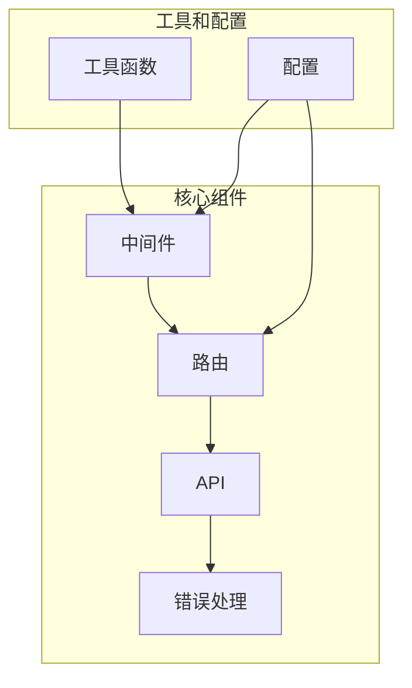

**图源**  
- [app-bootstrap.tsx](file://lib/app-bootstrap.tsx#L6-L17)
- [router.js](file://lib/router.js#L3-L800)

**本节源**  
- [app-bootstrap.tsx](file://lib/app-bootstrap.tsx#L1-L54)
- [router.js](file://lib/router.js#L1-L800)

## 核心组件
RSSHub的核心组件包括中间件、路由、API和错误处理。中间件负责处理请求和响应的预处理和后处理，如访问控制、缓存、日志记录等。路由系统定义了URL路径与处理函数的映射关系，支持懒加载以提高性能。API提供了统一的接口来处理各种请求，而错误处理则确保了系统的稳定性和可靠性。

**本节源**  
- [access-control.ts](file://lib/middleware/access-control.ts#L1-L27)
- [cache.ts](file://lib/middleware/cache.ts#L1-L84)
- [logger.ts](file://lib/middleware/logger.ts#L1-L46)
- [header.ts](file://lib/middleware/header.ts#L1-L56)
- [debug.ts](file://lib/middleware/debug.ts#L1-L41)
- [sentry.ts](file://lib/middleware/sentry.ts#L1-L29)
- [trace.ts](file://lib/middleware/trace.ts#L1-L27)

## 架构概述
RSSHub的架构设计遵循模块化和分层的原则，确保了系统的可维护性和扩展性。中间件层位于最外层，负责处理请求和响应的预处理和后处理。路由层定义了URL路径与处理函数的映射关系，支持懒加载以提高性能。API层提供了统一的接口来处理各种请求，而错误处理层则确保了系统的稳定性和可靠性。

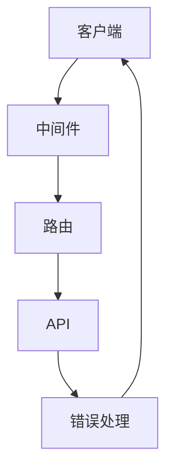

**图源**  
- [app-bootstrap.tsx](file://lib/app-bootstrap.tsx#L25-L54)
- [router.js](file://lib/router.js#L3-L800)

## 详细组件分析
### 访问控制中间件
访问控制中间件负责验证请求的合法性，确保只有授权用户才能访问特定资源。它通过检查请求中的`key`和`code`参数来实现访问控制。

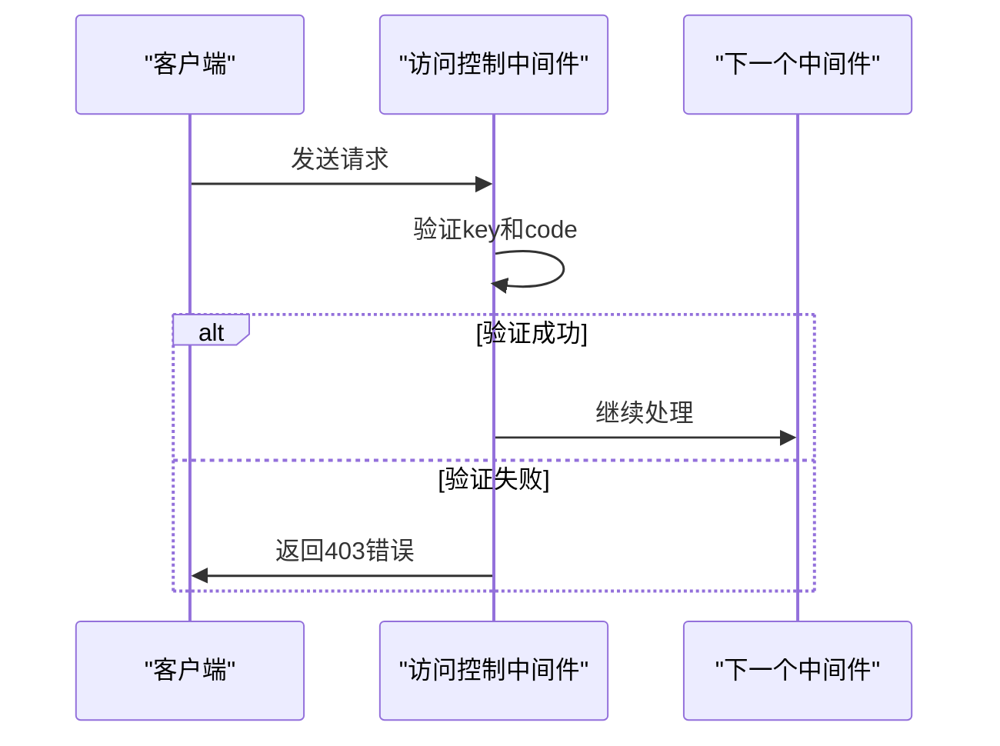

**图源**  
- [access-control.ts](file://lib/middleware/access-control.ts#L1-L27)

**本节源**  
- [access-control.ts](file://lib/middleware/access-control.ts#L1-L27)

### 缓存中间件
缓存中间件负责缓存响应数据，减少对后端服务的请求次数，提高系统性能。它通过检查请求路径和查询参数来确定是否命中缓存。

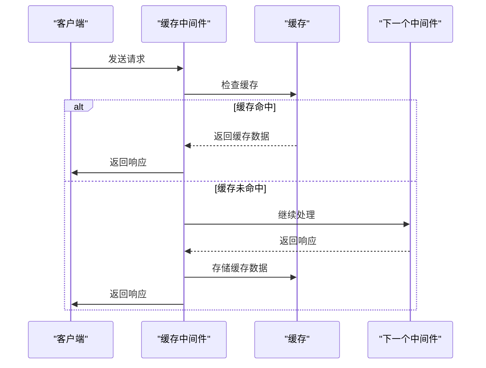

**图源**  
- [cache.ts](file://lib/middleware/cache.ts#L1-L84)

**本节源**  
- [cache.ts](file://lib/middleware/cache.ts#L1-L84)

### 日志记录中间件
日志记录中间件负责记录请求和响应的详细信息，便于调试和监控。它在请求开始和结束时记录日志，包括请求方法、路径、状态码和处理时间。

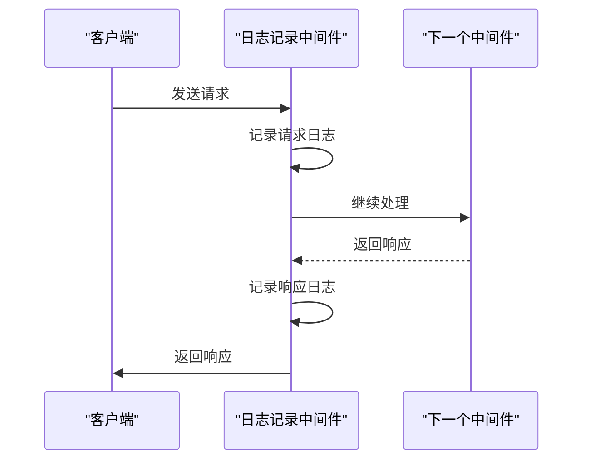

**图源**  
- [logger.ts](file://lib/middleware/logger.ts#L1-L46)

**本节源**  
- [logger.ts](file://lib/middleware/logger.ts#L1-L46)

### 响应头中间件
响应头中间件负责设置响应头，确保响应符合标准。它设置了`Content-Type`、`Cache-Control`等常见的响应头字段。

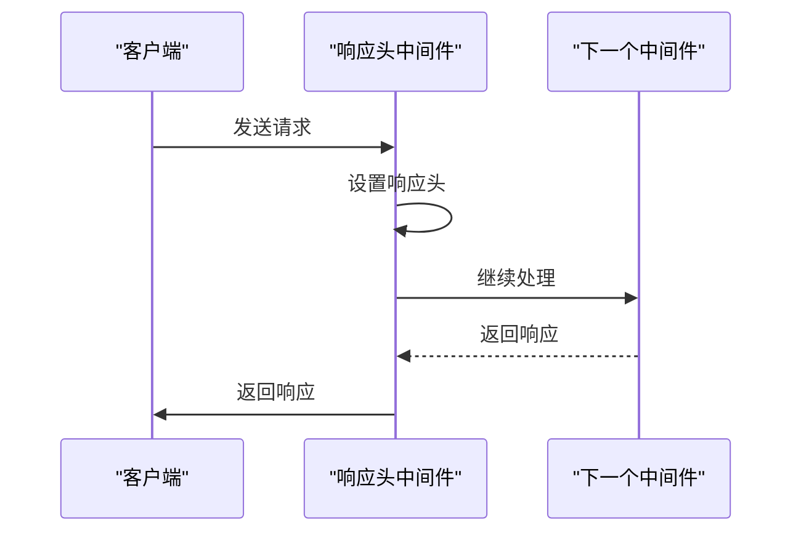

**图源**  
- [header.ts](file://lib/middleware/header.ts#L1-L56)

**本节源**  
- [header.ts](file://lib/middleware/header.ts#L1-L56)

### 调试中间件
调试中间件负责收集和记录调试信息，帮助开发者了解系统的运行状态。它记录了请求次数、缓存命中次数等信息。

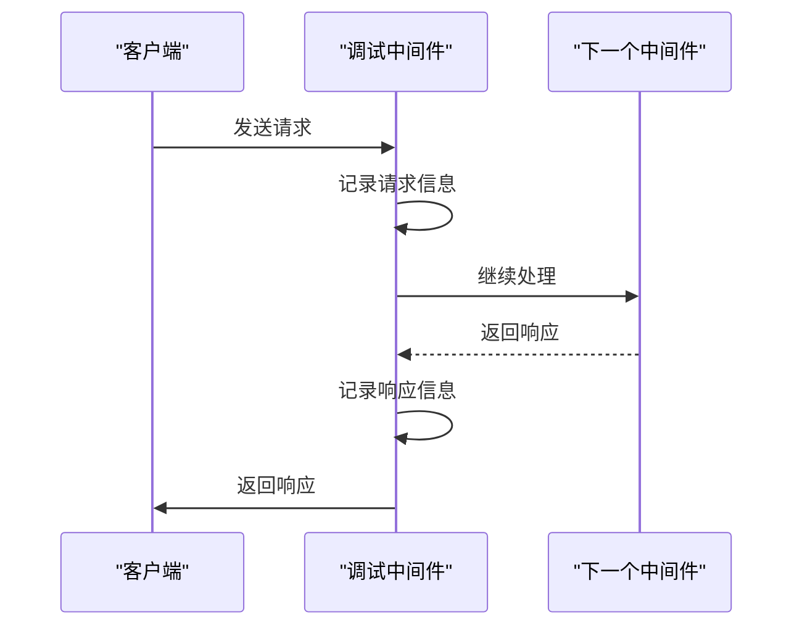

**图源**  
- [debug.ts](file://lib/middleware/debug.ts#L1-L41)

**本节源**  
- [debug.ts](file://lib/middleware/debug.ts#L1-L41)

### 错误追踪中间件
错误追踪中间件负责捕获和报告错误，确保系统的稳定性和可靠性。它使用Sentry来捕获和报告错误。

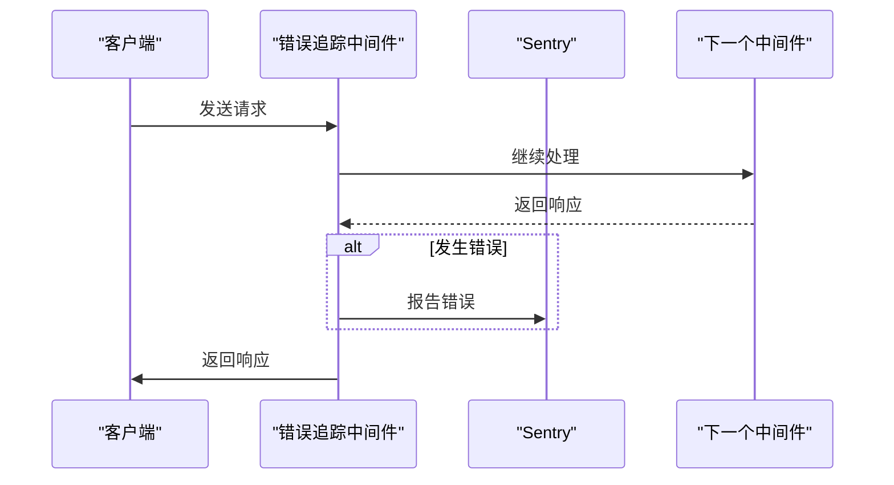

**图源**  
- [sentry.ts](file://lib/middleware/sentry.ts#L1-L29)

**本节源**  
- [sentry.ts](file://lib/middleware/sentry.ts#L1-L29)

### 跟踪中间件
跟踪中间件负责记录请求的处理过程，帮助开发者了解系统的性能瓶颈。它在调试模式下启用，记录了请求的处理时间。

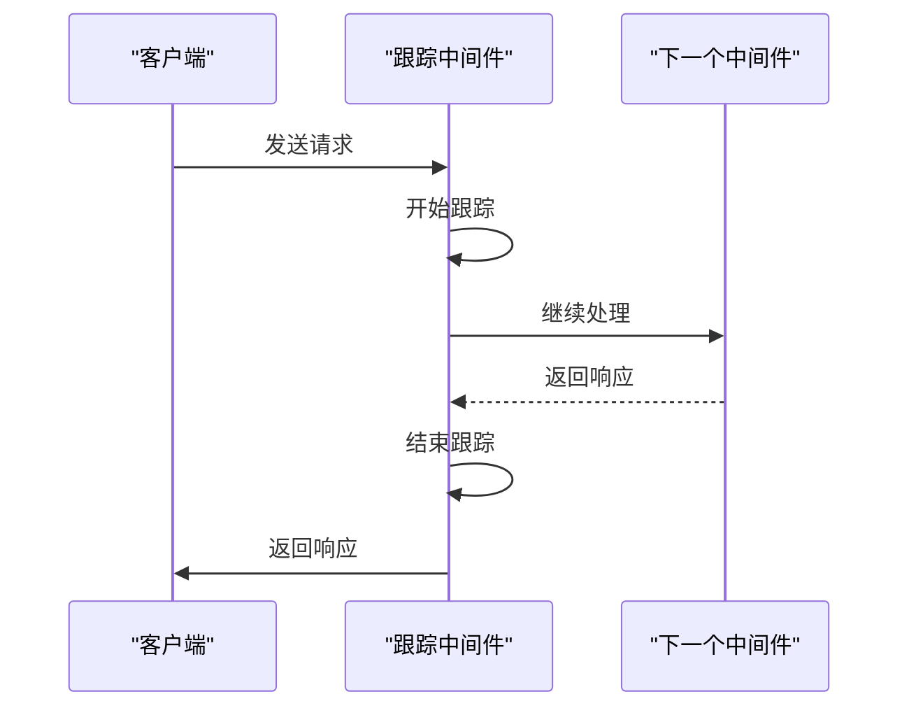

**图源**  
- [trace.ts](file://lib/middleware/trace.ts#L1-L27)

**本节源**  
- [trace.ts](file://lib/middleware/trace.ts#L1-L27)

### 反盗链中间件
反盗链中间件负责防止图片和其他资源被其他网站盗用。它通过检查请求来源和替换资源URL来实现反盗链。

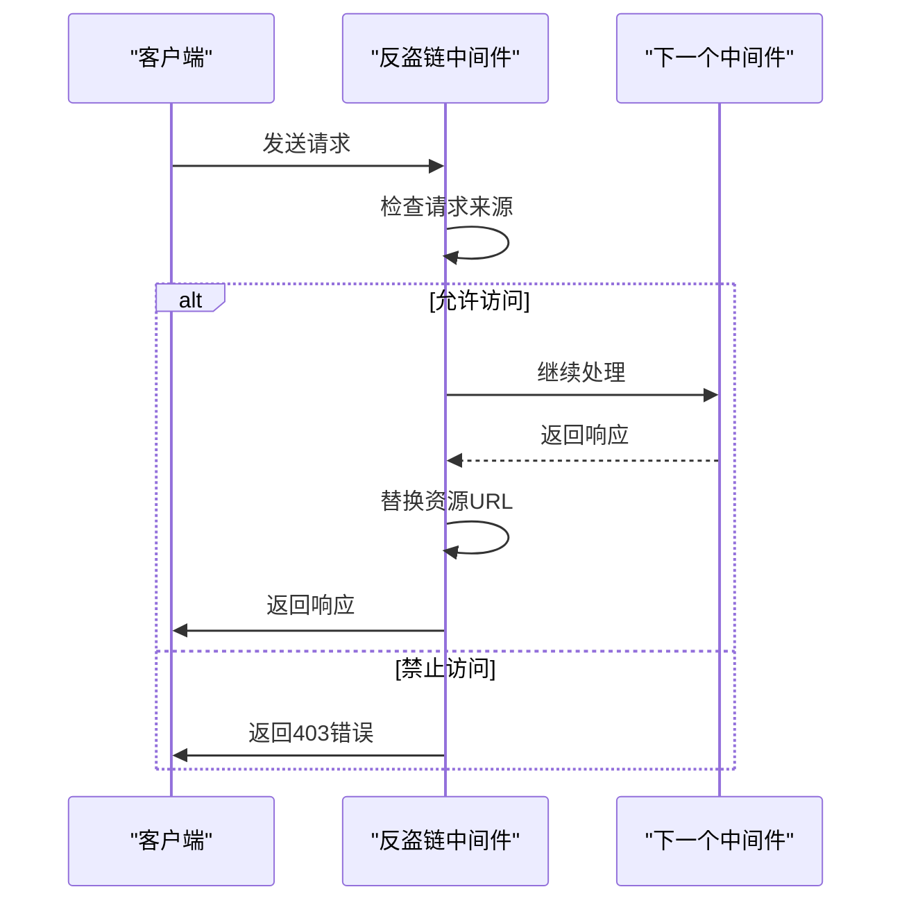

**图源**  
- [anti-hotlink.ts](file://lib/middleware/anti-hotlink.ts#L1-L171)

**本节源**  
- [anti-hotlink.ts](file://lib/middleware/anti-hotlink.ts#L1-L171)

### 参数处理中间件
参数处理中间件负责处理请求中的各种参数，如过滤、排序、限制等。它通过解析请求参数并应用相应的处理逻辑来实现功能。

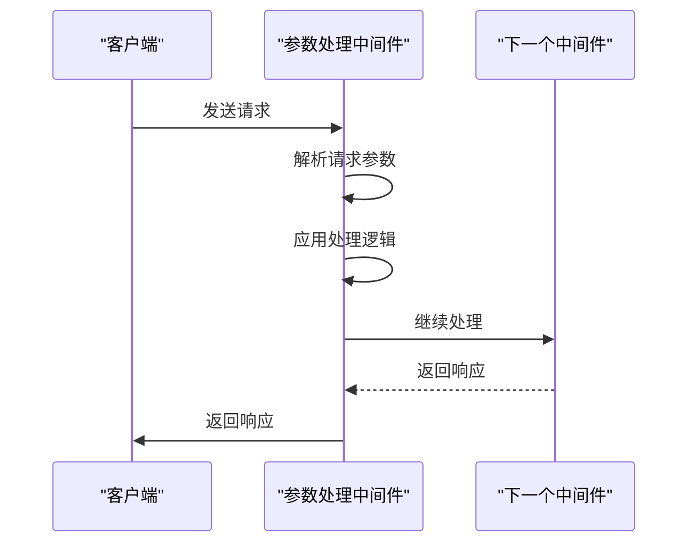

**图源**  
- [parameter.ts](file://lib/middleware/parameter.ts#L1-L429)

**本节源**  
- [parameter.ts](file://lib/middleware/parameter.ts#L1-L429)

### 模板渲染中间件
模板渲染中间件负责将数据渲染成不同的格式，如RSS、JSON、Atom等。它通过解析请求中的`format`参数来确定输出格式。

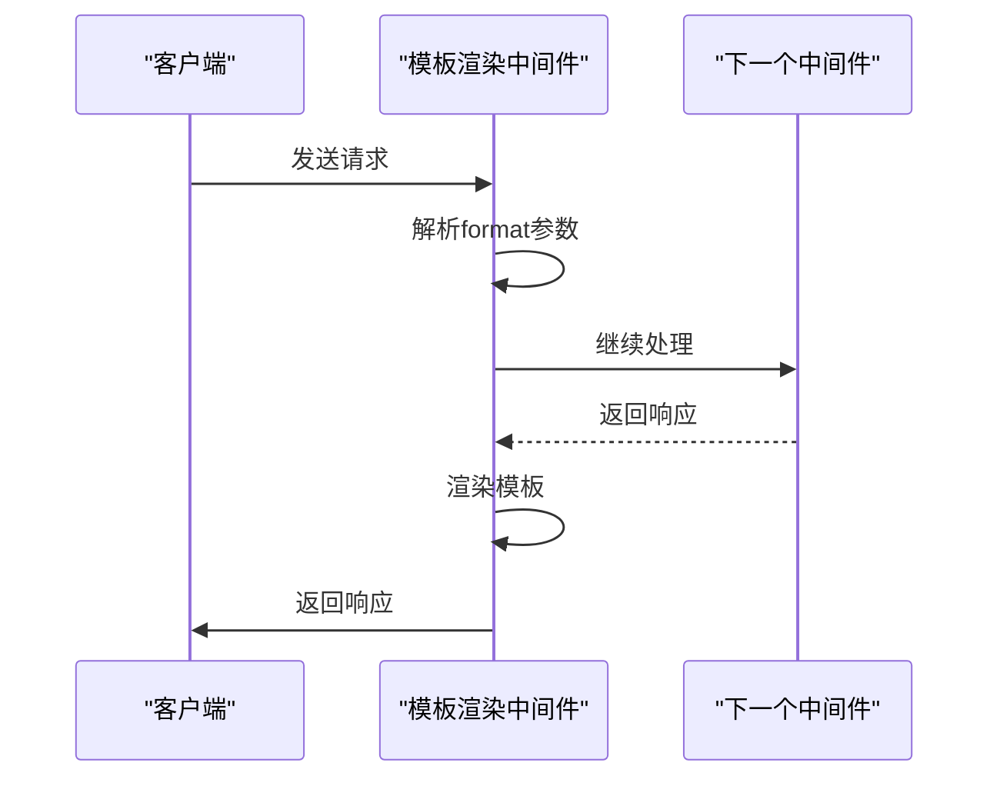

**图源**  
- [template.tsx](file://lib/middleware/template.tsx#L1-L132)

**本节源**  
- [template.tsx](file://lib/middleware/template.tsx#L1-L132)

## 依赖分析
RSSHub的中间件依赖于多个外部库和内部模块。外部库包括`hono`、`cheerio`、`re2js`等，用于处理HTTP请求、解析HTML和正则表达式匹配。内部模块包括`config`、`utils`、`errors`等，用于配置管理、工具函数和错误处理。

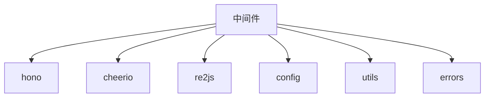

**图源**  
- [access-control.ts](file://lib/middleware/access-control.ts#L1-L27)
- [cache.ts](file://lib/middleware/cache.ts#L1-L84)
- [logger.ts](file://lib/middleware/logger.ts#L1-L46)
- [header.ts](file://lib/middleware/header.ts#L1-L56)
- [debug.ts](file://lib/middleware/debug.ts#L1-L41)
- [sentry.ts](file://lib/middleware/sentry.ts#L1-L29)
- [trace.ts](file://lib/middleware/trace.ts#L1-L27)
- [anti-hotlink.ts](file://lib/middleware/anti-hotlink.ts#L1-L171)
- [parameter.ts](file://lib/middleware/parameter.ts#L1-L429)
- [template.tsx](file://lib/middleware/template.tsx#L1-L132)

**本节源**  
- [access-control.ts](file://lib/middleware/access-control.ts#L1-L27)
- [cache.ts](file://lib/middleware/cache.ts#L1-L84)
- [logger.ts](file://lib/middleware/logger.ts#L1-L46)
- [header.ts](file://lib/middleware/header.ts#L1-L56)
- [debug.ts](file://lib/middleware/debug.ts#L1-L41)
- [sentry.ts](file://lib/middleware/sentry.ts#L1-L29)
- [trace.ts](file://lib/middleware/trace.ts#L1-L27)
- [anti-hotlink.ts](file://lib/middleware/anti-hotlink.ts#L1-L171)
- [parameter.ts](file://lib/middleware/parameter.ts#L1-L429)
- [template.tsx](file://lib/middleware/template.tsx#L1-L132)

## 性能考虑
在开发中间件时，性能是一个重要的考虑因素。以下是一些性能优化建议：
- **缓存**：合理使用缓存可以显著减少对后端服务的请求次数，提高系统性能。
- **懒加载**：使用懒加载机制可以减少启动时间和内存占用。
- **异步处理**：尽可能使用异步处理，避免阻塞主线程。
- **资源管理**：及时释放不再使用的资源，避免内存泄漏。

## 故障排除指南
在开发和使用中间件时，可能会遇到各种问题。以下是一些常见的故障排除方法：
- **日志记录**：启用日志记录功能，查看详细的请求和响应信息。
- **调试模式**：在调试模式下运行，可以获取更多的调试信息。
- **错误追踪**：使用Sentry等工具捕获和报告错误，帮助快速定位问题。
- **单元测试**：编写单元测试，确保中间件的正确性和稳定性。

**本节源**  
- [logger.ts](file://lib/middleware/logger.ts#L1-L46)
- [debug.ts](file://lib/middleware/debug.ts#L1-L41)
- [sentry.ts](file://lib/middleware/sentry.ts#L1-L29)

## 结论
本文档详细介绍了RSSHub中间件的开发指南，涵盖了环境设置、代码结构、类型定义和测试方法。通过多个实际案例，展示了从简单到复杂的中间件开发过程，包括请求拦截、响应修改、错误处理和日志记录等场景。文档还提供了代码规范、性能优化建议和安全最佳实践，帮助开发者更好地理解和使用RSSHub的中间件系统。