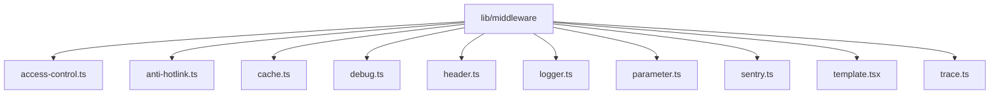
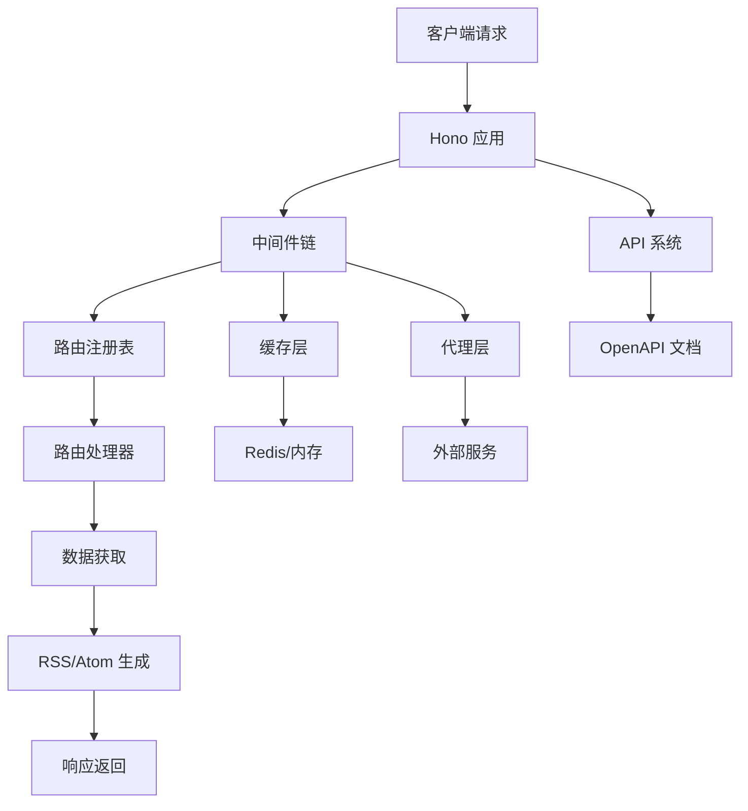
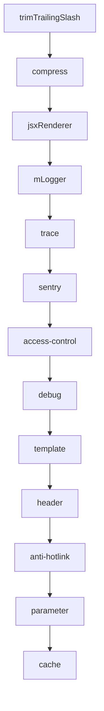
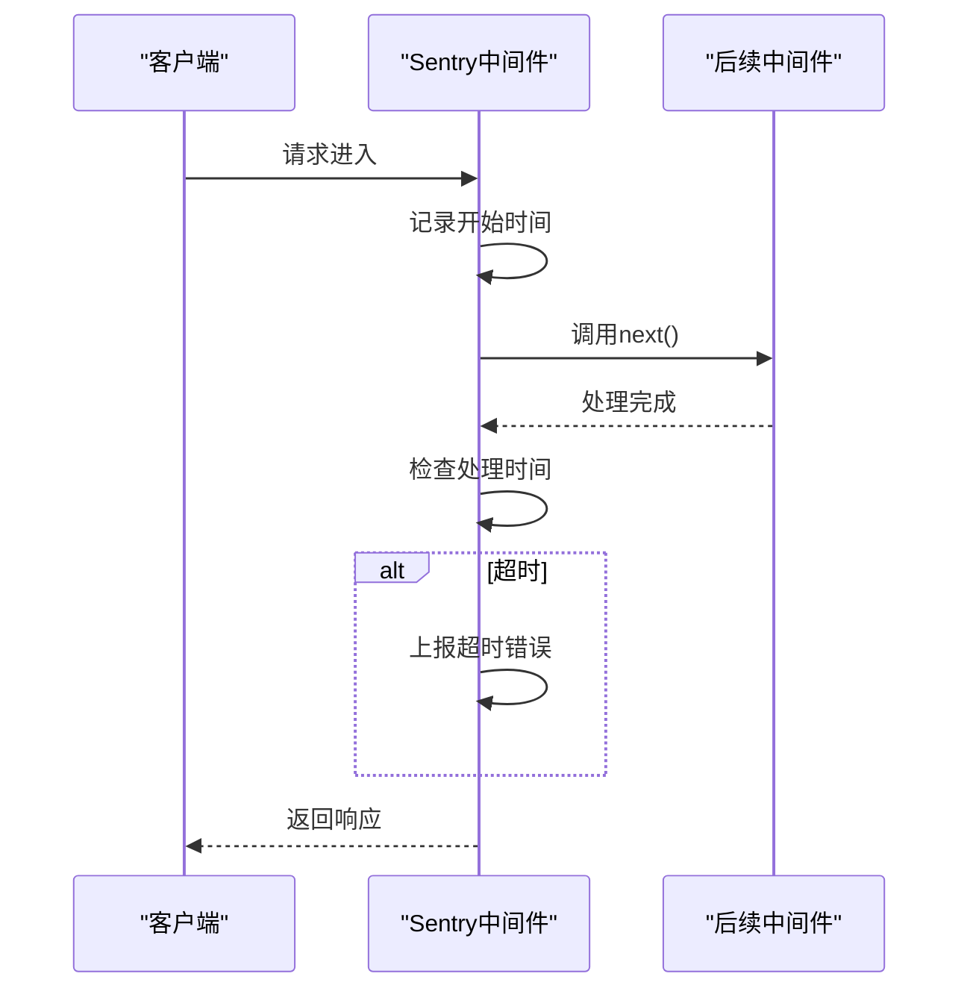
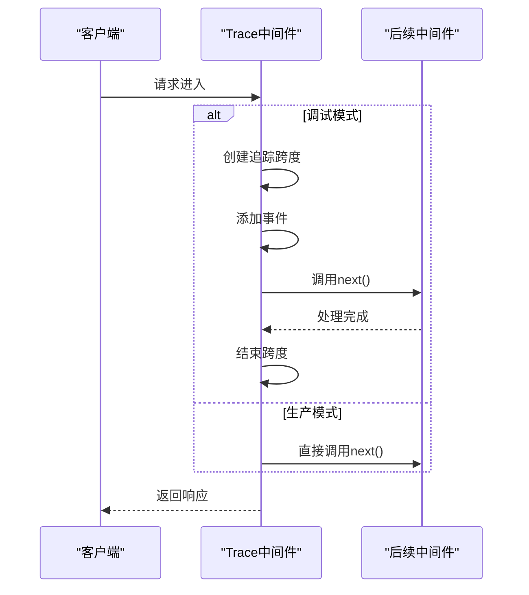
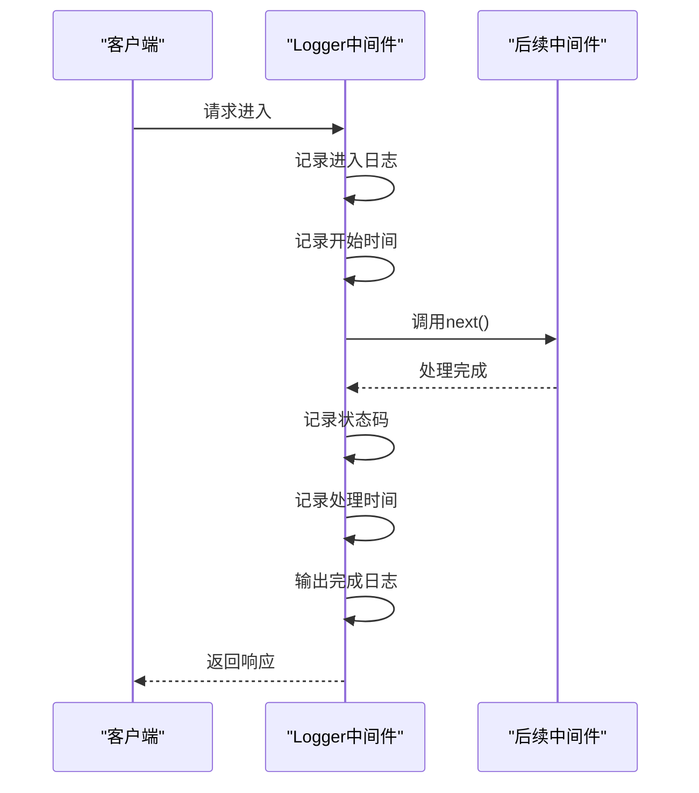
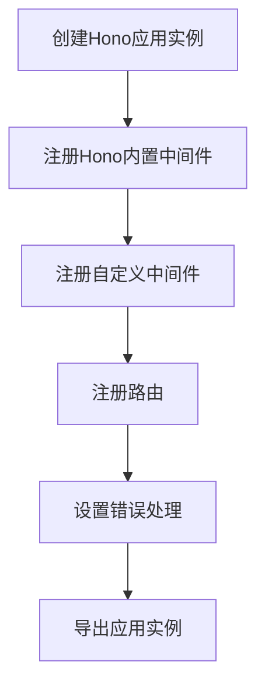
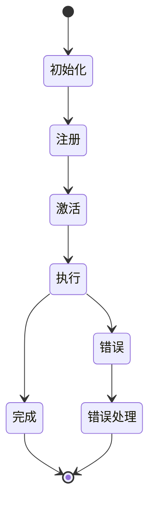
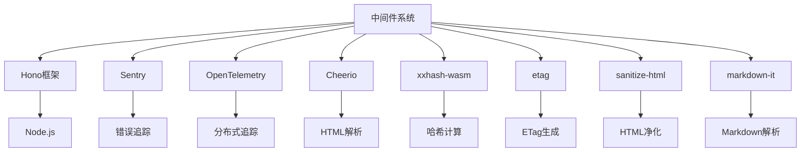

# 中间件机制

<cite>
**本文档引用的文件**
- [app-bootstrap.tsx](file://lib/app-bootstrap.tsx)
- [app.ts](file://lib/app.ts)
- [index.ts](file://lib/index.ts)
- [registry.ts](file://lib/registry.ts)
- [sentry.ts](file://lib/middleware/sentry.ts)
- [trace.ts](file://lib/middleware/trace.ts)
- [logger.ts](file://lib/middleware/logger.ts)
- [access-control.ts](file://lib/middleware/access-control.ts)
- [anti-hotlink.ts](file://lib/middleware/anti-hotlink.ts)
- [cache.ts](file://lib/middleware/cache.ts)
- [header.ts](file://lib/middleware/header.ts)
- [parameter.ts](file://lib/middleware/parameter.ts)
- [template.tsx](file://lib/middleware/template.tsx)
- [CLAUDE.md](file://lib/middleware/CLAUDE.md)
</cite>

## 目录
1. [简介](#简介)
2. [项目结构](#项目结构)
3. [核心组件](#核心组件)
4. [架构概述](#架构概述)
5. [详细组件分析](#详细组件分析)
6. [依赖分析](#依赖分析)
7. [性能考虑](#性能考虑)
8. [故障排除指南](#故障排除指南)
9. [结论](#结论)

## 简介
RSSHub 是一个基于 Hono 框架构建的开源 RSS 生成器，其核心功能依赖于精心设计的中间件机制。该机制通过一系列有序执行的中间件处理 HTTP 请求，实现了从请求接收、安全控制、缓存管理到响应生成的完整流程。中间件系统不仅提供了灵活的扩展能力，还确保了系统的高性能和可维护性。本文档详细介绍了 RSSHub 中间件的执行流程、注册机制和生命周期管理，以及 Hono 框架中间件与 RSSHub 自定义中间件的集成方式。

## 项目结构
RSSHub 的中间件系统位于 `lib/middleware` 目录下，包含多个功能独立的中间件模块。这些模块按功能分类，共同构成了完整的请求处理链。中间件的注册和执行顺序在 `lib/app-bootstrap.tsx` 文件中定义，确保了请求处理的逻辑一致性。

**图示来源**
- [app-bootstrap.tsx](file://lib/app-bootstrap.tsx#L8-L17)
- [middleware 目录](file://lib/middleware)

**本节来源**
- [app-bootstrap.tsx](file://lib/app-bootstrap.tsx#L1-L54)
- [middleware 目录](file://lib/middleware)

## 核心组件
RSSHub 的中间件系统由多个核心组件构成，每个组件负责特定的功能。这些组件包括访问控制、缓存管理、请求头处理、参数处理等。中间件的执行顺序经过精心设计，确保了安全性和性能的平衡。Hono 框架提供的基础中间件与 RSSHub 自定义中间件无缝集成，形成了一个完整的请求处理管道。

**本节来源**
- [app-bootstrap.tsx](file://lib/app-bootstrap.tsx#L27-L45)
- [CLAUDE.md](file://lib/middleware/CLAUDE.md#L76-L92)

## 架构概述
RSSHub 的中间件架构基于 Hono 框架的中间件机制构建。整个系统从请求进入开始，依次经过多个中间件处理，最终生成响应。中间件的执行顺序严格按照注册顺序进行，形成了一个单向的处理管道。这种设计确保了请求处理的可预测性和可维护性。

**图示来源**
- [app-bootstrap.tsx](file://lib/app-bootstrap.tsx#L27-L45)
- [registry.ts](file://lib/registry.ts#L154-L192)

## 详细组件分析

### 中间件执行流程分析
RSSHub 的中间件执行流程严格按照注册顺序进行。每个中间件都有机会在请求处理前后执行特定的逻辑。通过 `await next()` 调用，中间件将控制权传递给下一个中间件，形成一个链式调用结构。这种设计允许中间件在请求处理的不同阶段插入自定义逻辑。

#### 中间件执行顺序

**图示来源**
- [app-bootstrap.tsx](file://lib/app-bootstrap.tsx#L27-L45)
- [CLAUDE.md](file://lib/middleware/CLAUDE.md#L76-L92)

#### Sentry 中间件分析
Sentry 中间件负责错误追踪和性能监控。它在请求处理前后记录时间戳，当请求处理时间超过配置的阈值时，会自动上报超时错误。这种设计有助于及时发现性能瓶颈。

**图示来源**
- [sentry.ts](file://lib/middleware/sentry.ts#L17-L26)
- [config.ts](file://lib/config.ts)

#### Trace 中间件分析
Trace 中间件负责请求追踪，仅在调试模式下启用。它使用 OpenTelemetry 创建追踪跨度，记录请求的处理过程。这种设计有助于在开发和调试阶段分析请求的执行路径。

**图示来源**
- [trace.ts](file://lib/middleware/trace.ts#L7-L23)
- [otel.ts](file://lib/utils/otel.ts)

#### Logger 中间件分析
Logger 中间件负责记录请求日志。它在请求进入和响应返回时输出日志信息，包括请求方法、路径、状态码和处理时间。这种设计有助于监控系统运行状态和排查问题。

**图示来源**
- [logger.ts](file://lib/middleware/logger.ts#L29-L43)
- [helpers.ts](file://lib/utils/helpers.ts)

**本节来源**
- [sentry.ts](file://lib/middleware/sentry.ts#L1-L29)
- [trace.ts](file://lib/middleware/trace.ts#L1-L27)
- [logger.ts](file://lib/middleware/logger.ts#L1-L46)

### 中间件注册机制分析
RSSHub 的中间件注册机制基于 Hono 框架的 `app.use()` 方法实现。所有中间件都在 `app-bootstrap.tsx` 文件中集中注册，确保了注册顺序的一致性。这种设计使得中间件的管理和维护更加方便。

#### 中间件注册流程

**图示来源**
- [app-bootstrap.tsx](file://lib/app-bootstrap.tsx#L25-L53)
- [app.ts](file://lib/app.ts)

#### 中间件生命周期管理

**图示来源**
- [app-bootstrap.tsx](file://lib/app-bootstrap.tsx#L27-L45)
- [middleware 接口](file://node_modules/hono/types.d.ts)

**本节来源**
- [app-bootstrap.tsx](file://lib/app-bootstrap.tsx#L1-L54)
- [app.ts](file://lib/app.ts#L1-L6)

## 依赖分析
RSSHub 的中间件系统依赖于多个外部库和内部模块。这些依赖关系确保了中间件功能的完整性和可靠性。通过分析依赖关系，可以更好地理解中间件系统的架构和设计。

**图示来源**
- [package.json](file://package.json)
- [app-bootstrap.tsx](file://lib/app-bootstrap.tsx#L1-L54)

**本节来源**
- [package.json](file://package.json)
- [app-bootstrap.tsx](file://lib/app-bootstrap.tsx#L1-L54)

## 性能考虑
RSSHub 的中间件系统在设计时充分考虑了性能因素。通过合理的中间件顺序、缓存机制和异步处理，确保了系统的高性能。特别是缓存中间件的设计，有效减少了重复请求的处理时间。

**本节来源**
- [cache.ts](file://lib/middleware/cache.ts)
- [CLAUDE.md](file://lib/middleware/CLAUDE.md)

## 故障排除指南
在使用 RSSHub 中间件系统时，可能会遇到各种问题。通过查看日志、检查配置和使用调试工具，可以有效排查和解决问题。特别是 Sentry 和 Trace 中间件，为错误追踪和性能分析提供了有力支持。

**本节来源**
- [errors.ts](file://lib/errors/index.ts)
- [logger.ts](file://lib/middleware/logger.ts)
- [sentry.ts](file://lib/middleware/sentry.ts)

## 结论
RSSHub 的中间件机制是一个精心设计的系统，通过 Hono 框架的中间件机制与自定义中间件的有机结合，实现了高效、安全、可扩展的 RSS 生成服务。中间件的执行流程、注册机制和生命周期管理都经过深思熟虑，确保了系统的稳定性和可维护性。通过对中间件系统的深入理解，可以更好地利用 RSSHub 的功能，为用户提供高质量的 RSS 订阅服务。