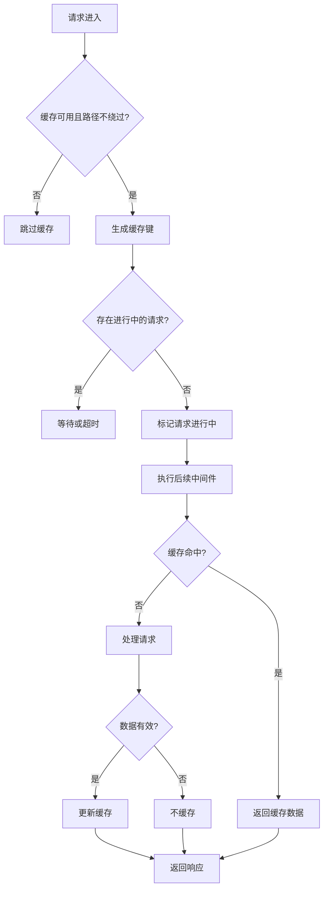
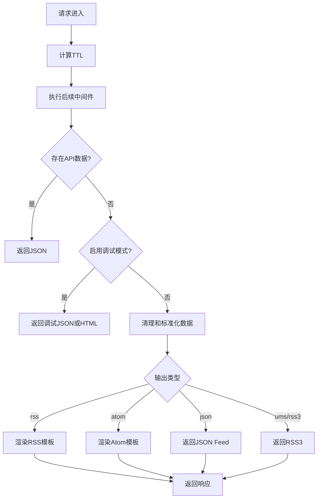

# 中间件类型

<cite>
**本文档中引用的文件**  
- [access-control.ts](file://lib/middleware/access-control.ts)
- [cache.ts](file://lib/middleware/cache.ts)
- [parameter.ts](file://lib/middleware/parameter.ts)
- [template.tsx](file://lib/middleware/template.tsx)
- [header.ts](file://lib/middleware/header.ts)
- [anti-hotlink.ts](file://lib/middleware/anti-hotlink.ts)
- [config.ts](file://lib/config.ts)
- [index.ts](file://lib/utils/cache/index.ts)
</cite>

## 目录
1. [介绍](#介绍)
2. [访问控制中间件](#访问控制中间件)
3. [缓存中间件](#缓存中间件)
4. [参数处理中间件](#参数处理中间件)
5. [模板渲染中间件](#模板渲染中间件)
6. [中间件组合使用与性能评估](#中间件组合使用与性能评估)

## 介绍
RSSHub 的中间件系统是其核心架构的重要组成部分，负责处理请求的预处理、后处理、访问控制、缓存管理、参数解析和响应渲染等关键功能。这些中间件按照特定顺序执行，共同构建了一个高效、安全且可扩展的 RSS 聚合服务。本文档将详细分析四种主要中间件类型：访问控制、缓存、参数处理和模板渲染，阐述其设计原理、配置选项和最佳实践。

## 访问控制中间件

访问控制中间件（`access-control.ts`）负责保护 RSSHub 路由免受未授权访问。它通过密钥或代码验证机制实现访问控制，确保只有持有有效凭证的用户才能访问受保护的路由。

该中间件的工作原理如下：首先检查请求路径是否为公开路径（如根路径、robots.txt 等），如果是则直接放行。对于其他路径，它会检查配置中的 `accessKey` 是否存在。如果存在，则验证请求中的 `key` 参数是否与配置的 `accessKey` 匹配，或者 `code` 参数是否等于请求路径与 `accessKey` 拼接后计算出的 MD5 哈希值。如果验证失败，则抛出拒绝错误，阻止请求继续执行。

此机制提供了两种访问方式：简单的密钥匹配和基于路径的动态代码验证，增强了安全性并防止密钥被轻易猜测。

**Section sources**
- [access-control.ts](file://lib/middleware/access-control.ts#L1-L27)
- [config.ts](file://lib/config.ts#L768)

## 缓存中间件

缓存中间件（`cache.ts`）是提升 RSSHub 性能的关键组件，它通过减少重复的数据抓取和处理操作来显著降低服务器负载和响应时间。

该中间件的实现原理基于 Redis 或内存缓存系统。它首先检查缓存是否可用且请求路径不在绕过列表中。然后，它使用 XXH64 哈希算法将请求路径、格式和限制参数组合成一个唯一的缓存键。在处理请求前，中间件会检查是否存在正在进行的相同请求（通过 `controlKey`），以避免并发请求导致的资源浪费。

如果缓存命中，中间件直接返回缓存数据，并设置 `RSSHub-Cache-Status` 响应头为 `HIT`。如果未命中，中间件会标记该请求正在处理，等待后续请求排队或超时。在路由处理完成后，如果数据有效且未禁用缓存，中间件会将数据序列化并存储到缓存中，设置相应的过期时间。

缓存策略通过配置文件灵活控制，包括缓存类型（内存或 Redis）、路由过期时间和请求超时时间，允许用户根据实际需求进行优化。

**Diagram sources**
- [cache.ts](file://lib/middleware/cache.ts#L1-L84)
- [index.ts](file://lib/utils/cache/index.ts#L1-L60)

**Section sources**
- [cache.ts](file://lib/middleware/cache.ts#L1-L84)
- [config.ts](file://lib/config.ts#L737-L739)

## 参数处理中间件

参数处理中间件（`parameter.ts`）负责处理和转换请求中的各种参数，为用户提供丰富的自定义功能。它支持多种参数，如过滤、限制、全文模式、AI 摘要、简繁转换等。

该中间件在 `next()` 调用后执行，对已生成的数据进行后处理。其主要功能包括：解码 HTML 实体、根据发布时间排序条目、应用正则表达式过滤（支持 `regexp` 和 `re2` 引擎）、限制返回条目数量、启用全文模式（通过 Mercury 解析器获取完整内容）、调用 OpenAI API 生成摘要或重写标题、处理 Sci-Hub 链接、执行简繁体转换以及截取内容摘要。

参数处理中间件的设计体现了高度的模块化和可扩展性。它通过 `config` 对象读取全局配置（如 OpenAI 密钥、过滤引擎等），并根据请求参数动态应用相应的处理逻辑。例如，`filter` 参数支持复杂的正则表达式匹配，而 `opencc` 参数则利用 `simplecc-wasm` 库实现高效的文本转换。

**Section sources**
- [parameter.ts](file://lib/middleware/parameter.ts#L1-L429)
- [config.ts](file://lib/config.ts#L790)

## 模板渲染中间件

模板渲染中间件（`template.tsx`）负责最终的响应格式化和输出。它根据请求的 `format` 参数决定输出格式（如 RSS、Atom、JSON 等），并对数据进行必要的清理和标准化。

该中间件首先根据缓存可用性计算 RSS 的 `<ttl>` 值。然后，它对数据进行预处理，包括折叠空白字符、限制标题长度、清理 Unicode 控制字符以及格式化日期。对于作者信息，它会根据输出格式将其合并为字符串。

在数据处理完成后，中间件根据 `outputType` 参数选择相应的渲染方式。它支持多种输出格式，包括 RSS、Atom、JSON Feed 和 RSS3。对于 HTML 输出，它还支持调试模式，允许用户查看特定条目的原始描述内容。中间件通过 `ctx.render` 方法调用相应的 JSX 组件进行渲染，实现了清晰的视图与逻辑分离。

**Diagram sources**
- [template.tsx](file://lib/middleware/template.tsx#L1-L132)

**Section sources**
- [template.tsx](file://lib/middleware/template.tsx#L1-L132)

## 中间件组合使用与性能评估

RSSHub 的中间件按特定顺序执行，形成一个完整的请求处理管道。典型的执行顺序为：访问控制 → 缓存 → 参数处理 → 模板渲染。这种顺序设计确保了高效率和安全性：访问控制在最前，防止无效请求消耗资源；缓存次之，避免重复计算；参数处理在数据生成后进行转换；模板渲染在最后完成格式化输出。

组合使用中间件时，需注意其相互影响。例如，`anti-hotlink` 中间件依赖 `config` 中的 `hotlink.template` 配置，而 `parameter` 中间件中的 `fulltext` 模式会显著增加响应时间。性能评估表明，缓存中间件对性能提升最为显著，可将重复请求的响应时间降低至毫秒级。而 `parameter` 中间件中的复杂操作（如全文解析、AI 调用）会增加处理延迟，应谨慎使用。

最佳实践建议：对于高流量路由，确保启用缓存并合理设置过期时间；对于需要访问控制的敏感路由，配置 `accessKey`；在使用 `parameter` 中间件的高级功能时，考虑其对性能的影响，并利用 `config` 进行全局优化。

**Section sources**
- [header.ts](file://lib/middleware/header.ts#L1-L56)
- [anti-hotlink.ts](file://lib/middleware/anti-hotlink.ts#L1-L171)
- [registry.ts](file://lib/registry.ts#L192-L271)
- [pkg.ts](file://lib/pkg.ts#L54-L75)