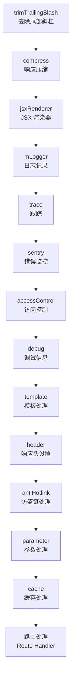
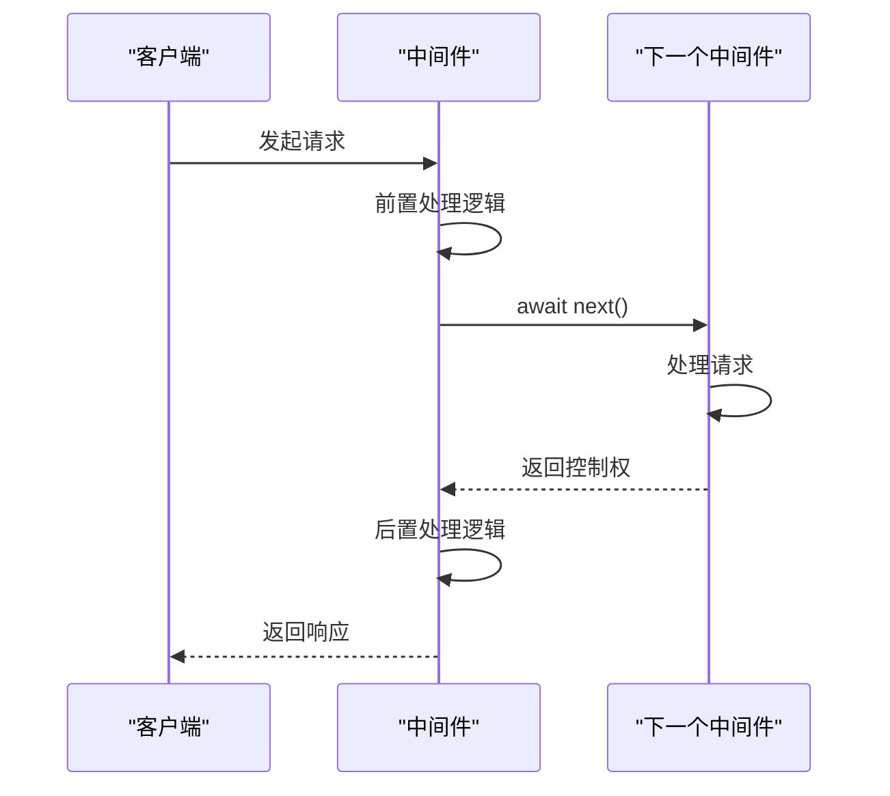
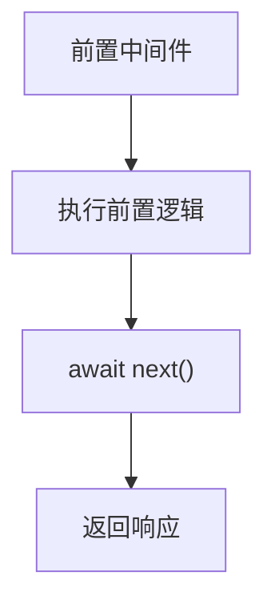
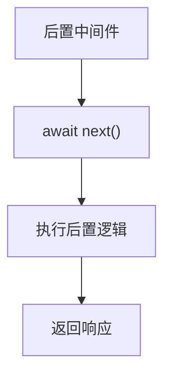
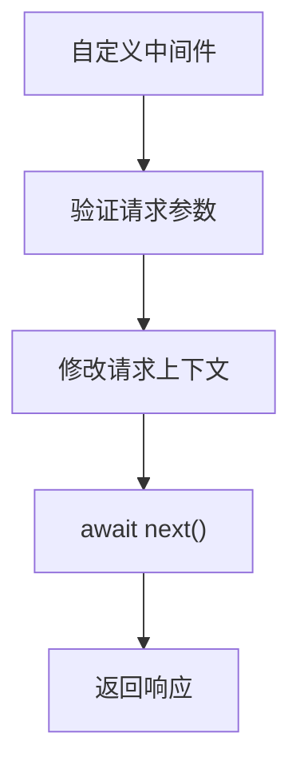
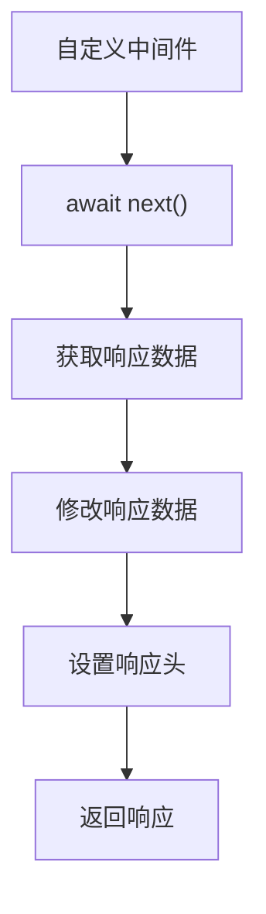
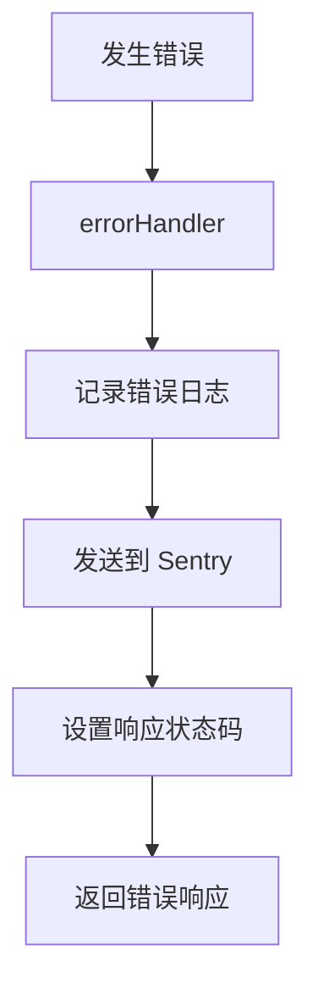

# 路由中间件

<cite>
**本文档中引用的文件**  
- [access-control.ts](file://lib/middleware/access-control.ts)
- [cache.ts](file://lib/middleware/cache.ts)
- [logger.ts](file://lib/middleware/logger.ts)
- [parameter.ts](file://lib/middleware/parameter.ts)
- [header.ts](file://lib/middleware/header.ts)
- [debug.ts](file://lib/middleware/debug.ts)
- [sentry.ts](file://lib/middleware/sentry.ts)
- [trace.ts](file://lib/middleware/trace.ts)
- [anti-hotlink.ts](file://lib/middleware/anti-hotlink.ts)
- [app-bootstrap.tsx](file://lib/app-bootstrap.tsx)
- [config.ts](file://lib/config.ts)
- [router.js](file://lib/router.js)
- [index.tsx](file://lib/errors/index.tsx)
</cite>

## 目录
1. [简介](#简介)
2. [中间件注册与执行顺序](#中间件注册与执行顺序)
3. [中间件生命周期与执行机制](#中间件生命周期与执行机制)
4. [前置中间件与后置中间件的区别](#前置中间件与后置中间件的区别)
5. [核心中间件分析](#核心中间件分析)
6. [自定义中间件开发](#自定义中间件开发)
7. [中间件数据传递与状态管理](#中间件数据传递与状态管理)
8. [错误处理中间件](#错误处理中间件)
9. [最佳实践与常见问题](#最佳实践与常见问题)
10. [总结](#总结)

## 简介

RSSHub 是一个基于 Hono 框架构建的 RSS 生成器，其路由中间件系统是整个应用的核心组成部分。中间件在请求处理流程中扮演着关键角色，负责处理请求预处理、响应后处理、缓存、日志记录、访问控制等多种功能。本文档深入分析 RSSHub 中路由中间件的执行机制，详细说明中间件的注册方式、执行顺序、生命周期，以及如何编写和使用自定义中间件。

**Section sources**
- [app-bootstrap.tsx](file://lib/app-bootstrap.tsx#L1-L54)
- [router.js](file://lib/router.js#L1-L800)

## 中间件注册与执行顺序

RSSHub 的中间件注册主要在 `app-bootstrap.tsx` 文件中完成，通过 Hono 框架的 `use` 方法按特定顺序注册一系列中间件。中间件的执行顺序至关重要，因为它决定了请求处理的流程和逻辑。

**Diagram sources**
- [app-bootstrap.tsx](file://lib/app-bootstrap.tsx#L27-L45)

**Section sources**
- [app-bootstrap.tsx](file://lib/app-bootstrap.tsx#L27-L45)

## 中间件生命周期与执行机制

RSSHub 的中间件遵循 Hono 框架的标准中间件模式，每个中间件都是一个异步函数，接收 `ctx`（上下文）和 `next`（下一个中间件）作为参数。中间件的生命周期包括前置处理、调用下一个中间件和后置处理三个阶段。

**Diagram sources**
- [access-control.ts](file://lib/middleware/access-control.ts#L11-L27)
- [cache.ts](file://lib/middleware/cache.ts#L13-L84)

**Section sources**
- [access-control.ts](file://lib/middleware/access-control.ts#L11-L27)
- [cache.ts](file://lib/middleware/cache.ts#L13-L84)

## 前置中间件与后置中间件的区别

在 RSSHub 中，中间件可以分为前置中间件和后置中间件，这种区分主要基于它们在 `await next()` 调用前后的执行位置。

### 前置中间件

前置中间件在 `await next()` 之前执行，主要用于请求预处理，如身份验证、日志记录、请求修改等。

### 后置中间件

后置中间件在 `await next()` 之后执行，主要用于响应后处理，如缓存存储、响应头设置、数据转换等。

**Diagram sources**
- [logger.ts](file://lib/middleware/logger.ts#L29-L46)
- [parameter.ts](file://lib/middleware/parameter.ts#L67-L429)

**Section sources**
- [logger.ts](file://lib/middleware/logger.ts#L29-L46)
- [parameter.ts](file://lib/middleware/parameter.ts#L67-L429)

## 核心中间件分析

### 访问控制中间件 (access-control)

访问控制中间件负责处理请求的身份验证和访问权限控制。它通过检查请求中的 `key` 或 `code` 参数来验证访问权限。

**Section sources**
- [access-control.ts](file://lib/middleware/access-control.ts#L1-L27)

### 缓存中间件 (cache)

缓存中间件是 RSSHub 性能优化的核心组件，负责处理请求的缓存逻辑。它使用 Redis 或内存作为缓存存储，通过哈希值作为缓存键来存储和检索数据。

**Section sources**
- [cache.ts](file://lib/middleware/cache.ts#L1-L84)

### 参数处理中间件 (parameter)

参数处理中间件负责处理请求中的各种参数，如过滤、排序、格式转换等。它是 RSSHub 功能丰富性的关键，支持多种参数处理逻辑。

**Section sources**
- [parameter.ts](file://lib/middleware/parameter.ts#L67-L429)

### 响应头中间件 (header)

响应头中间件负责设置响应头信息，包括内容类型、缓存控制、ETag 等。它还实现了 HTTP 缓存验证机制，通过 ETag 和 Last-Modified 头来支持 304 Not Modified 响应。

**Section sources**
- [header.ts](file://lib/middleware/header.ts#L22-L56)

### 日志记录中间件 (logger)

日志记录中间件负责记录请求和响应的日志信息，包括请求方法、路径、状态码和处理时间。它使用彩色输出来区分不同类型的日志信息。

**Section sources**
- [logger.ts](file://lib/middleware/logger.ts#L29-L46)

## 自定义中间件开发

### 中间件基本结构

在 RSSHub 中创建自定义中间件需要遵循 Hono 框架的中间件模式，使用 `MiddlewareHandler` 类型定义中间件函数。

**Section sources**
- [app-bootstrap.tsx](file://lib/app-bootstrap.tsx#L6-L17)

### 请求预处理中间件示例

**Diagram sources**
- [access-control.ts](file://lib/middleware/access-control.ts#L11-L27)

### 响应后处理中间件示例

**Diagram sources**
- [parameter.ts](file://lib/middleware/parameter.ts#L67-L429)

## 中间件数据传递与状态管理

### 上下文对象 (Context)

RSSHub 使用 Hono 的上下文对象作为中间件之间数据传递的主要机制。通过 `ctx.set()` 和 `ctx.get()` 方法可以在中间件之间共享数据。

**Section sources**
- [cache.ts](file://lib/middleware/cache.ts#L60-L62)
- [parameter.ts](file://lib/middleware/parameter.ts#L70-L71)

### 配置信息访问

中间件可以通过导入 `config` 模块来访问应用的配置信息，包括缓存设置、访问控制密钥、日志级别等。

**Section sources**
- [config.ts](file://lib/config.ts#L239-L800)

### 路由参数访问

中间件可以通过 `ctx.req` 对象访问路由参数和查询参数，实现基于路径和参数的条件逻辑处理。

**Section sources**
- [access-control.ts](file://lib/middleware/access-control.ts#L13-L14)
- [parameter.ts](file://lib/middleware/parameter.ts#L198-L212)

## 错误处理中间件

### 全局错误处理

RSSHub 通过 `app.onError()` 方法注册全局错误处理中间件，统一处理所有未捕获的异常。

**Diagram sources**
- [index.tsx](file://lib/errors/index.tsx#L13-L83)

### 错误类型处理

RSSHub 定义了多种自定义错误类型，如 `RejectError`、`RequestInProgressError`、`NotFoundError` 等，每种错误类型对应不同的 HTTP 状态码和处理逻辑。

**Section sources**
- [index.tsx](file://lib/errors/index.tsx#L13-L83)

## 最佳实践与常见问题

### 中间件编写最佳实践

1. **保持中间件单一职责**：每个中间件应该只负责一个特定的功能。
2. **正确处理异步操作**：确保所有异步操作都使用 `await` 正确处理。
3. **避免阻塞操作**：尽量避免在中间件中执行耗时的同步操作。
4. **合理使用上下文**：通过 `ctx.set()` 和 `ctx.get()` 在中间件之间传递数据。

### 常见问题解决方案

1. **中间件执行顺序问题**：确保中间件按正确的顺序注册，前置处理的中间件应该在后置处理的中间件之前。
2. **缓存键冲突**：使用唯一的哈希算法生成缓存键，避免不同请求的缓存冲突。
3. **内存泄漏**：及时清理不再需要的缓存数据，避免内存占用过高。

**Section sources**
- [app-bootstrap.tsx](file://lib/app-bootstrap.tsx#L30-L45)
- [cache.ts](file://lib/middleware/cache.ts#L22-L24)

## 总结

RSSHub 的路由中间件系统是一个精心设计的架构，通过一系列有序执行的中间件实现了请求处理的模块化和可扩展性。理解中间件的注册方式、执行顺序和生命周期对于开发和维护 RSSHub 应用至关重要。通过遵循最佳实践和合理使用中间件，可以构建出高效、可靠和易于维护的 RSS 生成服务。