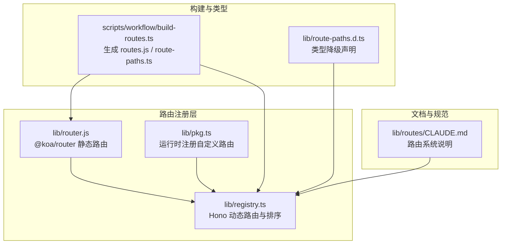
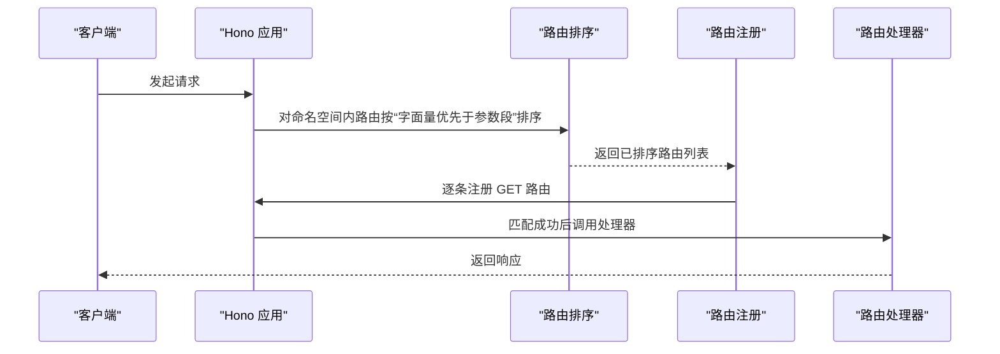
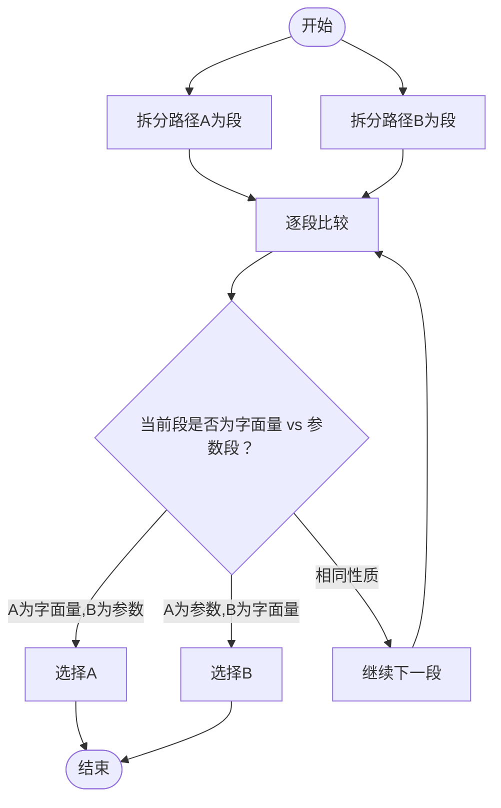
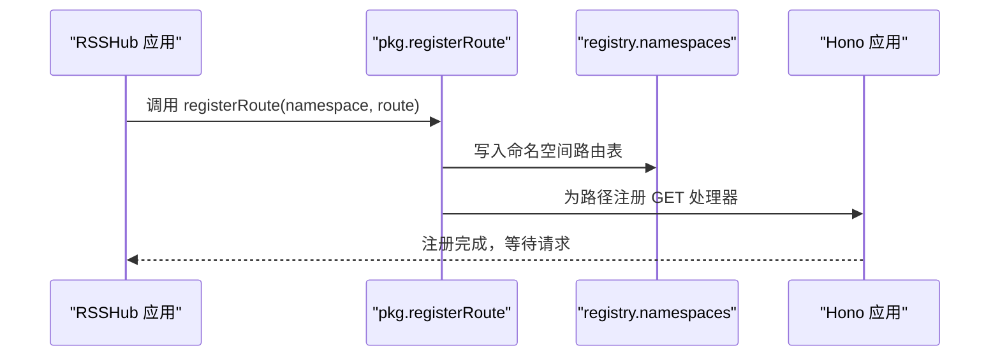
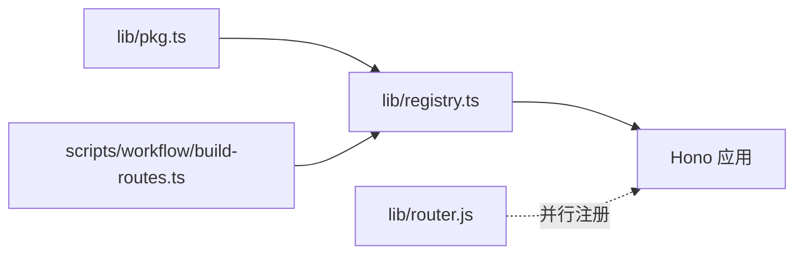

# 匹配优先级

<cite>
**本文引用的文件**
- [lib/router.js](file://lib/router.js)
- [lib/registry.ts](file://lib/registry.ts)
- [lib/pkg.ts](file://lib/pkg.ts)
- [lib/route-paths.d.ts](file://lib/route-paths.d.ts)
- [scripts/workflow/build-routes.ts](file://scripts/workflow/build-routes.ts)
- [lib/routes/CLAUDE.md](file://lib/routes/CLAUDE.md)
</cite>

## 目录
1. [引言](#引言)
2. [项目结构](#项目结构)
3. [核心组件](#核心组件)
4. [架构总览](#架构总览)
5. [详细组件分析](#详细组件分析)
6. [依赖关系分析](#依赖关系分析)
7. [性能考量](#性能考量)
8. [故障排查指南](#故障排查指南)
9. [结论](#结论)
10. [附录](#附录)

## 引言
本篇文档聚焦 RSSHub 路由匹配的优先级规则与决策机制，系统性解释当多个路由规则可能匹配同一请求时的判定逻辑。重点覆盖以下方面：
- 路由定义顺序与路径特异性对匹配结果的影响
- 参数段与字面量段的优先级差异
- 实际代码中的优先级判定实现位置与调用链
- 如何通过合理的路由设计避免优先级冲突
- 边界情况与异常处理策略

## 项目结构
RSSHub 的路由系统由两类入口构成：
- 传统基于 @koa/router 的静态路由注册（lib/router.js）
- 基于 Hono 的动态命名空间路由注册与排序（lib/registry.ts）

此外，pkg.ts 提供运行时注册自定义路由的能力；build-routes.ts 生成构建产物与类型声明；CLAUDE.md 提供路由系统的背景与组织方式。

图表来源
- [lib/router.js](file://lib/router.js#L1-L20)
- [lib/registry.ts](file://lib/registry.ts#L154-L216)
- [lib/pkg.ts](file://lib/pkg.ts#L40-L75)
- [scripts/workflow/build-routes.ts](file://scripts/workflow/build-routes.ts#L112-L127)
- [lib/route-paths.d.ts](file://lib/route-paths.d.ts#L1-L5)
- [lib/routes/CLAUDE.md](file://lib/routes/CLAUDE.md#L1-L51)

章节来源
- [lib/router.js](file://lib/router.js#L1-L20)
- [lib/registry.ts](file://lib/registry.ts#L154-L216)
- [lib/pkg.ts](file://lib/pkg.ts#L40-L75)
- [scripts/workflow/build-routes.ts](file://scripts/workflow/build-routes.ts#L112-L127)
- [lib/routes/CLAUDE.md](file://lib/routes/CLAUDE.md#L1-L51)

## 核心组件
- 路由排序与匹配核心：Hono 应用在注册路由前，对同一命名空间内的路由进行排序，确保“字面量段优先于参数段”的匹配优先级。
- 运行时注册：pkg.ts 提供 registerRoute 方法，允许在应用初始化后动态注册路由，并将其绑定到对应命名空间。
- 构建产物：build-routes.ts 生成 routes.js 与 route-paths.ts，后者用于类型约束，有助于减少运行期错误。
- 传统注册：lib/router.js 仍保留部分历史路由注册，作为兼容层存在。

章节来源
- [lib/registry.ts](file://lib/registry.ts#L154-L216)
- [lib/pkg.ts](file://lib/pkg.ts#L40-L75)
- [scripts/workflow/build-routes.ts](file://scripts/workflow/build-routes.ts#L112-L127)

## 架构总览
下图展示了 RSSHub 路由匹配的总体流程，从命名空间路由注册到请求到达处理器的全过程。

图表来源
- [lib/registry.ts](file://lib/registry.ts#L154-L216)

## 详细组件分析

### 组件A：路由排序与匹配优先级（Hono）
- 排序算法要点
  - 将路由路径按“/”分割为段，逐段比较。
  - 当某一位上出现“字面量段”与“参数段”不一致时，“字面量段”优先。
  - 若前缀完全相同，则保持相对顺序不变（稳定排序）。
- 匹配行为
  - Hono 在注册阶段即保证“字面量段优先”，因此在请求到来时，优先匹配更具体的路径。
  - 该策略有效避免了“参数段过多导致的歧义匹配”。

图表来源
- [lib/registry.ts](file://lib/registry.ts#L154-L182)

章节来源
- [lib/registry.ts](file://lib/registry.ts#L154-L182)

### 组件B：运行时注册与命名空间绑定（pkg.ts）
- registerRoute
  - 初始化后将自定义路由注册到指定命名空间。
  - 将路由路径写入命名空间路由表，并包装处理器以支持缓存与响应类型判断。
- 与排序的关系
  - 注册完成后，Hono 会在下一次请求到来时，依据排序规则进行匹配。
  - 因此，运行时新增的路由也会遵循“字面量优先”的原则。

图表来源
- [lib/pkg.ts](file://lib/pkg.ts#L40-L75)
- [lib/registry.ts](file://lib/registry.ts#L184-L216)

章节来源
- [lib/pkg.ts](file://lib/pkg.ts#L40-L75)
- [lib/registry.ts](file://lib/registry.ts#L184-L216)

### 组件C：传统注册（lib/router.js）
- 作用
  - 保留历史路由注册，便于兼容旧版路由。
  - 采用 @koa/router 的方式直接注册 GET 路由。
- 与 Hono 的关系
  - 两者并存，但 Hono 的排序优先级规则适用于命名空间路由。
  - 传统注册未受排序影响，匹配顺序取决于注册顺序。

章节来源
- [lib/router.js](file://lib/router.js#L1-L20)

### 组件D：构建产物与类型约束（build-routes.ts、route-paths.d.ts）
- build-routes.ts
  - 生成 routes.js 与 route-paths.ts，后者包含所有路由路径的联合类型，便于静态检查。
- route-paths.d.ts
  - 当构建产物不存在时提供类型降级，避免编译期报错。

章节来源
- [scripts/workflow/build-routes.ts](file://scripts/workflow/build-routes.ts#L112-L127)
- [lib/route-paths.d.ts](file://lib/route-paths.d.ts#L1-L5)

## 依赖关系分析
- Hono 应用依赖 registry.ts 中的命名空间路由表与排序逻辑。
- pkg.ts 通过修改 registry.ts 内部的 namespaces 来扩展路由。
- 构建脚本为运行时提供类型约束，降低运行期匹配错误的概率。
- 传统 @koa/router 注册与 Hono 并行存在，需注意命名空间隔离与注册顺序。

图表来源
- [lib/registry.ts](file://lib/registry.ts#L154-L216)
- [lib/pkg.ts](file://lib/pkg.ts#L40-L75)
- [lib/router.js](file://lib/router.js#L1-L20)
- [scripts/workflow/build-routes.ts](file://scripts/workflow/build-routes.ts#L112-L127)

章节来源
- [lib/registry.ts](file://lib/registry.ts#L154-L216)
- [lib/pkg.ts](file://lib/pkg.ts#L40-L75)
- [lib/router.js](file://lib/router.js#L1-L20)
- [scripts/workflow/build-routes.ts](file://scripts/workflow/build-routes.ts#L112-L127)

## 性能考量
- 排序复杂度
  - 对于每个命名空间内的路由集合，排序基于路径段的逐段比较，整体复杂度近似 O(N·S)，其中 N 为路由数量，S 为平均路径段数。
- 匹配复杂度
  - Hono 的匹配在注册阶段已通过“字面量优先”减少歧义，请求阶段的匹配复杂度与路径长度线性相关。
- 建议
  - 尽量使用字面量段表达具体资源，减少参数段泛化，可提升匹配效率与稳定性。
  - 控制单命名空间路由数量，避免过长的排序与匹配链路。

## 故障排查指南
- 症状：多个路由可能匹配同一请求，导致结果不确定
  - 原因：参数段与字面量段混用，且路径前缀相同
  - 解决：调整路径，使更具体的字面量段出现在前缀中；必要时拆分命名空间
- 症状：运行时新增路由未生效或匹配异常
  - 原因：Hono 注册发生在应用初始化阶段，运行时注册需确保在初始化之后
  - 解决：使用 pkg.ts 的 registerRoute，在应用初始化后再注册
- 症状：类型提示缺失或错误
  - 原因：构建产物未生成或类型降级
  - 解决：执行构建脚本生成 routes.js 与 route-paths.ts；确认类型声明可用

章节来源
- [lib/pkg.ts](file://lib/pkg.ts#L40-L75)
- [scripts/workflow/build-routes.ts](file://scripts/workflow/build-routes.ts#L112-L127)
- [lib/route-paths.d.ts](file://lib/route-paths.d.ts#L1-L5)

## 结论
RSSHub 的路由匹配优先级主要由“字面量段优先于参数段”的排序规则决定。该规则在 Hono 的命名空间路由注册阶段生效，确保更具体的路径优先匹配。结合运行时注册能力与构建产物类型约束，可以有效避免优先级冲突并提升路由系统的可维护性与可预测性。建议在设计路由时优先使用字面量段表达业务实体，减少参数段泛化，从而获得更清晰的匹配行为与更好的性能表现。

## 附录
- 路由系统文档参考：[lib/routes/CLAUDE.md](file://lib/routes/CLAUDE.md#L1-L51)