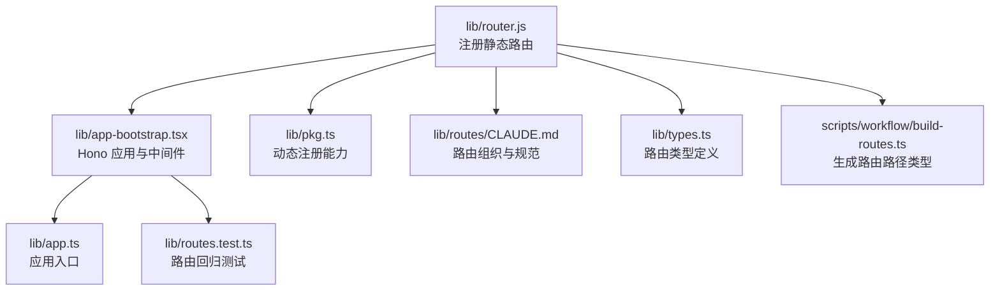
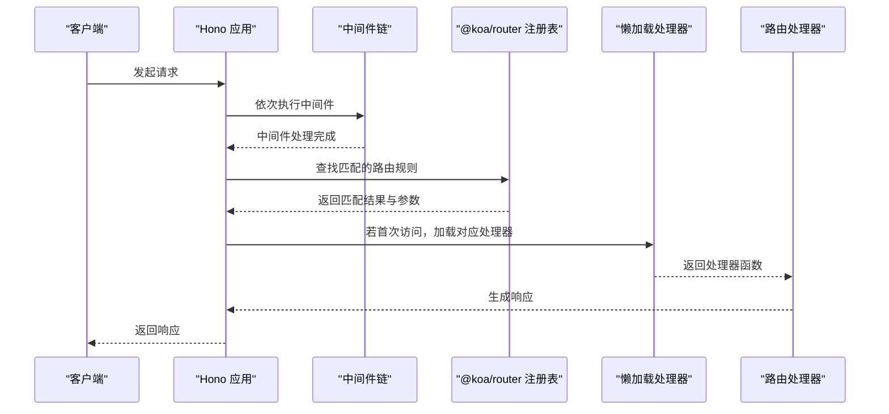
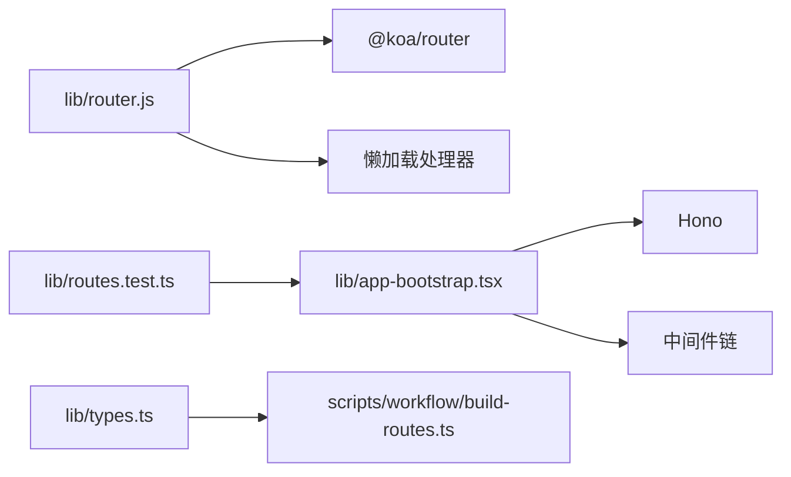

# 匹配算法

<cite>
**本文引用的文件**
- [lib/router.js](file://lib/router.js)
- [lib/app-bootstrap.tsx](file://lib/app-bootstrap.tsx)
- [lib/app.ts](file://lib/app.ts)
- [lib/pkg.ts](file://lib/pkg.ts)
- [lib/routes/CLAUDE.md](file://lib/routes/CLAUDE.md)
- [lib/types.ts](file://lib/types.ts)
- [scripts/workflow/build-routes.ts](file://scripts/workflow/build-routes.ts)
- [lib/routes.test.ts](file://lib/routes.test.ts)
</cite>

## 目录
1. [简介](#简介)
2. [项目结构](#项目结构)
3. [核心组件](#核心组件)
4. [架构总览](#架构总览)
5. [详细组件分析](#详细组件分析)
6. [依赖关系分析](#依赖关系分析)
7. [性能考量](#性能考量)
8. [故障排查指南](#故障排查指南)
9. [结论](#结论)
10. [附录](#附录)

## 简介
本文件聚焦 RSSHub 路由系统中的“匹配算法”，系统性梳理在 lib/router.js 中注册的路由如何被解析与匹配，并结合 Hono 应用层的中间件与路由注册流程，解释精确匹配、前缀匹配、通配符匹配与参数提取的实现原理、时间/空间复杂度、适用场景及在高并发下的性能表现。同时给出优化策略与潜在瓶颈提示，帮助开发者在新增或维护路由时做出更合理的设计选择。

## 项目结构
RSSHub 的路由系统由三部分组成：
- 路由注册层：集中于 lib/router.js，使用 @koa/router 注册大量静态路由规则。
- 应用层：lib/app-bootstrap.tsx 使用 Hono 构建应用并挂载中间件；lib/app.ts 作为入口确保请求重写器先于应用初始化执行。
- 类型与生成：lib/types.ts 定义路由类型；scripts/workflow/build-routes.ts 生成路由路径类型与雷达规则，辅助路由发现与校验。

图表来源
- [lib/router.js](file://lib/router.js#L1-L20)
- [lib/app-bootstrap.tsx](file://lib/app-bootstrap.tsx#L1-L54)
- [lib/app.ts](file://lib/app.ts#L1-L6)
- [lib/pkg.ts](file://lib/pkg.ts#L1-L52)
- [lib/routes/CLAUDE.md](file://lib/routes/CLAUDE.md#L1-L51)
- [lib/types.ts](file://lib/types.ts#L351-L388)
- [scripts/workflow/build-routes.ts](file://scripts/workflow/build-routes.ts#L112-L127)
- [lib/routes.test.ts](file://lib/routes.test.ts#L72-L86)

章节来源
- [lib/router.js](file://lib/router.js#L1-L20)
- [lib/app-bootstrap.tsx](file://lib/app-bootstrap.tsx#L1-L54)
- [lib/app.ts](file://lib/app.ts#L1-L6)
- [lib/pkg.ts](file://lib/pkg.ts#L1-L52)
- [lib/routes/CLAUDE.md](file://lib/routes/CLAUDE.md#L1-L51)
- [lib/types.ts](file://lib/types.ts#L351-L388)
- [scripts/workflow/build-routes.ts](file://scripts/workflow/build-routes.ts#L112-L127)
- [lib/routes.test.ts](file://lib/routes.test.ts#L72-L86)

## 核心组件
- 路由注册器：lib/router.js 使用 @koa/router 实例化路由对象，并通过 get/post/put/delete/all 等方法注册大量静态路由规则。这些规则通常采用“精确匹配”的形式，形如 /namespace/path/:param?。
- 懒加载处理器：lib/router.js 中的 lazyloadRouteHandler 仅在首次访问某路由时才 require 对应的路由处理器，降低启动成本。
- 应用与中间件：lib/app-bootstrap.tsx 创建 Hono 应用，按顺序挂载压缩、日志、缓存、参数清洗、模板渲染等中间件，再将路由注册到 / 与 /api。
- 动态注册：lib/pkg.ts 提供 registerRoute 能力，允许运行时向命名空间注册路由，配合 lib/registry.ts 的命名空间注册表工作。
- 类型与生成：lib/types.ts 定义 Route、RadarItem 等类型；build-routes.ts 生成 route-paths.ts 与雷达规则，提升路由发现与类型安全。

章节来源
- [lib/router.js](file://lib/router.js#L1-L20)
- [lib/app-bootstrap.tsx](file://lib/app-bootstrap.tsx#L1-L54)
- [lib/pkg.ts](file://lib/pkg.ts#L1-L52)
- [lib/types.ts](file://lib/types.ts#L351-L388)
- [scripts/workflow/build-routes.ts](file://scripts/workflow/build-routes.ts#L112-L127)

## 架构总览
下图展示了从请求进入应用到路由匹配与处理的关键路径，以及懒加载与中间件的作用位置。

图表来源
- [lib/app-bootstrap.tsx](file://lib/app-bootstrap.tsx#L1-L54)
- [lib/router.js](file://lib/router.js#L1-L20)
- [lib/pkg.ts](file://lib/pkg.ts#L1-L52)

## 详细组件分析

### 1) 路由注册与匹配模型
- 注册方式：lib/router.js 通过 router.get(...) 等方法注册路由，每条规则对应一个静态路径模板，例如 /namespace/:param? 或带通配符的 /namespace/*。
- 匹配模型：基于 @koa/router 的路径匹配机制，其内部对路由规则进行排序与预处理，支持：
  - 精确匹配：完全一致的路径字符串。
  - 参数提取：冒号前缀的占位符，如 :id。
  - 可选参数：问号后缀的可选段，如 :type?。
  - 通配符：星号后缀的剩余路径，如 :path*。
- 懒加载：首次命中某路由时才 require 对应处理器，避免一次性加载全部路由，降低内存占用与启动时间。

章节来源
- [lib/router.js](file://lib/router.js#L1-L20)
- [lib/router.js](file://lib/router.js#L150-L170)
- [lib/router.js](file://lib/router.js#L156-L163)

### 2) 精确匹配
- 定义：路径完全一致即命中，不包含参数或通配符。
- 典型用法：lib/router.js 中大量以固定路径开头的路由，如 /benedictevans、/wikipedia/mainland 等。
- 复杂度：
  - 时间复杂度：O(P)，P 为路径段数量（由 @koa/router 内部实现决定，通常为线性扫描与排序后的快速匹配）。
  - 空间复杂度：O(R)，R 为注册路由总数（存储路由规则与参数映射）。
- 适用场景：固定资源路径、无需参数提取的接口。
- 高并发表现：由于规则数量庞大（数千条），建议保持路径简洁，减少歧义与冲突，避免过多相似前缀导致匹配代价上升。

章节来源
- [lib/router.js](file://lib/router.js#L20-L120)

### 3) 前缀匹配
- 定义：路径以某个固定前缀开头即视为匹配，常用于同一业务域下的多条路由。
- 典型用法：lib/router.js 中存在大量以相同前缀开头的路由，如 /gov/...、/un/...、/mit/... 等。
- 复杂度：
  - 时间复杂度：O(P)（与精确匹配类似），但前缀冲突较多时可能需要更多比较步骤。
  - 空间复杂度：O(R)。
- 适用场景：同一组织或业务域下的多条路由，便于统一管理与扩展。
- 高并发表现：前缀冲突越多，匹配树或排序越重要；建议在新增路由时尽量避免与现有前缀高度重叠。

章节来源
- [lib/router.js](file://lib/router.js#L386-L420)
- [lib/router.js](file://lib/router.js#L517-L530)

### 4) 通配符匹配（:path*）
- 定义：以星号结尾的通配符，捕获剩余路径片段，常用于“任意层级”的资源路径。
- 典型用法：lib/router.js 中出现多处通配符路由，如 /cqu/jwc/*、/soul/posts/hot/:pid*。
- 复杂度：
  - 时间复杂度：O(N)，N 为输入路径长度（需要逐字符匹配剩余部分）。
  - 空间复杂度：O(K)，K 为捕获的路径片段长度。
- 适用场景：需要灵活处理深层嵌套或未知层级的路径。
- 高并发表现：通配符匹配可能带来额外的字符串处理开销，建议谨慎使用，优先采用明确参数以减少歧义。

章节来源
- [lib/router.js](file://lib/router.js#L156-L163)
- [lib/router.js](file://lib/router.js#L680-L685)

### 5) 参数提取（:id、:type?）
- 定义：通过冒号前缀占位符提取路径参数，问号表示可选。
- 典型用法：lib/router.js 中广泛使用参数占位符，如 /namespace/:id、/namespace/:type?、/namespace/:category/:id 等。
- 复杂度：
  - 时间复杂度：O(P)（参数提取为常量时间，与路径段数量相关）。
  - 空间复杂度：O(M)，M 为参数数量。
- 适用场景：需要根据路径参数动态生成内容的路由。
- 高并发表现：参数提取本身开销很小，但需注意参数命名一致性与冲突，避免误匹配。

章节来源
- [lib/router.js](file://lib/router.js#L20-L120)
- [lib/router.js](file://lib/router.js#L156-L163)

### 6) 懒加载处理器（lazyloadRouteHandler）
- 作用：首次命中某路由时才 require 对应处理器，避免一次性加载全部路由，降低内存占用与启动时间。
- 实现要点：使用 Map 缓存已加载的处理器，重复命中直接复用。
- 复杂度：
  - 首次加载：O(1) 平摊（Map 查找与 require）。
  - 后续命中：O(1)。
- 适用场景：路由数量庞大且处理器较重的系统。
- 高并发表现：在高并发下能显著降低冷启动抖动，但首次请求会有一次 require 的瞬时延迟。

章节来源
- [lib/router.js](file://lib/router.js#L1-L20)

### 7) 应用与中间件链路
- Hono 应用在 lib/app-bootstrap.tsx 中创建，并按顺序挂载中间件：压缩、日志、追踪、Sentry、访问控制、调试、模板、头部、防盗链、参数清洗、缓存等。
- 路由注册：通过 app.route('/', registry) 与 app.route('/api', api) 将路由注册到应用。
- 高并发表现：中间件链路在每次请求都会执行，应尽量保持中间件轻量与高效，避免阻塞主请求链路。

章节来源
- [lib/app-bootstrap.tsx](file://lib/app-bootstrap.tsx#L1-L54)

### 8) 动态注册与类型安全
- 动态注册：lib/pkg.ts 提供 registerRoute 能力，允许运行时向命名空间注册路由，适合插件化或外部扩展场景。
- 类型与生成：lib/types.ts 定义 Route、RadarItem 等类型；scripts/workflow/build-routes.ts 生成 route-paths.ts 与雷达规则，提升路由发现与类型安全。
- 高并发表现：动态注册在运行时进行，需注意并发安全性与命名空间隔离。

章节来源
- [lib/pkg.ts](file://lib/pkg.ts#L1-L52)
- [lib/types.ts](file://lib/types.ts#L351-L388)
- [scripts/workflow/build-routes.ts](file://scripts/workflow/build-routes.ts#L112-L127)

## 依赖关系分析
- 路由注册依赖 @koa/router，匹配算法由其内部实现提供。
- 应用层依赖 Hono，中间件链路贯穿请求生命周期。
- 类型与生成脚本为路由系统提供静态类型与雷达规则，辅助路由发现与测试。

图表来源
- [lib/router.js](file://lib/router.js#L1-L20)
- [lib/app-bootstrap.tsx](file://lib/app-bootstrap.tsx#L1-L54)
- [lib/types.ts](file://lib/types.ts#L351-L388)
- [scripts/workflow/build-routes.ts](file://scripts/workflow/build-routes.ts#L112-L127)
- [lib/routes.test.ts](file://lib/routes.test.ts#L72-L86)

章节来源
- [lib/router.js](file://lib/router.js#L1-L20)
- [lib/app-bootstrap.tsx](file://lib/app-bootstrap.tsx#L1-L54)
- [lib/types.ts](file://lib/types.ts#L351-L388)
- [scripts/workflow/build-routes.ts](file://scripts/workflow/build-routes.ts#L112-L127)
- [lib/routes.test.ts](file://lib/routes.test.ts#L72-L86)

## 性能考量
- 匹配复杂度
  - 精确匹配与前缀匹配：O(P)，P 为路径段数量；受注册规则数量影响，建议减少歧义前缀。
  - 通配符匹配：O(N)，N 为输入路径长度；避免滥用，优先参数化。
  - 参数提取：O(P)，常量级开销。
- 内存与启动
  - 懒加载处理器：首次命中时 require，后续复用，降低启动与内存压力。
- 中间件链路
  - 每次请求均执行，应保持中间件轻量，避免阻塞。
- 高并发建议
  - 合理设计前缀，避免大量相似前缀导致匹配代价上升。
  - 优先使用明确参数而非通配符，减少字符串处理。
  - 控制路由数量增长速度，定期清理无效或重复路由。
  - 利用缓存中间件与参数清洗中间件，减少下游调用与重复计算。

[本节为通用性能讨论，不直接分析具体文件，故无章节来源]

## 故障排查指南
- 路由未命中
  - 检查路径是否与注册规则一致（大小写、斜杠、参数占位符）。
  - 确认是否存在前缀冲突导致误匹配。
  - 使用路由测试用例验证：lib/routes.test.ts 会对已知路由发起请求并断言响应。
- 懒加载异常
  - 首次命中路由时可能出现 require 失败，检查处理器路径是否正确。
- 中间件干扰
  - 某些中间件（如参数清洗、防盗链）可能影响参数提取或请求头，逐一排查。
- 类型与生成问题
  - 若使用自动生成的 route-paths.ts，确认生成脚本是否成功执行且未被忽略。

章节来源
- [lib/routes.test.ts](file://lib/routes.test.ts#L72-L86)
- [lib/router.js](file://lib/router.js#L1-L20)

## 结论
RSSHub 的路由匹配以 @koa/router 为核心，结合 Hono 的中间件链路与懒加载策略，在大规模路由场景下实现了较好的可维护性与启动性能。实践中应优先采用精确匹配与明确参数，谨慎使用通配符，合理设计前缀，以获得更优的匹配效率与可扩展性。同时，利用中间件与类型生成工具，持续提升系统的稳定性与可观测性。

[本节为总结性内容，不直接分析具体文件，故无章节来源]

## 附录
- 路由组织与规范参考：lib/routes/CLAUDE.md
- 路由类型定义：lib/types.ts
- 路由路径类型生成：scripts/workflow/build-routes.ts

章节来源
- [lib/routes/CLAUDE.md](file://lib/routes/CLAUDE.md#L1-L51)
- [lib/types.ts](file://lib/types.ts#L351-L388)
- [scripts/workflow/build-routes.ts](file://scripts/workflow/build-routes.ts#L112-L127)