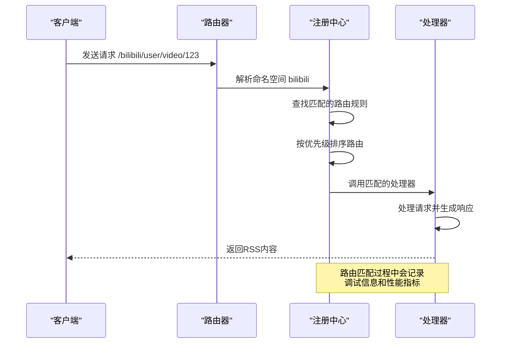
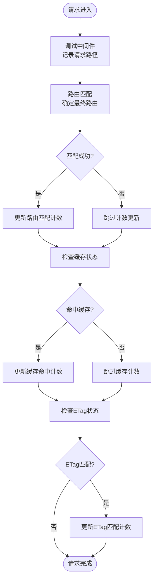
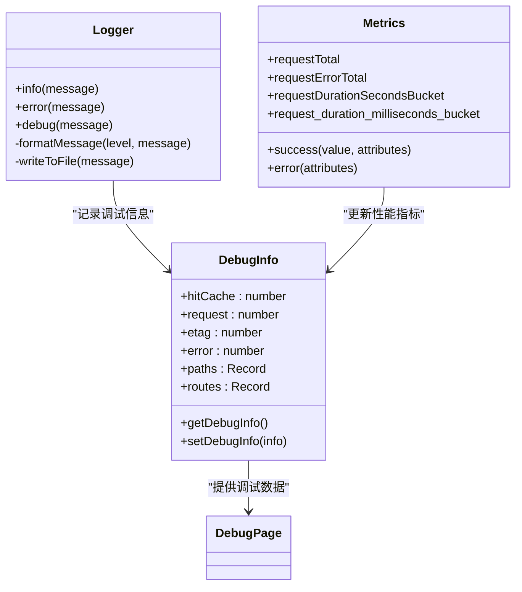
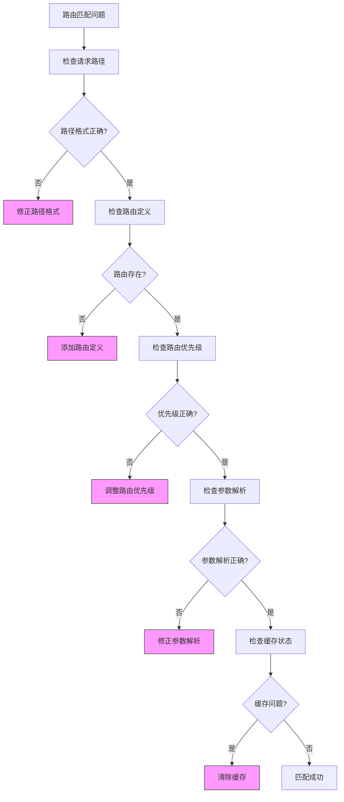
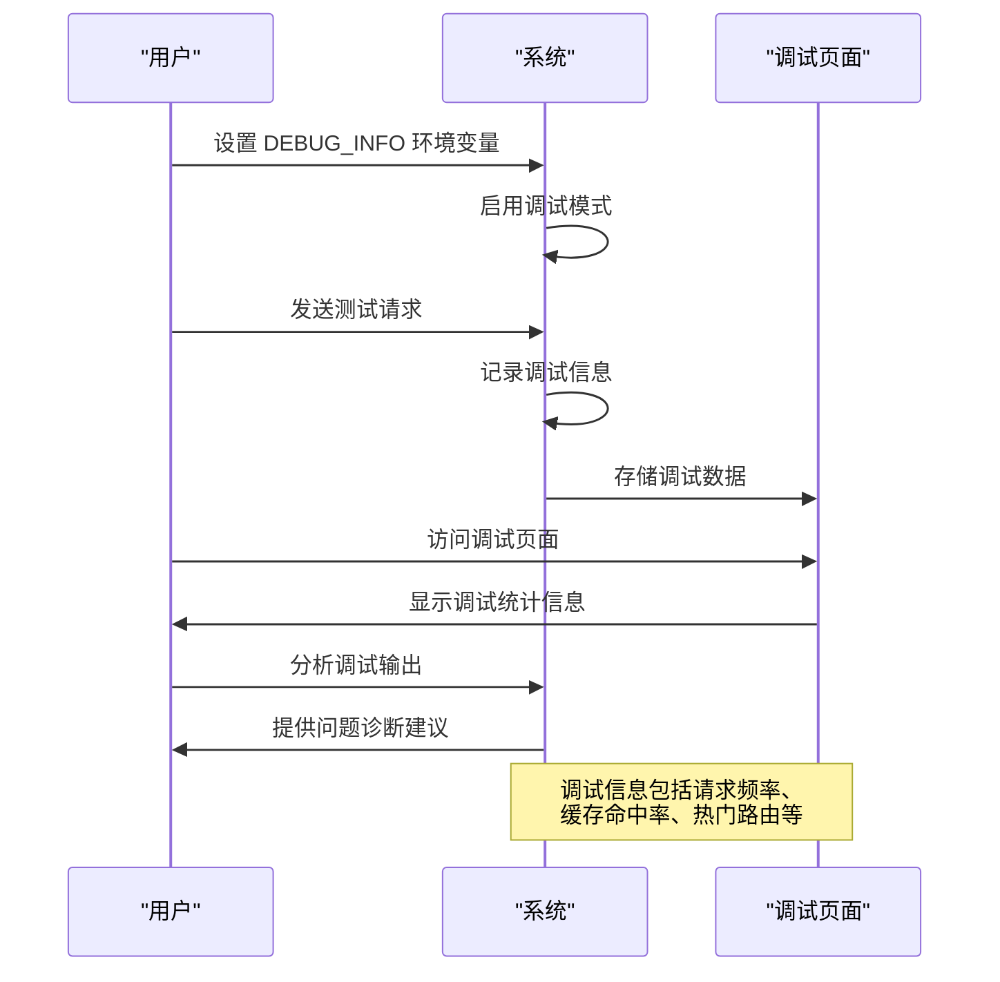
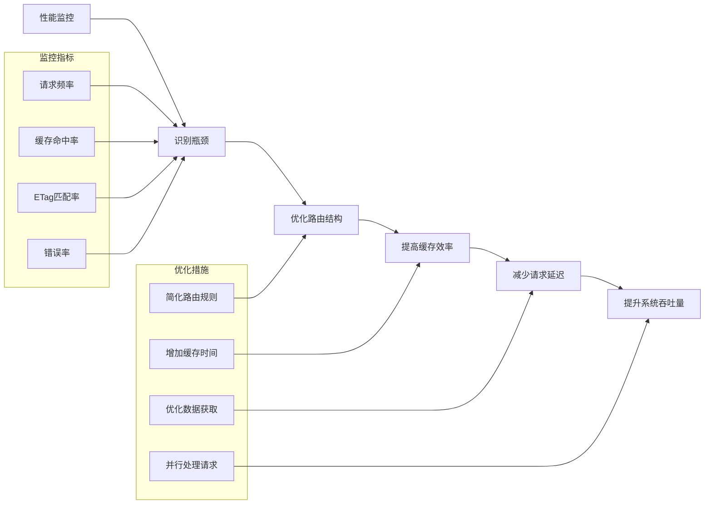

# 匹配调试

<cite>
**本文档中引用的文件**  
- [debug.ts](file://lib/middleware/debug.ts)
- [logger.ts](file://lib/middleware/logger.ts)
- [app-bootstrap.tsx](file://lib/app-bootstrap.tsx)
- [config.ts](file://lib/config.ts)
- [debug-info.ts](file://lib/utils/debug-info.ts)
- [registry.ts](file://lib/registry.ts)
- [trace.ts](file://lib/middleware/trace.ts)
- [otel/metric.ts](file://lib/utils/otel/metric.ts)
</cite>

## 目录
1. [简介](#简介)
2. [调试系统架构](#调试系统架构)
3. [路由匹配流程分析](#路由匹配流程分析)
4. [调试中间件详解](#调试中间件详解)
5. [日志系统与性能监控](#日志系统与性能监控)
6. [常见匹配问题诊断](#常见匹配问题诊断)
7. [调试工具使用指南](#调试工具使用指南)
8. [性能优化建议](#性能优化建议)
9. [结论](#结论)

## 简介
RSSHub 是一个开源的 RSS 生成器，其核心功能是将各种网站内容转换为 RSS 订阅源。在复杂的路由系统中，路由匹配的准确性和效率至关重要。本文档深入探讨 RSSHub 的匹配调试机制，详细解释如何使用调试中间件和日志系统来追踪路由匹配过程，包括请求路径解析、路由规则匹配和优先级判定的完整流程。通过本文档，开发者可以更好地理解 RSSHub 的内部工作原理，快速定位和解决路由匹配问题。

## 调试系统架构

```mermaid
graph TB
subgraph "调试系统"
DebugMiddleware[调试中间件]
TraceMiddleware[跟踪中间件]
LoggerMiddleware[日志中间件]
DebugInfo[调试信息存储]
Metrics[性能指标]
end
Client[客户端请求] --> DebugMiddleware
DebugMiddleware --> TraceMiddleware
TraceMiddleware --> LoggerMiddleware
DebugMiddleware --> DebugInfo
LoggerMiddleware --> Metrics
DebugInfo --> DebugPage[调试页面]
Metrics --> MetricsEndpoint[/metrics]
```

**图示来源**
- [app-bootstrap.tsx](file://lib/app-bootstrap.tsx#L10-L17)
- [debug.ts](file://lib/middleware/debug.ts)
- [trace.ts](file://lib/middleware/trace.ts)
- [logger.ts](file://lib/middleware/logger.ts)

**本节来源**
- [app-bootstrap.tsx](file://lib/app-bootstrap.tsx#L10-L17)
- [debug.ts](file://lib/middleware/debug.ts)
- [trace.ts](file://lib/middleware/trace.ts)

## 路由匹配流程分析



**图示来源**
- [registry.ts](file://lib/registry.ts#L154-L272)
- [router.js](file://lib/router.js)

**本节来源**
- [registry.ts](file://lib/registry.ts#L154-L272)
- [router.js](file://lib/router.js)

## 调试中间件详解



**图示来源**
- [debug.ts](file://lib/middleware/debug.ts#L6-L37)
- [debug-info.ts](file://lib/utils/debug-info.ts)

**本节来源**
- [debug.ts](file://lib/middleware/debug.ts#L6-L37)
- [debug-info.ts](file://lib/utils/debug-info.ts)

## 日志系统与性能监控



**图示来源**
- [logger.ts](file://lib/middleware/logger.ts)
- [metric.ts](file://lib/utils/otel/metric.ts#L34-L56)
- [debug-info.ts](file://lib/utils/debug-info.ts)

**本节来源**
- [logger.ts](file://lib/middleware/logger.ts)
- [metric.ts](file://lib/utils/otel/metric.ts#L34-L56)
- [debug-info.ts](file://lib/utils/debug-info.ts)

## 常见匹配问题诊断



**图示来源**
- [registry.ts](file://lib/registry.ts#L164-L182)
- [debug.ts](file://lib/middleware/debug.ts)
- [config.ts](file://lib/config.ts#L770-L772)

**本节来源**
- [registry.ts](file://lib/registry.ts#L164-L182)
- [debug.ts](file://lib/middleware/debug.ts)
- [config.ts](file://lib/config.ts#L770-L772)

## 调试工具使用指南



**图示来源**
- [config.ts](file://lib/config.ts#L770-L772)
- [debug.ts](file://lib/middleware/debug.ts)
- [views/index.tsx](file://lib/views/index.tsx#L60-L95)

**本节来源**
- [config.ts](file://lib/config.ts#L770-L772)
- [debug.ts](file://lib/middleware/debug.ts)
- [views/index.tsx](file://lib/views/index.tsx#L60-L95)

## 性能优化建议



**图示来源**
- [metric.ts](file://lib/utils/otel/metric.ts)
- [config.ts](file://lib/config.ts#L738-L740)
- [debug.ts](file://lib/middleware/debug.ts)

**本节来源**
- [metric.ts](file://lib/utils/otel/metric.ts)
- [config.ts](file://lib/config.ts#L738-L740)
- [debug.ts](file://lib/middleware/debug.ts)

## 结论
RSSHub 的匹配调试系统通过调试中间件、日志系统和性能监控工具的协同工作，为开发者提供了全面的路由匹配分析能力。通过启用调试模式，开发者可以追踪请求的完整生命周期，从路径解析到路由匹配，再到响应生成。调试信息的收集和分析有助于识别和解决路由匹配问题，优化系统性能。建议在开发和测试环境中充分利用这些调试工具，确保路由系统的稳定性和高效性。