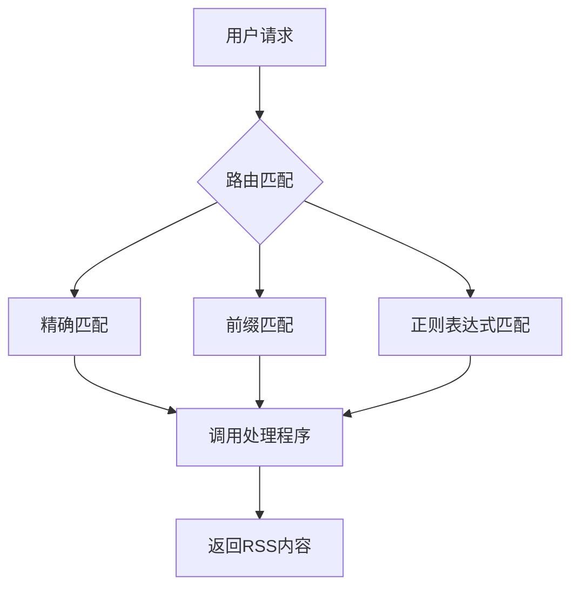
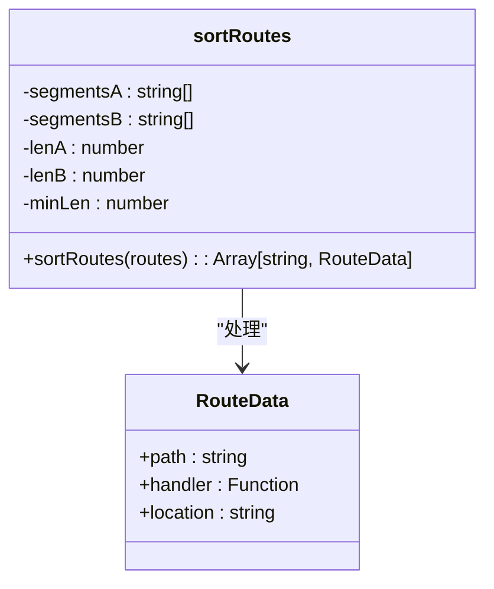
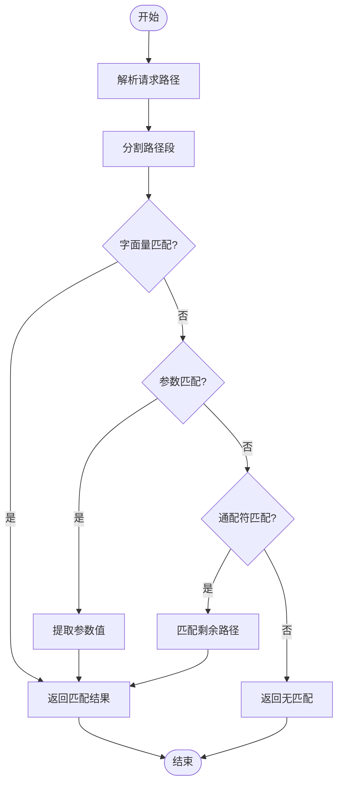
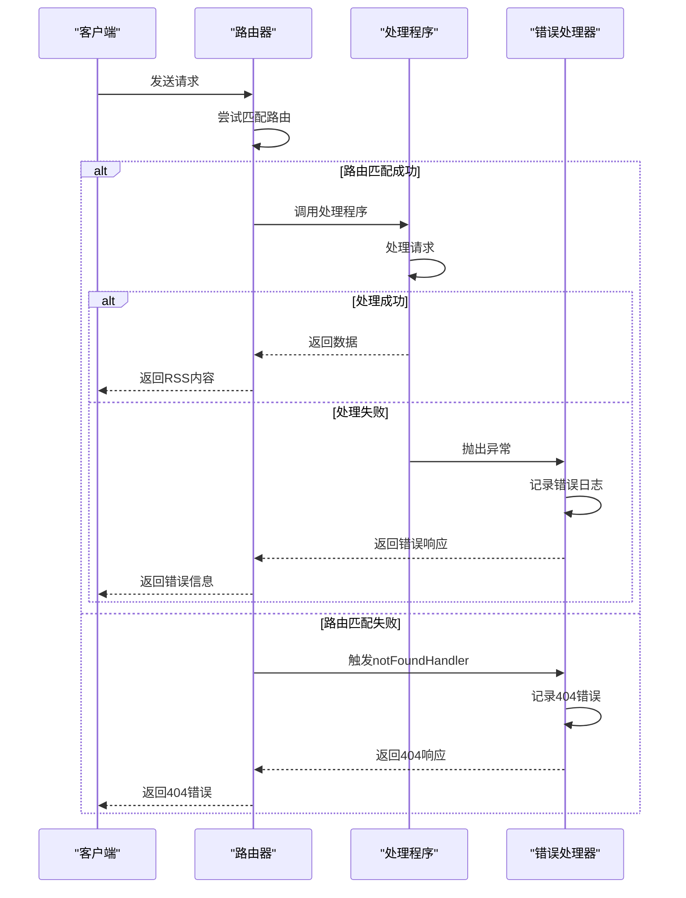
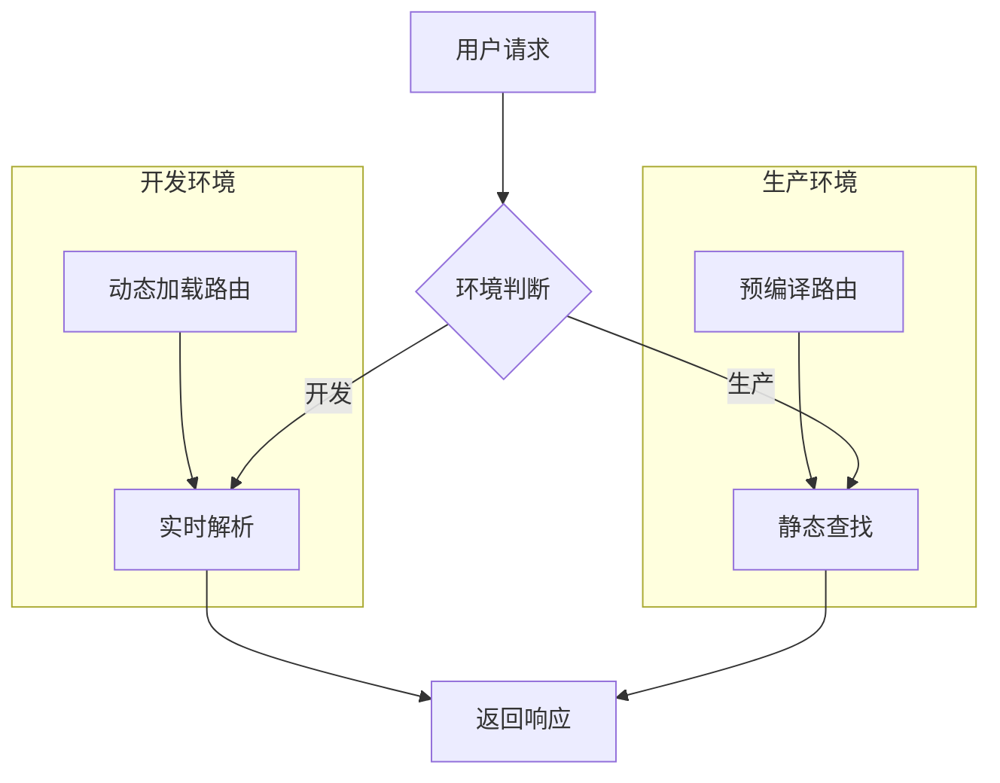

# 路由匹配

<cite>
**本文档中引用的文件**  
- [router.js](file://lib/router.js)
- [registry.ts](file://lib/registry.ts)
- [types.ts](file://lib/types.ts)
- [app-bootstrap.tsx](file://lib/app-bootstrap.tsx)
- [errors/index.tsx](file://lib/errors/index.tsx)
</cite>

## 目录
1. [简介](#简介)
2. [路由匹配机制概述](#路由匹配机制概述)
3. [匹配优先级规则](#匹配优先级规则)
4. [匹配算法详解](#匹配算法详解)
5. [错误处理与异常情况](#错误处理与异常情况)
6. [性能优化技巧](#性能优化技巧)
7. [常见问题解决方案](#常见问题解决方案)
8. [总结](#总结)

## 简介

RSSHub 是一个开源的 RSS 生成器，其核心功能之一是路由匹配机制。该机制负责将用户请求的 URL 映射到相应的处理程序（handler），从而生成对应的 RSS 内容。本文档深入探讨 RSSHub 的路由匹配机制，详细说明其优先级规则、匹配算法、错误处理以及性能优化技巧。

**本节内容不直接分析具体代码文件，因此无需添加来源**

## 路由匹配机制概述

RSSHub 使用 Hono 框架作为其底层 Web 框架，利用 Hono 提供的路由系统来实现 URL 匹配和请求处理。整个路由匹配过程可以分为以下几个步骤：

1. **路由注册**：在应用启动时，所有路由被注册到 Hono 应用实例中。
2. **请求接收**：当用户发起请求时，Hono 根据请求的 URL 进行匹配。
3. **处理程序调用**：匹配成功后，调用对应的处理程序生成响应。



**本图展示的是概念性工作流程，未直接映射到具体代码结构，因此无需添加来源**

## 匹配优先级规则

RSSHub 的路由匹配遵循一定的优先级规则，确保最合适的路由被选中。这些规则主要体现在路由的排序和匹配顺序上。

### 优先级排序规则

在 `registry.ts` 文件中，`sortRoutes` 函数定义了路由的排序规则：

1. **字面量段优先于参数段**：如果两个路径在某个位置上的段一个是字面量（如 `/news`），另一个是参数（如 `/:id`），则字面量段的路径优先级更高。
2. **长度优先**：较短的路径优先于较长的路径。
3. **字典序**：在同一层级上，按字典序进行排序。

这种排序规则确保了更具体的路由（如 `/news/latest`）会优先于更通用的路由（如 `/news/:id`）被匹配。



**Diagram sources**
- [registry.ts](file://lib/registry.ts#L154-L182)

**Section sources**
- [registry.ts](file://lib/registry.ts#L154-L182)

## 匹配算法详解

RSSHub 的路由匹配算法基于 Hono 的路由系统，并通过自定义逻辑进行增强。以下是匹配算法的详细解析。

### 精确匹配

精确匹配是最简单的匹配方式，要求请求的 URL 完全等于路由定义的路径。例如：

```javascript
router.get('/benedictevans', lazyloadRouteHandler('./routes/benedictevans/recent.js'));
```

当用户请求 `/benedictevans` 时，该路由会被精确匹配并调用相应的处理程序。

### 前缀匹配

前缀匹配允许路由路径以特定前缀开头。例如：

```javascript
router.get('/cqu/jwc/:path*', lazyloadRouteHandler('./routes/universities/cqu/jwc/announcement'));
```

这里的 `:path*` 表示匹配以 `/cqu/jwc/` 开头的所有路径，后面的 `*` 表示通配符，可以匹配任意数量的路径段。

### 正则表达式匹配

虽然 RSSHub 主要使用 Hono 的路由语法，但也可以通过正则表达式实现更复杂的匹配逻辑。例如，在 `types.ts` 中定义的路径可以包含参数和通配符，这些都会被转换为正则表达式进行匹配。



**Diagram sources**
- [router.js](file://lib/router.js#L1-L800)
- [registry.ts](file://lib/registry.ts#L154-L182)

**Section sources**
- [router.js](file://lib/router.js#L1-L800)
- [registry.ts](file://lib/registry.ts#L154-L182)

## 错误处理与异常情况

当路由匹配失败或处理过程中出现异常时，RSSHub 提供了完善的错误处理机制。

### 匹配失败处理

当没有找到匹配的路由时，Hono 会触发 `notFoundHandler`，返回 404 状态码。在 `errors/index.tsx` 中定义了错误处理逻辑：

```typescript
export const notFoundHandler: NotFoundHandler = (ctx) => errorHandler(new NotFoundError(), ctx);
```

### 异常处理

在处理请求时，如果发生异常，`errorHandler` 会被调用，记录错误日志并返回适当的错误信息。例如：

```typescript
export const errorHandler: ErrorHandler = (error, ctx) => {
    // 记录错误信息
    logger.error(`Error in ${requestPath}: ${message}`);
    // 设置状态码
    ctx.status(503);
    // 返回错误响应
    return ctx.json({
        error: {
            message: error.message ?? error,
        },
    });
};
```



**Diagram sources**
- [errors/index.tsx](file://lib/errors/index.tsx#L13-L82)
- [app-bootstrap.tsx](file://lib/app-bootstrap.tsx#L50-L51)

**Section sources**
- [errors/index.tsx](file://lib/errors/index.tsx#L13-L82)
- [app-bootstrap.tsx](file://lib/app-bootstrap.tsx#L50-L51)

## 性能优化技巧

为了提高路由匹配的性能，RSSHub 采用了多种优化策略。

### 懒加载处理程序

RSSHub 使用懒加载机制，只有在路由首次被请求时才会加载对应的处理程序模块。这减少了启动时的内存占用和加载时间。

```javascript
const lazyloadRouteHandler = (routeHandlerPath) => (ctx) => {
    if (RouterHandlerMap.has(routeHandlerPath)) {
        return RouterHandlerMap.get(routeHandlerPath)(ctx);
    }

    const handler = require(routeHandlerPath);
    RouterHandlerMap.set(routeHandlerPath, handler);
    return handler(ctx);
};
```

### 路由预编译

在生产环境中，RSSHub 会在构建时预编译路由信息，生成静态的路由表。这样可以在运行时直接查找路由，而不需要动态解析。



**本图展示了不同环境下的路由处理方式，未直接映射到具体代码文件，因此无需添加来源**

## 常见问题解决方案

### 路由冲突

当多个路由具有相似的路径时，可能会发生冲突。解决方案是调整路由的顺序，确保更具体的路由排在前面。

### 参数解析错误

在处理带有参数的路由时，确保正确解析参数值。可以使用 Hono 提供的 `ctx.req.param()` 方法来获取参数。

### 性能瓶颈

如果发现路由匹配性能低下，可以考虑以下优化措施：
- 减少动态路由的数量
- 使用更高效的正则表达式
- 启用缓存机制

## 总结

RSSHub 的路由匹配机制是一个高效且灵活的系统，通过精确匹配、前缀匹配和正则表达式匹配等多种方式，能够满足各种复杂的路由需求。同时，通过懒加载和预编译等优化策略，保证了系统的高性能。了解这些机制有助于更好地使用和扩展 RSSHub 的功能。

**本节内容为总结性描述，未直接分析具体代码文件，因此无需添加来源**