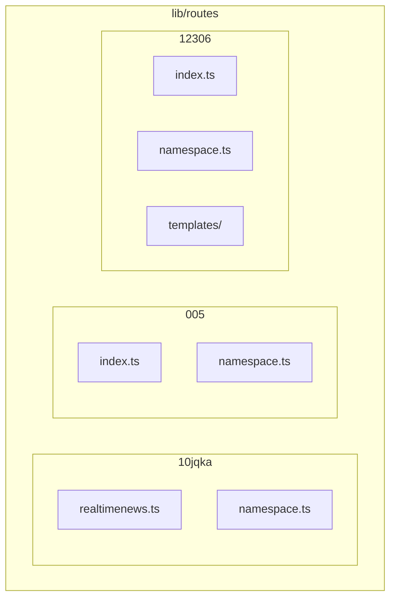
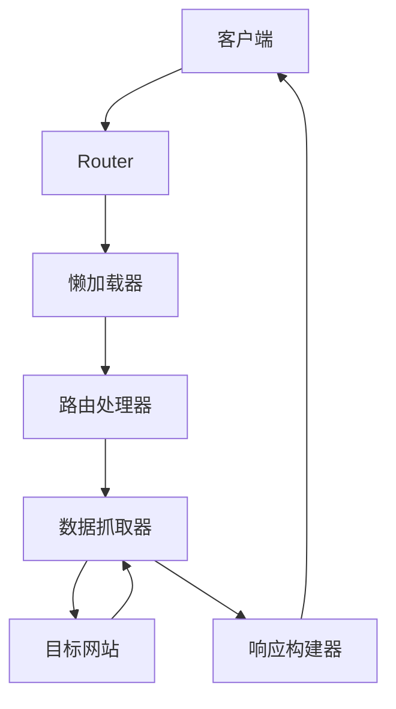
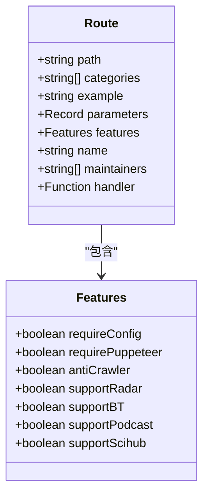
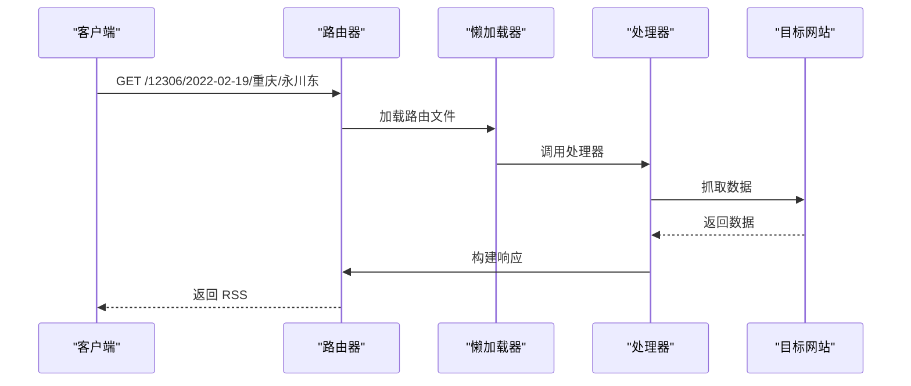
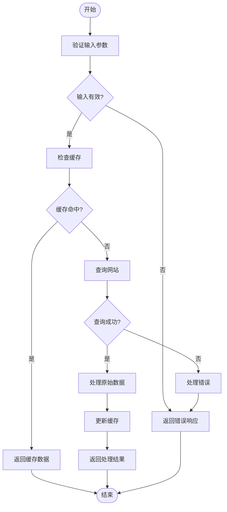
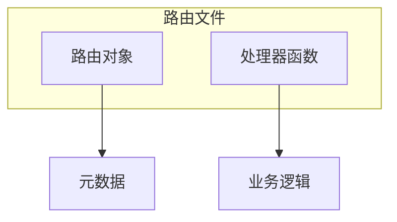

# 路由文件结构

<cite>
**本文档引用的文件**  
- [12306/index.ts](file://lib/routes/12306/index.ts)
- [12306/namespace.ts](file://lib/routes/12306/namespace.ts)
- [10jqka/realtimenews.ts](file://lib/routes/10jqka/realtimenews.ts)
- [005/index.ts](file://lib/routes/005/index.ts)
- [types.ts](file://lib/types.ts)
- [router.js](file://lib/router.js)
- [12306/templates/train.art](file://lib/routes/12306/templates/train.art)
</cite>

## 目录
1. [简介](#简介)
2. [项目结构](#项目结构)
3. [核心组件](#核心组件)
4. [架构概述](#架构概述)
5. [详细组件分析](#详细组件分析)
6. [依赖分析](#依赖分析)
7. [性能考虑](#性能考虑)
8. [故障排除指南](#故障排除指南)
9. [结论](#结论)
10. [附录](#附录)（如有必要）

## 简介
RSSHub 是一个开源的 RSS 生成器，其路由文件结构设计用于支持大量网站和内容源的聚合。本文档详细说明了 RSSHub 路由文件的目录组织方式、模块导出格式、必需的接口定义、文件命名约定以及加载机制。通过理解这些结构和机制，开发者可以更容易地为新的内容源创建和维护路由。

## 项目结构
RSSHub 的路由文件主要存放在 `lib/routes` 目录下。每个内容源通常有一个对应的子目录，该子目录包含一个或多个路由文件和一个 `namespace.ts` 文件。路由文件负责定义具体的 RSS 订阅路径和处理逻辑，而 `namespace.ts` 文件则定义了该内容源的元数据。



**图表来源**  
- [12306/index.ts](file://lib/routes/12306/index.ts)
- [12306/namespace.ts](file://lib/routes/12306/namespace.ts)
- [10jqka/realtimenews.ts](file://lib/routes/10jqka/realtimenews.ts)
- [005/index.ts](file://lib/routes/005/index.ts)

**章节来源**
- [12306/index.ts](file://lib/routes/12306/index.ts)
- [12306/namespace.ts](file://lib/routes/12306/namespace.ts)
- [10jqka/realtimenews.ts](file://lib/routes/10jqka/realtimenews.ts)
- [005/index.ts](file://lib/routes/005/index.ts)

## 核心组件
路由文件的核心组件包括 `route` 对象和 `handler` 函数。`route` 对象定义了路由的路径、分类、描述等元数据，而 `handler` 函数则负责实际的数据抓取和处理逻辑。

**章节来源**
- [12306/index.ts](file://lib/routes/12306/index.ts#L52-L68)
- [10jqka/realtimenews.ts](file://lib/routes/10jqka/realtimenews.ts#L73-L143)
- [005/index.ts](file://lib/routes/005/index.ts#L101-L155)

## 架构概述
RSSHub 的路由架构基于 Koa 框架，使用 `@koa/router` 来管理路由。路由文件通过懒加载机制在首次请求时被加载，以提高启动性能和内存使用效率。



**图表来源**  
- [router.js](file://lib/router.js#L7-L16)
- [12306/index.ts](file://lib/routes/12306/index.ts#L70-L130)

**章节来源**
- [router.js](file://lib/router.js#L1-L1584)
- [12306/index.ts](file://lib/routes/12306/index.ts#L1-L131)

## 详细组件分析
### 路由文件分析
路由文件通常包含一个 `route` 对象和一个 `handler` 函数。`route` 对象定义了路由的路径、分类、描述等元数据，而 `handler` 函数则负责实际的数据抓取和处理逻辑。

#### 对象导向组件


**图表来源**  
- [types.ts](file://lib/types.ts#L259-L364)
- [12306/index.ts](file://lib/routes/12306/index.ts#L52-L68)

#### API/服务组件


**图表来源**  
- [router.js](file://lib/router.js#L7-L16)
- [12306/index.ts](file://lib/routes/12306/index.ts#L70-L130)

#### 复杂逻辑组件


**图表来源**  
- [12306/index.ts](file://lib/routes/12306/index.ts#L70-L130)
- [005/index.ts](file://lib/routes/005/index.ts#L12-L99)

**章节来源**
- [12306/index.ts](file://lib/routes/12306/index.ts#L1-L131)
- [005/index.ts](file://lib/routes/005/index.ts#L1-L156)

### 概念概述
路由文件的结构设计旨在提供清晰的分离关注点，使得每个文件只负责一个特定的内容源。这种设计使得代码更易于维护和扩展。



## 依赖分析
路由文件依赖于多个核心模块，包括 `@/config`、`@/errors/types/invalid-parameter`、`@/types`、`@/utils/cache`、`@/utils/got` 和 `@/utils/render`。这些模块提供了配置管理、错误处理、类型定义、缓存、HTTP 请求和模板渲染等功能。

```mermaid
graph LR
RouteFile[路由文件] --> Config[@/config]
RouteFile --> InvalidParameterError[@/errors/types/invalid-parameter]
RouteFile --> Types[@/types]
RouteFile --> Cache[@/utils/cache]
RouteFile --> Got[@/utils/got]
RouteFile --> Render[@/utils/render]
```

**图表来源**  
- [12306/index.ts](file://lib/routes/12306/index.ts#L1-L9)
- [10jqka/realtimenews.ts](file://lib/routes/10jqka/realtimenews.ts#L1-L7)
- [005/index.ts](file://lib/routes/005/index.ts#L1-L11)

**章节来源**
- [12306/index.ts](file://lib/routes/12306/index.ts#L1-L131)
- [10jqka/realtimenews.ts](file://lib/routes/10jqka/realtimenews.ts#L1-L144)
- [005/index.ts](file://lib/routes/005/index.ts#L1-L156)

## 性能考虑
路由文件的性能主要受数据抓取和处理逻辑的影响。为了提高性能，建议使用缓存机制来减少对目标网站的请求频率，并优化数据处理逻辑以减少 CPU 使用。

## 故障排除指南
当路由文件出现问题时，首先检查输入参数是否正确，然后检查目标网站是否可访问。如果问题仍然存在，可以查看日志文件以获取更多详细信息。

**章节来源**
- [12306/index.ts](file://lib/routes/12306/index.ts#L86-L88)
- [10jqka/realtimenews.ts](file://lib/routes/10jqka/realtimenews.ts#L31-L56)

## 结论
RSSHub 的路由文件结构设计合理，通过清晰的分离关注点和模块化的设计，使得代码易于维护和扩展。理解这些结构和机制对于开发和维护新的内容源至关重要。

## 附录
### 路由文件示例
```typescript
import { config } from '@/config';
import InvalidParameterError from '@/errors/types/invalid-parameter';
import type { Route } from '@/types';
import cache from '@/utils/cache';
import got from '@/utils/got';
import { art } from '@/utils/render';

const rootUrl = 'https://kyfw.12306.cn';

async function getJSESSIONID(linkUrl) {
    const res = await got({
        method: 'get',
        url: linkUrl,
        headers: {
            UserAgent: config.ua,
            Referer: 'https://www.12306.cn/index/index.html',
        },
    });

    return res.headers['set-cookie'].join(',').match(/JSESSIONID=([^;]+);/)[0];
}

function getStationInfo(stationName) {
    return cache.tryGet(stationName, async () => {
        const res = await got({
            method: 'get',
            url: `${rootUrl}/otn/resources/js/framework/station_name.js`,
            headers: {
                UserAgent: config.ua,
                Referer: 'https://kyfw.12306.cn/otn/leftTicket/init',
            },
        });

        return res.data
            .split('@')
            .map((item) => {
                const itemData = item.split('|');

                return itemData.includes(stationName)
                    ? {
                          code: itemData[2],
                          name: itemData[1],
                      }
                    : null;
            })
            .find(Boolean);
    });
}

export const route: Route = {
    path: '/:date/:from/:to/:type?',
    categories: ['travel'],
    example: '/12306/2022-02-19/重庆/永川东',
    parameters: { date: '时间，格式为（YYYY-MM-DD）', from: '始发站', to: '终点站', type: '售票类型，成人和学生可选，默认为成人' },
    features: {
        requireConfig: false,
        requirePuppeteer: false,
        antiCrawler: false,
        supportBT: false,
        supportPodcast: false,
        supportScihub: false,
    },
    name: '售票信息',
    maintainers: ['Fatpandac'],
    handler,
};

async function handler(ctx) {
    const date = ctx.req.param('date');
    const fromStationInfo = await getStationInfo(ctx.req.param('from'));
    const toStationInfo = await getStationInfo(ctx.req.param('to'));
    const type = ctx.req.param('type') ?? 'ADULT';

    const apiUrl = `${rootUrl}/otn/leftTicket/queryA?leftTicketDTO.train_date=${date}&leftTicketDTO.from_station=${fromStationInfo.code}&leftTicketDTO.to_station=${toStationInfo.code}&purpose_codes=${type}`;
    const linkUrl = `${rootUrl}/otn/leftTicket/init?linktypeid=dc&fs=${fromStationInfo.code}&ts=${toStationInfo.code}&date=${date}&flag=N,N,Y`;

    const response = await got.get(apiUrl, {
        headers: {
            UserAgent: config.ua,
            Referer: 'https://kyfw.12306.cn/otn/leftTicket/init',
            Cookie: await getJSESSIONID(linkUrl),
        },
    });
    if (response.data.data === undefined || response.data.data.length === 0) {
        throw new InvalidParameterError('没有找到相关车次，请检查参数是否正确');
    }
    const data = response.data.data.result;
    const map = response.data.data.map;

    const items = data.map((item) => {
        const itemData = item.split('|');
        const trainInfo = {
            trainNo: itemData[3],
            fromStation: map[itemData[6]],
            toStation: map[itemData[7]],
            startTime: itemData[8],
            arriveTime: itemData[9],
            duration: itemData[10],
            today: itemData[11],
            A9: itemData[32],
            M: itemData[31],
            O: itemData[30],
            A6: itemData[29],
            A4: itemData[28],
            F: itemData[27],
            A3: itemData[26],
            A2: itemData[25],
            A1: itemData[24],
            WZ: itemData[23],
            QT: itemData[22],
        };

        return {
            title: `${trainInfo.fromStation} → ${trainInfo.toStation} ${trainInfo.startTime} ${trainInfo.arriveTime}`,
            description: art(path.join(__dirname, 'templates/train.art'), {
                trainInfo,
            }),
            link: linkUrl,
            guid: Object.values(trainInfo).join('|'),
        };
    });

    return {
        title: `${fromStationInfo.name} → ${toStationInfo.name} ${date}`,
        link: linkUrl,
        item: items,
    };
}
```

**章节来源**
- [12306/index.ts](file://lib/routes/12306/index.ts#L1-L131)