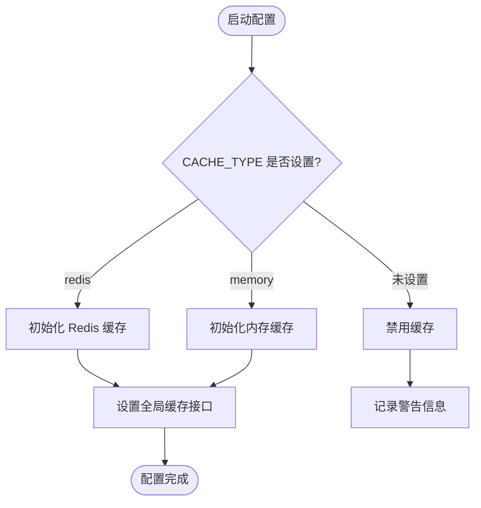
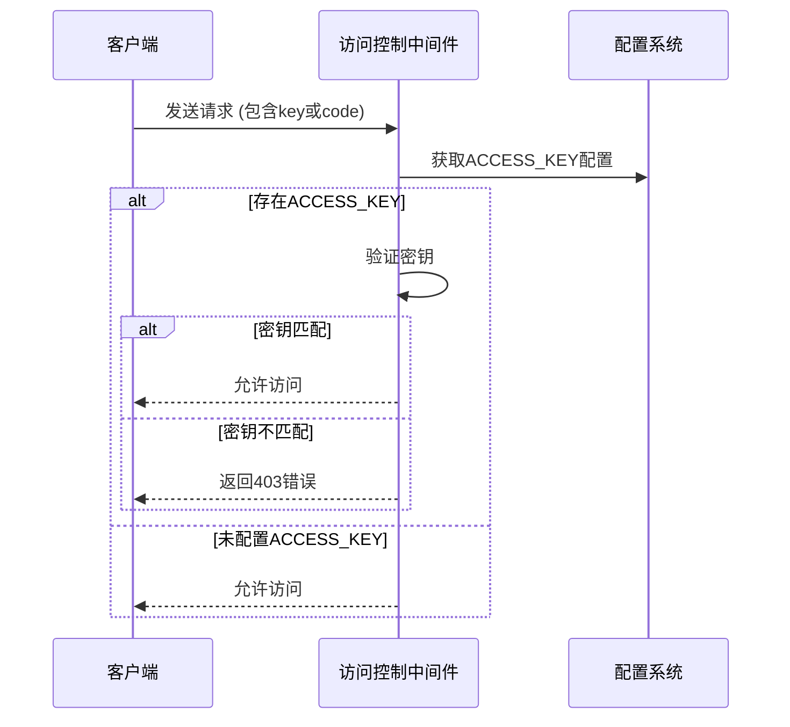
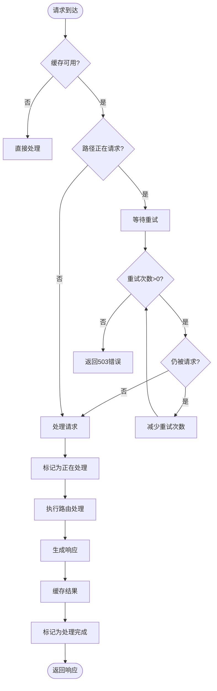
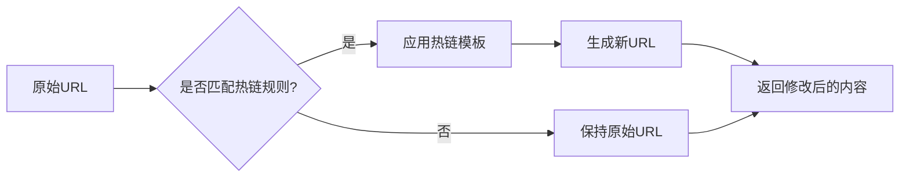

# 路由配置

<cite>
**本文档中引用的文件**  
- [config.ts](file://lib/config.ts)
- [cache.ts](file://lib/middleware/cache.ts)
- [access-control.ts](file://lib/middleware/access-control.ts)
- [anti-hotlink.ts](file://lib/middleware/anti-hotlink.ts)
- [index.ts](file://lib/utils/cache/index.ts)
- [telegram/channel-media.ts](file://lib/routes/telegram/channel-media.ts)
- [types.ts](file://lib/types.ts)
</cite>

## 目录
1. [引言](#引言)
2. [核心配置项详解](#核心配置项详解)
3. [缓存策略配置](#缓存策略配置)
4. [访问控制配置](#访问控制配置)
5. [请求限制与并发控制](#请求限制与并发控制)
6. [热链保护配置](#热链保护配置)
7. [路由配置继承与覆盖](#路由配置继承与覆盖)
8. [最佳实践与安全考虑](#最佳实践与安全考虑)
9. [性能影响分析](#性能影响分析)

## 引言

RSSHub 的路由配置系统是其核心功能之一，通过灵活的配置机制实现了对缓存、访问控制、请求限制等关键功能的精细化管理。本文档将深入解析 RSSHub 的路由配置体系，涵盖配置项的含义、用法、继承机制以及最佳实践。

**Section sources**
- [config.ts](file://lib/config.ts#L1-L800)

## 核心配置项详解

RSSHub 的配置系统通过 `config.ts` 文件定义了全局配置项，这些配置项可分为多个类别：应用配置、网络配置、缓存配置、代理配置、访问控制、日志配置和功能特性等。配置项通过环境变量注入，支持运行时动态调整。

配置系统采用 TypeScript 类型定义，确保了类型安全。核心配置对象包含 `disallowRobot`、`enableCluster`、`connect.port` 等属性，分别控制机器人访问、集群模式和监听端口。网络相关配置如 `requestRetry` 和 `requestTimeout` 用于设置请求重试次数和超时时间。

**Section sources**
- [config.ts](file://lib/config.ts#L5-L673)

## 缓存策略配置

### 缓存类型与配置

RSSHub 支持内存缓存和 Redis 缓存两种模式。通过 `CACHE_TYPE` 环境变量设置缓存类型，可选值为 'memory' 或 'redis'。当设置为空字符串时，可禁用缓存功能。



**Diagram sources**
- [config.ts](file://lib/config.ts#L23-L28)
- [index.ts](file://lib/utils/cache/index.ts#L18-L60)

### 缓存过期时间

缓存过期时间通过两个关键配置项控制：
- `CACHE_EXPIRE`: 路由缓存时间，单位为秒，默认值为 300 秒（5 分钟）
- `CACHE_CONTENT_EXPIRE`: 不变内容缓存时间，单位为秒，默认值为 3600 秒（1 小时）

这些配置在缓存中间件中被使用，当从缓存获取数据时，系统会根据这些过期时间判断缓存是否有效。内存缓存的最大项目数由 `MEMORY_MAX` 配置项控制，默认值为 256。

**Section sources**
- [config.ts](file://lib/config.ts#L25-L27)
- [index.ts](file://lib/utils/cache/index.ts#L41-L44)

## 访问控制配置

### 访问密钥机制

RSSHub 通过 `ACCESS_KEY` 环境变量实现访问控制。当配置了访问密钥时，所有请求必须提供正确的密钥才能访问。系统支持两种验证方式：
1. 直接在 URL 中传递 `key` 参数
2. 传递 `code` 参数，其值为路径与密钥的 MD5 哈希值



**Diagram sources**
- [config.ts](file://lib/config.ts#L43)
- [access-control.ts](file://lib/middleware/access-control.ts#L1-L27)

### 跨域资源共享

通过 `ALLOW_ORIGIN` 配置项可以设置允许的来源，实现跨域资源共享（CORS）控制。该配置项允许指定特定的域名或使用通配符，为前端应用提供灵活的跨域访问策略。

**Section sources**
- [config.ts](file://lib/config.ts#L21-L22)

## 请求限制与并发控制

### 请求并发控制

RSSHub 实现了精细的请求并发控制机制，防止同一路径的并发请求导致资源浪费。系统使用 Redis 或内存缓存来跟踪正在处理的请求。

当一个请求到达时，系统会检查该路径是否正在被处理：
- 如果正在处理，新请求会等待一段时间后重试
- 如果重试次数超过限制，返回 503 错误
- 如果未被处理，则标记为"正在处理"并继续执行



**Diagram sources**
- [cache.ts](file://lib/middleware/cache.ts#L26-L83)
- [index.ts](file://lib/utils/cache/index.ts#L16-L60)

### 请求重试机制

系统配置了 `REQUEST_RETRY` 参数来控制请求失败后的重试次数，默认值为 2 次。结合 `REQUEST_TIMEOUT` 参数（默认 30 秒），形成了完整的请求容错机制。这种配置对于处理不稳定的第三方 API 特别重要。

**Section sources**
- [config.ts](file://lib/config.ts#L17-L18)

## 热链保护配置

### 热链模板配置

通过 `HOTLINK_TEMPLATE` 环境变量可以配置热链保护模板，用于重写图片和其他资源的 URL。模板支持使用 `${}` 语法引用 URL 的各个部分，如 `${host}`、`${pathname}` 等。



**Diagram sources**
- [anti-hotlink.ts](file://lib/middleware/anti-hotlink.ts#L9-L10)

### 路径过滤配置

热链保护支持精细的路径控制：
- `HOTLINK_INCLUDE_PATHS`: 指定需要应用热链保护的路径前缀
- `HOTLINK_EXCLUDE_PATHS`: 指定不需要应用热链保护的路径前缀

这两个配置项以逗号分隔的字符串形式提供，系统会根据这些规则决定是否对特定路径的内容进行热链处理。

**Section sources**
- [config.ts](file://lib/config.ts#L56-L58)
- [anti-hotlink.ts](file://lib/middleware/anti-hotlink.ts#L23-L27)

## 路由配置继承与覆盖

### 配置继承机制

RSSHub 的配置系统采用分层继承机制。全局配置作为基础层，特定路由可以覆盖这些配置。例如，在 `telegram/channel-media.ts` 中，通过 `configureMiddlewares` 函数可以临时修改缓存行为：

```typescript
export async function configureMiddlewares(ctx: Context) {
    // 媒体文件太重，不需要在内存或 Redis 中缓存，也不需要锁定
    await cacheModule.set(ctx.get('cacheControlKey'), '0', config.cache.requestTimeout);
    ctx.req.raw.headers.delete('Accept-Encoding');
}
```

这种机制允许特定路由根据其特性调整全局配置，实现灵活的配置管理。

**Section sources**
- [channel-media.ts](file://lib/routes/telegram/channel-media.ts#L142-L146)

### 功能特性配置

路由可以通过 `features` 属性声明其特殊需求，如：
- `requireConfig`: 声明所需的环境变量配置
- `requirePuppeteer`: 是否需要 Puppeteer
- `antiCrawler`: 是否有反爬虫机制
- `nsfw`: 是否为不安全内容

这些配置不仅影响路由行为，还用于文档生成和系统监控。

**Section sources**
- [types.ts](file://lib/types.ts#L320-L352)

## 最佳实践与安全考虑

### 安全配置建议

1. **访问控制**: 在生产环境中始终配置 `ACCESS_KEY`，防止未授权访问
2. **缓存安全**: 避免在缓存中存储敏感信息，定期清理缓存
3. **代理配置**: 合理配置代理设置，避免暴露内部网络结构
4. **日志管理**: 根据需要调整 `LOGGER_LEVEL`，避免敏感信息泄露

### 配置管理最佳实践

1. **环境分离**: 为开发、测试和生产环境使用不同的配置文件
2. **配置验证**: 在启动时验证关键配置项的正确性
3. **文档化**: 为自定义配置添加详细文档说明
4. **监控**: 对关键配置项的变化进行监控和告警

**Section sources**
- [config.ts](file://lib/config.ts)
- [access-control.ts](file://lib/middleware/access-control.ts)

## 性能影响分析

### 缓存对性能的影响

适当的缓存配置可以显著提升系统性能：
- 减少对第三方 API 的请求次数
- 降低服务器负载
- 提高响应速度

但过度缓存可能导致：
- 内存占用过高
- 数据陈旧
- 缓存击穿风险

### 并发控制的权衡

请求并发控制机制虽然防止了资源浪费，但也可能带来：
- 请求延迟增加
- 用户体验下降
- 复杂的错误处理

需要根据实际业务场景平衡这些因素，选择合适的配置参数。

**Section sources**
- [cache.ts](file://lib/middleware/cache.ts)
- [index.ts](file://lib/utils/cache/index.ts)