# 路由系统API

<cite>
**本文档引用的文件**
- [router.js](file://lib/router.js)
- [app.ts](file://lib/app.ts)
- [app-bootstrap.tsx](file://lib/app-bootstrap.tsx)
- [types.ts](file://lib/types.ts)
- [parameter.ts](file://lib/middleware/parameter.ts)
- [cache.ts](file://lib/middleware/cache.ts)
- [logger.ts](file://lib/middleware/logger.ts)
- [12306/index.ts](file://lib/routes/12306/index.ts)
- [12306/namespace.ts](file://lib/routes/12306/namespace.ts)
- [12306/zxdt.ts](file://lib/routes/12306/zxdt.ts)
</cite>

## 目录
1. [简介](#简介)
2. [路由系统架构](#路由系统架构)
3. [路由定义与注册](#路由定义与注册)
4. [路由匹配规则](#路由匹配规则)
5. [路由中间件](#路由中间件)
6. [请求与响应处理](#请求与响应处理)
7. [路由调试与常见问题](#路由调试与常见问题)
8. [最佳实践](#最佳实践)

## 简介

RSSHub的路由系统是其核心功能之一，负责将HTTP请求映射到相应的处理函数。该系统基于Koa框架的路由机制构建，通过懒加载方式动态加载路由处理器，实现了高效且灵活的路由管理。本文档将深入解析RSSHub的路由机制，包括路由定义语法、模式匹配规则、中间件执行流程以及实际应用示例。

**路由系统的主要特点包括：**

- **懒加载机制**：路由处理器在首次请求时才被加载，减少了启动时的内存占用
- **动态参数支持**：通过`:param`语法支持动态路由参数
- **正则表达式匹配**：支持复杂的路径匹配模式
- **中间件管道**：提供完整的中间件执行流程，支持请求预处理和后处理
- **缓存集成**：内置缓存机制，提高响应性能

## 路由系统架构

RSSHub的路由系统采用分层架构设计，各组件协同工作以处理HTTP请求。系统核心由路由注册器、中间件管道和路由处理器组成。

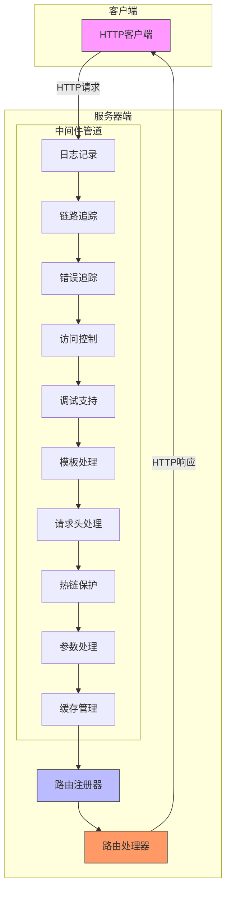

**图解：**
- 客户端发起HTTP请求
- 请求依次经过中间件管道的各个处理阶段
- 路由注册器根据请求路径匹配相应的路由处理器
- 路由处理器生成响应内容
- 响应通过中间件管道返回给客户端

**Diagram sources**
- [app-bootstrap.tsx](file://lib/app-bootstrap.tsx#L27-L45)
- [router.js](file://lib/router.js#L2-L3)
- [middleware/logger.ts](file://lib/middleware/logger.ts)

## 路由定义与注册

RSSHub的路由系统通过`@koa/router`库实现，采用声明式语法定义路由规则。每个路由由路径、处理函数和元数据组成。

### 路由定义语法

路由定义遵循以下基本语法：

```typescript
router.get('/path/:param', lazyloadRouteHandler('./routes/module/handler'));
```

其中：
- `router.get`：定义GET请求路由
- `/path/:param`：路由路径，支持动态参数
- `lazyloadRouteHandler`：懒加载包装函数
- `'./routes/module/handler'`：处理器模块路径

### 路由注册示例

以下是RSSHub中典型的路由注册示例：

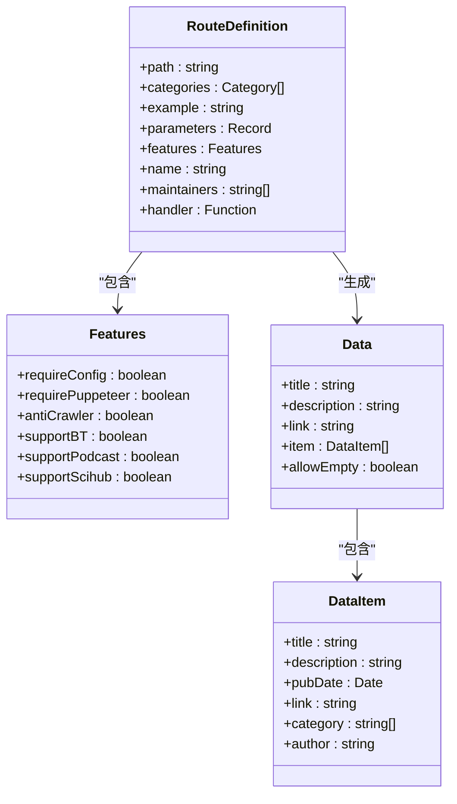

**路由组件说明：**
- **RouteDefinition**：路由定义对象，包含所有路由元数据
- **Features**：功能特性配置，定义路由的特殊需求
- **Data**：响应数据结构，表示RSS feed的整体信息
- **DataItem**：条目数据结构，表示feed中的单个条目

**Diagram sources**
- [12306/index.ts](file://lib/routes/12306/index.ts#L52-L68)
- [types.ts](file://lib/types.ts#L259-L364)

### 路由注册流程

路由注册流程如下：

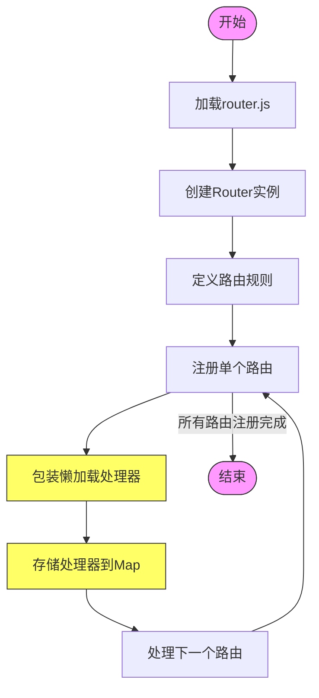

**流程说明：**
1. 加载`router.js`文件
2. 创建`@koa/router`实例
3. 逐个定义路由规则
4. 为每个路由处理器包装懒加载逻辑
5. 将处理器存储到`RouterHandlerMap`中
6. 重复直到所有路由注册完成

**Diagram sources**
- [router.js](file://lib/router.js#L1-L16)
- [router.js](file://lib/router.js#L20-L800)

## 路由匹配规则

RSSHub的路由系统支持多种匹配模式，包括静态路径、动态参数和通配符匹配。

### 动态参数匹配

动态参数通过冒号`:`前缀定义，支持以下形式：

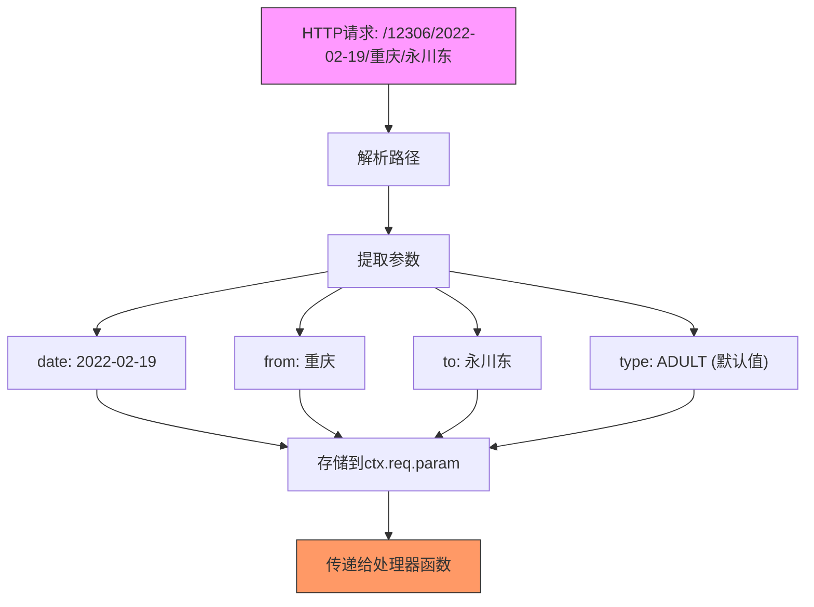

**参数处理规则：**
- 必填参数：`:param`形式，必须提供值
- 可选参数：`:param?`形式，可以省略
- 默认值：在处理器中通过`ctx.req.param('param') ?? 'default'`设置

**Diagram sources**
- [12306/index.ts](file://lib/routes/12306/index.ts#L53-L57)
- [12306/index.ts](file://lib/routes/12306/index.ts#L71-L74)

### 正则表达式匹配

虽然RSSHub主要使用Koa的路由语法，但可以通过自定义中间件实现正则表达式匹配：

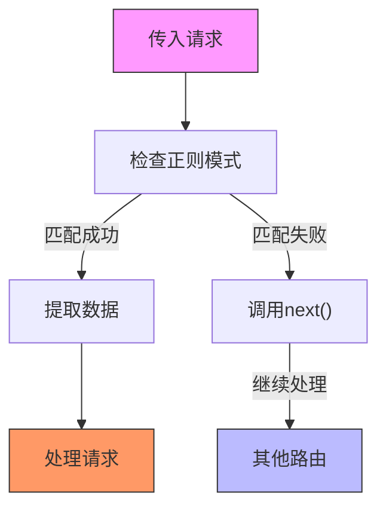

### 路由优先级

RSSHub的路由优先级遵循以下规则：

1. **精确匹配优先**：静态路径优先于动态参数
2. **顺序优先**：先定义的路由优先于后定义的路由
3. **特殊字符优先级**：`*`通配符具有最低优先级

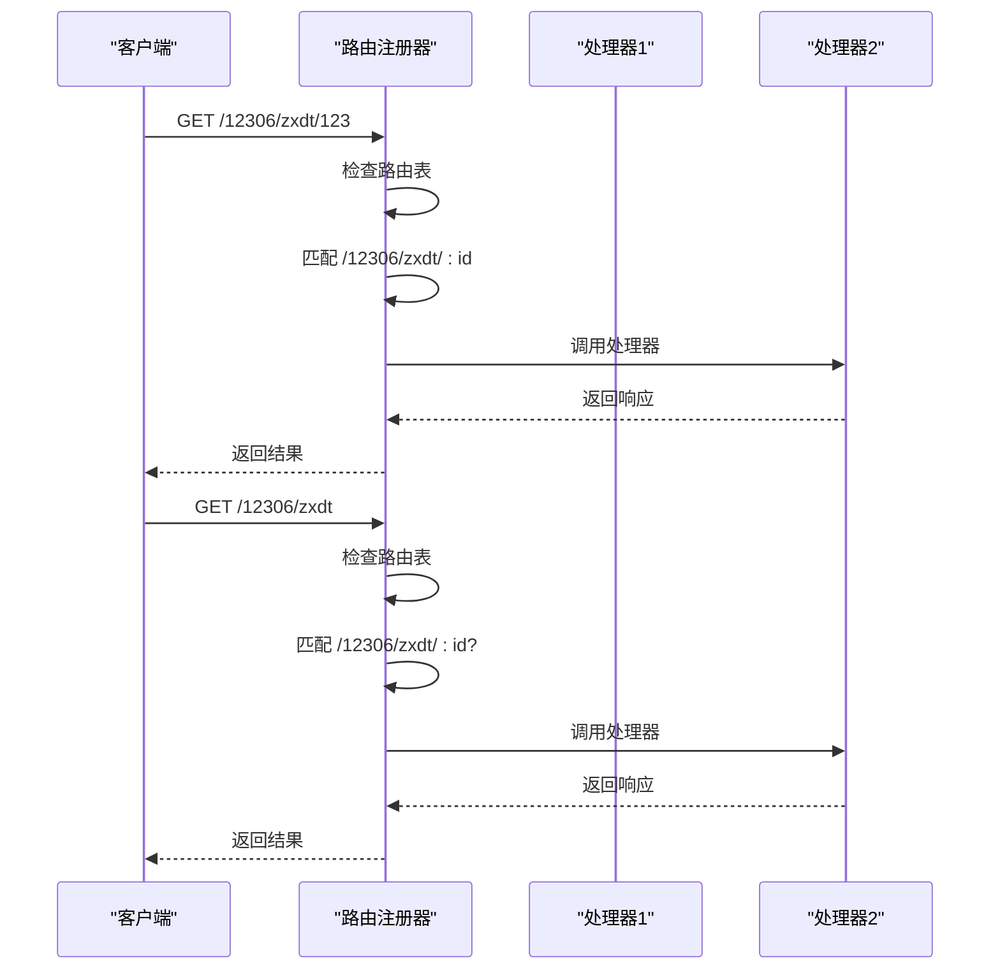

**Diagram sources**
- [12306/zxdt.ts](file://lib/routes/12306/zxdt.ts#L9-L12)

## 路由中间件

RSSHub的中间件系统采用管道模式，每个中间件负责特定的处理任务。中间件按预定义顺序执行，形成完整的请求处理链。

### 中间件执行流程

```mermaid
flowchart TD
Request["HTTP请求"] --> TrailingSlash["去除尾部斜杠"]
TrailingSlash --> Compress["响应压缩"]
Compress --> Logger["日志记录"]
Logger --> Trace["链路追踪"]
Trace --> Sentry["错误追踪"]
Sentry --> AccessControl["访问控制"]
AccessControl --> Debug["调试支持"]
Debug --> Template["模板处理"]
Template --> Header["请求头处理"]
Header --> AntiHotlink["热链保护"]
AntiHotlink --> Parameter["参数处理"]
Parameter --> Cache["缓存管理"]
Cache --> Router["路由匹配"]
Router --> Handler["路由处理器"]
Handler --> |响应生成| CacheBack["缓存响应"]
CacheBack --> ParameterBack["参数后处理"]
ParameterBack --> AntiHotlinkBack["热链后处理"]
AntiHotlinkBack --> HeaderBack["头部后处理"]
HeaderBack --> TemplateBack["模板后处理"]
TemplateBack --> DebugBack["调试后处理"]
DebugBack --> AccessControlBack["访问控制后处理"]
AccessControlBack --> SentryBack["错误追踪后处理"]
SentryBack --> TraceBack["链路追踪后处理"]
TraceBack --> LoggerBack["日志后处理"]
LoggerBack --> CompressBack["压缩后处理"]
CompressBack --> TrailingSlashBack["尾部斜杠后处理"]
TrailingSlashBack --> Response["HTTP响应"]
style Request fill:#f9f,stroke:#333
style Response fill:#f9f,stroke:#333
style Router fill:#bbf,stroke:#333
style Handler fill:#f96,stroke:#333
```

### 核心中间件详解

#### 缓存中间件

缓存中间件负责管理路由响应的缓存，减少重复请求的处理开销。

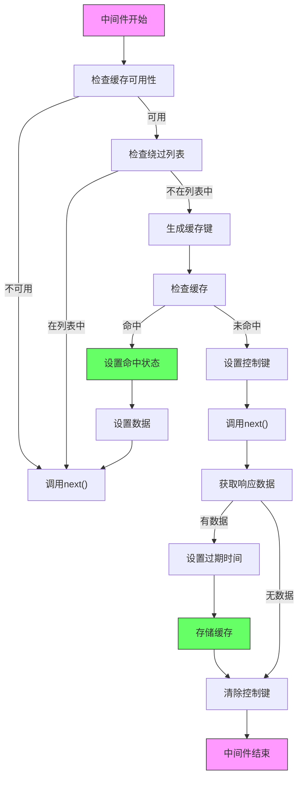

**Diagram sources**
- [cache.ts](file://lib/middleware/cache.ts#L13-L84)

#### 参数中间件

参数中间件负责请求参数的预处理和验证，确保数据的一致性和安全性。

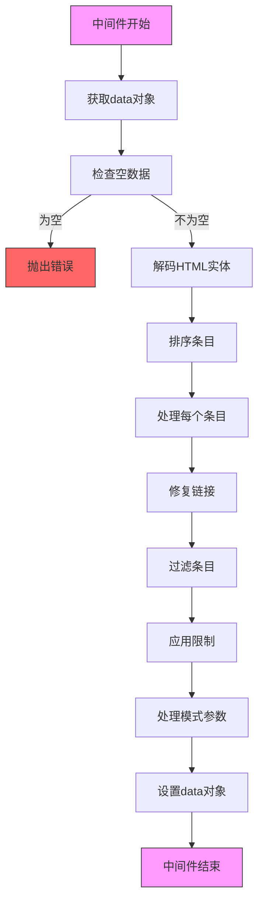

**Diagram sources**
- [parameter.ts](file://lib/middleware/parameter.ts#L67-L429)

#### 日志中间件

日志中间件记录每个请求的详细信息，便于监控和调试。

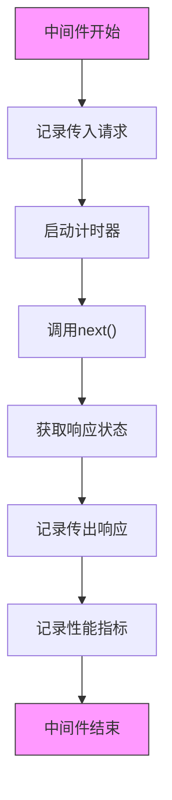

**Diagram sources**
- [logger.ts](file://lib/middleware/logger.ts#L29-L45)

## 请求与响应处理

### 请求对象访问

在路由处理器中，可以通过`ctx.req`访问请求对象，获取各种请求信息：

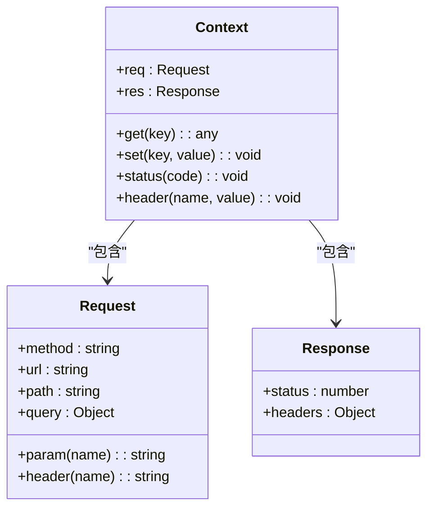

**常用请求方法：**
- `ctx.req.param('name')`：获取路径参数
- `ctx.req.query('name')`：获取查询参数
- `ctx.req.header('name')`：获取请求头

**Diagram sources**
- [12306/index.ts](file://lib/routes/12306/index.ts#L71-L74)
- [types.ts](file://lib/types.ts#L1)

### 响应数据结构

路由处理器返回的标准响应数据结构如下：

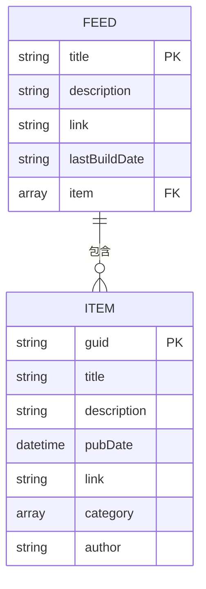

**数据字段说明：**
- **title**：feed标题
- **description**：feed描述
- **link**：源链接
- **item**：条目数组
- **lastBuildDate**：最后构建时间
- **guid**：条目唯一标识
- **pubDate**：发布时间

**Diagram sources**
- [types.ts](file://lib/types.ts#L80-L99)
- [12306/index.ts](file://lib/routes/12306/index.ts#L125-L129)

## 路由调试与常见问题

### 调试技巧

#### 启用调试模式

通过设置环境变量启用调试功能：

```bash
DEBUG=true node index.js
```

#### 使用调试中间件

调试中间件提供详细的请求/响应日志：

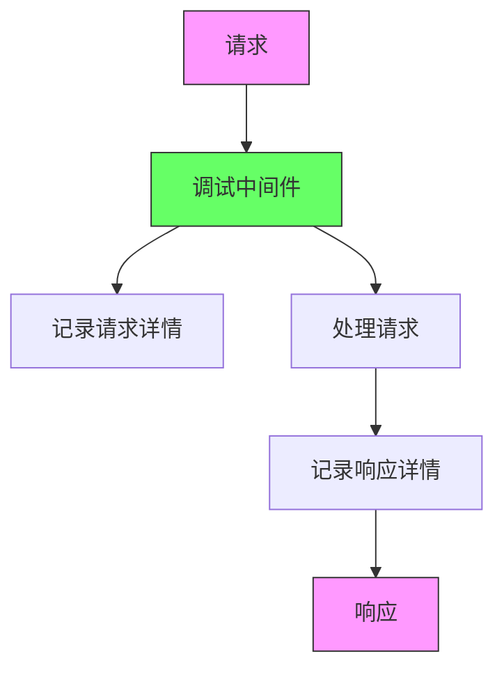

### 常见问题及解决方案

#### 路由未找到

**问题现象：** 返回404错误

**可能原因：**
- 路由路径拼写错误
- 路由未正确注册
- 中间件拦截

**解决方案：**
1. 检查`router.js`中的路由定义
2. 确认处理器文件路径正确
3. 检查中间件配置

#### 参数解析错误

**问题现象：** 动态参数无法正确解析

**可能原因：**
- 参数名称不匹配
- 路径顺序错误
- 编码问题

**解决方案：**
1. 使用`ctx.req.param()`方法获取参数
2. 检查路径定义中的参数名称
3. 确保URL编码正确

#### 缓存问题

**问题现象：** 响应数据未更新

**可能原因：**
- 缓存键生成错误
- 缓存过期时间过长
- 缓存服务不可用

**解决方案：**
1. 检查`cache.ts`中的缓存键生成逻辑
2. 调整`config.cache.routeExpire`配置
3. 验证缓存服务状态

## 最佳实践

### 路由设计原则

1. **命名规范**：使用小写字母和连字符
2. **层次结构**：按功能模块组织路由
3. **参数命名**：使用有意义的参数名称
4. **文档完整**：提供完整的参数说明和示例

### 性能优化建议

1. **合理设置缓存**：根据数据更新频率设置适当的缓存时间
2. **避免阻塞操作**：使用异步操作处理耗时任务
3. **减少网络请求**：合并多个API调用
4. **优化数据处理**：使用流式处理大文件

### 安全考虑

1. **输入验证**：严格验证所有输入参数
2. **防止注入**：对用户输入进行转义
3. **访问控制**：实施适当的权限检查
4. **错误处理**：提供有意义的错误信息而不暴露敏感信息