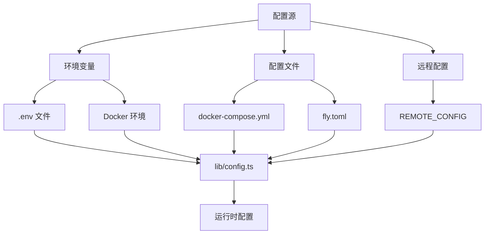
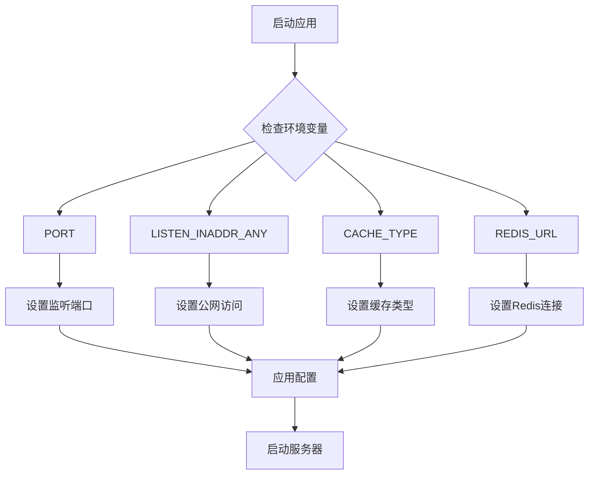
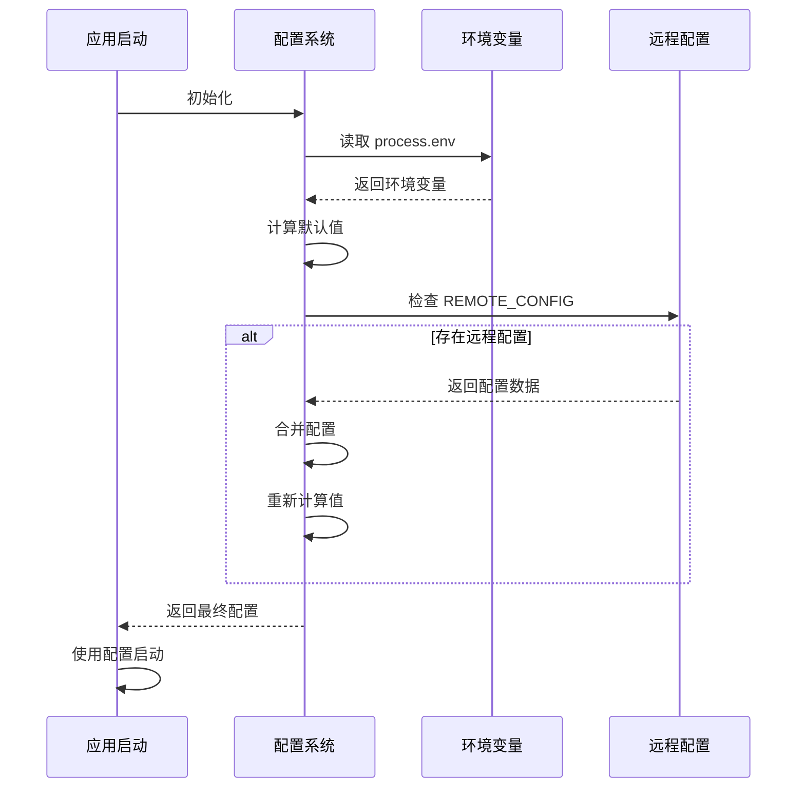
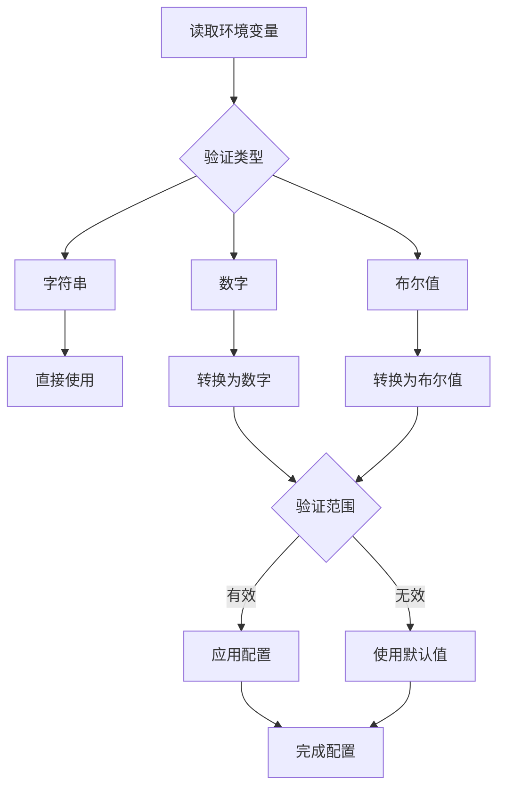

# 基础配置

<cite>
**本文档中引用的文件**  
- [config.ts](file://lib/config.ts)
- [rsshub.env](file://scripts/ansible/rsshub.env)
- [docker-compose.yml](file://docker-compose.yml)
- [Dockerfile](file://Dockerfile)
- [fly.toml](file://fly.toml)
</cite>

## 目录
1. [简介](#简介)
2. [项目结构](#项目结构)
3. [核心配置项](#核心配置项)
4. [配置方式](#配置方式)
5. [配置优先级与加载顺序](#配置优先级与加载顺序)
6. [部署环境配置示例](#部署环境配置示例)
7. [配置验证与错误处理](#配置验证与错误处理)
8. [常见配置问题排查](#常见配置问题排查)
9. [结论](#结论)

## 简介
RSSHub 是一个开源的 RSS 生成器，其配置系统支持通过环境变量和配置文件进行灵活设置。本文档详细介绍了 RSSHub 的基础配置机制，涵盖服务器端口、主机名、基础路径等核心配置项，以及如何在不同部署环境中进行配置。文档还解释了配置优先级规则、配置文件加载顺序、配置验证和错误处理机制，帮助开发者全面理解 RSSHub 的配置系统。

## 项目结构
RSSHub 的配置相关文件主要分布在以下几个位置：
- `lib/config.ts`：核心配置文件，定义了所有配置项及其默认值
- `scripts/ansible/rsshub.env`：Ansible 部署环境的配置示例
- `docker-compose.yml`：Docker 部署的配置文件
- `Dockerfile`：Docker 镜像构建文件，包含环境变量设置
- `fly.toml`：Fly.io 部署配置文件



**Diagram sources**
- [config.ts](file://lib/config.ts#L1-L1188)
- [docker-compose.yml](file://docker-compose.yml#L1-L63)
- [fly.toml](file://fly.toml#L1-L16)

**Section sources**
- [config.ts](file://lib/config.ts#L1-L1188)
- [docker-compose.yml](file://docker-compose.yml#L1-L63)

## 核心配置项
RSSHub 的核心配置项主要分为以下几个类别：

### 网络配置
网络配置项控制 RSSHub 服务器的网络行为，包括监听端口、主机名等。

| 配置项 | 环境变量 | 默认值 | 说明 |
|--------|----------|--------|------|
| 监听端口 | PORT | 1200 | 服务器监听的端口号 |
| 公网访问 | LISTEN_INADDR_ANY | true | 是否允许公网连接 |
| 请求超时 | REQUEST_TIMEOUT | 30000 | 请求超时时间（毫秒） |
| 请求重试 | REQUEST_RETRY | 2 | 请求失败重试次数 |

### 缓存配置
缓存配置项控制 RSSHub 的缓存行为，包括缓存类型、过期时间等。

| 配置项 | 环境变量 | 默认值 | 说明 |
|--------|----------|--------|------|
| 缓存类型 | CACHE_TYPE | memory | 缓存类型（memory/redis） |
| 路由缓存过期 | CACHE_EXPIRE | 300 | 路由缓存过期时间（秒） |
| 内容缓存过期 | CACHE_CONTENT_EXPIRE | 3600 | 内容缓存过期时间（秒） |
| Redis URL | REDIS_URL | redis://localhost:6379/ | Redis 服务器地址 |

### 访问控制
访问控制配置项用于限制对 RSSHub 的访问。

| 配置项 | 环境变量 | 默认值 | 说明 |
|--------|----------|--------|------|
| 访问密钥 | ACCESS_KEY | undefined | 访问密钥，用于身份验证 |
| 允许来源 | ALLOW_ORIGIN | undefined | 允许的跨域请求来源 |

**Section sources**
- [config.ts](file://lib/config.ts#L253-L262)
- [config.ts](file://lib/config.ts#L263-L274)

## 配置方式
RSSHub 支持多种配置方式，开发者可以根据部署环境选择最适合的方式。

### 环境变量配置
环境变量是最常用的配置方式，可以直接在运行时设置。所有配置项都对应一个大写的环境变量名。



**Diagram sources**
- [config.ts](file://lib/config.ts#L726-L747)

### 配置文件配置
对于复杂的部署环境，可以使用配置文件进行配置。RSSHub 支持多种配置文件格式。

#### Docker Compose 配置
在 `docker-compose.yml` 文件中，可以通过 environment 部分设置环境变量：

```yaml
environment:
  NODE_ENV: production
  CACHE_TYPE: redis
  REDIS_URL: 'redis://redis:6379/'
  PUPPETEER_WS_ENDPOINT: 'ws://browserless:3000'
```

#### Fly.io 配置
在 `fly.toml` 文件中，可以通过 http_service 部分设置端口：

```toml
[http_service]
internal_port = 1200
force_https = true
```

**Section sources**
- [docker-compose.yml](file://docker-compose.yml#L10-L15)
- [fly.toml](file://fly.toml#L3-L4)

## 配置优先级与加载顺序
RSSHub 的配置系统遵循特定的优先级规则，确保配置的一致性和可预测性。

### 配置加载流程


**Diagram sources**
- [config.ts](file://lib/config.ts#L1159-L1178)

### 优先级规则
RSSHub 配置的优先级从高到低如下：

1. **远程配置**：通过 REMOTE_CONFIG 加载的配置具有最高优先级
2. **环境变量**：直接设置的环境变量优先级高于默认值
3. **默认值**：当没有设置环境变量时，使用代码中定义的默认值

这种优先级设计允许开发者在不同环境中灵活覆盖配置，同时保持配置的一致性。

**Section sources**
- [config.ts](file://lib/config.ts#L1159-L1178)

## 部署环境配置示例
以下是不同部署环境的配置示例，展示了如何根据具体需求进行配置。

### 开发环境配置
开发环境通常需要更宽松的配置，便于调试和测试。

```env
# 开发环境配置
NODE_ENV=development
PORT=3000
CACHE_TYPE=memory
DEBUG_INFO=true
LOGGER_LEVEL=debug
```

### 生产环境配置
生产环境需要更严格的配置，确保稳定性和安全性。

```yaml
# docker-compose.yml 片段
services:
  rsshub:
    environment:
      NODE_ENV: production
      CACHE_TYPE: redis
      REDIS_URL: 'redis://redis:6379/'
      PUPPETEER_WS_ENDPOINT: 'ws://browserless:3000'
    ports:
      - '1200:1200'
```

### 云平台部署配置
在云平台（如 Fly.io）上部署时，需要特定的配置格式。

```toml
# fly.toml
app = "rsshub"

[http_service]
internal_port = 1200
force_https = true
auto_stop_machines = "suspend"
min_machines_running = 1

[[http_service.checks]]
path = "/healthz"
```

**Section sources**
- [rsshub.env](file://scripts/ansible/rsshub.env#L1-L4)
- [docker-compose.yml](file://docker-compose.yml#L10-L15)
- [fly.toml](file://fly.toml#L1-L16)

## 配置验证与错误处理
RSSHub 的配置系统包含完善的验证和错误处理机制，确保配置的正确性。

### 配置验证流程


**Diagram sources**
- [config.ts](file://lib/config.ts#L679-L684)

### 错误处理机制
当配置出现问题时，RSSHub 会记录详细的错误信息：

1. **远程配置加载失败**：记录错误日志并继续使用现有配置
2. **无效的数值配置**：使用默认值并记录警告
3. **必需配置缺失**：某些配置项没有默认值，缺失时可能导致功能异常

```typescript
// 远程配置错误处理
try {
    const data = await ofetch(envs.REMOTE_CONFIG, {
        headers: {
            Authorization: `Basic ${envs.REMOTE_CONFIG_AUTH}`,
        },
    });
    // 处理成功
} catch (error) {
    logger.error('远程配置加载失败。', error);
}
```

**Section sources**
- [config.ts](file://lib/config.ts#L1162-L1177)

## 常见配置问题排查
本节提供常见配置问题的排查指南，帮助开发者快速解决问题。

### 端口冲突
**问题**：服务器无法启动，提示端口已被占用
**解决方案**：
1. 检查 PORT 环境变量是否与其他服务冲突
2. 使用 `netstat -an | grep 1200` 检查端口占用情况
3. 修改 PORT 为其他可用端口

### 缓存问题
**问题**：缓存未生效或 Redis 连接失败
**解决方案**：
1. 检查 CACHE_TYPE 是否正确设置为 'redis'
2. 验证 REDIS_URL 格式是否正确
3. 确认 Redis 服务是否正常运行

### 访问控制问题
**问题**：无法访问 RSSHub 服务
**解决方案**：
1. 检查 LISTEN_INADDR_ANY 是否设置为 true
2. 验证防火墙设置是否允许相应端口的访问
3. 检查 ACCESS_KEY 是否正确配置

**Section sources**
- [config.ts](file://lib/config.ts#L726-L728)
- [config.ts](file://lib/config.ts#L736-L747)

## 结论
RSSHub 的配置系统设计灵活且强大，支持通过环境变量、配置文件和远程配置等多种方式进行设置。通过理解配置优先级规则和加载顺序，开发者可以在不同环境中轻松管理配置。合理的配置验证和错误处理机制确保了系统的稳定运行。建议在生产环境中使用 Redis 缓存，并通过配置文件管理复杂的部署设置，以获得最佳性能和可维护性。