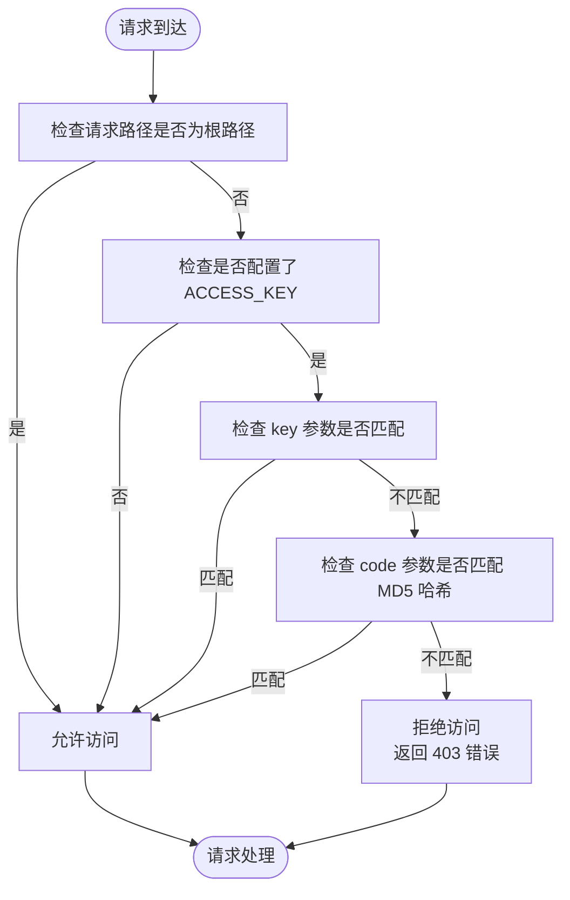
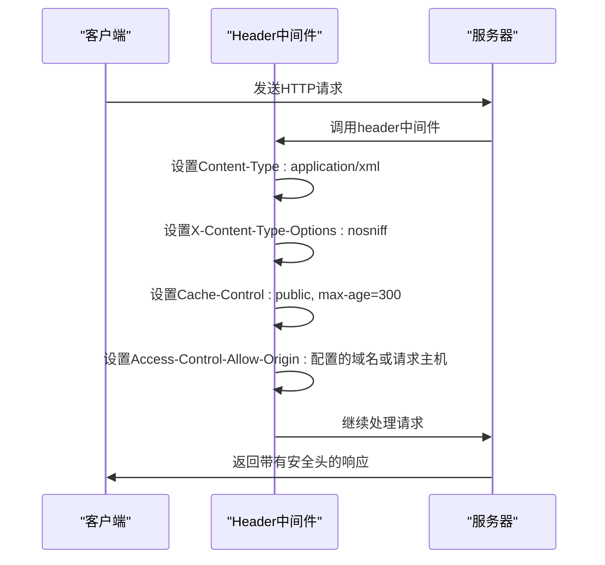
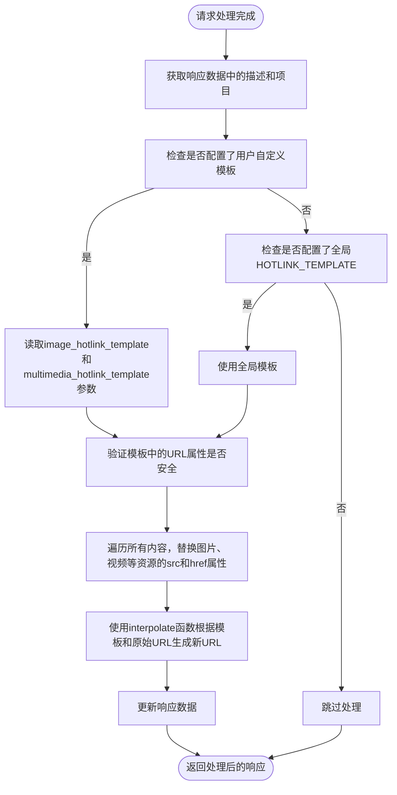
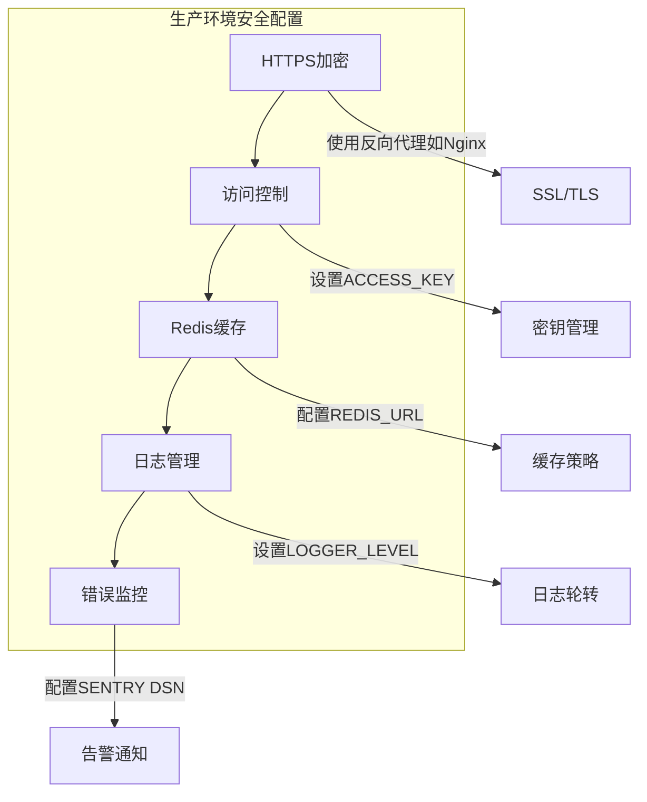
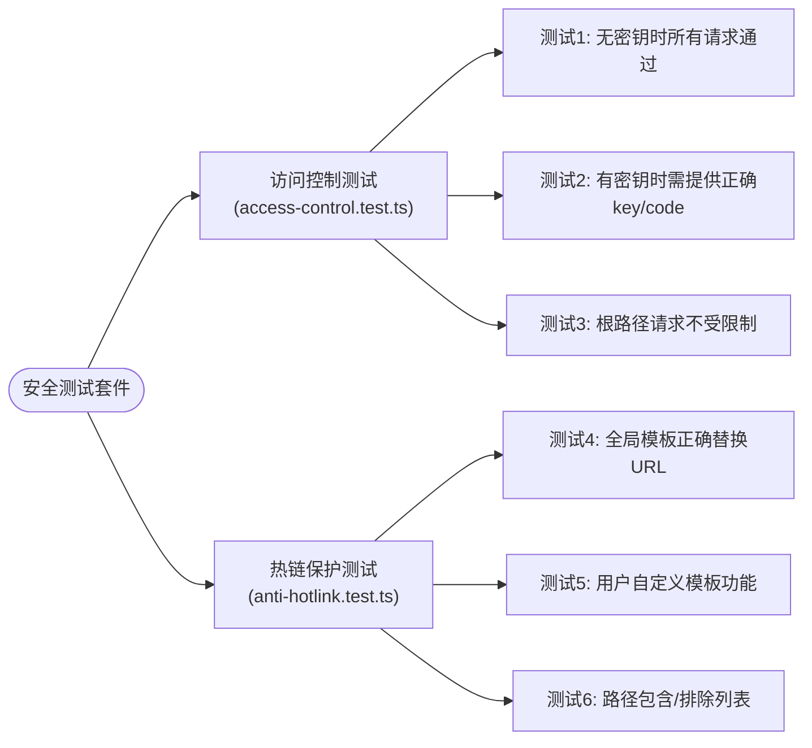

# 安全配置

<cite>
**本文档中引用的文件**
- [config.ts](file://lib/config.ts)
- [access-control.ts](file://lib/middleware/access-control.ts)
- [header.ts](file://lib/middleware/header.ts)
- [anti-hotlink.ts](file://lib/middleware/anti-hotlink.ts)
- [cache.ts](file://lib/middleware/cache.ts)
- [app-bootstrap.tsx](file://lib/app-bootstrap.tsx)
- [SECURITY.md](file://SECURITY.md)
- [access-control.test.ts](file://lib/middleware/access-control.test.ts)
- [anti-hotlink.test.ts](file://lib/middleware/anti-hotlink.test.ts)
</cite>

## 目录
1. [简介](#简介)
2. [访问控制配置](#访问控制配置)
3. [安全头信息与CORS策略](#安全头信息与cors策略)
4. [热链保护与敏感信息防护](#热链保护与敏感信息防护)
5. [生产环境安全最佳实践](#生产环境安全最佳实践)
6. [安全配置测试方法](#安全配置测试方法)
7. [常见漏洞防范措施](#常见漏洞防范措施)
8. [结论](#结论)

## 简介

RSSHub 是一个开源的 RSS 生成器，为各种网站提供 RSS 订阅支持。本安全配置文档深入分析了 RSSHub 的安全相关配置选项，包括访问控制、IP 白名单、请求频率限制和敏感信息保护。文档详细解释了如何配置安全头信息、CORS 策略和 CSRF 防护，并提供了生产环境安全配置的最佳实践，包括 HTTPS 设置、安全令牌管理和日志安全。此外，文档还包含了安全配置的测试方法和常见漏洞的防范措施。

通过本文档，用户可以全面了解 RSSHub 的安全架构和配置选项，确保其部署的安全性。文档基于对 RSSHub 代码库的深入分析，涵盖了核心配置文件、中间件和安全策略的实现细节。

**Section sources**
- [config.ts](file://lib/config.ts#L1-L1188)
- [SECURITY.md](file://SECURITY.md#L1-L10)

## 访问控制配置

RSSHub 提供了多种访问控制机制来保护其 API 端点。核心的访问控制功能通过 `access-control` 中间件实现，该中间件位于 `lib/middleware/access-control.ts`。此中间件通过检查请求中的 `key` 或 `code` 参数来验证访问权限。

访问密钥（ACCESS_KEY）是主要的访问控制机制。当配置了 `ACCESS_KEY` 时，所有非根路径的请求都必须提供正确的密钥或代码才能访问。密钥可以直接通过 `key` 参数传递，或者通过 `code` 参数传递一个基于 MD5 哈希的动态代码。动态代码的生成方式为 `md5(requestPath + config.accessKey)`，这增加了安全性，防止密钥被简单地复制使用。

**Diagram sources**
- [access-control.ts](file://lib/middleware/access-control.ts#L1-L27)

**Section sources**
- [access-control.ts](file://lib/middleware/access-control.ts#L1-L27)
- [config.ts](file://lib/config.ts#L42-L43)

## 安全头信息与CORS策略

RSSHub 通过 `header` 中间件自动设置一系列安全相关的 HTTP 头信息，以增强应用的安全性。该中间件位于 `lib/middleware/header.ts`，负责设置 `Content-Type`、`Cache-Control` 和 `X-Content-Type-Options` 等关键头信息。

`X-Content-Type-Options: nosniff` 头信息可以防止浏览器进行 MIME 类型嗅探，从而降低跨站脚本（XSS）攻击的风险。`Cache-Control` 头信息根据配置设置缓存策略，有助于控制内容的缓存行为。此外，中间件还设置了 `Access-Control-Allow-Origin` 头，实现 CORS（跨域资源共享）策略。该策略的值可以是配置的 `ALLOW_ORIGIN`，如果没有配置，则默认为请求的主机名，这提供了一定程度的跨域访问控制。

**Diagram sources**
- [header.ts](file://lib/middleware/header.ts#L1-L56)

**Section sources**
- [header.ts](file://lib/middleware/header.ts#L1-L56)
- [config.ts](file://lib/config.ts#L21-L22)

## 热链保护与敏感信息防护

RSSHub 提供了强大的热链保护功能，通过 `anti-hotlink` 中间件实现，位于 `lib/middleware/anti-hotlink.ts`。该功能旨在防止外部网站直接盗用 RSSHub 的资源链接，保护带宽和内容安全。

热链保护的核心是 `HOTLINK_TEMPLATE` 配置。当配置了此模板时，中间件会自动将响应中的图片、视频等资源的 URL 替换为通过模板生成的新 URL。例如，可以配置为使用图片代理服务（如 `https://i3.wp.com/${host}${pathname}`）来中转图片请求。此外，系统还支持通过 `HOTLINK_INCLUDE_PATHS` 和 `HOTLINK_EXCLUDE_PATHS` 配置路径白名单和黑名单，实现更精细的控制。

**Diagram sources**
- [anti-hotlink.ts](file://lib/middleware/anti-hotlink.ts#L1-L171)

**Section sources**
- [anti-hotlink.ts](file://lib/middleware/anti-hotlink.ts#L1-L171)
- [config.ts](file://lib/config.ts#L55-L58)

## 生产环境安全最佳实践

在生产环境中部署 RSSHub 时，应遵循一系列安全最佳实践以确保系统的稳定和安全。首先，必须配置 `ACCESS_KEY` 以启用访问控制，防止未授权访问。其次，应使用 HTTPS 来加密所有通信，保护数据在传输过程中的安全。

对于缓存配置，建议在生产环境中使用 Redis 而不是内存缓存，以提高性能和可靠性。通过设置 `CACHE_TYPE=redis` 和 `REDIS_URL` 来配置 Redis 缓存。同时，应合理设置 `CACHE_EXPIRE` 和 `CACHE_CONTENT_EXPIRE`，平衡内容新鲜度和服务器负载。

日志安全同样重要。应配置 `LOGGER_LEVEL` 为适当的级别（如 'info' 或 'warn'），避免在日志中记录敏感信息。如果不需要日志文件，可以设置 `NO_LOGFILES=true`。此外，可以集成 Sentry 错误追踪服务，通过设置 `SENTRY` DSN 来监控和报告错误。

**Diagram sources**
- [config.ts](file://lib/config.ts#L23-L28)
- [config.ts](file://lib/config.ts#L45-L53)

**Section sources**
- [config.ts](file://lib/config.ts#L23-L53)

## 安全配置测试方法

RSSHub 项目包含了一系列测试用例来验证安全配置的正确性。这些测试主要位于 `lib/middleware` 目录下的 `.test.ts` 文件中，使用 Vitest 测试框架进行。

对于访问控制，`access-control.test.ts` 文件中的测试用例验证了不同场景下的访问行为。测试包括：当没有配置 `ACCESS_KEY` 时，所有请求都能通过；当配置了 `ACCESS_KEY` 后，只有提供正确 `key` 或 `code` 的请求才能成功；以及对根路径（如 `/`、`/robots.txt`）的请求不受访问控制限制。

对于热链保护，`anti-hotlink.test.ts` 文件提供了详细的测试。测试用例模拟了不同的请求场景，验证了模板替换的正确性。例如，测试会检查当配置了 `HOTLINK_TEMPLATE` 时，响应中的图片 URL 是否被正确替换为代理 URL。测试还覆盖了用户自定义模板、路径包含/排除列表等复杂场景。

**Diagram sources**
- [access-control.test.ts](file://lib/middleware/access-control.test.ts#L1-L49)
- [anti-hotlink.test.ts](file://lib/middleware/anti-hotlink.test.ts#L1-L200)

**Section sources**
- [access-control.test.ts](file://lib/middleware/access-control.test.ts#L1-L49)
- [anti-hotlink.test.ts](file://lib/middleware/anti-hotlink.test.ts#L1-L200)

## 常见漏洞防范措施

RSSHub 通过多种机制防范常见的安全漏洞。针对跨站脚本（XSS）攻击，系统在处理 HTML 内容时使用 Cheerio 库，该库在设置属性时会进行适当的转义，降低了 XSS 风险。同时，`X-Content-Type-Options: nosniff` 头信息防止了 MIME 类型嗅探攻击。

对于跨站请求伪造（CSRF）攻击，虽然 RSSHub 主要作为数据提供者，但其某些路由（如 `nosec/index.ts`）在与目标网站交互时会处理 CSRF 令牌，展示了对 CSRF 防护的考虑。系统通过提取并使用目标网站的 CSRF 令牌来模拟合法请求。

在敏感信息保护方面，RSSHub 避免在日志中记录完整的请求和响应内容。通过 `logger.ts` 中间件，日志仅记录请求方法、路径和状态码等基本信息。此外，配置文件中的敏感信息（如 API 密钥、Cookie）应通过环境变量注入，而不是硬编码在代码中。

最后，通过 `cache` 中间件实现的请求频率限制和缓存机制，可以有效缓解简单的拒绝服务（DoS）攻击。当某个路径正在被请求时，后续请求会被放入等待队列，避免服务器被大量并发请求压垮。

**Section sources**
- [header.ts](file://lib/middleware/header.ts#L12)
- [logger.ts](file://lib/middleware/logger.ts#L1-L46)
- [cache.ts](file://lib/middleware/cache.ts#L1-L84)
- [nosec/index.ts](file://lib/routes/nosec/index.ts#L43-L79)

## 结论

RSSHub 提供了一套全面的安全配置选项，涵盖了访问控制、头信息安全、热链保护和日志管理等多个方面。通过合理配置 `ACCESS_KEY`、`HOTLINK_TEMPLATE`、`ALLOW_ORIGIN` 等环境变量，用户可以有效地保护其 RSSHub 实例。

在生产环境中，建议启用访问控制、使用 HTTPS、配置 Redis 缓存并合理设置日志级别。同时，应定期查看 `SECURITY.md` 文件，了解项目的安全政策和漏洞报告流程。通过遵循本文档中的最佳实践，用户可以确保其 RSSHub 部署的安全性和稳定性。