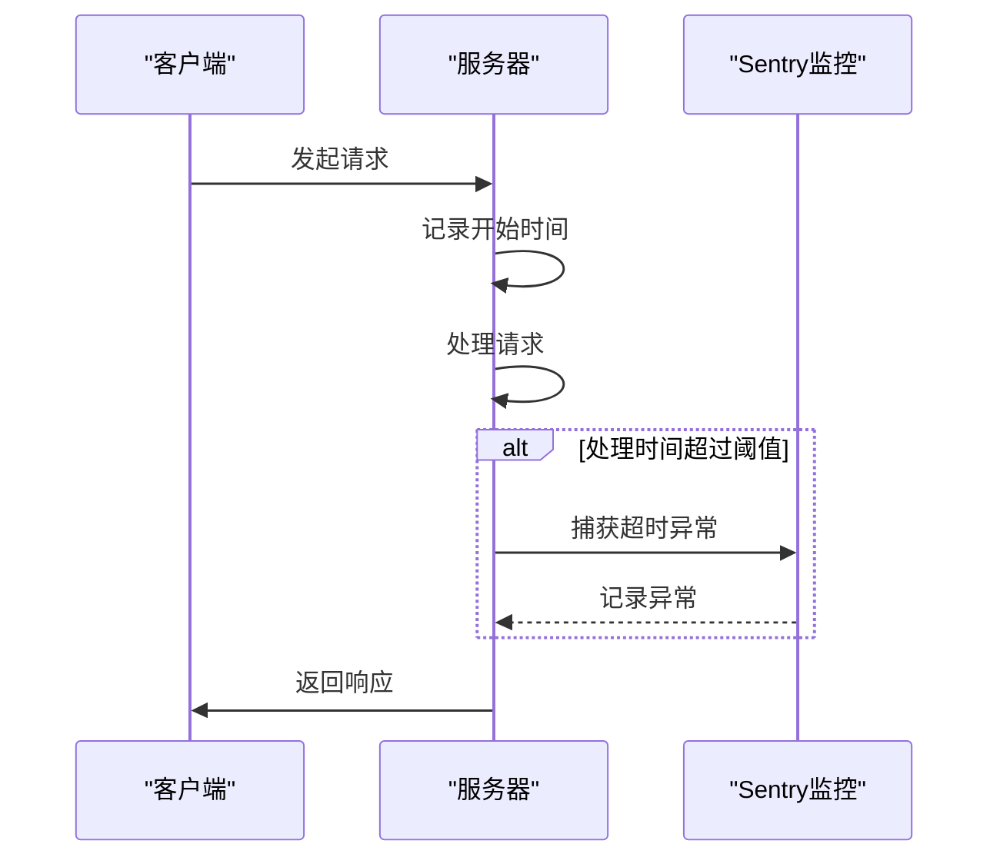
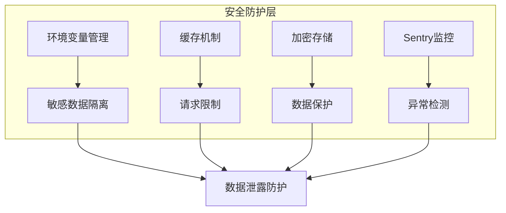

# 数据安全

<cite>
**本文档引用的文件**
- [config.ts](file://lib/config.ts)
- [sentry.ts](file://lib/middleware/sentry.ts)
- [logger.ts](file://lib/middleware/logger.ts)
- [rsshub.env](file://scripts/ansible/rsshub.env)
- [base.ts](file://lib/utils/cache/base.ts)
- [index.ts](file://lib/utils/cache/index.ts)
- [cache.ts](file://lib/middleware/cache.ts)
</cite>

## 目录
1. [简介](#简介)
2. [环境变量管理](#环境变量管理)
3. [敏感信息加密存储](#敏感信息加密存储)
4. [日志脱敏处理](#日志脱敏处理)
5. [Sentry安全监控配置](#sentry安全监控配置)
6. [用户内容安全处理](#用户内容安全处理)
7. [数据泄露防护最佳实践](#数据泄露防护最佳实践)
8. [安全审计日志与数据访问监控](#安全审计日志与数据访问监控)

## 简介
RSSHub作为全球最大的RSS网络，其数据安全机制至关重要。本文档全面阐述RSSHub中敏感数据的保护机制，涵盖环境变量管理、敏感信息加密存储、日志脱敏处理、Sentry安全监控配置、用户内容安全处理、数据泄露防护最佳实践以及安全审计日志与数据访问监控策略。

## 环境变量管理

RSSHub通过环境变量管理敏感配置信息，确保敏感数据不会硬编码在代码中。系统通过`lib/config.ts`文件定义所有可能的环境变量，并从`process.env`中读取配置值。环境变量的命名遵循大写和下划线的约定，如`SENTRY`、`REDIS_URL`等。

系统支持多种类型的环境变量，包括应用配置、网络设置、缓存配置、代理设置、访问控制、日志配置、Feed配置、OpenAI配置以及特定路由的配置。对于特定路由的配置，系统使用前缀模式，如`BILIBILI_COOKIE_`、`EMAIL_CONFIG_`等，允许为不同用户提供独立的认证信息。

在Ansible部署脚本中，`scripts/ansible/rsshub.env`文件提供了生产环境的示例配置，包括节点环境设置、缓存类型和Puppeteer WebSocket端点等关键配置。

**Section sources**
- [config.ts](file://lib/config.ts#L1-L800)
- [rsshub.env](file://scripts/ansible/rsshub.env#L1-L4)

## 敏感信息加密存储

RSSHub在处理敏感信息时采用了多种加密技术。对于特定路由的数据加密，系统使用了不同的加密库和算法。例如，在`lib/routes/stream-capital/utils.ts`中，系统使用`crypto-js`库的AES加密算法，采用CBC模式和PKCS7填充，使用固定的密钥和IV进行加密和解密。

在`lib/routes/ainvest/utils.ts`中，系统同样使用`crypto-js`库，但采用了ECB模式进行AES加密，并使用MD5对密钥进行哈希处理。系统还实现了RSA公钥加密功能，使用`jsrsasign`库处理非对称加密需求。

对于CloudFlare邮箱保护，`lib/routes/sciencedirect/cf-email.ts`实现了CloudFlare的邮箱混淆算法，通过异或操作对邮箱地址进行编码和解码，保护用户隐私。

**Section sources**
- [stream-capital/utils.ts](file://lib/routes/stream-capital/utils.ts#L1-L18)
- [ainvest/utils.ts](file://lib/routes/ainvest/utils.ts#L1-L42)
- [cf-email.ts](file://lib/routes/sciencedirect/cf-email.ts#L1-L38)

## 日志脱敏处理

RSSHub的日志系统在`lib/middleware/logger.ts`中实现，通过中间件方式记录请求和响应信息。日志记录包括请求方法、路径、状态码和处理时间等关键信息，但系统通过设计避免记录敏感数据。

日志中间件使用颜色编码显示不同级别的HTTP状态码，便于快速识别问题。系统通过`logger.info`记录进出请求，但不会记录请求体或响应体的具体内容，从而避免敏感信息泄露。日志级别由`LOGGER_LEVEL`环境变量控制，默认为'info'级别。

系统还支持通过`DEBUG_INFO`环境变量控制调试信息的显示，允许在请求中通过`?debug=some_string`参数有条件地显示调试信息，提供了灵活的调试控制机制。

**Section sources**
- [logger.ts](file://lib/middleware/logger.ts#L1-L46)

## Sentry安全监控配置

RSSHub通过Sentry实现错误监控和性能跟踪。Sentry配置在`lib/middleware/sentry.ts`中实现，通过检查`SENTRY`环境变量来决定是否启用Sentry监控。

当Sentry DSN可用时，系统会初始化Sentry客户端，并设置`node_name`标签以便区分不同节点。系统通过中间件监控路由处理时间，当处理时间超过`SENTRY_ROUTE_TIMEOUT`（默认30000毫秒）时，会捕获"Route Timeout"异常并发送到Sentry。

Sentry配置包括DSN和路由超时阈值，这些配置都通过环境变量`SENTRY`和`SENTRY_ROUTE_TIMEOUT`进行管理，确保敏感的监控配置不会硬编码在代码中。

**Diagram sources**
- [sentry.ts](file://lib/middleware/sentry.ts#L1-L29)
- [config.ts](file://lib/config.ts#L779-L782)

**Section sources**
- [sentry.ts](file://lib/middleware/sentry.ts#L1-L29)

## 用户内容安全处理

RSSHub通过多种机制确保用户提交内容的安全处理。系统使用缓存机制来限制并发请求，防止滥用。缓存系统在`lib/utils/cache/index.ts`中实现，支持内存缓存和Redis缓存两种模式。

系统通过`tryGet`方法提供缓存获取功能，当缓存不存在时会调用提供的函数获取数据并缓存。这种方法确保了相同请求不会重复处理，提高了系统效率并防止了潜在的滥用。

对于特定路由的用户认证信息，系统使用前缀化的环境变量名，如`BILIBILI_COOKIE_`后跟用户ID，实现了多用户认证信息的隔离存储。系统在处理这些信息时，会通过专门的配置对象进行管理，避免直接暴露原始数据。

**Section sources**
- [index.ts](file://lib/utils/cache/index.ts#L1-L100)

## 数据泄露防护最佳实践

RSSHub通过多层次的安全机制防止数据泄露。首先，系统通过环境变量管理所有敏感配置，避免敏感信息进入版本控制系统。其次，系统使用缓存隔离机制，通过`CACHE_TYPE`环境变量选择内存或Redis缓存，Redis连接信息通过`REDIS_URL`环境变量配置。

在数据库连接安全方面，虽然RSSHub主要作为数据聚合器而非数据存储器，但其缓存系统起到了类似数据库的作用。系统通过配置`REDIS_URL`来连接Redis实例，支持完整的Redis连接字符串，包括认证信息。

对于缓存数据保护，系统在`lib/utils/cache/base.ts`中定义了缓存模块接口，确保缓存操作的标准化。内存缓存使用`lru-cache`库，设置了最大项目数限制，防止内存耗尽攻击。

临时文件处理方面，系统在WASM执行环境中模拟了文件系统，但仅用于输出缓冲，不涉及实际文件创建，减少了临时文件相关的安全风险。

**Diagram sources**
- [base.ts](file://lib/utils/cache/base.ts#L1-L17)
- [index.ts](file://lib/utils/cache/index.ts#L1-L100)

**Section sources**
- [base.ts](file://lib/utils/cache/base.ts#L1-L17)
- [index.ts](file://lib/utils/cache/index.ts#L1-L100)

## 安全审计日志与数据访问监控

RSSHub通过综合的日志和监控系统实现安全审计和数据访问监控。系统日志记录了所有进出请求的基本信息，包括方法、路径、状态码和处理时间，但不包含请求体和响应体内容，平衡了监控需求和隐私保护。

通过Sentry集成，系统能够监控异常情况和性能问题，特别是路由处理超时情况。Sentry事件包含了路由名称等上下文信息，便于问题定位，但不会包含敏感的请求参数。

缓存系统也提供了访问监控能力，通过`globalCache`对象记录缓存命中和设置情况。系统可以监控特定键的访问模式，识别异常访问行为。

对于数据访问控制，系统通过`ACCESS_KEY`环境变量实现基本的访问控制，只有提供正确访问密钥的请求才能访问受保护的路由。

**Section sources**
- [logger.ts](file://lib/middleware/logger.ts#L1-L46)
- [sentry.ts](file://lib/middleware/sentry.ts#L1-L29)
- [cache.ts](file://lib/middleware/cache.ts#L70-L83)