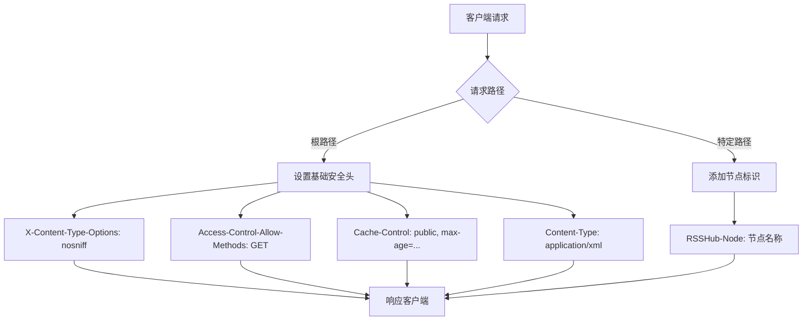
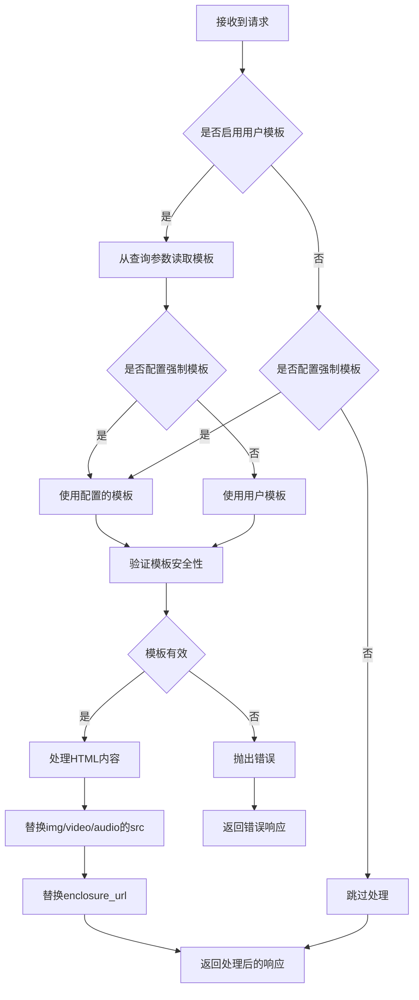
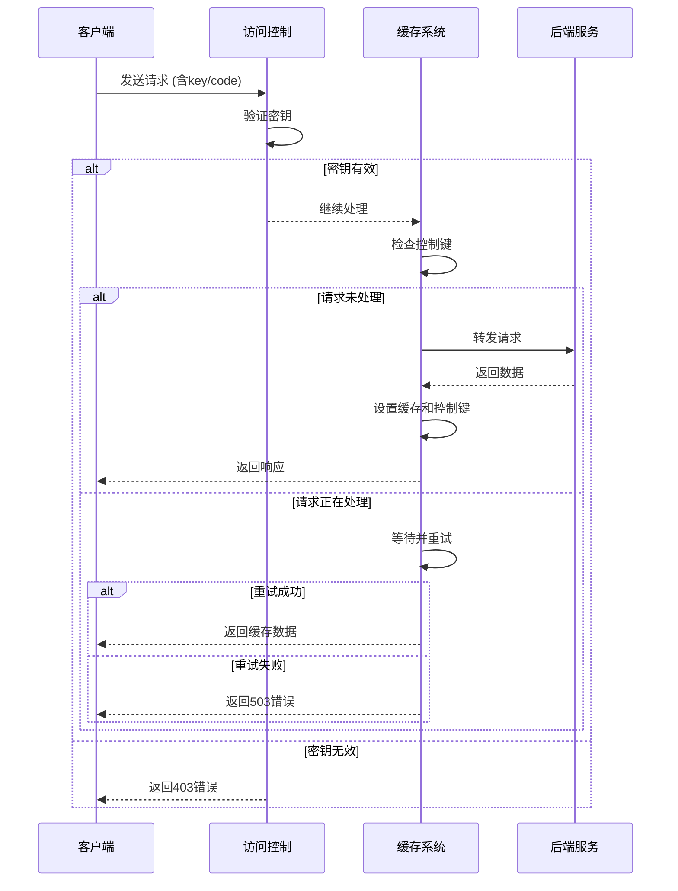

# 网络安全

<cite>
**本文档引用文件**  
- [header.ts](file://lib/middleware/header.ts)
- [anti-hotlink.ts](file://lib/middleware/anti-hotlink.ts)
- [access-control.ts](file://lib/middleware/access-control.ts)
- [config.ts](file://lib/config.ts)
- [cache.ts](file://lib/middleware/cache.ts)
- [parameter.ts](file://lib/middleware/parameter.ts)
- [sentry.ts](file://lib/middleware/sentry.ts)
- [trace.ts](file://lib/middleware/trace.ts)
</cite>

## 目录
1. [引言](#引言)
2. [安全HTTP头配置](#安全http头配置)
3. [反盗链机制实现](#反盗链机制实现)
4. [访问控制与DDoS防护](#访问控制与ddos防护)
5. [HTTPS与TLS最佳实践](#https与tls最佳实践)
6. [网络安全测试与漏洞防范](#网络安全测试与漏洞防范)
7. [结论](#结论)

## 引言

RSSHub作为一个开源的RSS生成器，其网络安全防护体系涵盖了HTTP安全头配置、反盗链机制、访问控制、缓存管理等多个层面。本文档深入分析其网络安全架构，重点阐述安全HTTP头的设置、反盗链实现原理、DDoS防护策略以及HTTPS配置指南，为系统管理员和开发者提供全面的安全防护参考。

## 安全HTTP头配置

RSSHub通过中间件机制配置了多项关键的安全HTTP头，以增强系统的安全性。在`lib/middleware/header.ts`文件中，定义了以下核心安全头：

- **X-Content-Type-Options**: 设置为`nosniff`，防止浏览器进行MIME类型嗅探，避免潜在的跨站脚本（XSS）攻击。
- **Access-Control-Allow-Methods**: 限制为`GET`方法，确保API接口仅接受安全的HTTP请求方法。
- **Cache-Control**: 根据配置设置缓存策略，有效控制内容的缓存时间，减少敏感信息的暴露风险。
- **Content-Type**: 明确指定内容类型为`application/xml; charset=utf-8`，确保客户端正确解析响应内容。

此外，系统还根据配置动态添加`RSSHub-Node`头，用于标识节点信息。通过`Access-Control-Allow-Origin`头，系统实现了跨域资源共享（CORS）的精细控制，仅允许来自可信源的请求。

**图源**  
- [header.ts](file://lib/middleware/header.ts#L8-L16)

**本节来源**  
- [header.ts](file://lib/middleware/header.ts#L1-L55)

## 反盗链机制实现

RSSHub的反盗链机制在`lib/middleware/anti-hotlink.ts`中实现，通过模板替换和URL验证来保护媒体资源。该机制的核心功能包括：

1. **路径过滤**: 通过`includePaths`和`excludePaths`配置项，精确控制哪些路径需要应用反盗链保护。
2. **模板插值**: 支持动态模板`${property}`，可安全地替换URL中的特定属性（如host、pathname等）。
3. **用户自定义模板**: 当`ALLOW_USER_HOTLINK_TEMPLATE`启用时，允许用户通过查询参数指定自定义的热链模板，但仅限于个人使用场景。
4. **强制配置模板**: 通过`HOTLINK_TEMPLATE`环境变量，可为所有符合条件的路径强制应用统一的反盗链模板。

系统会对HTML内容中的`img`、`video`、`audio`等标签的`src`属性进行处理，同时也会处理`enclosure_url`等RSS特定字段。在处理前，会对模板进行严格验证，确保只使用允许的URL属性，防止潜在的注入攻击。

**图源**  
- [anti-hotlink.ts](file://lib/middleware/anti-hotlink.ts#L1-L171)

**本节来源**  
- [anti-hotlink.ts](file://lib/middleware/anti-hotlink.ts#L1-L171)
- [config.ts](file://lib/config.ts#L307-L311)

## 访问控制与DDoS防护

RSSHub实现了多层访问控制和DDoS防护机制，确保系统的稳定性和安全性。

### 访问密钥控制

在`lib/middleware/access-control.ts`中，实现了基于密钥的访问控制。当`ACCESS_KEY`配置项设置后，系统会验证请求中的`key`或`code`参数。`code`参数是路径与密钥的MD5哈希值，提供了一种更安全的认证方式，防止密钥直接暴露在URL中。

### 请求频率限制与缓存保护

通过`lib/middleware/cache.ts`中的缓存中间件，系统实现了请求频率限制和并发控制。当缓存可用时，系统会为每个请求路径生成唯一的控制键（controlKey），并在请求处理期间将其标记为"1"。如果同一路径的请求同时到达，后续请求会等待一段时间后重试，最多重试10次。若仍无法获取资源，则返回503状态码，有效防止了对后端服务的过度请求。

### 错误追踪与超时监控

`lib/middleware/sentry.ts`集成了Sentry错误追踪服务，当请求处理时间超过`SENTRY_ROUTE_TIMEOUT`（默认30秒）时，会自动上报"Route Timeout"异常。这有助于及时发现潜在的DDoS攻击或性能瓶颈。

**图源**  
- [access-control.ts](file://lib/middleware/access-control.ts#L1-L27)
- [cache.ts](file://lib/middleware/cache.ts#L1-L84)
- [sentry.ts](file://lib/middleware/sentry.ts#L1-L29)

**本节来源**  
- [access-control.ts](file://lib/middleware/access-control.ts#L1-L27)
- [cache.ts](file://lib/middleware/cache.ts#L1-L84)
- [sentry.ts](file://lib/middleware/sentry.ts#L1-L29)

## HTTPS与TLS最佳实践

虽然RSSHub本身不直接处理HTTPS，但其设计充分考虑了与HTTPS代理的集成，遵循了现代Web安全的最佳实践。

### 与反向代理的集成

RSSHub通常部署在Nginx、Caddy等反向代理之后，由代理服务器处理SSL/TLS终止。在这种架构下，RSSHub通过`X-Forwarded-Proto`等头信息识别原始请求的协议类型，并相应地调整响应内容。

### HSTS支持

虽然代码中未直接设置HSTS头，但通过反向代理可以轻松配置HTTP Strict Transport Security（HSTS），强制浏览器仅通过HTTPS连接访问服务。

### 安全的Cookie处理

在处理第三方服务的Cookie时（如`lib/routes/zaker/utils.ts`中的实现），系统会正确处理`Set-Cookie`头，并通过安全的方式传递会话信息，确保敏感数据不被泄露。

### 内容安全策略

在特定路由（如Telegram媒体路由）中，系统会设置严格的内容安全策略（CSP），例如`default-src 'self'; script-src 'none'`，完全禁止内联脚本执行，有效防御XSS攻击。

## 网络安全测试与漏洞防范

### 常见漏洞防范策略

- **XSS防范**: 通过`sanitize-html`库清理HTML内容，移除潜在的恶意脚本。在`parameter.ts`中，对`img`标签的`onclick`等事件属性进行移除，并设置`referrerpolicy="no-referrer"`防止信息泄露。
- **CSRF防范**: 由于RSSHub主要提供只读的RSS订阅服务，不涉及用户状态修改，因此天然具备较强的CSRF防护能力。对于需要身份验证的路由，通过访问密钥机制进行保护。
- **信息泄露防护**: 通过`X-RSSHub-Route`头提供路由信息，但仅在调试模式下启用。错误信息经过精心设计，避免暴露过多的系统内部细节。

### 安全测试方法

1. **自动化测试**: 项目包含全面的单元测试和集成测试，验证各种安全中间件的行为。
2. **渗透测试**: 建议定期对部署实例进行渗透测试，检查是否存在配置错误或新的安全漏洞。
3. **依赖扫描**: 使用工具定期扫描项目依赖，及时发现和修复已知的漏洞。

## 结论

RSSHub通过多层次的安全机制构建了一个健壮的网络安全防护体系。从基础的HTTP安全头配置，到复杂的反盗链和访问控制，再到与现代安全实践的集成，系统在保证功能灵活性的同时，始终将安全性放在首位。建议系统管理员根据实际需求合理配置各项安全参数，并定期更新和审查安全策略，以应对不断变化的网络威胁环境。