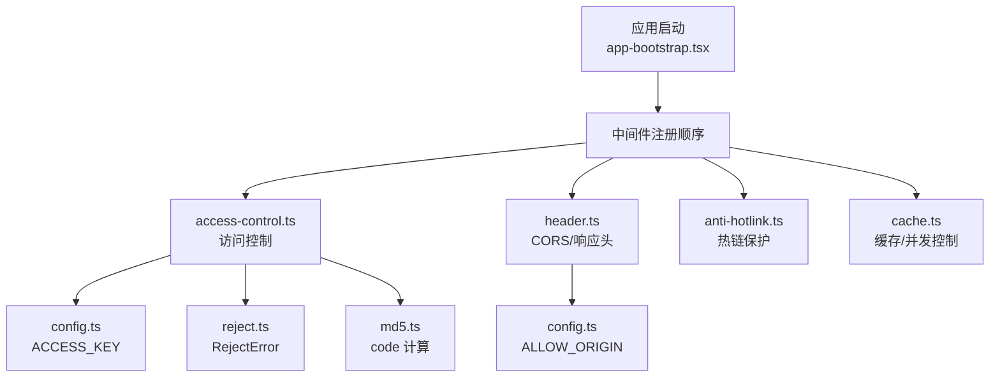
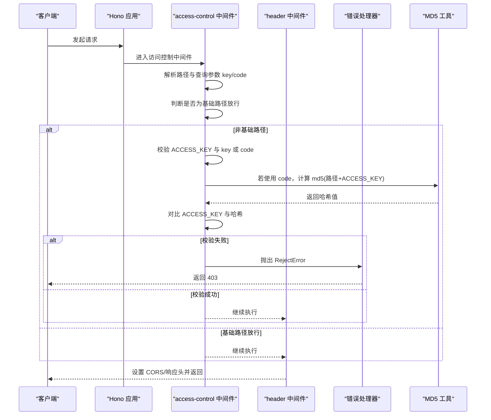
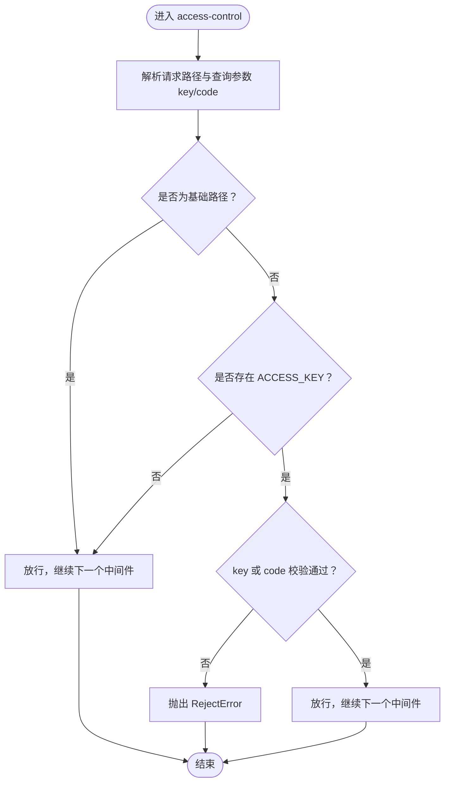
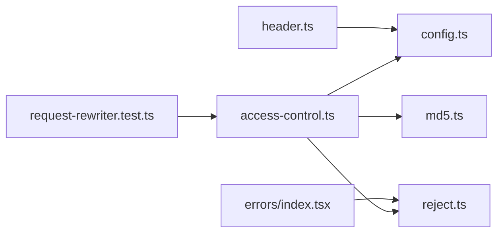

# 访问控制

<cite>
**本文引用的文件**
- [access-control.ts](file://lib/middleware/access-control.ts)
- [access-control.test.ts](file://lib/middleware/access-control.test.ts)
- [config.ts](file://lib/config.ts)
- [app-bootstrap.tsx](file://lib/app-bootstrap.tsx)
- [header.ts](file://lib/middleware/header.ts)
- [index.tsx](file://lib/errors/index.tsx)
- [reject.ts](file://lib/errors/types/reject.ts)
- [md5.ts](file://lib/utils/md5.ts)
- [CLAUDE.md](file://lib/middleware/CLAUDE.md)
- [request-rewriter.test.ts](file://lib/utils/request-rewriter.test.ts)
</cite>

## 目录
1. [简介](#简介)
2. [项目结构](#项目结构)
3. [核心组件](#核心组件)
4. [架构总览](#架构总览)
5. [详细组件分析](#详细组件分析)
6. [依赖分析](#依赖分析)
7. [性能考虑](#性能考虑)
8. [故障排查指南](#故障排查指南)
9. [结论](#结论)
10. [附录](#附录)

## 简介
本文件面向 RSSHub 的访问控制机制进行系统化说明，重点覆盖以下方面：
- API 密钥验证：基于查询参数 key 与 code 的认证流程
- 请求频率限制：通过缓存并发控制与请求去重实现的限流效果
- CORS 协同：与 header 中间件共同实现跨域策略
- 与 Nginx 等反向代理的配合：在代理层前置的安全策略建议
- 其他安全机制的交互：与热链保护、错误处理、Sentry 等的关系

需要特别说明的是：当前仓库中未发现“IP 白名单/黑名单”或“allowedHosts/forbiddenHosts”的显式实现；访问控制中间件主要围绕 API 密钥验证与基础路径放行逻辑。本文将据此给出可操作的实践建议与注意事项。

## 项目结构
RSSHub 使用 Hono 应用框架，访问控制中间件位于 lib/middleware 目录下，并在应用启动时按固定顺序注册。关键文件如下：
- 访问控制中间件：lib/middleware/access-control.ts
- 应用启动与中间件注册：lib/app-bootstrap.tsx
- 配置读取：lib/config.ts（含 ACCESS_KEY）
- CORS 与通用响应头：lib/middleware/header.ts
- 错误处理与 RejectError：lib/errors/index.tsx、lib/errors/types/reject.ts
- MD5 工具：lib/utils/md5.ts
- 测试用例：lib/middleware/access-control.test.ts
- 中间件文档：lib/middleware/CLAUDE.md（包含对 access-control 的职责说明）

图表来源
- [app-bootstrap.tsx](file://lib/app-bootstrap.tsx#L27-L45)
- [access-control.ts](file://lib/middleware/access-control.ts#L1-L26)
- [header.ts](file://lib/middleware/header.ts#L1-L55)
- [config.ts](file://lib/config.ts#L737-L768)
- [reject.ts](file://lib/errors/types/reject.ts#L1-L5)
- [md5.ts](file://lib/utils/md5.ts#L1-L200)

章节来源
- [app-bootstrap.tsx](file://lib/app-bootstrap.tsx#L27-L45)
- [access-control.ts](file://lib/middleware/access-control.ts#L1-L26)
- [header.ts](file://lib/middleware/header.ts#L1-L55)
- [config.ts](file://lib/config.ts#L737-L768)

## 核心组件
- 访问控制中间件（access-control）：校验请求是否携带有效的 API 密钥（key 或 code），并对特定基础路径放行。
- 配置系统（config）：读取 ACCESS_KEY 等环境变量，供中间件使用。
- CORS 与响应头（header）：设置 Access-Control-Allow-Origin、Cache-Control 等。
- 错误处理（errors）：将 RejectError 映射为 403 响应。
- MD5 工具：用于生成 code 的哈希值。

章节来源
- [access-control.ts](file://lib/middleware/access-control.ts#L1-L26)
- [config.ts](file://lib/config.ts#L737-L768)
- [header.ts](file://lib/middleware/header.ts#L1-L55)
- [index.tsx](file://lib/errors/index.tsx#L46-L82)
- [reject.ts](file://lib/errors/types/reject.ts#L1-L5)
- [md5.ts](file://lib/utils/md5.ts#L1-L200)

## 架构总览
访问控制在 Hono 应用中的执行顺序如下（节选）：
- trimTrailingSlash → compress → jsxRenderer → mLogger → trace → sentry → access-control → debug → template → header → anti-hotlink → parameter → cache

其中 access-control 在 header 之前执行，确保在设置 CORS 响应头前完成鉴权判断。

图表来源
- [app-bootstrap.tsx](file://lib/app-bootstrap.tsx#L27-L45)
- [access-control.ts](file://lib/middleware/access-control.ts#L1-L26)
- [header.ts](file://lib/middleware/header.ts#L1-L55)
- [index.tsx](file://lib/errors/index.tsx#L46-L82)
- [md5.ts](file://lib/utils/md5.ts#L1-L200)

## 详细组件分析

### 访问控制中间件（access-control）
- 功能要点
  - 对常见基础路径（如根路径、robots.txt、favicon.ico、logo.png）直接放行，不进行密钥校验。
  - 对其他路径：若配置了 ACCESS_KEY，则要求请求携带 key 或 code；否则拒绝。
  - code 的生成规则为 md5(请求路径 + ACCESS_KEY)，用于一次性或临时授权场景。
- 关键行为
  - 从 URL 查询参数读取 key 与 code
  - 通过 config.accessKey 进行对比
  - 校验失败抛出 RejectError，交由错误处理器映射为 403
- 安全边界
  - 仅基于查询参数的 API 密钥，不包含 IP 白名单/黑名单或 allowedHosts/forbiddenHosts 的实现
  - 建议在反向代理层（如 Nginx）增加 IP/主机名过滤与速率限制

图表来源
- [access-control.ts](file://lib/middleware/access-control.ts#L1-L26)
- [index.tsx](file://lib/errors/index.tsx#L46-L82)
- [md5.ts](file://lib/utils/md5.ts#L1-L200)

章节来源
- [access-control.ts](file://lib/middleware/access-control.ts#L1-L26)
- [access-control.test.ts](file://lib/middleware/access-control.test.ts#L1-L49)
- [index.tsx](file://lib/errors/index.tsx#L46-L82)

### 配置系统（config）
- ACCESS_KEY：用于启用 API 密钥验证
- ALLOW_ORIGIN：用于 header 中间件设置 CORS 域名
- 缓存与超时：影响并发控制与限流效果（见后续章节）

章节来源
- [config.ts](file://lib/config.ts#L737-L768)

### CORS 与响应头（header）
- 设置 Access-Control-Allow-Origin：优先使用配置项 ALLOW_ORIGIN，否则回退到请求的 host
- 设置 Cache-Control、X-Content-Type-Options 等通用响应头
- 与 access-control 协同：先鉴权再设置 CORS，避免泄露敏感信息

章节来源
- [header.ts](file://lib/middleware/header.ts#L1-L55)

### 错误处理与 RejectError
- RejectError 在错误处理器中被映射为 403 响应
- 便于与上游代理或网关区分“鉴权失败”与“其他错误”

章节来源
- [index.tsx](file://lib/errors/index.tsx#L46-L82)
- [reject.ts](file://lib/errors/types/reject.ts#L1-L5)

### 请求频率限制与并发控制
- 当前实现通过缓存模块的并发控制与“请求进行中”错误实现限流效果
- 测试用例展示了并发请求在特定路由下的限流表现（例如等待与重试）
- 注意：这并非传统意义上的“速率限制器”，而是基于缓存与去重的并发控制

章节来源
- [request-rewriter.test.ts](file://lib/utils/request-rewriter.test.ts#L201-L214)
- [index.tsx](file://lib/errors/index.tsx#L30-L49)

### 与热链保护（anti-hotlink）的协作
- anti-hotlink 在响应阶段对媒体链接进行替换与清洗，避免外部站点直接引用资源
- 与 access-control 并行工作：前者保障访问权限，后者保障资源不被滥用

章节来源
- [anti-hotlink.ts](file://lib/middleware/anti-hotlink.ts#L1-L171)

## 依赖分析
- 访问控制中间件依赖
  - config：读取 ACCESS_KEY
  - RejectError：用于拒绝访问
  - md5：生成 code
- 错误处理依赖
  - RejectError 类型映射为 403
- CORS 依赖
  - config.allowOrigin：决定 Access-Control-Allow-Origin
- 并发控制依赖
  - 缓存模块与“请求进行中”错误共同实现限流效果

图表来源
- [access-control.ts](file://lib/middleware/access-control.ts#L1-L26)
- [config.ts](file://lib/config.ts#L737-L768)
- [reject.ts](file://lib/errors/types/reject.ts#L1-L5)
- [md5.ts](file://lib/utils/md5.ts#L1-L200)
- [header.ts](file://lib/middleware/header.ts#L1-L55)
- [index.tsx](file://lib/errors/index.tsx#L46-L82)
- [request-rewriter.test.ts](file://lib/utils/request-rewriter.test.ts#L201-L214)

## 性能考虑
- 中间件执行顺序靠前的 access-control 可以尽早拒绝无效请求，减少下游负载
- header 中间件设置 Cache-Control，有助于浏览器与代理缓存，降低重复请求压力
- 并发控制与“请求进行中”错误可避免同一路径的重复抓取，提升整体吞吐

[本节为通用指导，无需列出具体文件来源]

## 故障排查指南
- 403 鉴权失败
  - 检查是否正确设置了 ACCESS_KEY
  - 确认请求是否携带 key 或 code，且 code 为 md5(路径+ACCESS_KEY)
  - 确认请求路径不在基础路径放行列表之外
- CORS 问题
  - 检查 ALLOW_ORIGIN 配置是否正确
  - 确认浏览器是否收到 Access-Control-Allow-Origin 响应头
- 限流/并发问题
  - 观察是否存在大量“请求进行中”的并发控制提示
  - 调整缓存类型与过期策略，避免频繁重复抓取

章节来源
- [access-control.test.ts](file://lib/middleware/access-control.test.ts#L1-L49)
- [header.ts](file://lib/middleware/header.ts#L1-L55)
- [index.tsx](file://lib/errors/index.tsx#L30-L49)

## 结论
- RSSHub 的访问控制以 API 密钥为核心，结合基础路径放行与 RejectError 映射实现鉴权
- 当前未内置 IP 白名单/黑名单或 allowedHosts/forbiddenHosts 的实现，建议在反向代理层补充
- CORS 与 header 中间件协同工作，确保跨域与响应头一致性
- 并发控制与“请求进行中”错误提供了限流效果，但非传统速率限制器

[本节为总结性内容，无需列出具体文件来源]

## 附录

### 如何配置 API 密钥验证
- 设置环境变量 ACCESS_KEY
- 客户端请求携带 key 或 code 参数
  - key：与 ACCESS_KEY 直接比较
  - code：需满足 code = md5(请求路径 + ACCESS_KEY)

章节来源
- [config.ts](file://lib/config.ts#L737-L768)
- [access-control.ts](file://lib/middleware/access-control.ts#L1-L26)
- [access-control.test.ts](file://lib/middleware/access-control.test.ts#L1-L49)

### 与 Nginx 等反向代理配合的建议
- 在代理层增加 IP 白名单/黑名单与主机名过滤
- 在代理层设置速率限制，避免对后端造成过大压力
- 将 HTTPS 终止于代理，后端以 HTTP 接收请求，减少 TLS 开销
- 通过代理转发真实客户端 IP（如 X-Forwarded-For），以便上游做策略

[本节为通用实践建议，无需列出具体文件来源]

### 与 CORS 的协同工作
- header 中间件设置 Access-Control-Allow-Origin
- access-control 在设置 CORS 前完成鉴权，避免泄露敏感信息
- 若前端跨域请求，需确保 ALLOW_ORIGIN 正确配置

章节来源
- [header.ts](file://lib/middleware/header.ts#L1-L55)
- [config.ts](file://lib/config.ts#L737-L768)

### 与热链保护（anti-hotlink）的协同
- anti-hotlink 在响应阶段替换媒体链接，防止外部站点直接引用
- 与 access-control 并行，分别保障访问权限与资源安全

章节来源
- [anti-hotlink.ts](file://lib/middleware/anti-hotlink.ts#L1-L171)

### 与 Sentry 的交互
- sentry 中间件在路由超时时上报错误，便于定位性能瓶颈
- 与 access-control 无直接冲突，但共同构成安全与可观测性体系

章节来源
- [sentry.ts](file://lib/middleware/sentry.ts#L1-L28)