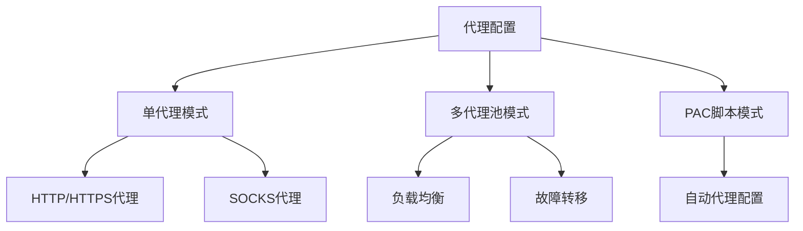
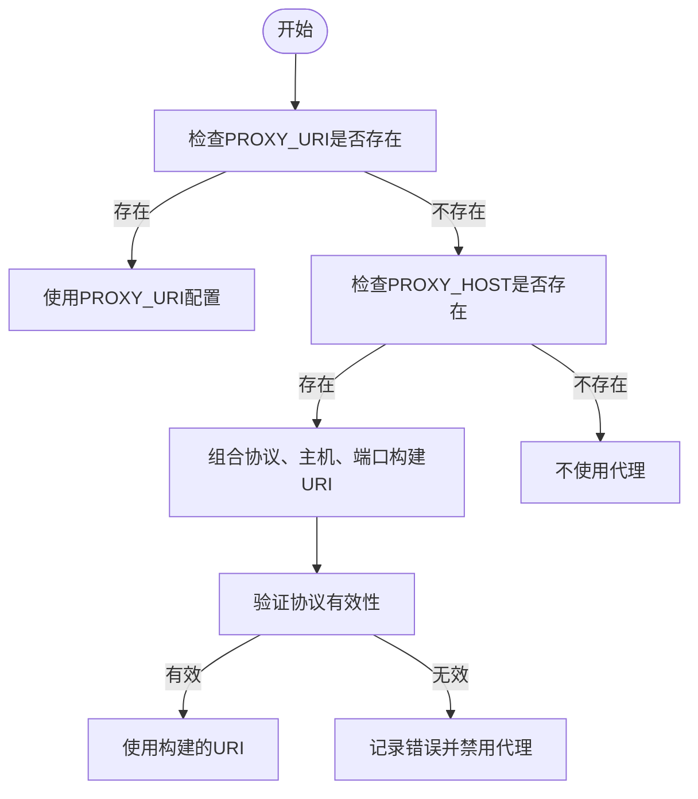
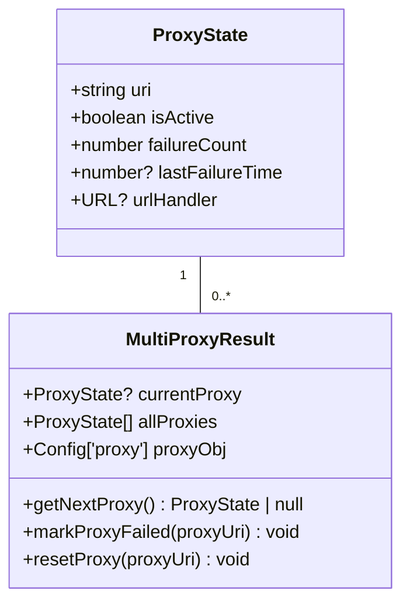
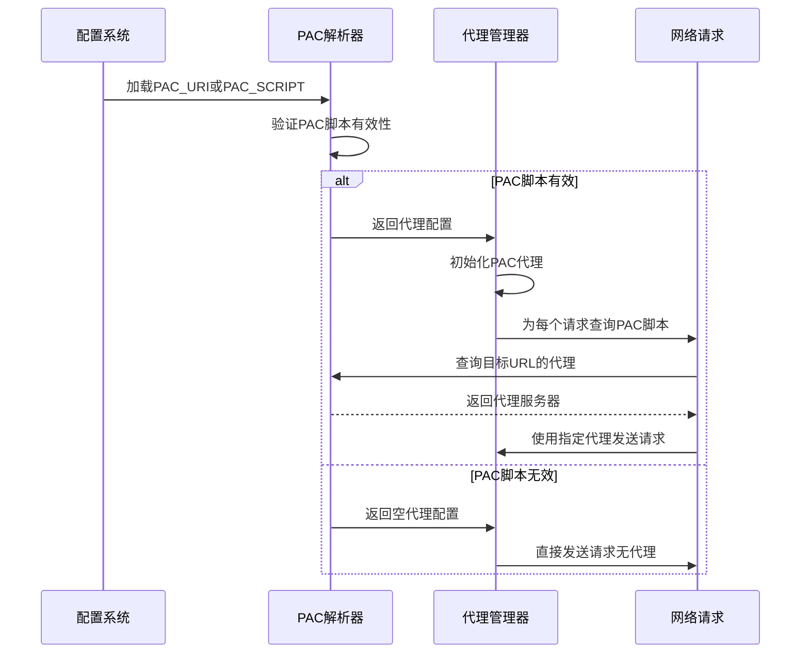
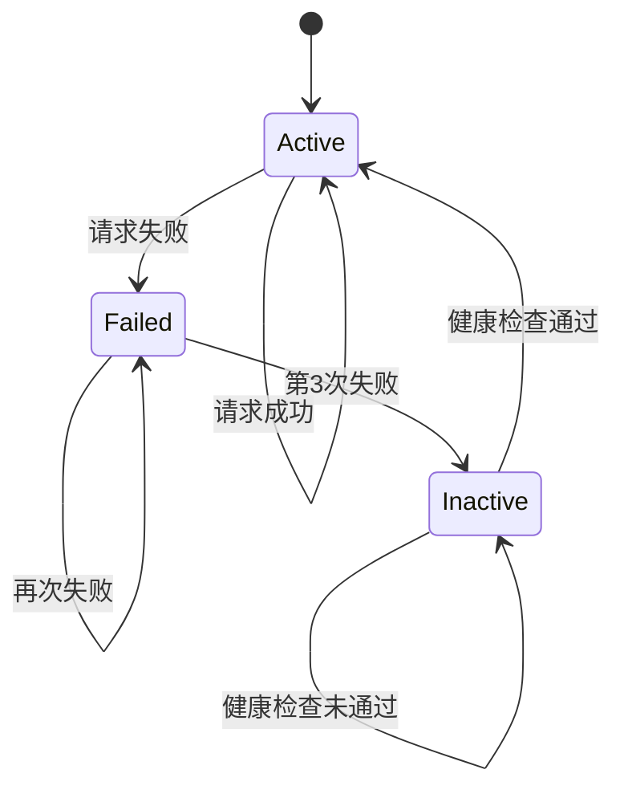
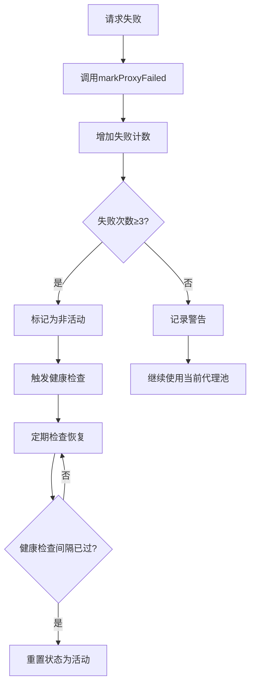
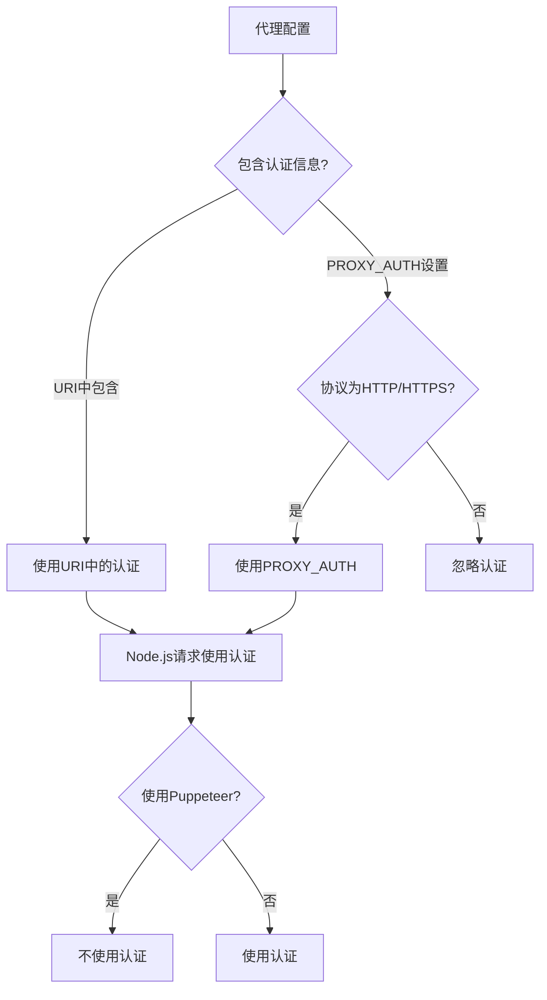

# 代理配置

<cite>
**本文档中引用的文件**  
- [config.ts](file://lib/config.ts)
- [index.ts](file://lib/utils/proxy/index.ts)
- [multi-proxy.ts](file://lib/utils/proxy/multi-proxy.ts)
- [unify-proxy.ts](file://lib/utils/proxy/unify-proxy.ts)
- [pac-proxy.ts](file://lib/utils/proxy/pac-proxy.ts)
</cite>

## 目录
1. [简介](#简介)
2. [代理配置概述](#代理配置概述)
3. [单代理配置](#单代理配置)
4. [多代理配置与负载均衡](#多代理配置与负载均衡)
5. [PAC代理配置](#pac代理配置)
6. [代理故障转移机制](#代理故障转移机制)
7. [代理验证与安全设置](#代理验证与安全设置)
8. [性能调优建议](#性能调优建议)
9. [常见问题解决方案](#常见问题解决方案)

## 简介
RSSHub 是一个强大的 RSS 聚合网络，支持通过代理服务器访问受限制的内容。本文档详细介绍了 RSSHub 的代理服务器配置和管理方法，包括 HTTP/HTTPS 代理、SOCKS 代理、PAC 脚本代理以及多代理池的配置。通过合理的代理配置，用户可以绕过网络限制，提高内容抓取的成功率和稳定性。

## 代理配置概述

RSSHub 提供了灵活的代理配置选项，支持多种代理类型和配置方式。代理配置主要通过环境变量或配置文件进行设置，系统会根据配置自动选择合适的代理策略。

**图示来源**  
- [config.ts](file://lib/config.ts#L274-L290)
- [index.ts](file://lib/utils/proxy/index.ts#L14-L15)

## 单代理配置

单代理配置是最基本的代理设置方式，通过指定单一代理服务器来转发所有请求。

### 配置参数
- **PROXY_URI**: 代理服务器完整地址（包含协议、主机、端口和认证信息）
- **PROXY_PROTOCOL**: 代理协议（http、https、socks、socks4、socks4a、socks5、socks5h）
- **PROXY_HOST**: 代理服务器主机名或IP地址
- **PROXY_PORT**: 代理服务器端口号
- **PROXY_AUTH**: 代理认证信息（用户名:密码）
- **PROXY_URL_REGEX**: 代理应用的URL正则表达式，默认为`.*`（所有URL）

### 配置优先级
当同时配置 `PROXY_URI` 和 `PROXY_{PROTOCOL,HOST,PORT}` 时，系统优先使用 `PROXY_URI`，并忽略其他单独的代理配置。

**图示来源**  
- [unify-proxy.ts](file://lib/utils/proxy/unify-proxy.ts#L7-L110)
- [config.ts](file://lib/config.ts#L748-L758)

## 多代理配置与负载均衡

多代理配置允许用户指定多个代理服务器，系统会自动进行负载均衡和故障转移管理。

### 配置参数
- **PROXY_URIS**: 多个代理服务器地址，用逗号分隔
- **PROXY_STRATEGY**: 代理使用策略，可选值：
  - `all`: 所有请求都通过代理
  - `on_retry`: 仅在请求失败时使用代理
- **PROXY_FAILOVER_TIMEOUT**: 故障转移超时时间（毫秒），默认5000
- **PROXY_HEALTH_CHECK_INTERVAL**: 健康检查间隔（毫秒），默认60000

### 负载均衡策略
系统采用轮询（Round Robin）算法进行负载均衡，同时维护每个代理的状态信息：

**图示来源**  
- [multi-proxy.ts](file://lib/utils/proxy/multi-proxy.ts#L6-L23)
- [index.ts](file://lib/utils/proxy/index.ts#L9-L10)

## PAC代理配置

PAC（Proxy Auto-Configuration）代理配置允许使用JavaScript脚本动态决定请求的代理服务器。

### 配置参数
- **PAC_URI**: PAC脚本的URL地址
- **PAC_SCRIPT**: PAC脚本内容（直接嵌入）
- **PROXY_AUTH**: PAC代理的认证信息

### 工作流程

**图示来源**  
- [pac-proxy.ts](file://lib/utils/proxy/pac-proxy.ts#L6-L72)
- [index.ts](file://lib/utils/proxy/index.ts#L14-L15)

## 代理故障转移机制

RSSHub 实现了完善的代理故障转移机制，确保在代理服务器失效时能够自动切换到备用代理。

### 故障检测与恢复
- 每个代理服务器最多允许3次失败
- 失败3次后，代理被标记为非活动状态
- 非活动代理在健康检查间隔后自动恢复
- 系统会自动切换到下一个可用代理

### 故障处理流程

**图示来源**  
- [multi-proxy.ts](file://lib/utils/proxy/multi-proxy.ts#L55-L67)
- [index.ts](file://lib/utils/proxy/index.ts#L106-L123)

## 代理验证与安全设置

### 认证机制
- 支持 Basic 认证
- 认证信息通过 `PROXY_AUTH` 环境变量配置
- 认证仅对 HTTP(S) 代理有效
- SOCKS 代理不支持认证

### 安全注意事项
1. **认证信息优先级**：如果 `PROXY_URI` 中包含用户名和密码，则忽略 `PROXY_AUTH`
2. **协议兼容性**：`PROXY_AUTH` 仅支持 HTTP(S) 代理
3. **Puppeteer 限制**：通过 `PROXY_AUTH` 设置的认证信息不会被 Puppeteer 使用

**图示来源**  
- [unify-proxy.ts](file://lib/utils/proxy/unify-proxy.ts#L64-L80)
- [pac-proxy.ts](file://lib/utils/proxy/pac-proxy.ts#L46-L62)

## 性能调优建议

### 连接池配置
- 合理设置 `PROXY_HEALTH_CHECK_INTERVAL`（默认60秒）
- 根据网络状况调整 `PROXY_FAILOVER_TIMEOUT`
- 避免设置过多的代理服务器，以免增加管理开销

### 缓存策略
- 结合 RSSHub 的缓存机制，减少重复请求
- 对于稳定的代理服务器，可以适当延长健康检查间隔
- 使用 `url_regex` 参数限制代理应用范围，避免不必要的代理开销

### 资源管理
- 监控代理服务器的响应时间和成功率
- 定期清理失效的代理服务器
- 平衡代理池大小和系统性能

## 常见问题解决方案

### 代理配置不生效
1. 检查环境变量名称是否正确
2. 确认 `PROXY_URI` 和 `PROXY_URIS` 没有冲突
3. 验证代理服务器地址格式是否正确
4. 检查日志中的代理相关警告和错误信息

### 认证失败
1. 确认 `PROXY_AUTH` 格式为 `用户名:密码`
2. 检查代理服务器是否支持所使用的认证方式
3. 对于 HTTP(S) 代理，优先在 `PROXY_URI` 中包含认证信息

### 性能问题
1. 减少代理池中的代理服务器数量
2. 调整健康检查间隔，避免过于频繁的检查
3. 使用 `url_regex` 限制代理应用范围
4. 监控系统资源使用情况，确保有足够的内存和CPU资源

**本节来源**  
- [config.ts](file://lib/config.ts#L274-L290)
- [multi-proxy.ts](file://lib/utils/proxy/multi-proxy.ts#L52-L54)
- [unify-proxy.ts](file://lib/utils/proxy/unify-proxy.ts#L83-L108)