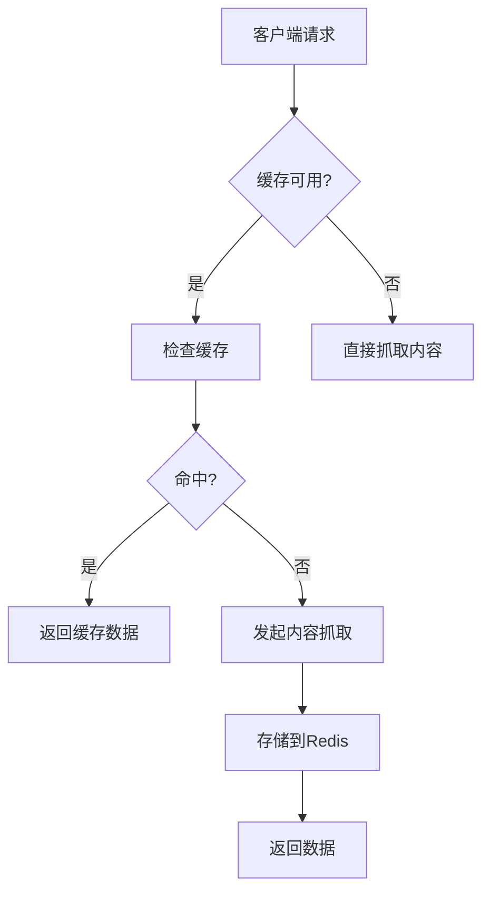
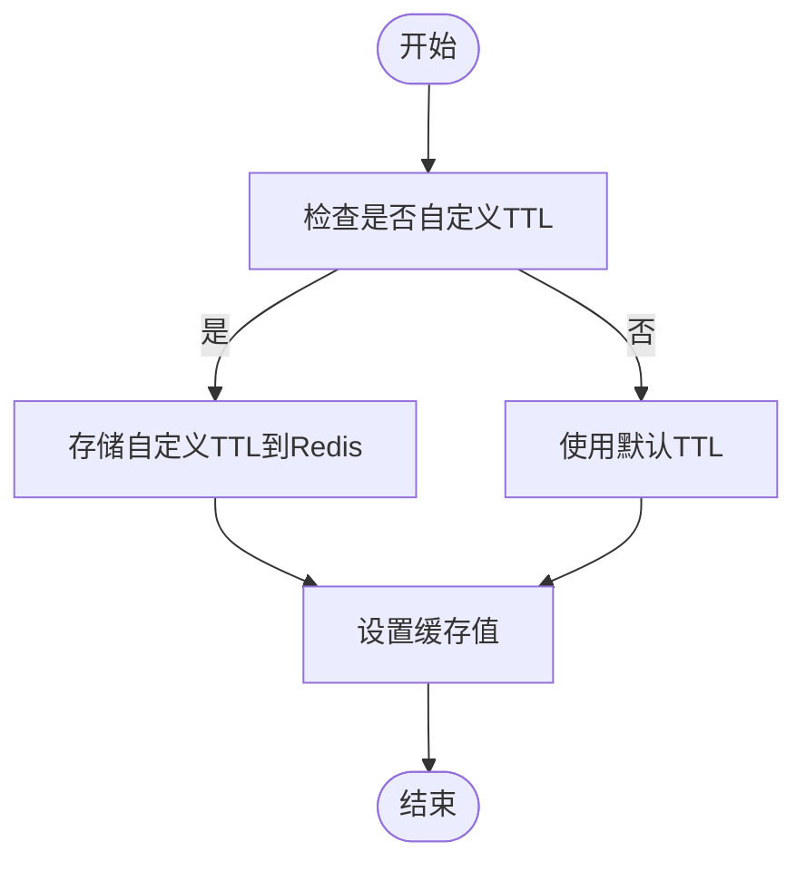
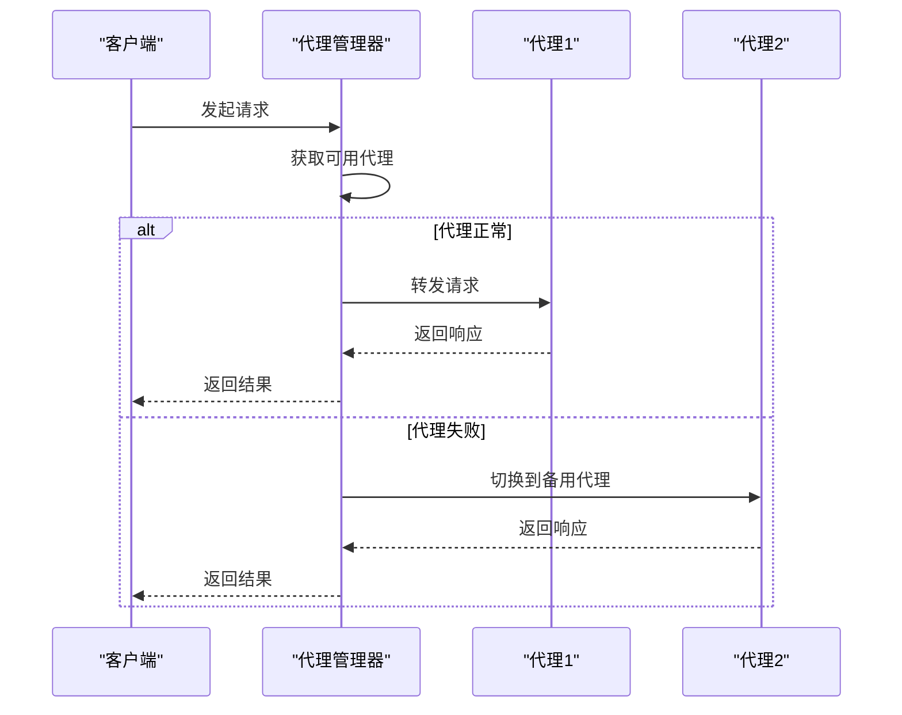
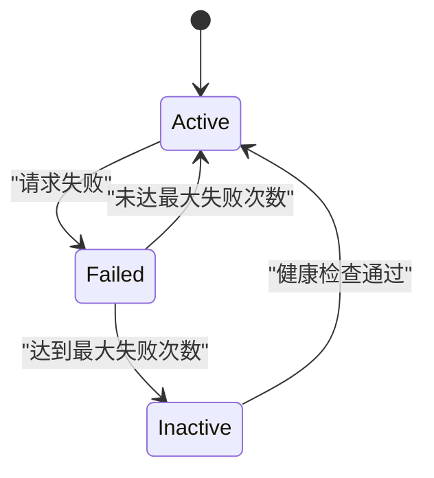
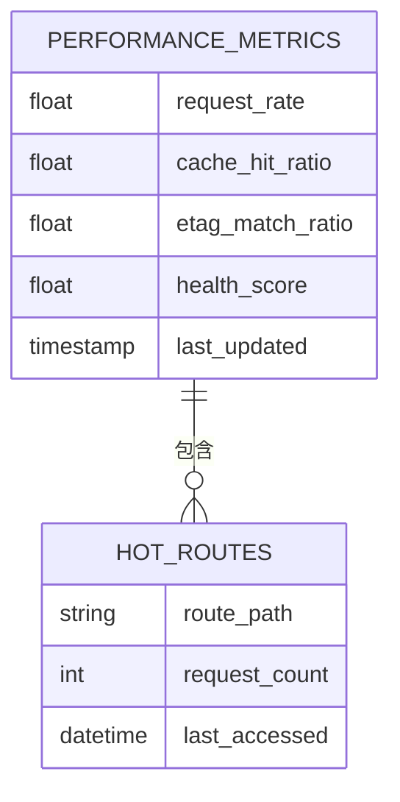

# 性能配置

<cite>
**本文档中引用的文件**  
- [config.ts](file://lib/config.ts)
- [cache.ts](file://lib/middleware/cache.ts)
- [index.ts](file://lib/utils/cache/index.ts)
- [redis.ts](file://lib/utils/cache/redis.ts)
- [memory.ts](file://lib/utils/cache/memory.ts)
- [index.ts](file://lib/utils/proxy/index.ts)
- [multi-proxy.ts](file://lib/utils/proxy/multi-proxy.ts)
- [rsshub.env](file://scripts/ansible/rsshub.env)
</cite>

## 目录
1. [引言](#引言)
2. [缓存系统配置](#缓存系统配置)
3. [代理服务器配置](#代理服务器配置)
4. [性能监控与调优建议](#性能监控与调优建议)
5. [总结](#总结)

## 引言

RSSHub 是一个强大的内容聚合系统，通过高效的缓存机制和灵活的代理配置来优化内容抓取性能。本文档详细介绍了如何配置 Redis 缓存、内存缓存、缓存过期策略、代理服务器设置以及性能监控选项，帮助用户最大化系统性能。

## 缓存系统配置

RSSHub 提供了多种缓存机制，包括 Redis 缓存和内存缓存，以提高内容抓取效率并减少重复请求。

### Redis 缓存配置

Redis 缓存是推荐的高性能缓存方案，适用于分布式部署环境。通过配置 `CACHE_TYPE=redis` 和 `REDIS_URL` 环境变量启用 Redis 缓存。



**Diagram sources**  
- [config.ts](file://lib/config.ts#L263-L274)
- [redis.ts](file://lib/utils/cache/redis.ts#L1-L78)

**Section sources**  
- [config.ts](file://lib/config.ts#L735-L747)
- [redis.ts](file://lib/utils/cache/redis.ts#L1-L78)

### 内存缓存配置

内存缓存使用 LRU（最近最少使用）算法管理缓存数据，适合单机部署场景。通过设置 `CACHE_TYPE=memory` 启用内存缓存，并可通过 `MEMORY_MAX` 控制最大缓存条目数。

```mermaid
classDiagram
class LRUCache {
+ttl : number
+max : number
+get(key) : any
+set(key, value) : void
}
class MemoryCache {
-clients : { memoryCache? : LRUCache }
-status : { available : boolean }
+init() : void
+get(key, refresh) : string | null
+set(key, value, maxAge) : void
}
MemoryCache --> LRUCache : "使用"
```

**Diagram sources**  
- [memory.ts](file://lib/utils/cache/memory.ts#L1-L45)
- [config.ts](file://lib/config.ts#L269-L271)

**Section sources**  
- [memory.ts](file://lib/utils/cache/memory.ts#L1-L45)
- [config.ts](file://lib/config.ts#L741-L744)

### 缓存过期策略

RSSHub 支持两种缓存过期时间配置：
- `CACHE_EXPIRE`：路由缓存时间（默认 300 秒）
- `CACHE_CONTENT_EXPIRE`：内容缓存时间（默认 3600 秒）

当缓存键的过期时间不同于默认值时，系统会单独存储 TTL 值以实现精细化控制。



**Diagram sources**  
- [redis.ts](file://lib/utils/cache/redis.ts#L57-L73)
- [config.ts](file://lib/config.ts#L266-L267)

**Section sources**  
- [redis.ts](file://lib/utils/cache/redis.ts#L57-L73)
- [config.ts](file://lib/config.ts#L738-L739)

## 代理服务器配置

RSSHub 支持多种代理配置方式，包括单一代理、多代理负载均衡和 PAC 脚本代理。

### 多代理负载均衡

通过 `PROXY_URIS` 环境变量配置多个代理服务器，系统将自动进行负载均衡和故障转移。每个代理最多允许 3 次失败，之后会被标记为不可用并在健康检查间隔后重新激活。



**Diagram sources**  
- [multi-proxy.ts](file://lib/utils/proxy/multi-proxy.ts#L1-L141)
- [index.ts](file://lib/utils/proxy/index.ts#L60-L74)

**Section sources**  
- [multi-proxy.ts](file://lib/utils/proxy/multi-proxy.ts#L1-L141)
- [index.ts](file://lib/utils/proxy/index.ts#L1-L143)

### 代理策略与健康检查

系统支持两种代理策略：
- `all`：所有请求都通过代理
- `on_retry`：仅在重试时使用代理

健康检查间隔由 `PROXY_HEALTH_CHECK_INTERVAL` 控制（默认 60 秒），确保失效代理能够及时恢复。



**Diagram sources**  
- [multi-proxy.ts](file://lib/utils/proxy/multi-proxy.ts#L52-L67)
- [config.ts](file://lib/config.ts#L286-L287)

**Section sources**  
- [multi-proxy.ts](file://lib/utils/proxy/multi-proxy.ts#L52-L67)
- [config.ts](file://lib/config.ts#L762-L764)

## 性能监控与调优建议

### 并发请求限制

通过 `CACHE_REQUEST_TIMEOUT` 配置控制并发请求超时时间（默认 60 秒）。当同一路径正在处理请求时，后续请求将等待直至超时或前一个请求完成。

### 请求超时设置

`REQUEST_TIMEOUT` 参数控制单个请求的超时时间（默认 30 秒），`REQUEST_RETRY` 控制失败重试次数（默认 2 次）。

### 性能监控指标

系统提供详细的性能监控数据，包括：
- 请求速率（次/分钟）
- 缓存命中率
- ETag 匹配率
- 系统健康度
- 热门路由统计



**Diagram sources**  
- [config.ts](file://lib/config.ts#L257-L258)
- [index.ts](file://lib/views/index.tsx#L60-L95)

**Section sources**  
- [config.ts](file://lib/config.ts#L729-L730)
- [index.tsx](file://lib/views/index.tsx#L60-L95)

## 总结

通过合理配置缓存系统和代理服务器，可以显著提升 RSSHub 的性能和稳定性。建议生产环境使用 Redis 缓存配合多代理负载均衡方案，并根据实际需求调整各项超时和过期参数以达到最佳性能表现。