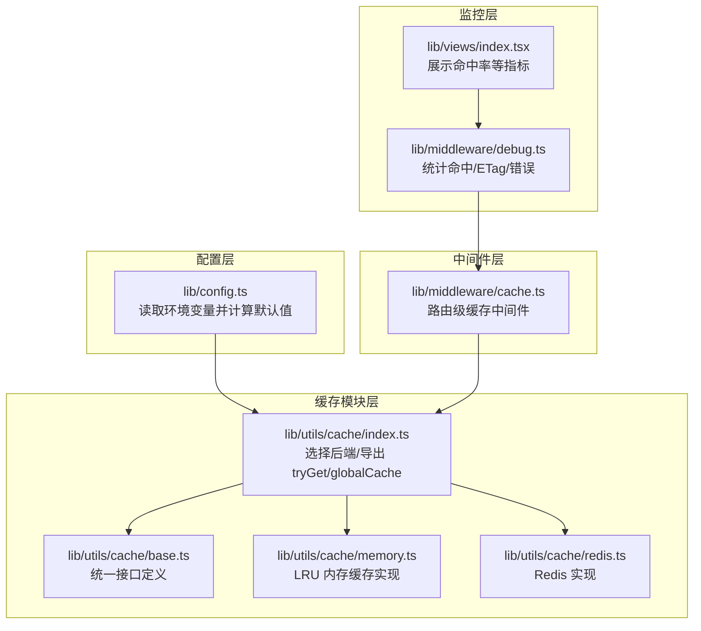
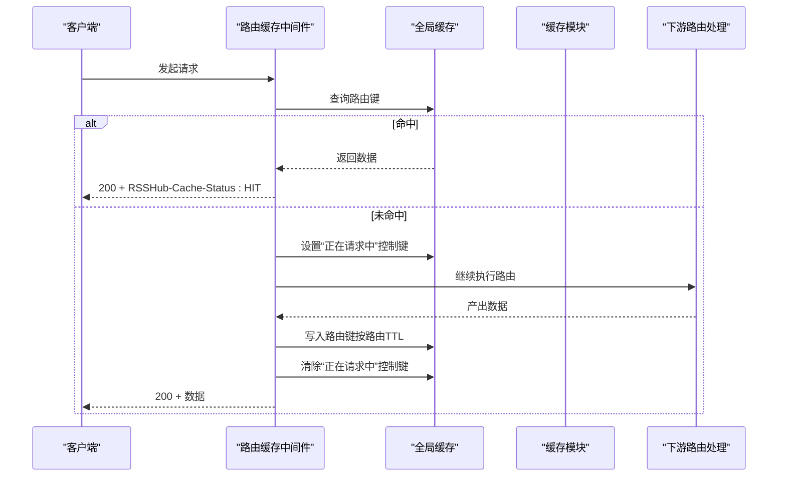
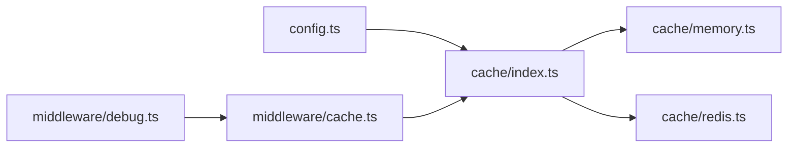

# 缓存配置

<cite>
**本文引用的文件**
- [lib/config.ts](file://lib/config.ts)
- [lib/utils/cache/index.ts](file://lib/utils/cache/index.ts)
- [lib/utils/cache/base.ts](file://lib/utils/cache/base.ts)
- [lib/utils/cache/memory.ts](file://lib/utils/cache/memory.ts)
- [lib/utils/cache/redis.ts](file://lib/utils/cache/redis.ts)
- [lib/middleware/cache.ts](file://lib/middleware/cache.ts)
- [lib/middleware/cache.test.ts](file://lib/middleware/cache.test.ts)
- [lib/utils/cache.test.ts](file://lib/utils/cache.test.ts)
- [lib/middleware/debug.ts](file://lib/middleware/debug.ts)
- [lib/views/index.tsx](file://lib/views/index.tsx)
- [lib/routes-deprecated/index.js](file://lib/routes-deprecated/index.js)
- [scripts/ansible/rsshub.env](file://scripts/ansible/rsshub.env)
</cite>

## 目录
1. [简介](#简介)
2. [项目结构与关键组件](#项目结构与关键组件)
3. [核心配置项与默认行为](#核心配置项与默认行为)
4. [架构总览](#架构总览)
5. [详细组件分析](#详细组件分析)
6. [依赖关系分析](#依赖关系分析)
7. [性能与命中率监控](#性能与命中率监控)
8. [配置示例与最佳实践](#配置示例与最佳实践)
9. [常见问题与排障](#常见问题与排障)
10. [结论](#结论)

## 简介
本文件面向 RSSHub 的缓存系统，聚焦于缓存配置、Redis 与内存缓存的实现差异、过期策略、键命名与分区、并发控制、命中率监控与性能优化，并提供可直接落地的配置示例与排障建议。

## 项目结构与关键组件
- 配置层：集中定义缓存相关环境变量与默认值，决定运行时使用哪种缓存后端及 TTL。
- 缓存模块层：抽象出统一接口，分别实现内存与 Redis 后端；提供全局缓存访问器与 tryGet 辅助方法。
- 中间件层：路由级缓存中间件负责键生成、并发控制、命中返回与写入缓存。
- 监控层：调试中间件统计命中数，页面展示命中率等指标。

图表来源
- [lib/config.ts](file://lib/config.ts#L735-L760)
- [lib/utils/cache/index.ts](file://lib/utils/cache/index.ts#L1-L60)
- [lib/utils/cache/memory.ts](file://lib/utils/cache/memory.ts#L1-L44)
- [lib/utils/cache/redis.ts](file://lib/utils/cache/redis.ts#L1-L77)
- [lib/middleware/cache.ts](file://lib/middleware/cache.ts#L1-L83)
- [lib/middleware/debug.ts](file://lib/middleware/debug.ts#L1-L40)
- [lib/views/index.tsx](file://lib/views/index.tsx#L60-L95)

章节来源
- [lib/config.ts](file://lib/config.ts#L735-L760)
- [lib/utils/cache/index.ts](file://lib/utils/cache/index.ts#L1-L60)
- [lib/middleware/cache.ts](file://lib/middleware/cache.ts#L1-L83)

## 核心配置项与默认行为
- 缓存类型与开关
  - CACHE_TYPE：支持 'memory'、'redis' 或空字符串禁用缓存。默认启用内存缓存。
  - 参考路径：[lib/config.ts](file://lib/config.ts#L735-L740)
- 过期策略
  - CACHE_EXPIRE：路由级缓存 TTL（秒），默认 5 分钟。
  - CACHE_CONTENT_EXPIRE：内容级缓存 TTL（秒），默认 1 小时。
  - 参考路径：[lib/config.ts](file://lib/config.ts#L735-L740)
- 内存缓存容量
  - MEMORY_MAX：内存 LRU 最大项数，默认较小值。
  - 参考路径：[lib/config.ts](file://lib/config.ts#L741-L744)
- Redis 连接
  - REDIS_URL：Redis 连接地址，默认本地。
  - 参考路径：[lib/config.ts](file://lib/config.ts#L745-L747)
- 并发请求控制
  - CACHE_REQUEST_TIMEOUT：请求锁超时（秒），用于避免同一路径并发重复抓取。
  - 参考路径：[lib/config.ts](file://lib/config.ts#L735-L740)

章节来源
- [lib/config.ts](file://lib/config.ts#L735-L760)

## 架构总览
RSSHub 的缓存分为三层：
- 全局缓存：通过中间件在 Redis/LRU 中存储最终 RSS 数据体，供后续请求直接返回。
- 路由级缓存：中间件根据路径、format、limit 计算键，命中即直接返回。
- 并发控制：通过一个“正在请求中”的控制键，避免同一路径并发重复抓取。

图表来源
- [lib/middleware/cache.ts](file://lib/middleware/cache.ts#L13-L83)
- [lib/utils/cache/index.ts](file://lib/utils/cache/index.ts#L1-L60)

## 详细组件分析

### 配置与默认值（lib/config.ts）
- 关键点
  - CACHE_TYPE 默认 'memory'，空字符串表示禁用缓存。
  - CACHE_EXPIRE 默认 5 分钟，CACHE_CONTENT_EXPIRE 默认 1 小时。
  - MEMORY_MAX 默认较小值，适合单实例场景；生产建议调高。
  - REDIS_URL 默认本地地址。
  - CACHE_REQUEST_TIMEOUT 默认 60 秒，用于并发锁。
- 影响范围
  - 决定缓存模块初始化与行为（memory/redis/no cache）。
  - 影响中间件键生成与 TTL 设置。

章节来源
- [lib/config.ts](file://lib/config.ts#L735-L760)

### 缓存模块抽象（lib/utils/cache/base.ts）
- 接口职责
  - init/get/set/status/clients：统一对外暴露。
  - clients 支持 redisClient 与 memoryCache。
- 设计意义
  - 便于在不同后端之间切换，保持上层调用一致。

章节来源
- [lib/utils/cache/base.ts](file://lib/utils/cache/base.ts#L1-L17)

### 内存缓存（lib/utils/cache/memory.ts）
- 特性
  - 使用 LRU 缓存，基于 ttl 与 max 控制容量与过期。
  - get 支持 refresh 参数更新年龄。
- TTL 行为
  - 路由级 TTL 来自 config.cache.routeExpire。
  - 内容级 TTL 来自 set(maxAge)。
- 并发与可用性
  - 初始化成功后 status.available=true。

章节来源
- [lib/utils/cache/memory.ts](file://lib/utils/cache/memory.ts#L1-L44)
- [lib/config.ts](file://lib/config.ts#L735-L744)

### Redis 缓存（lib/utils/cache/redis.ts）
- 连接与可用性
  - 从 config.redis.url 创建连接，监听 error/end/connect 事件维护可用状态。
- 键与过期
  - 存储两条键：主键与对应 TTL 键（rsshub:cacheTtl:前缀）。
  - 若 maxAge 非默认值，则单独存储 TTL 键；否则使用默认内容 TTL。
  - get 时若 refresh=true，会同时对主键与 TTL 键进行 expire 刷新。
- 安全限制
  - 禁止用户使用 rsshub:cacheTtl: 前缀作为自定义 key，防止冲突。

章节来源
- [lib/utils/cache/redis.ts](file://lib/utils/cache/redis.ts#L1-L77)
- [lib/config.ts](file://lib/config.ts#L745-L747)

### 缓存模块入口（lib/utils/cache/index.ts）
- 选择逻辑
  - redis：初始化 redis 模块，globalCache 直接复用 redisClient。
  - memory：初始化 memory 模块，globalCache 使用 LRU。
  - 其他：禁用缓存，记录日志。
- tryGet 辅助方法
  - 提供“缓存命中则返回，未命中则执行回调并缓存”的便捷流程。
  - 支持 maxAge 与 refresh 参数。
- globalCache
  - 对外暴露 get/set，供中间件直接使用。

章节来源
- [lib/utils/cache/index.ts](file://lib/utils/cache/index.ts#L1-L60)
- [lib/utils/cache/index.ts](file://lib/utils/cache/index.ts#L62-L101)

### 路由级缓存中间件（lib/middleware/cache.ts）
- 键生成规则
  - 基于路径、format、limit 计算唯一键；使用哈希缩短键长度。
  - 控制键用于并发锁。
- 并发控制
  - 若控制键为 '1'，等待若干轮次后仍未释放则抛错。
  - 成功获取数据后写入控制键 '0'。
- 命中与写入
  - 命中：设置 RSSHub-Cache-Status: HIT 并直接返回。
  - 未命中：将数据序列化后以路由 TTL 写入全局缓存。
- 兼容性
  - 对静态资源与白名单路径跳过缓存。

章节来源
- [lib/middleware/cache.ts](file://lib/middleware/cache.ts#L1-L83)

### 测试验证（lib/middleware/cache.test.ts 与 lib/utils/cache.test.ts）
- 功能覆盖
  - memory/redis/no cache 三种模式的行为验证。
  - Redis 断连/错误连接时的降级行为。
  - tryGet 的键类型校验与 TTL 冲突保护。
- 关键断言
  - 命中时设置 RSSHub-Cache-Status: HIT。
  - RSS TTL 在有无缓存时的差异表现。

章节来源
- [lib/middleware/cache.test.ts](file://lib/middleware/cache.test.ts#L1-L190)
- [lib/utils/cache.test.ts](file://lib/utils/cache.test.ts#L1-L92)

## 依赖关系分析
- 配置到缓存模块
  - config.cache.type 决定初始化 memory 或 redis。
- 中间件到缓存模块
  - 中间件通过 globalCache 读写；内部再委托具体后端。
- 监控到中间件
  - 调试中间件读取响应头 RSSHub-Cache-Status 统计命中。

图表来源
- [lib/config.ts](file://lib/config.ts#L735-L760)
- [lib/utils/cache/index.ts](file://lib/utils/cache/index.ts#L1-L60)
- [lib/utils/cache/memory.ts](file://lib/utils/cache/memory.ts#L1-L44)
- [lib/utils/cache/redis.ts](file://lib/utils/cache/redis.ts#L1-L77)
- [lib/middleware/cache.ts](file://lib/middleware/cache.ts#L1-L83)
- [lib/middleware/debug.ts](file://lib/middleware/debug.ts#L1-L40)

## 性能与命中率监控
- 命中率统计
  - 调试中间件在响应头存在 RSSHub-Cache-Status 时增加命中计数。
  - 页面视图展示“缓存命中率”、“ETag 匹配率”等指标。
- 性能建议
  - 生产优先 Redis，避免多实例共享内存缓存。
  - 合理设置 MEMORY_MAX 与 CACHE_EXPIRE/CACHE_CONTENT_EXPIRE。
  - 对大体积媒体类路由关闭中间件缓存或采用专用策略（参考路由实现）。
  - 使用 tryGet 在业务层按需设置 maxAge，避免全局过长导致陈旧。

章节来源
- [lib/middleware/debug.ts](file://lib/middleware/debug.ts#L1-L40)
- [lib/views/index.tsx](file://lib/views/index.tsx#L60-L95)
- [lib/routes-deprecated/index.js](file://lib/routes-deprecated/index.js#L46-L100)

## 配置示例与最佳实践

### 环境变量清单（节选）
- CACHE_TYPE：'memory' | 'redis' | ''（禁用）
- CACHE_EXPIRE：路由级 TTL（秒）
- CACHE_CONTENT_EXPIRE：内容级 TTL（秒）
- MEMORY_MAX：内存缓存最大项数
- REDIS_URL：Redis 连接串
- CACHE_REQUEST_TIMEOUT：并发锁超时（秒）

章节来源
- [lib/config.ts](file://lib/config.ts#L735-L760)

### 示例：使用 Ansible 部署脚本中的示例
- 示例文件展示了将 CACHE_TYPE 设为 redis 的用法。
- 参考路径：[scripts/ansible/rsshub.env](file://scripts/ansible/rsshub.env#L1-L4)

### Redis 连接与认证
- 连接串格式
  - 使用 REDIS_URL 指定连接地址，支持密码等参数。
- 集群模式
  - 当前实现基于 ioredis 单实例连接；如需集群/哨兵/集群模式，请结合部署环境与 ioredis 支持情况评估。
- 认证信息
  - 如需认证，可在 REDIS_URL 中携带凭据；确保仅在受信网络访问。

章节来源
- [lib/config.ts](file://lib/config.ts#L745-L747)
- [lib/utils/cache/redis.ts](file://lib/utils/cache/redis.ts#L20-L35)

### 过期策略与刷新
- 路由级 TTL（routeExpire）
  - 用于中间件缓存键的过期时间。
- 内容级 TTL（contentExpire）
  - 用于缓存模块默认内容过期时间。
- 刷新机制
  - get(refresh=true) 会在命中时对主键与 TTL 键进行 expire 刷新，避免缓存抖动。
- 自定义 maxAge
  - 通过 tryGet/set 的 maxAge 参数覆盖默认 TTL。

章节来源
- [lib/config.ts](file://lib/config.ts#L735-L740)
- [lib/utils/cache/redis.ts](file://lib/utils/cache/redis.ts#L36-L56)
- [lib/utils/cache/index.ts](file://lib/utils/cache/index.ts#L62-L101)

### 键命名规范与分区
- 键前缀
  - 中间件键前缀：rsshub:koa-redis-cache:...
  - 控制键前缀：rsshub:path-requested:...
  - Redis TTL 键前缀：rsshub:cacheTtl:...
- 命名规则
  - 基于路径、format、limit 组合生成，经哈希缩短。
  - 用户自定义缓存键请避免使用 rsshub:cacheTtl: 前缀，以免冲突。
- 分区建议
  - 通过路径与查询参数组合形成自然分区；必要时可在业务层增加业务域前缀。

章节来源
- [lib/middleware/cache.ts](file://lib/middleware/cache.ts#L19-L25)
- [lib/utils/cache/redis.ts](file://lib/utils/cache/redis.ts#L13-L18)
- [lib/utils/cache.test.ts](file://lib/utils/cache.test.ts#L80-L92)

### 缓存预热策略
- 业务侧预热
  - 使用 tryGet 在启动或定时任务中提前拉取热点路由，降低首次延迟。
- 中间件预热
  - 对高频路径在部署后主动访问，使中间件缓存键提前建立。

章节来源
- [lib/utils/cache/index.ts](file://lib/utils/cache/index.ts#L62-L101)

### 常见配置组合建议
- 开发/单机
  - CACHE_TYPE='memory'，MEMORY_MAX 视资源调整，CACHE_EXPIRE/CACHE_CONTENT_EXPIRE 适当缩短。
- 生产/多实例
  - CACHE_TYPE='redis'，REDIST_URL 指向集群/哨兵/集群服务端点，开启持久化与合理淘汰策略。
- 大流量路由
  - 对媒体类路由关闭中间件缓存或采用独立缓存策略，避免中间件锁竞争。

章节来源
- [lib/config.ts](file://lib/config.ts#L735-L760)
- [lib/middleware/cache.ts](file://lib/middleware/cache.ts#L13-L25)

## 常见问题与排障

### 问题：Redis 连接失败或断开
- 现象
  - 缓存不可用，中间件不返回命中，日志出现 Redis 错误。
- 排查
  - 检查 REDIS_URL 是否正确；确认网络可达与认证信息。
  - 查看中间件初始化是否触发 error/end/connect 事件。
- 处理
  - 修复连接后自动恢复；或临时切换到 memory 模式验证业务。

章节来源
- [lib/utils/cache/redis.ts](file://lib/utils/cache/redis.ts#L20-L35)
- [lib/utils/cache.test.ts](file://lib/utils/cache.test.ts#L64-L71)

### 问题：并发请求被阻塞
- 现象
  - 同一路径短时间内多次请求，部分请求被拒绝。
- 排查
  - 检查控制键是否存在且长时间为 '1'。
  - 调整 CACHE_REQUEST_TIMEOUT，避免过短导致频繁拒绝。
- 处理
  - 优化上游抓取耗时；或在业务层减少并发。

章节来源
- [lib/middleware/cache.ts](file://lib/middleware/cache.ts#L26-L44)

### 问题：命中率低
- 现象
  - RSSHub-Cache-Status 未出现或命中率偏低。
- 排查
  - 检查是否启用了缓存（CACHE_TYPE 非空）。
  - 确认中间件是否对目标路径生效（非白名单）。
  - 查看调试页“缓存命中率”指标。
- 处理
  - 调整 CACHE_EXPIRE/CACHE_CONTENT_EXPIRE；对热点路由预热。

章节来源
- [lib/middleware/cache.ts](file://lib/middleware/cache.ts#L13-L25)
- [lib/middleware/debug.ts](file://lib/middleware/debug.ts#L1-L40)
- [lib/views/index.tsx](file://lib/views/index.tsx#L60-L95)

### 问题：自定义缓存键冲突
- 现象
  - 使用 rsshub:cacheTtl: 前缀时报错。
- 排查
  - 检查业务层是否直接使用该前缀。
- 处理
  - 更换为不含该前缀的自定义键空间。

章节来源
- [lib/utils/cache/redis.ts](file://lib/utils/cache/redis.ts#L13-L18)
- [lib/utils/cache.test.ts](file://lib/utils/cache.test.ts#L80-L92)

## 结论
RSSHub 的缓存体系以配置为中心，通过统一接口在内存与 Redis 间灵活切换，并以中间件实现路由级缓存与并发控制。配合调试中间件与页面指标，可有效观测命中率并指导 TTL 与容量调优。生产环境建议优先使用 Redis，并结合业务特性制定键命名与预热策略，以获得稳定、可观测的缓存效果。