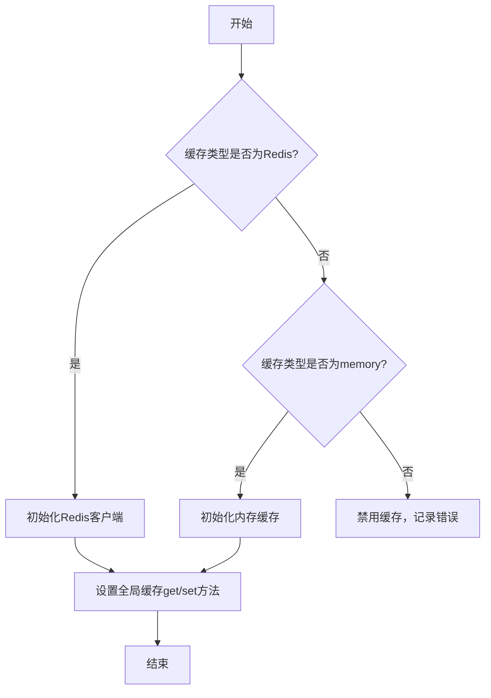
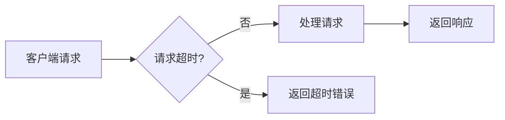
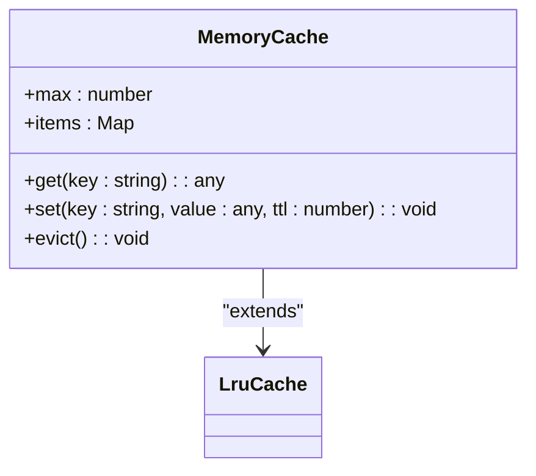
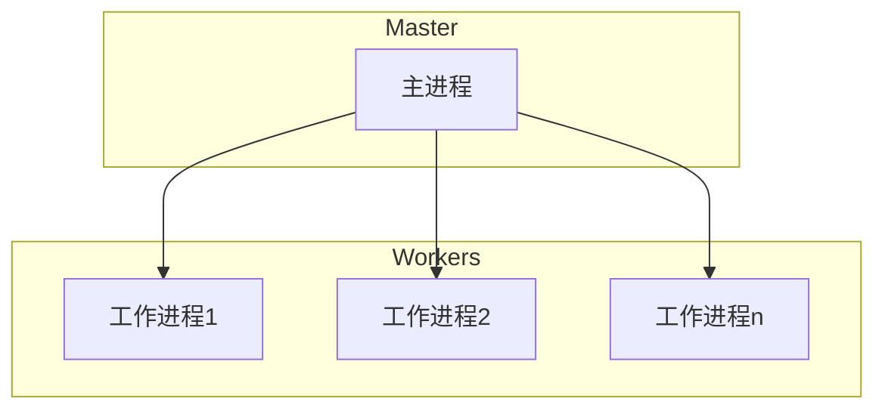
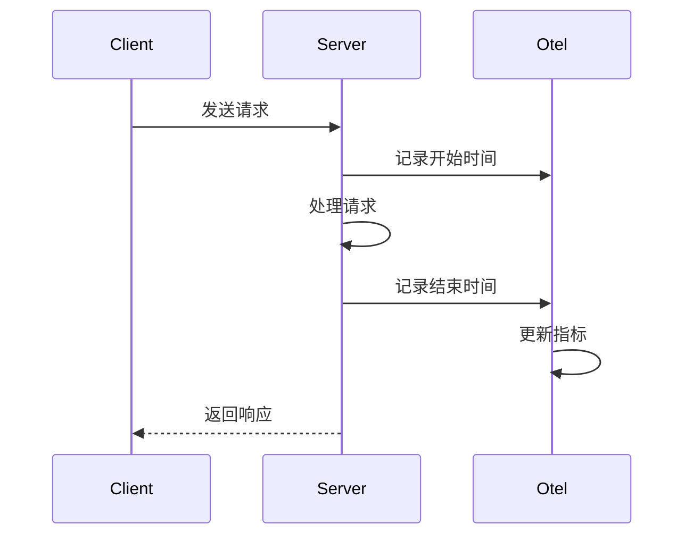
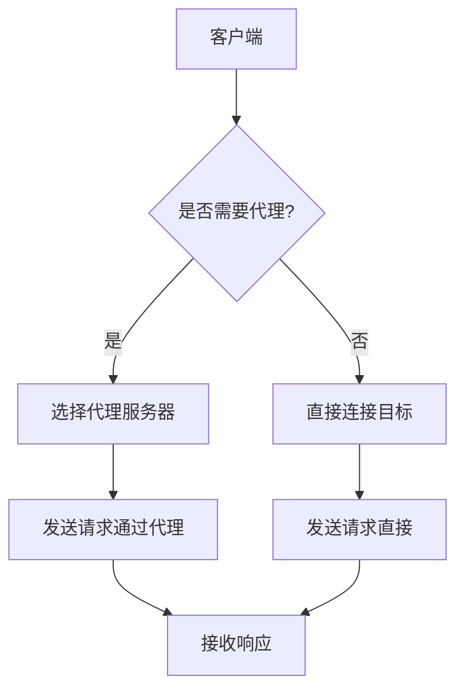
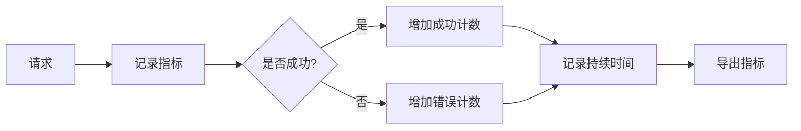

# 资源优化

<cite>
**本文档引用的文件**
- [config.ts](file://lib/config.ts)
- [cache.ts](file://lib/middleware/cache.ts)
- [index.ts](file://lib/index.ts)
- [metric.ts](file://lib/utils/otel/metric.ts)
- [index.ts](file://lib/utils/cache/index.ts)
- [multi-proxy.ts](file://lib/utils/proxy/multi-proxy.ts)
- [package.json](file://package.json)
</cite>

## 目录
1. [引言](#引言)
2. [并发请求限制与连接池管理](#并发请求限制与连接池管理)
3. [超时设置优化](#超时设置优化)
4. [内存管理与垃圾回收](#内存管理与垃圾回收)
5. [CPU使用率优化策略](#cpu使用率优化策略)
6. [请求频率限制与数据压缩](#请求频率限制与数据压缩)
7. [带宽优化建议](#带宽优化建议)
8. [性能监控指标配置](#性能监控指标配置)
9. [资源使用分析工具](#资源使用分析工具)
10. [结论](#结论)

## 引言
RSSHub是一个开源的RSS生成器，旨在通过优化系统资源管理和性能调优来提高服务效率。本文档详细介绍了如何配置并发请求限制、连接池大小和超时设置以优化资源使用。同时，解释了内存管理和垃圾回收配置，以及CPU使用率优化策略。此外，还提供了请求频率限制、数据压缩配置和带宽优化建议，并包含性能监控指标配置和资源使用分析工具的使用指南。

## 并发请求限制与连接池管理
RSSHub通过配置文件中的`REQUEST_RETRY`和`CACHE_TYPE`等环境变量来控制并发请求限制和连接池管理。当缓存类型设置为'redis'时，系统会利用Redis作为缓存后端，从而有效管理连接池。如果缓存类型为空，则禁用缓存功能，这可能导致并发请求不受限制，进而引发不良行为。

**图表来源**
- [config.ts](file://lib/config.ts#L735-L747)
- [index.ts](file://lib/utils/cache/index.ts#L18-L60)

**章节来源**
- [config.ts](file://lib/config.ts#L23-28)
- [index.ts](file://lib/utils/cache/index.ts#L1-L101)

## 超时设置优化
RSSHub允许用户通过环境变量`REQUEST_TIMEOUT`来设置请求超时时间（以毫秒为单位）。默认值为30000毫秒。此设置确保在服务器响应前等待指定的时间，避免长时间挂起。此外，`CACHE_REQUEST_TIMEOUT`用于定义缓存请求的超时时间，默认为60秒。

**图表来源**
- [config.ts](file://lib/config.ts#L730-L731)
- [cache.ts](file://lib/middleware/cache.ts#L26-L44)

**章节来源**
- [config.ts](file://lib/config.ts#L17-L18)
- [cache.ts](file://lib/middleware/cache.ts#L1-L84)

## 内存管理与垃圾回收
RSSHub通过`MEMORY_MAX`环境变量来限制内存缓存的最大项目数，默认值为256。该配置基于`node-lru-cache`库，确保缓存中保留的项目数量为正有限整数。当内存使用接近上限时，系统将自动清理最久未使用的项目，以释放内存空间。

**图表来源**
- [config.ts](file://lib/config.ts#L742-L744)
- [index.ts](file://lib/utils/cache/index.ts#L30-L48)

**章节来源**
- [config.ts](file://lib/config.ts#L27-L28)
- [index.ts](file://lib/utils/cache/index.ts#L1-L101)

## CPU使用率优化策略
RSSHub支持集群模式运行，通过设置`ENABLE_CLUSTER`环境变量启用。在集群模式下，主进程会根据可用的CPU核心数启动多个工作进程，从而充分利用多核处理器的计算能力。每个工作进程独立处理请求，减少了单个进程的负载，提高了整体性能。

**图表来源**
- [index.ts](file://lib/index.ts#L16-L33)

**章节来源**
- [config.ts](file://lib/config.ts#L8-L9)
- [index.ts](file://lib/index.ts#L1-L63)

## 请求频率限制与数据压缩
RSSHub通过OpenTelemetry库实现请求频率的监控和统计。`requestMetric.success`函数记录成功请求的持续时间和相关属性，而`requestMetric.error`则记录失败请求。这些数据可用于分析请求模式并实施频率限制策略。此外，系统支持数据压缩，通过配置`UA`和`NO_RANDOM_UA`环境变量来优化请求头，减少传输数据量。

**图表来源**
- [metric.ts](file://lib/utils/otel/metric.ts#L47-L56)
- [config.ts](file://lib/config.ts#L731-L732)

**章节来源**
- [metric.ts](file://lib/utils/otel/metric.ts#L1-L69)
- [config.ts](file://lib/config.ts#L19-L20)

## 带宽优化建议
为了优化带宽使用，RSSHub建议使用代理服务器来分发请求。通过配置`PROXY_URI`、`PROXY_URIS`和`PROXY_STRATEGY`等环境变量，可以指定一个或多个代理服务器，并选择策略（如'all'或'on_retry'）来决定何时使用代理。此外，还可以通过PAC脚本动态选择代理，进一步提高灵活性和效率。

**图表来源**
- [multi-proxy.ts](file://lib/utils/proxy/multi-proxy.ts#L25-L140)
- [config.ts](file://lib/config.ts#L756-L761)

**章节来源**
- [config.ts](file://lib/config.ts#L30-L37)
- [multi-proxy.ts](file://lib/utils/proxy/multi-proxy.ts#L1-L140)

## 性能监控指标配置
RSSHub集成了Prometheus导出器，用于收集和暴露性能监控指标。通过`getContext`函数，可以从Prometheus导出器获取当前的资源度量数据，并将其序列化为字符串格式。这些指标包括请求总数、错误总数、请求持续时间等，有助于实时监控系统健康状况。

**图表来源**
- [metric.ts](file://lib/utils/otel/metric.ts#L58-L68)
- [config.ts](file://lib/config.ts#L48-L49)

**章节来源**
- [metric.ts](file://lib/utils/otel/metric.ts#L1-L69)
- [config.ts](file://lib/config.ts#L48-L49)

## 资源使用分析工具
RSSHub提供了多种工具来分析资源使用情况。例如，`logger.ts`中间件记录每个请求的进出信息，包括方法、路径、状态码和耗时。这些日志信息可以帮助开发者识别性能瓶颈和异常行为。此外，通过配置`LOGGER_LEVEL`和`SHOW_LOGGER_TIMESTAMP`，可以调整日志级别和时间戳显示，以便更好地进行调试和监控。

**图表来源**
- [logger.ts](file://lib/middleware/logger.ts#L29-L42)
- [config.ts](file://lib/config.ts#L46-L47)

**章节来源**
- [logger.ts](file://lib/middleware/logger.ts#L1-L46)
- [config.ts](file://lib/config.ts#L46-L47)

## 结论
通过对RSSHub的系统资源管理和性能调优进行全面配置，可以显著提升服务的稳定性和效率。合理设置并发请求限制、连接池大小和超时时间，结合有效的内存管理和CPU使用率优化策略，能够确保系统在高负载下仍保持良好性能。同时，利用请求频率限制、数据压缩和带宽优化技术，可以进一步降低资源消耗。最后，通过集成性能监控指标和资源使用分析工具，可以实时掌握系统状态，及时发现并解决问题。