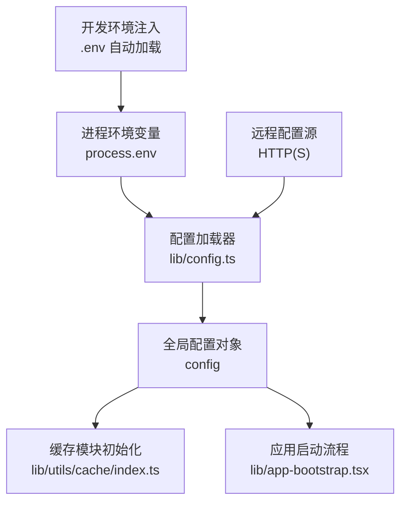
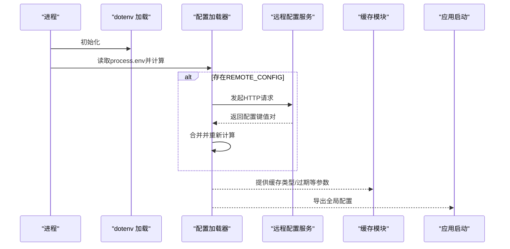
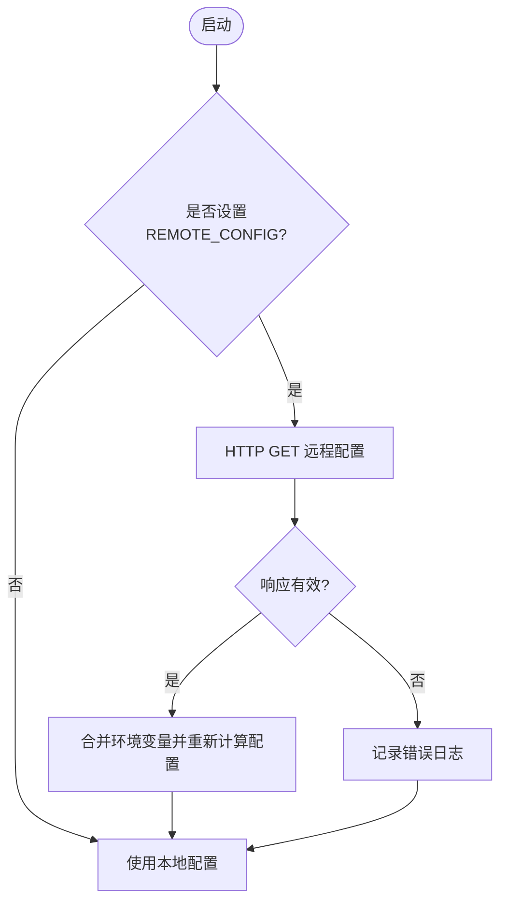
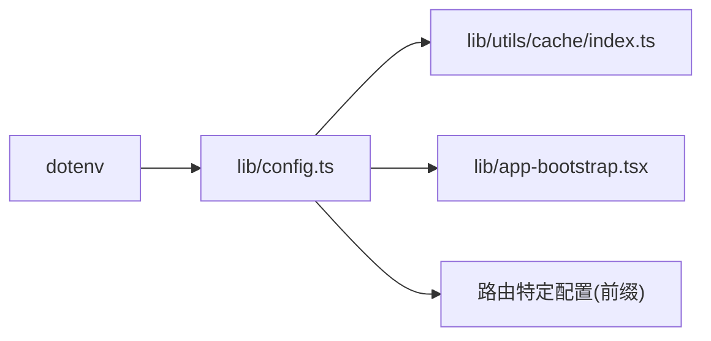

# 配置API

<cite>
**本文引用的文件列表**
- [lib/config.ts](file://lib/config.ts)
- [lib/app-bootstrap.tsx](file://lib/app-bootstrap.tsx)
- [lib/utils/cache/index.ts](file://lib/utils/cache/index.ts)
- [lib/routes-deprecated/index.js](file://lib/routes-deprecated/index.js)
- [lib/config.test.ts](file://lib/config.test.ts)
- [scripts/ansible/rsshub.env](file://scripts/ansible/rsshub.env)
- [devenv.nix](file://devenv.nix)
- [package.json](file://package.json)
</cite>

## 目录
1. [简介](#简介)
2. [项目结构与配置入口](#项目结构与配置入口)
3. [核心配置组件](#核心配置组件)
4. [架构总览](#架构总览)
5. [详细组件分析](#详细组件分析)
6. [依赖关系分析](#依赖关系分析)
7. [性能与可靠性考量](#性能与可靠性考量)
8. [故障排查指南](#故障排查指南)
9. [结论](#结论)
10. [附录：配置清单与最佳实践](#附录配置清单与最佳实践)

## 简介
本文件面向RSSHub的运维与开发者，系统性梳理RSSHub的配置体系，重点说明：
- 如何通过环境变量与可选远程配置源管理应用行为
- 所有可用配置项及其默认值、类型与作用域
- 生产与开发环境的配置最佳实践（含敏感信息保护与版本控制建议）
- 配置验证与热重载能力的使用方式与注意事项

## 项目结构与配置入口
RSSHub的配置系统以“环境变量为中心”，在启动时解析并计算出最终配置对象，供全局模块按需读取。同时支持从远程地址拉取配置并动态刷新，以及通过工具函数进行运行期覆盖。

图表来源
- [lib/config.ts](file://lib/config.ts#L1-L20)
- [lib/utils/cache/index.ts](file://lib/utils/cache/index.ts#L16-L60)
- [lib/app-bootstrap.tsx](file://lib/app-bootstrap.tsx#L1-L53)
- [devenv.nix](file://devenv.nix#L102-L108)

章节来源
- [lib/config.ts](file://lib/config.ts#L1-L20)
- [devenv.nix](file://devenv.nix#L102-L108)

## 核心配置组件
- 环境变量到配置对象的映射：通过统一的类型定义与转换函数，将字符串型环境变量转换为布尔、整数或结构化对象。
- 远程配置：当指定远程配置地址时，应用会发起HTTP请求并合并返回的键值对，随后重新计算配置。
- 运行期覆盖：提供setConfig方法，允许在测试或特定场景下临时替换配置。

章节来源
- [lib/config.ts](file://lib/config.ts#L679-L740)
- [lib/config.ts](file://lib/config.ts#L1159-L1187)

## 架构总览
RSSHub的配置生命周期如下：
- 启动阶段：加载dotenv（如存在），读取process.env，逐项解析并填充到配置对象
- 可选阶段：若设置了远程配置地址，则异步拉取并合并，随后重新计算
- 运行阶段：全局配置对象被中间件与业务逻辑消费；在需要时可通过setConfig进行覆盖

图表来源
- [lib/config.ts](file://lib/config.ts#L1-L20)
- [lib/config.ts](file://lib/config.ts#L1159-L1187)
- [lib/utils/cache/index.ts](file://lib/utils/cache/index.ts#L16-L60)

## 详细组件分析

### 环境变量与配置项总览
以下为RSSHub中定义的关键配置类别与代表性项（并非穷举，仅列主要类别）：
- 应用与集群
  - DISALLOW_ROBOT：是否禁止搜索引擎抓取
  - ENABLE_CLUSTER：是否启用集群模式
  - IS_PACKAGE：打包模式开关
  - NODE_NAME：节点名称
  - PUPPETEER_REAL_BROWSER_SERVICE / PUPPETEER_WS_ENDPOINT / CHROMIUM_EXECUTABLE_PATH：浏览器相关
- 网络与请求
  - PORT：监听端口，默认值见实现
  - LISTEN_INADDR_ANY：是否允许公网访问
  - REQUEST_RETRY / REQUEST_TIMEOUT：请求重试次数与超时
  - UA / NO_RANDOM_UA：用户代理策略
  - ALLOW_ORIGIN：跨域来源
- 缓存
  - CACHE_TYPE：缓存类型(memory/redis/空字符串禁用)
  - CACHE_REQUEST_TIMEOUT / CACHE_EXPIRE / CACHE_CONTENT_EXPIRE：缓存请求超时与过期时间
  - MEMORY_MAX：内存缓存最大条目
  - REDIS_URL：Redis连接串
- 代理与PAC
  - PROXY_URI / PROXY_URIS：单个或多个代理URI
  - PROXY_PROTOCOL / PROXY_HOST / PROXY_PORT / PROXY_AUTH：代理协议/主机/端口/认证
  - PROXY_URL_REGEX / PROXY_STRATEGY：URL匹配与重试策略
  - PROXY_FAILOVER_TIMEOUT / PROXY_HEALTH_CHECK_INTERVAL：降级与健康检查
  - PAC_URI / PAC_SCRIPT：PAC脚本
- 访问控制
  - ACCESS_KEY：访问密钥
- 日志与监控
  - DEBUG_INFO：调试信息显示策略
  - LOGGER_LEVEL：日志级别
  - NO_LOGFILES：是否禁用文件日志
  - OTEL_SECONDS_BUCKET / OTEL_MILLISECONDS_BUCKET：OpenTelemetry直方图桶
  - SHOW_LOGGER_TIMESTAMP：是否显示时间戳
  - SENTRY / SENTRY_ROUTE_TIMEOUT：Sentry DSN与路由超时
  - ENABLE_REMOTE_DEBUGGING：远程调试开关
- 饲料与过滤
  - HOTLINK_TEMPLATE / HOTLINK_INCLUDE_PATHS / HOTLINK_EXCLUDE_PATHS：外链模板与路径白/黑名单
  - ALLOW_USER_HOTLINK_TEMPLATE / FILTER_REGEX_ENGINE / ALLOW_USER_SUPPLY_UNSAFE_DOMAIN / DISABLE_NSFW：特性开关
  - SUFFIX / TITLE_LENGTH_LIMIT：标题后缀与长度限制
- OpenAI
  - OPENAI_API_KEY / OPENAI_MODEL / OPENAI_TEMPERATURE / OPENAI_MAX_TOKENS / OPENAI_API_ENDPOINT / OPENAI_INPUT_OPTION / OPENAI_PROMPT / OPENAI_PROMPT_TITLE
- Follow
  - FOLLOW_OWNER_USER_ID / FOLLOW_DESCRIPTION / FOLLOW_PRICE / FOLLOW_USER_LIMIT
- 路由特定配置（按前缀分组）
  - BILIBILI_COOKIE_*：多账户Cookie集合
  - EMAIL_CONFIG_*：邮箱配置集合
  - DISCUZ_COOKIE_*：论坛Cookie集合
  - MEDIUM_COOKIE_*：Medium Cookie集合
  - DISCOURSE_CONFIG_*：Discourse站点配置JSON集合
  - TWITTER_* / TELEGRAM_* / YOUTUBE_* / SPOTIFY_* 等：各站点凭据与参数
- 远程配置
  - REMOTE_CONFIG / REMOTE_CONFIG_AUTH：远程配置地址与Basic鉴权

章节来源
- [lib/config.ts](file://lib/config.ts#L5-L237)
- [lib/config.ts](file://lib/config.ts#L243-L673)
- [lib/config.ts](file://lib/config.ts#L715-L1151)

### 配置解析与类型转换
- 布尔转换：空字符串、0、false视为假，其他视为真
- 整数转换：未提供则使用默认值
- 特殊处理：
  - UA：当关闭随机UA时回退到固定UA
  - PROXY_URIS：逗号分隔转数组
  - PROXY_STRATEGY：默认all
  - PROXY_URL_REGEX：默认全匹配
  - REDIS_URL：默认本地Redis
  - CACHE_TYPE：默认memory，空字符串可禁用
  - 端口：默认1200
  - 列表类字段：逗号分隔转数组
  - 结构化字段：如Discourse配置按JSON解析

章节来源
- [lib/config.ts](file://lib/config.ts#L679-L740)
- [lib/config.ts](file://lib/config.ts#L745-L767)
- [lib/config.ts](file://lib/config.ts#L768-L807)
- [lib/config.ts](file://lib/config.ts#L808-L813)

### 远程配置与热重载
- 触发条件：当设置REMOTE_CONFIG时，应用会在启动后尝试拉取远程配置
- 认证方式：REMOTE_CONFIG_AUTH作为Basic鉴权头
- 合并与刷新：成功后将远程键值对合并入当前环境变量并重新计算配置
- 注意事项：远程配置失败不会影响启动，但后续可能因缺少配置导致行为异常

图表来源
- [lib/config.ts](file://lib/config.ts#L1159-L1187)

章节来源
- [lib/config.ts](file://lib/config.ts#L1159-L1187)

### 缓存配置与生效路径
- 缓存类型选择：根据CACHE_TYPE决定使用内存缓存或Redis缓存
- 内存缓存：基于LRU，受MEMORY_MAX与路由过期时间控制
- Redis缓存：通过REDIS_URL连接，支持分布式共享
- 禁用缓存：当CACHE_TYPE为空字符串时，缓存模块降级为不可用状态

章节来源
- [lib/utils/cache/index.ts](file://lib/utils/cache/index.ts#L16-L60)
- [lib/config.ts](file://lib/config.ts#L735-L747)

### 访问控制与安全
- ACCESS_KEY：用于限制访问
- REMOTE_CONFIG_AUTH：远程配置鉴权
- PROXY_AUTH：代理鉴权
- 安全建议：敏感信息通过环境变量注入，避免硬编码；生产环境建议使用只读权限的最小化凭证

章节来源
- [lib/config.ts](file://lib/config.ts#L768-L768)
- [lib/config.ts](file://lib/config.ts#L759-L759)
- [lib/config.ts](file://lib/config.ts#L1164-L1166)

### 调试与可观测性
- DEBUG_INFO：控制调试页面显示策略
- LOGGER_LEVEL / NO_LOGFILES / SHOW_LOGGER_TIMESTAMP：日志级别与输出控制
- SENTRY：错误上报
- OTEL_*：指标直方图桶配置
- ENABLE_REMOTE_DEBUGGING：远程调试开关

章节来源
- [lib/config.ts](file://lib/config.ts#L770-L783)
- [lib/routes-deprecated/index.js](file://lib/routes-deprecated/index.js#L43-L44)

### 开发与生产环境差异
- NODE_ENV：通过脚本设置为development或production
- 缓存：生产环境推荐使用Redis
- 浏览器：生产环境可使用真实浏览器WS端点
- Ansible示例：提供生产环境典型配置样例

章节来源
- [package.json](file://package.json#L28-L49)
- [scripts/ansible/rsshub.env](file://scripts/ansible/rsshub.env#L1-L3)
- [devenv.nix](file://devenv.nix#L69-L108)

## 依赖关系分析
- 配置加载器依赖dotenv以自动读取.env文件
- 缓存模块依赖配置中的缓存类型与过期参数
- 应用启动流程依赖配置中的端口、UA、跨域等网络参数
- 路由特定配置通过前缀聚合，形成多账户或多站点的灵活配置

图表来源
- [lib/config.ts](file://lib/config.ts#L1-L20)
- [lib/utils/cache/index.ts](file://lib/utils/cache/index.ts#L16-L60)
- [lib/app-bootstrap.tsx](file://lib/app-bootstrap.tsx#L1-L53)

章节来源
- [lib/config.ts](file://lib/config.ts#L1-L20)
- [lib/utils/cache/index.ts](file://lib/utils/cache/index.ts#L16-L60)
- [lib/app-bootstrap.tsx](file://lib/app-bootstrap.tsx#L1-L53)

## 性能与可靠性考量
- 缓存策略
  - 内存缓存适合小规模实例，注意MEMORY_MAX与路由过期时间
  - Redis适合多实例共享与高并发场景
- 请求超时与重试
  - REQUEST_TIMEOUT与REQUEST_RETRY影响对外请求稳定性
- 代理与PAC
  - PROXY_STRATEGY=all或on_retry影响失败重试策略
  - PROXY_HEALTH_CHECK_INTERVAL与PROXY_FAILOVER_TIMEOUT影响可用性
- 日志与监控
  - 合理的日志级别与直方图桶有助于定位性能瓶颈
  - Sentry与远程调试可用于问题诊断

章节来源
- [lib/config.ts](file://lib/config.ts#L725-L767)
- [lib/config.ts](file://lib/config.ts#L770-L783)
- [lib/utils/cache/index.ts](file://lib/utils/cache/index.ts#L16-L60)

## 故障排查指南
- 远程配置加载失败
  - 现象：启动后记录错误日志，但应用仍可运行
  - 排查：确认REMOTE_CONFIG地址可达、REMOTE_CONFIG_AUTH正确、网络连通性
- 缓存不可用
  - 现象：日志提示缓存不可用，可能导致并发请求不受限
  - 排查：检查CACHE_TYPE与REDIS_URL，确保Redis可用
- 调试页面无法显示
  - 现象：调试信息未显示
  - 排查：检查DEBUG_INFO与请求参数中的debug查询串
- 访问受限
  - 现象：出现访问控制错误
  - 排查：核对ACCESS_KEY是否正确设置

章节来源
- [lib/config.ts](file://lib/config.ts#L1160-L1178)
- [lib/utils/cache/index.ts](file://lib/utils/cache/index.ts#L50-L60)
- [lib/routes-deprecated/index.js](file://lib/routes-deprecated/index.js#L43-L44)

## 结论
RSSHub的配置系统以环境变量为核心，辅以远程配置与运行期覆盖，既满足开发灵活性，又能在生产环境中通过明确的参数与可观测性保障稳定性。建议在生产环境采用Redis缓存、严格的访问控制与最小权限凭证，并结合日志与监控工具持续优化。

## 附录：配置清单与最佳实践

### 配置清单与默认值摘要
- 网络与请求
  - PORT：默认1200
  - LISTEN_INADDR_ANY：默认true
  - REQUEST_RETRY：默认2
  - REQUEST_TIMEOUT：默认30000
  - UA：默认随机UA；NO_RANDOM_UA为真时回退到固定UA
  - ALLOW_ORIGIN：未设置
- 缓存
  - CACHE_TYPE：默认memory；空字符串禁用
  - CACHE_REQUEST_TIMEOUT：默认60
  - CACHE_EXPIRE：默认5*60
  - CACHE_CONTENT_EXPIRE：默认1*60*60
  - MEMORY_MAX：默认2^8
  - REDIS_URL：默认redis://localhost:6379/
- 代理与PAC
  - PROXY_URI / PROXY_URIS：未设置
  - PROXY_PROTOCOL / PROXY_HOST / PROXY_PORT / PROXY_AUTH：未设置
  - PROXY_URL_REGEX：默认.*
  - PROXY_STRATEGY：默认all
  - PROXY_FAILOVER_TIMEOUT：默认5000
  - PROXY_HEALTH_CHECK_INTERVAL：默认60000
  - PAC_URI / PAC_SCRIPT：未设置
- 访问控制
  - ACCESS_KEY：未设置
- 日志与监控
  - DEBUG_INFO：默认true
  - LOGGER_LEVEL：默认info
  - NO_LOGFILES：默认false
  - OTEL_SECONDS_BUCKET / OTEL_MILLISECONDS_BUCKET：默认直方图桶
  - SHOW_LOGGER_TIMESTAMP：默认false
  - SENTRY：未设置
  - SENTRY_ROUTE_TIMEOUT：默认30000
  - ENABLE_REMOTE_DEBUGGING：默认false
- 饲料与过滤
  - HOTLINK_*：未设置
  - ALLOW_USER_HOTLINK_TEMPLATE：默认false
  - FILTER_REGEX_ENGINE：默认re2
  - ALLOW_USER_SUPPLY_UNSAFE_DOMAIN：默认false
  - DISABLE_NSFW：默认false
  - SUFFIX：未设置
  - TITLE_LENGTH_LIMIT：默认150
- OpenAI
  - OPENAI_*：未设置或默认值
- Follow
  - FOLLOW_*：未设置
- 远程配置
  - REMOTE_CONFIG / REMOTE_CONFIG_AUTH：未设置

章节来源
- [lib/config.ts](file://lib/config.ts#L725-L807)
- [lib/config.ts](file://lib/config.ts#L735-L767)
- [lib/config.ts](file://lib/config.ts#L768-L807)
- [lib/config.ts](file://lib/config.ts#L808-L813)
- [lib/config.ts](file://lib/config.ts#L1159-L1187)

### 最佳实践
- 开发环境
  - 使用.devenv自动加载.env
  - 使用本地内存缓存，便于快速迭代
  - 保持DEBUG_INFO为true以便调试
- 生产环境
  - 使用Redis作为缓存后端
  - 设置ACCESS_KEY与合适的代理参数
  - 严格控制日志级别与Sentry配置
  - 使用REMOTE_CONFIG进行集中化配置管理（需配合鉴权）
- 敏感信息保护
  - 将API密钥、数据库密码、代理认证等放入环境变量
  - 使用只读最小权限凭证
  - 避免将.env提交到版本控制
- 配置版本控制
  - 将非敏感的默认配置纳入仓库
  - 将敏感配置通过环境变量注入
  - 使用Ansible等编排工具管理不同环境的配置差异

章节来源
- [devenv.nix](file://devenv.nix#L102-L108)
- [scripts/ansible/rsshub.env](file://scripts/ansible/rsshub.env#L1-L3)
- [package.json](file://package.json#L28-L49)